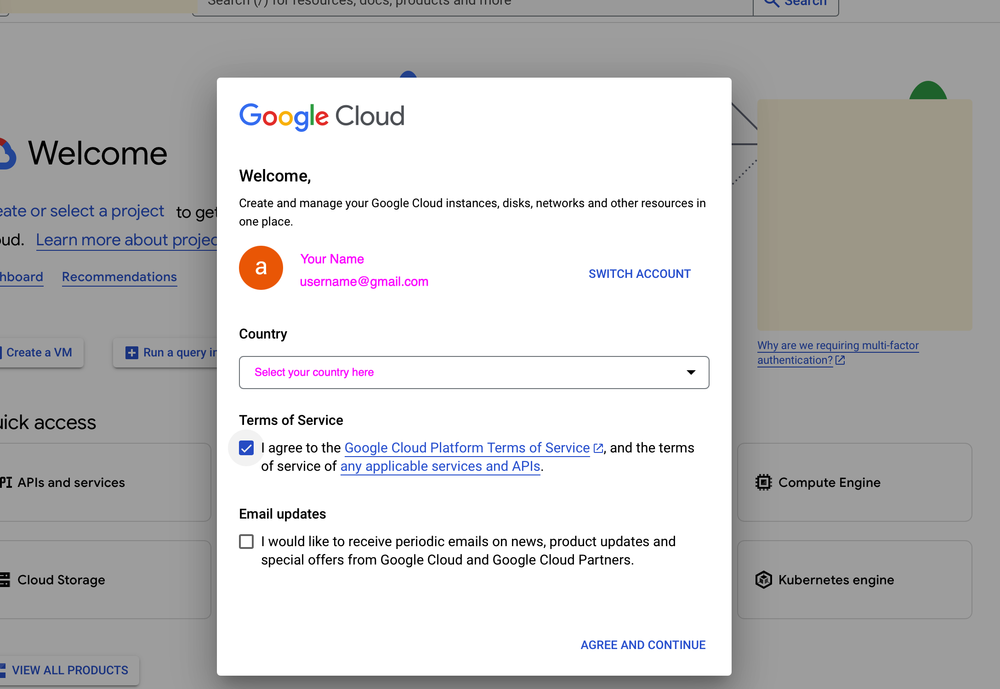

# Alternative GCP Account Setup Guide

In a number of countries, it is not possible to setup a GCP billing account as an individual.

If instructed by your teaching crew, follow the steps below to setup your GCP account.

## Creating and setting project & billing account

Visit the website console.cloud.google.com and create an account as in the picture below.



Click on **AGREE AND CONTINUE**.


### Configuration

First, let's connect to GCP. Run the following command and follow the steps:

```bash
gcloud auth login
```

Run the command below to save your GitHub username in an environment variable that we'll use later:

```bash
echo "export GITHUB_USERNAME='$(gh api user | jq -r .login)'" >> ~/.zshrc
```

<br>

Next, we will save the Billing Account ID you were provided with in an environment variable. Change `BILLING_ACCOUNT_ID` into the ID you received 👇

```bash
echo "export BILLING_ACCOUNT='BILLING_ACCOUNT_ID'" >> ~/.zshrc
exec zsh
```

Finally, let's also store a name for your project in an environment variable. The project name will be `lewagon-yourgithubusername-ds`. Run this command:

```bash
echo "export MY_GPROJECT='lewagon-${(L)GITHUB_USERNAME}-ds'" >> ~/.zshrc
exec zsh
```


❌ Depending on your GitHub username, you may face an issue. If it's the case please contact a TA 🙋‍♂️

## Create the project, set up billing, and budget alerts

Run the commands below. ❌ If an error appears, call the BM / TA 🙋‍♂️

Create project:

```bash
gcloud projects create "${MY_GPROJECT}"
```

Set the project as your current project:

```bash
gcloud config set project "${MY_GPROJECT}"
```

Link the billing account:
```bash
gcloud billing projects link "${MY_GPROJECT}" --billing-account ${BILLING_ACCOUNT}
```

Set budget alerts per 1$
```bash
gcloud billing budgets create \
	--billing-account="${BILLING_ACCOUNT}" \
	--display-name="${MY_GPROJECT}" \
	--filter-projects=projects/"${MY_GPROJECT}" \
	--budget-amount=5 \
	--threshold-rule=percent=0.20 \
	--threshold-rule=percent=0.40 \
	--threshold-rule=percent=0.60 \
	--threshold-rule=percent=0.80
```

❌ If an error appeared, call the BM / TA 🙋‍♂️


## Set up a Service Account

Last part of the setup, we need to create a service account and configure it on your computer so GCP can identify you and you are able to launch gcloud command from your machine ! 💻

Check the current project:

```bash
gcloud config get-value project
```

This command retrieves the currently set project ID in your gcloud configuration.
It's important to ensure you're working in the correct project before proceeding with other commands. It should be `lewagon-yourgithubusername-ds`.

If at this point you have an error ❌, call a TA. 🙋‍♂️
If the project is not the one you've set up, call a TA. 🙋‍♂️

Create a service account:

```bash
gcloud iam service-accounts create my-service-account --display-name "My Service Account"
```

This command creates a new service account named "my-service-account" with the display name "My Service Account".
Service accounts are used to authenticate applications and services to Google Cloud resources.

Grant the `owner` role to the service account:

```bash
gcloud projects add-iam-policy-binding ${MY_GPROJECT} --member="serviceAccount:my-service-account@${MY_GPROJECT}.iam.gserviceaccount.com" --role="roles/owner"
```

This command adds the `owner` role to the newly created service account for the specified projects.
This grants full access to all resources in the project, so use with caution.

Create a key for the service account:

```bash
gcloud iam service-accounts keys create key.json --iam-account=my-service-account@${MY_GPROJECT}.iam.gserviceaccount.com
```

This generates a new private key for the service account and saves it as `key.json`. This key file is used to authenticate as the service account.

Move the key file:

```bash
mkdir ~/code/${GITHUB_USERNAME}/gcp
mv key.json ~/code/${GITHUB_USERNAME}/gcp/
```

This command moves the `key.json` file to a specific directory in your home folder.

Set the GOOGLE_APPLICATION_CREDENTIALS environment variable:

```bash
echo "export GOOGLE_APPLICATION_CREDENTIALS='~/code/${GITHUB_USERNAME}/gcp/key.json'" >> ~/.zshrc
```
This adds an export command to your `.zshrc` file, setting the `GOOGLE_APPLICATION_CREDENTIALS` environment variable to the path of your key file. This allows Google Cloud client libraries to automatically find and use the credentials for authentication.


## Check

Reset the terminal:

```bash
exec zsh
```

Check your project is set up and has a billing account :

```bash
bash <(curl -s https://raw.githubusercontent.com/lewagon/data-setup/refs/heads/nogcp/checks/gcp_check.sh)
```

If at this point you have an error ❌, call a TA. 🙋‍♂️

Otherwise, congratulations! You're all set! 🎉🎉
