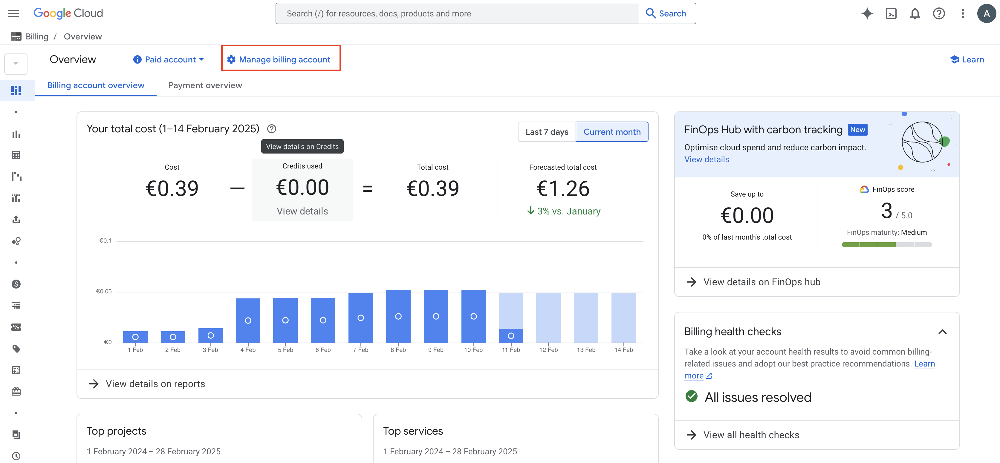
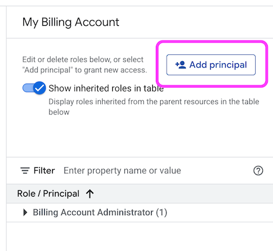
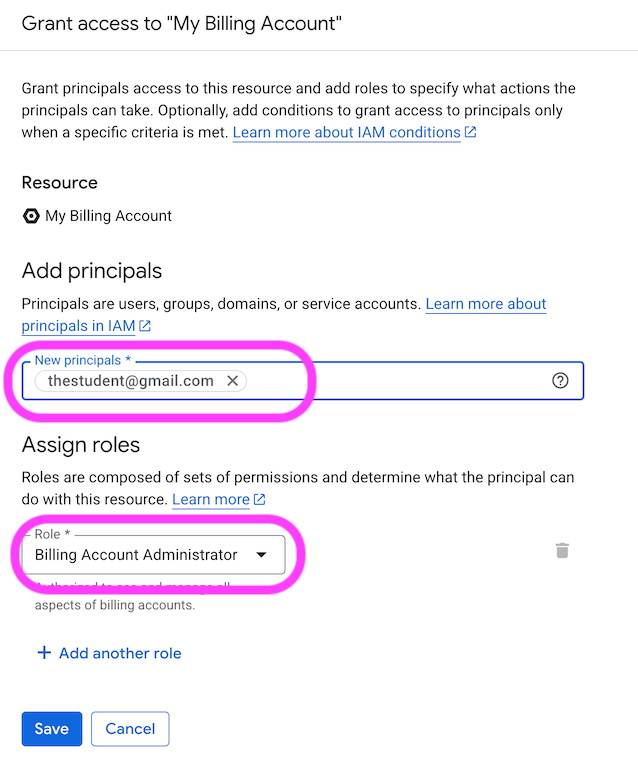

# Alternative GCP Account Setup Guide (teachers)

In a number of countries, it is not possible to setup a GCP billing account as an individual.

The steps below will allow students to use GCP in those cases.

# Process & Schedule

**Prerequisites for students**:

- Obtain a Gmail account
- Communicate with the BM

## Week 1 - Day 1:

- Students do the regular setup skipping the GCP Setup by following a dedicated setup link: [Setup - No GCP](https://github.com/lewagon/data-setup/blob/nogcp/README.md)

## Week 2

- BM creates and send a Google Form to collect students' full name and Gmail addresses.
- Students submit their Gmail account through the Google Form.

    > Hello @channel
    >
    > We will prepare the Google Cloud Platform setup next week.
    >
    > Can you go to the form here and submit your Gmail account?

➡️ Ask the PM to prepare the repartition per account (prepared accounts with quotas already attributed by Google and billing already set up). Please reach out to your PM to ask for the accounts you can use and where to add your students.
([Template sheet](https://docs.google.com/spreadsheets/d/1gWyCui6AtHaAe1yygVGOOV50C4Y969tXT08M4s8MK4A/edit?gid=1578747303#gid=1578747303))

## **Week 3**

👉 BM adds students' Gmail account as *Billing Account Administrator* with the instructions below:

  
Instructions to add students to the billing account

### **Billing account Management**

From the hamburger menu, go to Billing section. Once you landed on the page, click on manage billing account.

### **Add student on the billing**

Once you have selected the billing account, add students and give them the role of billing account administrator (that will allow them to link their own project to this billing account).

The BM / PM should provide you a Google Sheet with students' name, email and the billing account ID to use.

👉 Go to the *Add principal* page:

👉 Add the student as a *Billing Account Administrator*:

 

👉 Prepare the list of your students with their respective billing accounts to send it to them. ([Template sheet](https://docs.google.com/spreadsheets/d/1n8KJ0jKzDwiuaqMUBX_o6tROJ5Pqg6GcJlb6pt3uRQo/edit?usp=sharing))

## **Week 4**

- BM communicates to students that they should do the GCP part of the setup. Send them this message:

    > Hello @channel,
    >
    > Next week we will start MLOps week on Google Cloud Platform also known as GCP :gcp:
    >
    > For you to be able to use GCP services, you need to follow the steps from this guide :point_down:
    >
    > Student guide: https://github.com/lewagon/data-setup/blob/nogcp/GCP_alternative_students.md
    >
    > To make it simple, you'll create a project through CLI command and link it to the billing account provided by Le Wagon.
    >
    > To know which billing account to use, please check the one allocated to you in this Google Sheet :google-sheets-intensifies:
    >
    > Let me know through tickets if you face any issue or need further explanations. :hand:

- Students do the GCP part of the setup:

     [Students guide](https://github.com/lewagon/data-setup/blob/nogcp/GCP_alternative_students.md)

- Students confirm ✅ that they have finished the setup.
- BM follows up everyone finished.
