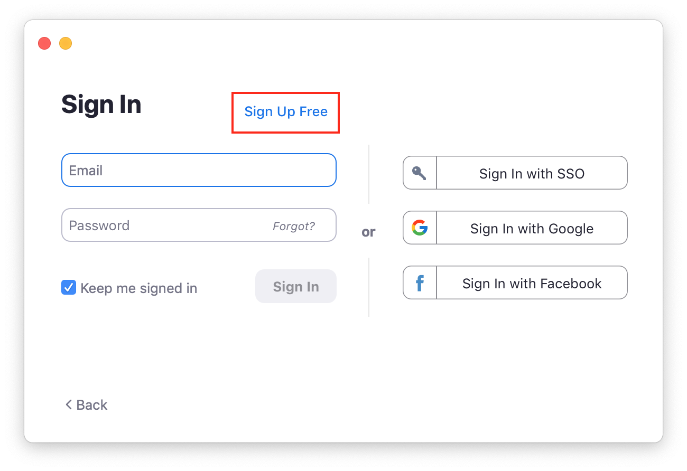
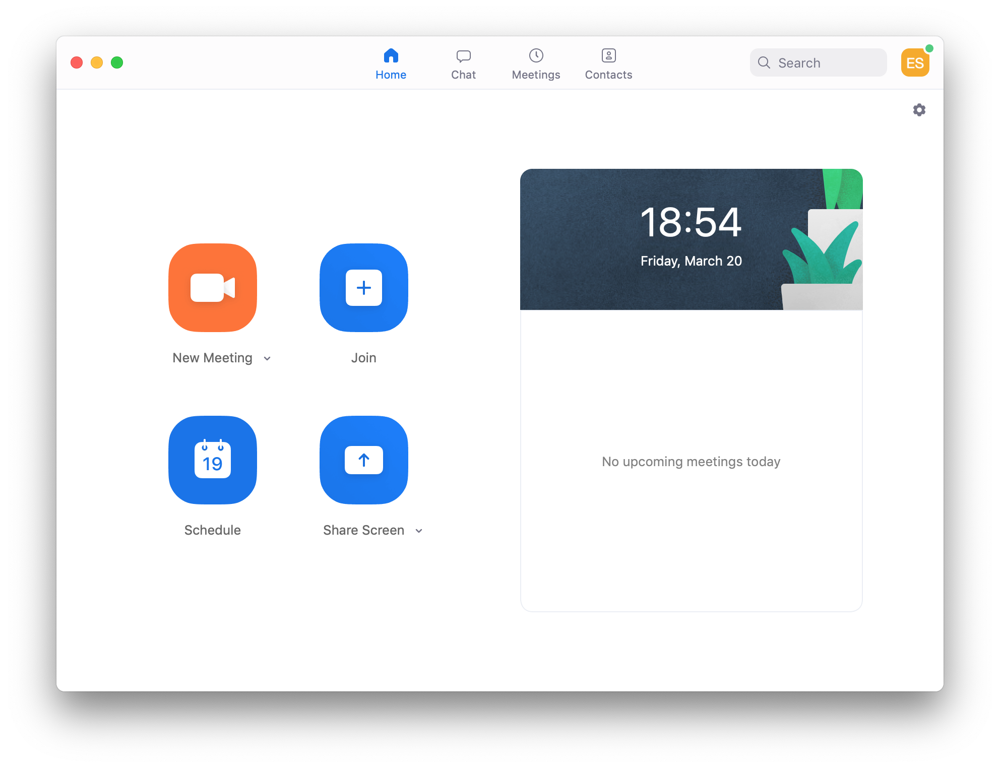
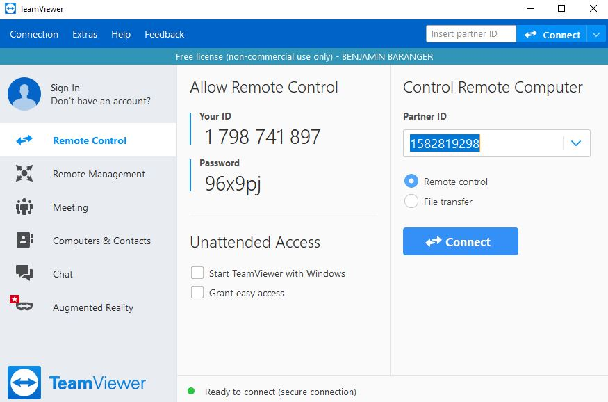
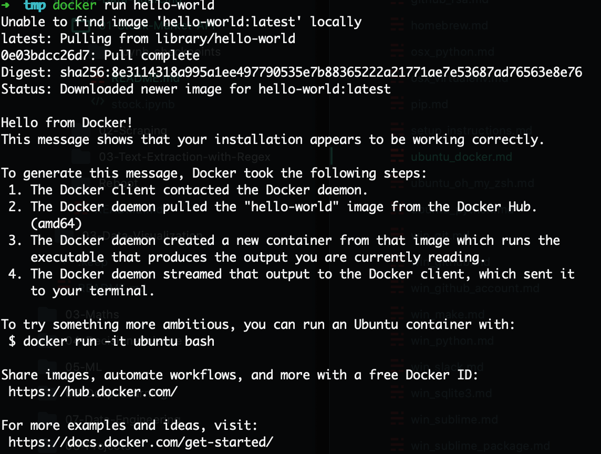

# Setup instructions

The following instructions will help you to get ready for [Le Wagon](http://www.lewagon.com) Data Bootcamp:

- Install remote tools
- Install and setup the terminal
- Install a text editor
- Install and setup `git` and GitHub
- Install [Python 3](https://www.python.org/) and packages to manage [Virtual Environments](https://docs.python.org/3/tutorial/venv.html)
- Install [Docker](https://docs.docker.com/get-docker/)
- Install Slack
- Onboard on **Kitt**, Le Wagon's pedagogic platform


## Remote tools

To be able to interact when we are not in the same physical room, we will be using two tools:

### Zoom

Zoom is a video conferencing tool. To create an account and install the app, go to [https://zoom.us/download](https://zoom.us/download) and under **Zoom Client for Meetings** click the **Download** button. Open the file you have just downloaded. A progress bar will appear, then Zoom will start. Click on **Connection** and create an account with the **Sign Up Free** option:



Once connected, you should see:



You can close Zoom now.

### Teamviewer

For the most complicated problems, a teacher might have to take control of your computer. To be able to do this, we will need to use the Teamviewer tool. Go to the [Teamviewer download page](https://www.teamviewer.com/en/download). It should automatically detect your operating system. If it doesn't, choose your operating system from the list at the top of the page. Click on **Download Teamviewer**, and open the file you just have downloaded. Leave the default settings as they are, and click on **Accept**. A progress bar will appear, then Teamviewer will start when the installation is over. It should look like this:



This will only be used as last resort when debugging becomes too tricky through spoken word. Nobody will ever be able to take control of your screen without you knowing it :ok_hand:

You can close Teamviewer now.

If you are not familiar with video calls, here is a great [article](https://martinfowler.com/articles/effective-video-calls.html) full of good practices :camera: :microphone:


## GitHub account

Have you signed up to GitHub? If not, [do it right away](https://github.com/join).

:point_right: **[Upload a picture](https://github.com/settings/profile)** and put your name correctly on your GitHub account. This is important as we'll use an internal dashboard with your avatars. Please do this **now**, before you continue with this guide.


## Git

To install `git`, first open a terminal. To open a terminal, you can click on the Ubuntu Start button in the sidebar and type `Terminal`. Then click on the terminal icon.

Then copy this line with `Ctrl` + `C`:

```bash
sudo apt install -y git
```

:bulb: To **paste it in the terminal**, you need to use `Ctrl` + `Shift` + `V`.


## Sublime Text 3 - Your text editor

A text editor is one of the most important tools of a developer.
Follow these instructions in the Terminal:

```bash
wget -qO - https://download.sublimetext.com/sublimehq-pub.gpg | sudo apt-key add -
```

:point_up: This command will ask for your password with: `[sudo] password for <username>:`. Don't panick! Calmy type your password key by key. You won't have a visual feedback (like little `*`), that's **perfectly normal**, keep on typing. When you're done, hit `Enter` :muscle:.

```bash
sudo apt install -y apt-transport-https
echo "deb https://download.sublimetext.com/ apt/stable/" | sudo tee /etc/apt/sources.list.d/sublime-text.list
sudo apt update
sudo apt install -y sublime-text
```

Sublime Text is free without any time limitation but a popup will appear every ten saves to remind you there is a license to buy. You can hit `Esc` when this happens, but feel free to buy Sublime Text if you really like this one (there are alternatives).


## Oh-my-zsh - Fancy your Terminal

We will use the shell named `zsh` instead of `bash`, the default one.

```bash
sudo apt install -y zsh curl vim
sh -c "$(curl -fsSL https://raw.githubusercontent.com/robbyrussell/oh-my-zsh/master/tools/install.sh)"
# it will ask for your session password
```

Be careful, those commands will ask you to type your password twice. At the end
your prompt should look like this:


If it doesn't, **ask a teacher**.

To make this change stick, restart your laptop (or virtual machine):

```bash
sudo reboot
```


## GitHub

### Already configured?

Then try this command:

```bash
ssh -T git@github.com
```

If it returns the following:

```bash
# Hi <your_github_nickname>! You've successfully authenticated, but GitHub does not provide shell access
```

It means `git` is **already** configured on your laptop, you can skip the section below!

### Configuring your first SSH key

We need to generate SSH keys which are going to be used by GitHub and Heroku
to authenticate you. Think of it as a way to log in, but different from the
well known username/password couple. If you already generated keys
that you already use with other services, you can skip this step.

Open a terminal and type this, replacing the email with **yours** (the
same one you used to create your GitHub account). It will prompt
for information. Just press enter until it asks for a **passphrase**.

```bash
mkdir -p ~/.ssh && ssh-keygen -t ed25519 -o -a 100 -f ~/.ssh/id_ed25519 -C "TYPE_YOUR_EMAIL@HERE.com"
```

**NB:** when asked for a passphrase, put something you want (and that you'll remember),
it's a password to protect your private key stored on your hard drive. You'll type,
nothing will show up on the screen, **that's normal**. Just type the passphrase,
and when you're done, press `Enter`.

Then you need to give your **public** key to GitHub. Run:

```bash
cat ~/.ssh/id_ed25519.pub
```

It will prompt on the screen the content of the `id_ed25519.pub` file. Copy that text,
then go to [github.com/settings/ssh](https://github.com/settings/ssh). Click on
**Add SSH key**, fill in the Title with your computer name, and paste the **Key**.
Finish by clicking on the **Add key** green button.

To check that this step is completed, in the terminal run this. You will be
prompted a warning, type `yes` then `Enter`.

```bash
ssh -T git@github.com
```

If you see something like this, you're done!

```bash
# Hi <your_github_nickname>! You've successfully authenticated, but GitHub does not provide shell access
```

Don't be in a rush, take time to [read this article](http://sebastien.saunier.me/blog/2015/05/10/github-public-key-authentication.html) to get a better
understanding of what those keys are used for.


## Dotfiles

There are three options, choose _one_:

### 1. I already attended Web Development (FullStack) bootcamp at Le Wagon _on the same laptop_

This means that you already forked the GitHub repo `lewagon/dotfiles`, but at that time the configuration was maybe not ready for the new Data Science bootcamp.

Open your terminal and go to your `dotfiles` project:

```bash
cd ~/code/<YOUR_GITHUB_NICKNAME>/dotfiles
stt # Open it in Sublime Text
```

In Sublime Text, open the `zshrc` file. Replace its content with the [newest version](https://raw.githubusercontent.com/lewagon/dotfiles/master/zshrc) of that file that we provide. Save to disk.

Back to the terminal, run a `git diff` and ask a TA to come and check about this configuration change. You should see stuff about Python and `pyenv`.

Once this is good, commit and push your changes:

```bash
git add zshrc
git commit -m "Update zshrc for Data Science bootcamp"
git push origin master
```

### 2. I did not attend the Web Dev bootcamp at Le Wagon

Hackers love to refine and polish their shell and tools. We'll start with a great default configuration provided by [Le Wagon](http://github.com/lewagon/dotfiles), stored on GitHub. As your configuration is personal, you need your own repository storing it, so you first need to fork it to your GitHub account.

:arrow_right: [Click here to **fork**](https://github.com/lewagon/dotfiles/fork) the `lewagon/dotfiles` repository to your account (you'll need to click again on your picture to confirm _where_ you do the fork).

Forking means that it will create a new repo in your GitHub account, identical to the original one. You'll have a new repository on your GitHub account, `your_github_username/dotfiles`. We need to fork because each of you will need to put specific information (e.g. your name) in those
files.

Now this is done, go on with the following instructions under in the `3. ` section right below. :warning: DO NOT SKIP IT!

### 3. I already attended Web Development (FullStack) bootcamp at Le Wagon _but I have a new laptop_

Open your terminal. **Don't blindly copy paste this line**, replace `replace_this_with_your_github_username` with *your* own github usernickname.

```bash
export GITHUB_USERNAME=replace_this_with_your_github_username

# Example:
#   export GITHUB_USERNAME=ssaunier
```

Now copy/paste this very long line in your terminal. Do **not** change this one.

```bash
mkdir -p ~/code/$GITHUB_USERNAME && cd $_ && git clone git@github.com:$GITHUB_USERNAME/dotfiles.git
```

Run the `dotfiles` installer.

```bash
cd ~/code/$GITHUB_USERNAME/dotfiles
zsh install.sh
```

Then run the git installer:

```bash
cd ~/code/$GITHUB_USERNAME/dotfiles
zsh git_setup.sh
```

:point_up: This will **prompt** you for your name (`Firstname Lastname`) and your email.

Be careful, you **need** to put the **same** email as the one you sign up with on GitHub.

Please now **quit** all your opened terminal windows.

### Sublime Text auto-configuration

Open a new terminal and type this:

```bash
stt
```

It will **open Sublime Text in the context of your current folder**. That's how we'll use it.

**Close Sublime text** and open it again:

```bash
stt
```

**Wait 1 minute** for additional packages to be automatically installed (New tabs with text will automatically open, containing documentation for each new package installed). TO follow package installation, you can go to `View > Show console`.

To check if plugins are installed, open the Command Palette (`⌘` + `⇧` + `P` on OSX, `Ctrl` + `⇧` + `P` on Linux), type in `Packlist` and then `Enter`, you should see a couple of packages installed (like [Emmet](http://emmet.io/)).

If you don't, please install all of them manually. The list is referenced [here](https://github.com/lewagon/dotfiles/blob/master/Package%20Control.sublime-settings).

When it's done, you can close Sublime Text.


## Installing Python (with [`pyenv`](https://github.com/pyenv/pyenv))

macOS comes with an outdated version of Python that we don't want to use. You might already have installed Anaconda or something else to tinker with Python and Data Science packages. All of this does not really matter as we are going to do a professional setup of Python where you'll be able to switch which version you want to use whenever you type `python` in the terminal.

First let's install `pyenv` with the following Terminal command:

```bash
git clone https://github.com/pyenv/pyenv.git ~/.pyenv
```

Then quit **all your opened terminal windows** (Cmd + Q) and restart one. Ignore the `pyenv: no such command 'virtualenv-init' for now`.

Let's install some [dependencies](https://github.com/pyenv/pyenv/wiki/common-build-problems#prerequisites) needed to build Python from `pyenv`:

```bash
sudo apt install -y make build-essential libssl-dev zlib1g-dev libbz2-dev \
  libreadline-dev libsqlite3-dev llvm libncurses5-dev libncursesw5-dev \
  xz-utils tk-dev libffi-dev liblzma-dev python-openssl
```

Let's install the [latest stable version of Python](https://www.python.org/doc/versions/) supported by Le Wagon's curriculum:

```bash
pyenv install 3.8.5
```

This command might take a while, this is perfectly normal. Don't hesitate to help other students seated next to you!

OK once this command is complete, we are going to tell the system to use this version of Python **by default**. This is done with:

```bash
pyenv global 3.8.5
```

Once again, quit **all your opened terminal windows** (Cmd + Q) and restart one.

To check if this worked, run `python --version`. If you see `3.8.5`, perfect! If not, ask a TA that will help you debug the problem thanks to `pyenv versions` and `type -a python` (`python` should be using the `.pyenv/shims` version first).

---

:thinking: Why aren't we using the latest `3.9+` Python version? Good question! For now, Python 3.9 is not supported by pyenv `pyenv install --list`. Let's be patient and be thankful of the open-source community work!

---


## Python Virtual Environment

Before we start installing relevant Python packages, we will isolate the setup for the Bootcamp into a **dedicated** virtual environment. We will use a `pyenv` plugin called [`pyenv-virtualenv`](https://github.com/pyenv/pyenv-virtualenv).

First let's install this plugin:

```bash
git clone https://github.com/pyenv/pyenv-virtualenv.git $(pyenv root)/plugins/pyenv-virtualenv
```

Once again, quit **all your opened terminal windows** (Cmd + Q) and restart one.

Let's create the virtual environment we are going to use during the whole bootcamp:

```bash
pyenv virtualenv 3.8.5 lewagon
```

Let's now activate the virtual environment with:

```bash
pyenv activate lewagon
```

Great! Anytime we'll install Python package, we'll do it in that environment. In order for you to not have to always activate it everytime you open a new terminal, we conviniently added a line to the `~/.zshrc` file:

```bash
cat ~/.zshrc | grep activate
```

As the `~/.zshrc` is executed everytime you open a new terminal, it will automatically activate the `lewagon` virtualenv. Try it now, quit **all your opened terminal windows** (Cmd + Q) and restart one. Then run:

```bash
pyenv activate lewagon
```

It should tell you:

```bash
pyenv-virtualenv: version `lewagon' is already activated
```

All good!


## Python packages

Now that we have a pristine `lewagon` virtual environment, it's time to install some packages in it.

First, let's upgrade `pip`, the tool to install Python Packages from [pypi.org](https://pypi.org). In the latest Powershell window where the virtualenv `lewagon` is activated, run:

```bash
pip install --upgrade pip
```

Then let's install some packages for the first weeks of the program:

```bash
pip install pytest pylint ipdb pyyaml
```

Let's install packages useful for API & Scraping:

```bash
pip install requests bs4
```

Finally, more Data Science packages:

```bash
pip install jupyterlab pandas matplotlib seaborn plotly scikit-learn
```

That's it for today. During the bootcamp, we'll install more packages but we'll talk about that later.

If you want to check which packages (and which version of that package) you have installed, you can run:

```bash
pip freeze
```


## Docker 🐋

Docker is an open platform for developing, shipping, and running applications.

_if you already have Docker installed on your machine please update with the latest version_

### Install Docker

Go to [Docker install documentation](https://docs.docker.com/engine/install/ubuntu/#install-using-the-repository).

Then follow the tutorial instructions to install Docker **using the repository**. There are 2 steps:

- SET UP THE REPOSITORY
- INSTALL DOCKER ENGINE

Once done, you should be able to run:

```bash
sudo docker run hello-world
```

The following message should print:




## Ubuntu inotify

Ubuntu is always tracking changes in your folders, and to do this it uses inotify.
By default the Ubuntu limit is set to 8192 files monitored.

As programming involves a lot of files, we need to raise this limit.
In your terminal run:

```bash
echo fs.inotify.max_user_watches=524288 | sudo tee -a /etc/sysctl.conf && sudo sysctl -p
```

## Extra

### Install video codec H264

On our pedagogical platform (Kitt, you'll soon discover it!), we have some videos. By default Firefox on Linux cannot play them as they use an unsupported codec (H264). To get those videos working for you, you need to run this:

```bash
sudo apt install libavcodec-extra -y
```

### Install useful terminal tools

`tree` is a nice tool to visualize a directory tree inside the terminal:

`ncdu` is a text-based interface disk utility.

`htop` is an interactive process viewer.

`tig` is a text-mode interface for `git`.

`hub` is a command line tool that wraps `git` in order to extend it with extra features and commands that make working with GitHub easier.

```bash
sudo apt install tree ncdu htop tig hub
```


## Alumni

Register as a Wagon alumni by going to [kitt.lewagon.com/onboarding](http://kitt.lewagon.com/onboarding). Select your batch, sign in with GitHub and enter all your information.

Your teacher will then validate that you are indeed part of the batch. You can ask him to do it as soon as you completed the registration form.

Once the teacher has approved your profile, go to your email inbox. You should have 2 emails:

- One from Slack, inviting you to the Le Wagon Alumni slack community (where you'll chat with your buddies and all the previous alumni). Click on **Join** and fill the information.
- One from GitHub, inviting you to `lewagon` team. **Accept it** otherwise you won't be able to access the lecture slides.


## Slack

[Install Slack for Linux (beta)](https://get.slack.help/hc/en-us/articles/212924728-Slack-for-Linux-beta-).

Launch the app and sign in to `lewagon-alumni` organization.

Make sure you upload a picture there.

You can also sign in to Slack on your iPhone or Android device!

The idea is that you'll have Slack open all day, so that you can share useful links / ask for help / decide where to go to lunch / etc.

In case of remote tickets, you will use Slack audio or video call to get help. To ensure that everything is working fine, [test your camera and microphone](https://lewagon-alumni.slack.com/help/test/calls). If your browser is asking your permission to access your microphone and camera, click on yes.

After the test are finished, you should have green "All clear" messages at least for your microphone and camera. If not, ask a teacher.


## (Bonus) Kata

If you are done with your setup, please ask around if some classmates need some help with theirs (macOS, Linux, Windows). We will have our first lectures at 2pm and will talk about the Setup you just did + onboard you on Kitt.

If you don't have a lot of experience with `git` and GitHub, please [(re-)watch this workshop](https://www.youtube.com/watch?v=Z9fIBT2NBGY) (`1.25` playback speed is fine).

If you do, then you can wait for the first lecture working on this [Tic-Tac-Toe Kata](https://www.codewars.com/kata/5b817c2a0ce070ace8002be0/train/python)


