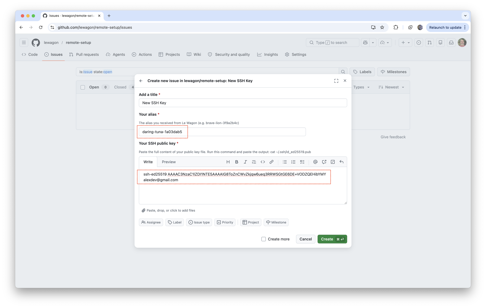
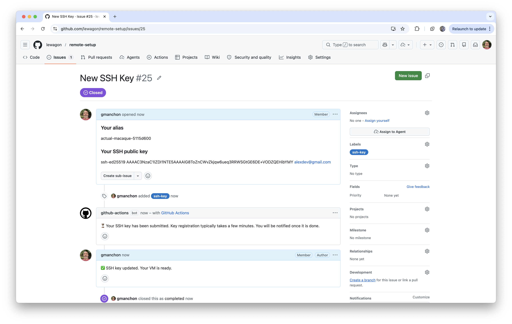

# Setup instructions

You will find below the instructions to set up you computer for [Le Wagon Data Science course](https://www.lewagon.com/data-science-course/full-time)

Please **read them carefully and execute all commands in the following order**. If you get stuck, don't hesitate to ask a teacher for help :raising_hand:

Let's start :rocket:


## GitHub account

Have you signed up to GitHub? If not, [do it right away](https://github.com/join).

:point_right: **[Upload a picture](https://github.com/settings/profile)** and put your name correctly on your GitHub account. This is important as we'll use an internal dashboard with your avatar. Please do this **now**, before you continue with this guide.


:point_right: **[Enable Two-Factor Authentication (2FA)](https://docs.github.com/en/authentication/securing-your-account-with-two-factor-authentication-2fa/configuring-two-factor-authentication#configuring-two-factor-authentication-using-text-messages)**. GitHub will send you text messages with a code when you try to log in. This is important for security and also will soon be required in order to contribute code on GitHub.


## SSH key

We want to safely communicate with your virtual machine using [SSH protocol](https://en.wikipedia.org/wiki/Secure_Shell). We need to generate a SSH key to authenticate.

- Open your terminal

<details>
  <summary markdown='span'>💡 Windows tip</summary>

We highly recommend installing [Windows Terminal](https://apps.microsoft.com/store/detail/windows-terminal/9N0DX20HK701?hl=fr-fr&gl=FR) from the Windows Store (installed on Windows 11 by default) to perform this operation
</details>

- Create a SSH key

<details>
  <summary markdown='span'>Windows</summary>

```bash
# replace "your_email@example.com" with your GCP account email
ssh-keygen.exe -t ed25519 -C "your_email@example.com"
```
</details>

<details>
  <summary markdown='span'>MacOS & Linux</summary>

```bash
# replace "your_email@example.com" with your GCP account email
ssh-keygen -t ed25519 -C "your_email@example.com"
```
</details>


You should get the following message: `> Generating public/private algorithm key pair.`
- When you are prompted `> Enter a file in which to save the key`, press Enter
- You should be asked to `Enter a passphrase` - this is optional if you want additional security. To continue without a passphrase press enter without typing anything when asked to enter a passphrase.

ℹ️ Don't worry if nothing prompt when you type, that is perfectly normal for security reasons.

- You should be asked to `Enter same passphrase again`, do it.

**❗️ You must remember this passphrase.**

<details>
  <summary markdown='span'> ❗️ /home/your_username/.ssh/id_ed25519 already exists.</summary>
If you receive this message, you may already have an SSH Key with the same name (if you are a Le Wagon Alumni or are using SSH Authentication with Github).

To create a separate SSH key to exclusively use for this bootcamp use the following:

```bash
# replace "your_email@example.com" with your GCP account email
ssh-keygen -t ed25519 -f ~/.ssh/de-bootcamp -C "your_email@example.com"
```

Your new SSH Key will be named `de-bootcamp`. Make sure to remember it for later!
</details>


## Authenticate to your virtual machine

In order to move forwards, you will need to use:
- The SSH **public** and **PRIVATE** keys you just created
- The alias provided to you by Le Wagon

<details>

  <summary>🤔 What are the SSH public and private keys ?</summary>

  A SSH key is a pair constituted of linked public and private keys.

  The **PRIVATE** part of the SSH key (private key) is the part that allows you alone to use the key. It should not be communicated to anyone and should never leave your machine.

  The **public** part of the SSH key (public key) is the part that identifies you when communicating over SSH. It can be communicated widely.

  The file storing the public key ends in `.pub` (for example `id_ed25519.pub`), while the file storing the private key does not have an extension (for example `id_ed25519`).

  In this setup we will publish the **public** key to the virtual machine provided by Le Wagon in order to identify ourselves. We will then use the **PRIVATE** key to authenticate remotely and connect to the virtual machine.
</details>


Retrieve your SSH **public** key using the command below:
- Replace `👉PATH_TO_YOUR_PUBLIC_KEY👈` with the path to your **public** key

<details>
  <summary markdown='span'>Windows</summary>

```bash
type 👉PATH_TO_YOUR_PUBLIC_KEY👈
# type C:\Users\<YourUsername>\.ssh\id_ed25519.pub
```
</details>

<details>
  <summary markdown='span'>MacOS & Linux</summary>

``` bash
cat 👉PATH_TO_YOUR_PUBLIC_KEY👈
# cat ~/.ssh/id_ed25519.pub
```
</details>


You should see something similar to the following even though multiple formats exist:

```
ssh-ed25519 AAAAC3NzaC1lZDI1NTE5AAAAIG8ToZnCWvZkjqw6ueq3RRWSGtGE6DE+VODZQEHibYMY alexdev@gmail.com
```

Fetch the alias provided to you by Le Wagon. The alias contains random pet names separated by dashes, for exampe `daring-tuna-1a03dab5`. If you cannot find it, ask a teacher for help 🙋

Now let's register your SSH key:
- Go to https://github.com/lewagon/remote-setup/issues
- Click on **New issue**
- Select **New SSH Key**
- Enter your alias
- Enter your SSH **public** key
- Validate with **Create**



👉 Your SSH **public** key is being added to your virtual machine

After a couple of minutes, a comment should indicate when the operation is complete. If the registration fails, ask a teacher for help 🙋

❗️ Retrieve the IP address of your virtual machine and note it down for later



Now let's check the connection to the virtual machine with the command below:
- Replace your IP address
- Replace the path to your **PRIVATE** key

``` bash
ssh -i 👉PATH_TO_YOUR_PRIVATE_KEY👈 lewagon@👉YOUR_IP_ADDRESS👈
# ssh -i ~/.ssh/id_ed25519 lewagon@34.52.208.105
```

<details>

  <summary>❌ Operation timed out</summary>

  Error:

  ``` bash
  ssh -i ~/.ssh/id_ed25519_data_eng_setup lewagon@34.52.208.105
  ssh: connect to host 34.52.208.105 port 22: Operation timed out
  ```

  The virtual machine is not started, ask a teacher for help 🙋
</details>


<details>

  <summary>❌ Connection refused</summary>

  ``` bash
  ssh -i ~/.ssh/id_ed25519_data_eng_setup lewagon@34.52.208.105
  ssh: connect to host 34.52.208.105 port 22: Connection refused
  ```

  This can happen if the virtual machine was just started and the SSH server is not ready yet to accept connections. If the issue persists after a couple of minutes, ask a teacher for help 🙋
</details>


A new terminal invite should be visible once connected to the machine:

``` bash
lewagon@daring-tuna-9609dab8:~$
```

You can now disconnect from the virtual machine:

``` bash
exit
```

You will be back to the regular terminal prompt:

``` bash
lewagon@daring-tuna-9609dab8:~$ exit
logout
Connection to 34.52.208.105 closed.
```


## Visual Studio Code

### Installation

Let's install [Visual Studio Code](https://code.visualstudio.com) text editor.

- Go to [Visual Studio Code download page](https://code.visualstudio.com/download).
- Click on "Windows" button
- Open the file you have just downloaded.
- Install it with few options:


When the installation is finished, launch VS Code.


### VS Code Remote SSH Extension

We need to connect VS Code to a virtual machine in the cloud so you will only work on that machine during the bootcamp. A pretty useful [**Remote SSH Extension**](https://marketplace.visualstudio.com/items?itemName=ms-vscode-remote.remote-ssh) is available on the VS Code Marketplace.

- Open VS Code > Open the [command palette](https://code.visualstudio.com/docs/getstarted/userinterface#_command-palette) > Type `Extensions: Install Extensions`


- Install the extension


That's the only extension you should install on your _local_ machine, we will install additional VS Code extensions on your _virtual machine_.

### Virtual Machine connection

- Open VS Code > Open the [command palette](https://code.visualstudio.com/docs/getstarted/userinterface#_command-palette) > Type `Remote-SSH: Connect to Host...`


- Click on `Add a new host`
- Type `ssh -i <path/to/your/private/key> <username>@<ip address>`, for instance, my username is `somedude`, my private SSH key is located at `~/.ssh/id_rsa` on my local computer, my VM has a public IP of `34.77.50.76`: I'll type `ssh -i ~/.ssh/id_rsa somedude@34.77.50.76`


- When prompted to `Select SSH configuration file to update`, pick the one in your home directory, under the `.ssh` folder, `~/.ssh/config` basically. Usually VS Code will pick automatically the best option, so their default should work.


- You should get a pop-up on the bottom right notifying you the host has been added


- Open again the [command palette](https://code.visualstudio.com/docs/getstarted/userinterface#_command-palette) > Type `Remote-SSH: Connect to Host...` > Pick your VM IP address


- The first time, VSCode might ask you for a security permission like below, say yes / continue.


- Open again the [command palette](https://code.visualstudio.com/docs/getstarted/userinterface#_command-palette) > Type `Terminal: Create New Terminal (in active workspace)` > You now have a Bash terminal in your virtual machine!


<br>


- Still on your *local* computer, lets create a more readable version of your machine to connect to!

```bash
code ~/.ssh/config
```

You should see something like the following:

```bash
Host <machine ip>
  HostName <machine ip>
  IdentityFile <file path for your ssh key>
  User <username>
```
You can now change Host to whatever you would like to see as the name of your connection or in terminal with `ssh <Host>`!

❗️ It is important that the `Host` alias does not contain any whitespaces ❗️

```bash
# For instance
Host "de-bootcamp-vm"
  HostName 34.77.50.76 # replace with your VM's public IP address
  IdentityFile <file path for your ssh key>
  User <username>
```

**The setup of your local machine is over. All following commands will be run from within your 🚨 virtual machine**🚨 terminal (via VS code for instance)


## VS Code Extensions

### Installation

Let's install some useful extensions to VS Code.

```bash
code --install-extension ms-vscode.sublime-keybindings
code --install-extension emmanuelbeziat.vscode-great-icons
code --install-extension MS-vsliveshare.vsliveshare
code --install-extension ms-python.python
code --install-extension KevinRose.vsc-python-indent
code --install-extension ms-python.vscode-pylance
code --install-extension ms-toolsai.jupyter
code --install-extension alexcvzz.vscode-sqlite
```

Here is a list of the extensions you are installing:
- [Sublime Text Keymap and Settings Importer](https://marketplace.visualstudio.com/items?itemName=ms-vscode.sublime-keybindings)
- [VSCode Great Icons](https://marketplace.visualstudio.com/items?itemName=emmanuelbeziat.vscode-great-icons)
- [Live Share](https://marketplace.visualstudio.com/items?itemName=MS-vsliveshare.vsliveshare)
- [Python](https://marketplace.visualstudio.com/items?itemName=ms-python.python)
- [Python Indent](https://marketplace.visualstudio.com/items?itemName=KevinRose.vsc-python-indent)
- [Pylance](https://marketplace.visualstudio.com/items?itemName=ms-python.vscode-pylance)
- [Jupyter](https://marketplace.visualstudio.com/items?itemName=ms-toolsai.jupyter)
- [SQLite](https://marketplace.visualstudio.com/items?itemName=alexcvzz.vscode-sqlite)


### VS Code AI Features

VS Code includes many powerful **AI features**, which are a great tool once you already know how to code.

That said, relying on AI too early can hide important concepts and make debugging harder to understand. Once you’re comfortable with the fundamentals, you’ll know when and how to use AI effectively — without letting it do the thinking for you.

For the start of the bootcamp, we’ll disable these features. At the right point in the course, we’ll reenable them so you can put them to good use.

In **VS Code**:

1. Let's open the VS Code "Command **P**alette": type `Ctrl-Shift-P` (Windows / Linux) or `Cmd-Shift-P` (macOS).
1. This will open the Command Palette: a small text box at the top of your screen. Start typing `aifeatures` until you see "Chat: Learn How to Hide AI features". Click on it.
   
1. This will open the settings, and will show you the option "Disable and hide built-in AI features ...". Tick the checkbox in front of that option.
   

Later, if you want **to reenable** the AI features, you can follow the same instructions to untick the checkbox.


## Command line tools

### Check the locale

The locale is a mechanism allowing to customize programs to your language and country.

Let's verify that the default locale is set to English, please type this in the Ubuntu terminal:

```bash
locale
```

If the output does not contain `LANG=en_US.UTF-8`, run the following command in a Ubuntu terminal to install the english locale:

```bash
sudo locale-gen en_US.UTF-8
```

If after, you receive a warning (`bash: warning: setlocale: LC_ALL: cannot change locale (en_US.utf-8)`) in your terminal, please do the following:

<details>
  <summary>Generate locale</summary>

Please, run this lines in your terminal.

```bash
sudo update-locale LANG=en_US.UTF8
sudo apt-get update
sudo apt-get install language-pack-en language-pack-en-base manpages
```
</details>

### Zsh & Git

Instead of using the default `bash` [shell](https://en.wikipedia.org/wiki/Shell_(computing)), we will use `zsh`.

We will also use [`git`](https://git-scm.com/), a command line software used for version control.

Let's install them, along with other useful tools:
- Open an **Ubuntu terminal**
- Copy and paste the following commands:

```bash
sudo apt update
```

```bash
sudo apt install -y curl git imagemagick jq unzip vim zsh tree
```

These commands will ask for your password: type it in.

:warning: When you type your password, nothing will show up on the screen, **that's normal**. This is a security feature to mask not only your password as a whole but also its length. Just type in your password and when you're done, press `Enter`.

### GitHub CLI installation

Let's now install [GitHub official CLI](https://cli.github.com) (Command Line Interface). It's a software used to interact with your GitHub account via the command line.

In your terminal, copy-paste the following commands and type in your password if asked:

```bash
sudo apt remove -y gitsome # gh command can conflict with gitsome if already installed
curl -fsSL https://cli.github.com/packages/githubcli-archive-keyring.gpg | sudo dd of=/usr/share/keyrings/githubcli-archive-keyring.gpg
```

```bash
echo "deb [arch=$(dpkg --print-architecture) signed-by=/usr/share/keyrings/githubcli-archive-keyring.gpg] https://cli.github.com/packages stable main" | sudo tee /etc/apt/sources.list.d/github-cli.list > /dev/null
```

```bash
sudo apt update
```

```bash
sudo apt install -y gh
```

To check that `gh` has been successfully installed on your machine, you can run:

```bash
gh --version
```

:heavy_check_mark: If you see `gh version X.Y.Z (YYYY-MM-DD)`, you're good to go :+1:

:x: Otherwise, please **contact a teacher**


## Oh-my-zsh

Let's install the `zsh` plugin [Oh My Zsh](https://ohmyz.sh/).

In a terminal execute the following command:

```bash
sh -c "$(curl -fsSL https://raw.github.com/ohmyzsh/ohmyzsh/master/tools/install.sh)"
```

If asked "Do you want to change your default shell to zsh?", press `Y`

At the end your terminal should look like this:


:heavy_check_mark: If it does, you can continue :+1:

:x: Otherwise, please **ask for a teacher**


## direnv

[direnv](https://direnv.net/) is a shell extension. It makes it easy to deal with per project environment variables. This will be useful in order to customize the behavior of your code.

``` bash
sudo apt-get update; sudo apt-get install direnv
echo 'eval "$(direnv hook zsh)"' >> ~/.zshrc
```


## GitHub CLI

CLI is the acronym of [Command-line Interface](https://en.wikipedia.org/wiki/Command-line_interface).

In this section, we will use [GitHub CLI](https://cli.github.com/) to interact with GitHub directly from the terminal.

It should already be installed on your computer from the previous commands.

We will use the GitHub CLI (`gh`) to connect to GitHub using *SSH*, a protocol to log in using SSH keys instead of the well known username/password pair.

First in order to **login**, copy-paste the following command in your terminal:

:warning: **DO NOT edit the `email`** — Even though `user:email` looks like a placeholder for your actual email address, it isn't — do not replace it.

```bash
gh auth login -s 'user:email' -w --git-protocol ssh
```

`gh` will ask you few questions:

- `Generate a new SSH key to add to your GitHub account?` Press `Enter` to ask gh to generate the SSH keys for you.

  If you already have SSH keys, you will see instead `Upload your SSH public key to your GitHub account?` With the arrows, select your public key file path and press `Enter`.

- `Enter a passphrase for your new SSH key (Optional)`:
  - **FOR MOST PEOPLE:** Just press `Enter` to skip. You don't need a passphrase for the bootcamp and it would prompt you every time you use the key. There is a risk, however, that if someone steals your laptop, they could then push to GitHub.
  - **IF SECURITY IS REALLY IMPORTANT TO YOU:** Enter a passphrase of your choice and press `Enter`. It's _really_ important that if you enter a passphrase, you write it down somewhere immediately and do not lose/forget it. You will need to enter this frequently.

- `Title for your SSH key`. You can leave it at the proposed "GitHub CLI", press `Enter`.

You will then get the following output:

```bash
! First copy your one-time code: 0EF9-D015
- Press Enter to open github.com in your browser...
```

Select and copy the code (`0EF9-D015` in the example), then press `Enter`.

Your browser will open and ask you to authorize GitHub CLI to use your GitHub account. Accept and wait a bit.

Come back to the terminal, press `Enter` again, and that's it.

To check that you are properly connected, type:

```bash
gh auth status
```

:heavy_check_mark: If you get `Logged in to github.com as <YOUR USERNAME> `, then all good :+1:

:x: If not, **contact a teacher**.


## Dotfiles

Hackers love to refine and polish their shell and tools. We'll start with a great default configuration provided by [Le Wagon](http://github.com/lewagon/dotfiles), stored on GitHub.

### Check your GitHub CLI configuration

First, let's do a quick check. Open your terminal and run the following command:

```bash
export GITHUB_USERNAME=`gh api user | jq -r '.login'`
echo $GITHUB_USERNAME
```

You should see your GitHub username printed. If it's not the case, **stop here** and ask for help.
There seems to be a problem with the previous step (`gh auth`).

### Fork and/or clone dotfiles

There are three options, choose **one**:


<details>
    <summary>
        <strong>I did not attend the Web Dev or Data Science & AI bootcamp at Le Wagon</strong>
    </summary>

 As your configuration is personal, you need your own repository storing it, so you'll need to fork it to your GitHub account.

Forking means that it will create a new repo in your GitHub account, identical to the original one. You'll have a new repository on your GitHub account, `your_github_username/dotfiles`. We need to fork because each of you will need to put specific information (e.g. your name) in those
files.

Lets' run this command to fork the repo, and clone it on your laptop:

```bash
mkdir -p ~/code/$GITHUB_USERNAME && cd $_
gh repo fork lewagon/dotfiles --clone
```

</details>


<details>
    <summary>
        <strong>I already attended a Le Wagon coding bootcamp (Web Development or Data Science & AI) <em>but I have a new laptop</em></strong>
    </summary>

This means that you already forked the GitHub repo `lewagon/dotfiles`, but at that time the configuration was maybe not ready for the current Data Science & AI bootcamp. Let's update it. **Ask a TA to join you for the nex steps.**

First, clone your fork on this machine:

```bash
mkdir -p ~/code/$GITHUB_USERNAME && cd $_
gh repo clone $GITHUB_USERNAME/dotfiles
```


Open your terminal and go to your `dotfiles` project:

```bash
cd ~/code/$GITHUB_USERNAME/dotfiles
```

Time to merge the changes from `lewagon/dotfiles` into yours:
1. Commit your current version of your dotfiles:
   ```bash
   git add .
   git status # Check what will be committed
   git commit -m "Version prior to new setup"
   ```

1. Let's bring in the changes from upstream: `git merge upstream/master`

1. Check that you're not in `MERGING` state. If you are, resolve any conflicts.

1. Do a `git diff HEAD~1 HEAD` to check what changed.

1. If nothing seems out of the ordinary, continue

<details>
  <summary>Too many conflicts?
  </summary>

  Let's just take over the current version from `lewagon/dotfiles`.

  First abort the merge: `git merge --abort`.

  Run `code .`

  In VS Code, open the `zshrc` file. Replace its content with the [newest version](https://raw.githubusercontent.com/lewagon/dotfiles/master/zshrc). Save to disk.

  Still in VS Code, open the `zprofile` file. Replace its content with the [newest version](https://raw.githubusercontent.com/lewagon/dotfiles/master/zprofile). Save to disk.

  Back in the terminal, run a `git diff` and check if this didn't remove any personal configuration setting that you wanted to keep.

</details>

Time to commit your changes and push them.

```bash
git add .
git commit -m "Update for Data Science bootcamp"
git push origin master
```

</details>


<details>
    <summary>
        <strong>I already did the setup of a Le Wagon coding bootcamp (WebDev or Data Science & AI) <em>on the same laptop</em> before</strong>
    </summary>

This means that you already forked and cloned the GitHub repo `lewagon/dotfiles`, but at that time the configuration was maybe not ready for the current Data Science & AI bootcamp. Let's update it. **Ask a TA to join you for the nex steps.**


Open your terminal and go to your `dotfiles` project:

```bash
cd ~/code/$GITHUB_USERNAME/dotfiles
```

Time to merge the changes from `lewagon/dotfiles` into yours:
1. Commit your current version of your dotfiles:
   ```bash
   git add .
   git status # Check what will be committed
   git commit -m "Version prior to new setup"
   ```

1. Let's bring in the changes from upstream: `git merge upstream/master`

1. Check that you're not in `MERGING` state. If you are, resolve any conflicts.

1. Do a `git diff HEAD~1 HEAD` to check what changed.

1. If nothing seems out of the ordinary, continue

<details>
  <summary>Too many conflicts?
  </summary>

  Let's just take over the current version from `lewagon/dotfiles`.

  First abort the merge: `git merge --abort`.

  Run `code .`

  In VS Code, open the `zshrc` file. Replace its content with the [newest version](https://raw.githubusercontent.com/lewagon/dotfiles/master/zshrc). Save to disk.

  Still in VS Code, open the `zprofile` file. Replace its content with the [newest version](https://raw.githubusercontent.com/lewagon/dotfiles/master/zprofile). Save to disk.

  Back in the terminal, run a `git diff` and check if this didn't remove any personal configuration setting that you wanted to keep.

</details>

Time to commit your changes and push them.

```bash
git add .
git commit -m "Update for Data Science bootcamp"
git push origin master
```

</details>


### Run the dotfiles installer

It's time to run the `dotfiles` installer:

```bash
cd ~/code/$GITHUB_USERNAME/dotfiles && zsh install.sh
```

Check the emails registered with your GitHub Account. You'll need to pick one at the next step:

```bash
gh api user/emails | jq -r '.[].email'
```

Run the git installer:

```bash
cd ~/code/$GITHUB_USERNAME/dotfiles && zsh git_setup.sh
```

:point_up: This will **prompt** you for your name (`FirstName LastName`) and your email.
:warning: You **need** to put one of the emails listed above thanks to the previous `gh api ...` command. If you don't do that, Kitt won't be able to track your progress. 💡 Select the `@users.noreply.github.com` address if you don't want your email to appear in public repositories you may contribute to.

Please now **quit** all your opened terminal windows.


### zsh default terminal

Set `zsh` as your default VS Code terminal.

- Open terminal default profile settings

    
- Select `zsh /usr/bin/zsh`

    


## Disable SSH passphrase prompt

You don't want to be asked for your passphrase every time you communicate with a distant repository. So, you need to add the plugin `ssh-agent` to `oh my zsh`:

First, open the `.zshrc` file:

```bash
code ~/.zshrc
```

Then:
- Spot the line starting with `plugins=`
- Add `ssh-agent` at the end of the plugins list

:heavy_check_mark: Save the `.zshrc` file with `Ctrl` + `S` and close your text editor.


### Install `pyenv`

Ubuntu comes with an outdated version of Python that we don't want to use. You might already have installed Anaconda or something else to tinker with Python and Data Science packages. All of this does not really matter as we are going to do a professional setup of Python where you'll be able to switch which version you want to use whenever you type `python` in the terminal.

First let's install `pyenv` with the following Terminal command:

```bash
git clone https://github.com/pyenv/pyenv.git ~/.pyenv
exec zsh
```

Let's install some [dependencies](https://github.com/pyenv/pyenv/wiki/common-build-problems#prerequisites) needed to build Python from `pyenv`:

```bash
sudo apt-get update; sudo apt-get install make build-essential libssl-dev zlib1g-dev \
libbz2-dev libreadline-dev sqlite3 libsqlite3-dev wget curl llvm \
libncursesw5-dev xz-utils tk-dev libxml2-dev libxmlsec1-dev libffi-dev liblzma-dev \
python3-dev
```

### Install Python

Let's install the [latest stable version of Python](https://www.python.org/doc/versions/) supported by Le Wagon's curriculum:

```bash
pyenv install 3.12.9
```

This command might take a while, this is perfectly normal. Don't hesitate to help other students seated next to you!

<details>
  <summary>🛠 Troubleshooting `pyenv` not found</summary>

If you encounter an error `Command 'pyenv' not found`: execute the following line:

```bash
source ~/.zprofile
```

Then try to install Python again:

```bash
pyenv install 3.12.9
```

If `pyenv` is still not found, contact a teacher.

</details>
<br>


OK once this command is complete, we are going to tell the system to use this version of Python **by default**. This is done with:

```bash
pyenv global 3.12.9
exec zsh
```

To check if this worked, run `python --version`. If you see `3.12.9`, perfect! If not, ask a TA that will help you debug the problem thanks to `pyenv versions` and `type -a python` (`python` should be using the `.pyenv/shims` version first).


## Python Virtual Environment

Before we start installing relevant Python packages, we will isolate the setup for the Bootcamp into a **dedicated** virtual environment. We will use a `pyenv` plugin called [`pyenv-virtualenv`](https://github.com/pyenv/pyenv-virtualenv).

### Setup a virtualenv

First let's install this plugin:

```bash
git clone https://github.com/pyenv/pyenv-virtualenv.git $(pyenv root)/plugins/pyenv-virtualenv
exec zsh
```

Let's create the virtual environment we are going to use during the whole bootcamp:

```bash
pyenv virtualenv 3.12.9 lewagon
```

Let's now set the virtual environment with:

```bash
pyenv global lewagon
```

Great! Anytime we'll install Python package, we'll do it in that environment.


### Python packages

Now that we have a pristine `lewagon` virtual environment, it's time to install some packages in it.

First, let's upgrade `pip`, the tool to install Python Packages from [pypi.org](https://pypi.org). In the latest terminal where the virtualenv `lewagon` is activated, run:

```bash
pip install --upgrade pip
```

Then let's install some packages for the first weeks of the program:

``` bash
pip install -r https://raw.githubusercontent.com/lewagon/data-setup/master/specs/releases/linux.txt
```


## Jupyter Notebook tweaking

Let's improve the display of the [`details` disclosure elements](https://developer.mozilla.org/en-US/docs/Web/HTML/Element/details) in your notebooks.

Run the following lines to create a `custom.css` stylesheet in your Jupyter config directory:

```bash
LOCATION=$(jupyter --config-dir)/custom
SOURCE=https://raw.githubusercontent.com/lewagon/data-setup/refs/heads/master/specs/jupyter/custom.css
mkdir -p $LOCATION
curl $SOURCE > $LOCATION/custom.css
```


## Python setup check

### Python and packages check

Let's reset your terminal:

```bash
cd ~/code && exec zsh
```

Check your Python version with the following commands:
```bash
zsh -c "$(curl -fsSL https://raw.githubusercontent.com/lewagon/data-setup/master/checks/python_checker.sh)" 3.12.9
```

Run the following command to check if you successfully installed the required packages:
```bash
zsh -c "$(curl -fsSL https://raw.githubusercontent.com/lewagon/data-setup/master/checks/pip_check.sh)"
```

Now run the following command to check if you can load these packages:
```bash
python -c "$(curl -fsSL https://raw.githubusercontent.com/lewagon/data-setup/master/checks/pip_check.py)"
```

### Jupyter check

Make sure you can run Jupyter:

```bash
jupyter notebook
```

Your web browser should open on a `jupyter` window:


Click on `New` and in the dropdown menu select `Python 3 (ipykernel)`:


A tab should open on a new notebook:


Make sure that you are running the correct python version in the notebook. Open a cell and run:
``` python
import sys; sys.version
```

It should output `3.12.9` followed by some more details. If not, check with a TA.

You can close your web browser then terminate the jupyter server with `CTRL` + `C`.

Here you have it! A complete python virtual env with all the third-party packages you'll need for the whole bootcamp.


## DBeaver

Download and install [DBeaver](https://dbeaver.io/), a free and open source powerful tool to connect to any database, explore the schema and even **run SQL queries**.


## Docker 🐋

Docker is an open platform for developing, shipping, and running applications.

_if you already have Docker installed on your machine please update with the latest version_

### Install Docker

Go to [Docker install documentation](https://docs.docker.com/engine/install/ubuntu/#install-using-the-repository).

Then follow the tutorial instructions to install Docker **using the repository**. There are 2 steps:

1. Set up Docker's apt repository.
2. Install the Docker packages.

Now, let's make sure we can run `docker` without `sudo`.

Run the following commands one by one:

```bash
sudo groupadd docker
sudo usermod -aG docker $USER
newgrp docker
sudo rm -rf ~/.docker/
```

When finished, run the following command:

```bash
docker run hello-world
```

The following message should print:


## This is it!

Congratulations, you're all set! 🎉


