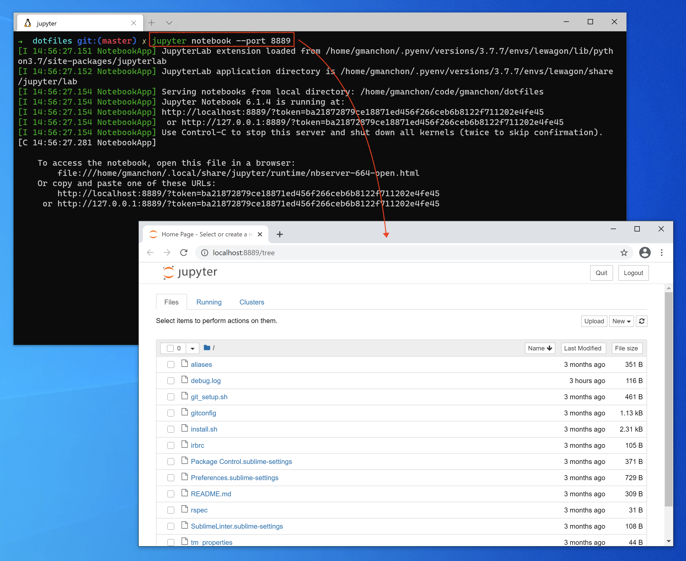
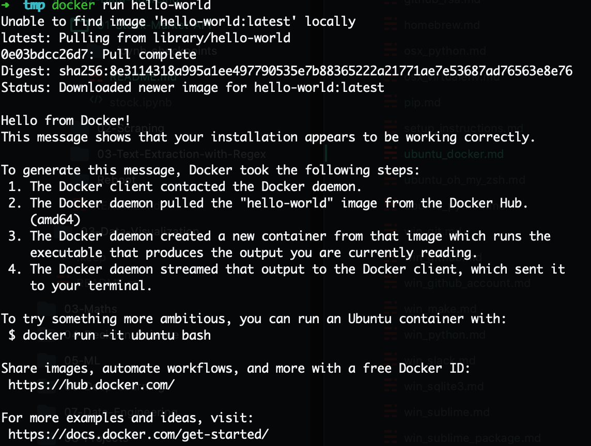
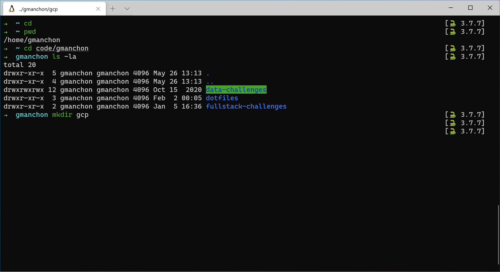
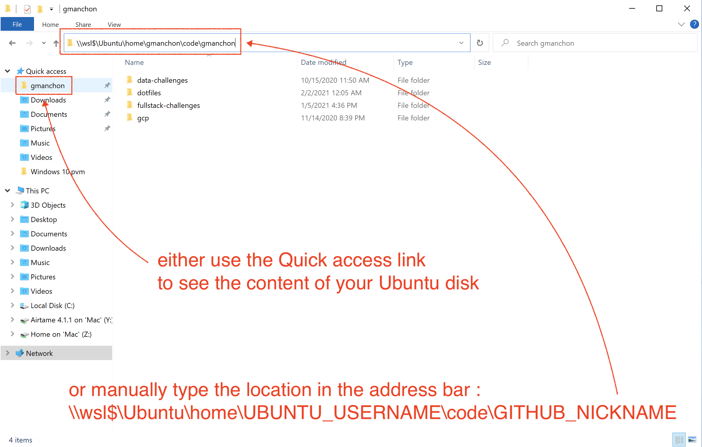
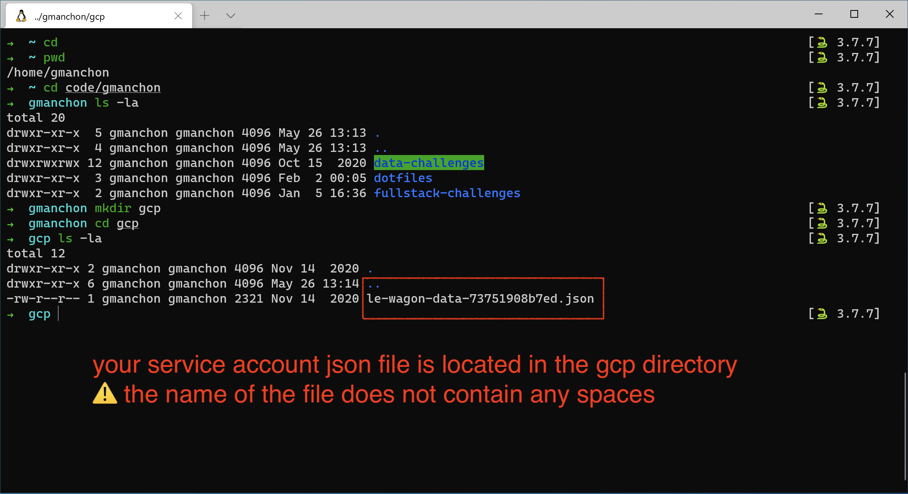

# Instrucciones para la configuración

Aquí abajo encontrarás las instrucciones para configurar tu computadora para [el curso de Data Science de Le Wagon](https://www.lewagon.com/data-science-course/full-time)

Por favor **léelas cuidadosamente y ejecuta todos los comandos en el siguiente orden**. Si tienes algún problema, no dudes en pedirle ayuda a una profesor :raising_hand:

¡Comencemos! :rocket:


## Zoom

Para poder interactuar cuando no estemos en el mismo lugar físico, usaremos [Zoom](https://zoom.us/), una herramienta de videoconferencia.

:warning: Si ya tienes Zoom instalado, por favor asegúrate de que por lo menos tienes versión **5.6**.

Ve a [zoom.us/download](https://zoom.us/download).

Haz clic en el botón **Download** debajo de **Zoom Client**.

Abre el archivo que acabas de descargar para instalar la aplicación.

Abre la aplicación Zoom.

Si ya tienes una cuenta Zoom, inicia sesión con tus credenciales.

Si no, haz clic en el enlace **Sign Up Free**, que significa registrarse gratuitamente:


Te redireccionarán a la página de Zoom para que completes un formulario.

Cuando termines, regresa a la aplicación Zoom e inicia sesión usando tus credenciales.

Deberías ver una pantalla como la siguiente:


Ya puedes cerrar la aplicación Zoom.


## Cuenta GitHub

¿Ya tienes una cuenta GitHub? Si no es el caso, [ábrela ya](https://github.com/join).

:point_right: **[Sube una foto](https://github.com/settings/profile)** y escribe tu nombre correctamente en tu cuenta GitHub. Esto es importante porque nosotros usaremos un tablero de comando interno con tu avatar. Por favor hazlo **ahora** antes de dar un paso más en esta guía.


:point_right: **[Habilita la Autenticación de Dos Factores (2FA)](https://docs.github.com/en/authentication/securing-your-account-with-two-factor-authentication-2fa/configuring-two-factor-authentication#configuring-two-factor-authentication-using-text-messages)**. GitHub te enviará mensajes de texto con un código cuando intentes iniciar sesión. Esto es importante para la seguridad y también pronto será necesario para contribuir código en GitHub.


## La versión de Windows

Antes de comenzar, necesitamos verificar que la versión de Windows instalada en tu computadora sea compatible con estas instrucciones de configuración.

### Windows 10 o Windows 11

Para poder configurar tu computadora, necesitas tener **Windows 10 o Windows 11** instalado.

Para chequear la versión de tu Windows:
- Presiona `Windows` + `R`
- Escribe  `winver`
- Presiona `Enter`

:heavy_check_mark: Si las primeras palabras de esta ventana son **Windows 10 o Windows 11**, entonces todo está bien y puedes continuar trabajando en la configuración :+1:

:x: Si no es el caso, no puedes continuar. Primero debes actualizar tu versión a Windows 10 :point_down:

<details>
  <summary>Actualizar a Windows 10</summary>

  - Descarga Windows 10 desde [Microsoft](https://www.microsoft.com/software-download/windows10ISO)
  - Instálalo. Debería tomar como una hora pero realmente depende de tu computadora.
  - Cuando termine la instalación, ejecuta los comandos de aquí arriba :point_up: para chequear que tengas **Windows 10**.
</details>

:information_source: [La actualización de Windows 11 está en curso en este momento](https://www.microsoft.com/en-us/windows/get-windows-11). Esto significa que puede que esté o que aún no esté disponible para tu computadora.

:warning: **Si tienes Windows 10 instalado, no necesitas actualizarlo a Windows 11 para hacer esta configuración**.

### Últimas actualizaciones

Una vez que estés seguro de que estés usando Windows 10 o 11, instala las siguientes actualizaciones.

Abre Windows Update:
- Presiona `Windows` + `R`
- Escribe `ms-settings:windowsupdate`
- Presiona `Enter`
- Haz clic en `Check updates`

:heavy_check_mark: Si tienes una marca verde y el siguiente mensaje "You're up to date", entonces todo está bien :+1:

:warning: Si obtienes una exclamación roja y el siguiente mensaje "Update available", por favor instala las actualizaciones y repite el proceso hasta que diga que todo está actualizado :loop:

:x: Si obtienes un mensaje de error diciendo que Windows no puede aplicar las actualizaciones, por favor **contacta a un profesor**.

<details>
  <summary>Activa Windows Update Service para resolver las Actualizaciones</summary>

  Algunos antivirus y programas deshabilitan las actualizaciones que necesitamos y luego se muestra un error. ¡Solucionemos esto!
  - Presiona `Windows` + `R`
  - Escribe `services.msc`
  - Presiona `Enter`
  - Haz doble clic en `Windows Update Service`
  - Coloca su `Startup` en `Automatic`
  - Haz clic en `Start`
  - Haz clic en `Ok`
  ¡Ahora intenta instalar las actualizaciones nuevamente!
</details>

### Requisito mínimo para la versión

Algunas de las herramientas que necesitamos han salido con la versión `1903` **o superior** de Windows 10, así que necesitamos asegurarnos de que al menos tengamos esa.

- Presiona `Windows` + `R`
- Escribe  `winver`
- Presiona `Enter`

Verifica el **número de la versión**:

:heavy_check_mark: Si dice al menos `1903`, entonces todo está bien :+1:

:x: Si es inferior a `1903`, por favor **contacta a un profesor**.


## Virtualización

Tenemos que asegurarnos de que las opciones de Virtualización estén habilitadas en el BIOS de tu computadora.

Normalmente ya es el caso en muchas computadoras. Verifiquemos:
- Presiona `Windows` + `R`
- Escribe `taskmgr`
- Presiona `Enter`
- Haz clic en la pestaña `Performance`
- Haz clic en `CPU`


:heavy_check_mark: Si ves "Virtualization: Enabled", entonces todo está bien :+1:

:x: Si falta la línea o si la virtualización está desactivada, por favor **contacta a un profesor antes de intentar activar la Virtualización por tu cuenta**

<details>
  <summary>Activa la Virtualización</summary>

  Debemos acceder al BIOS / UEFI de la computadora para activarla.
  - Presiona `Windows + R`
  - Escribe `shutdown.exe /r /o /t 1`
  - Presiona `Enter`
  - Espera a que la computadora se apague
  - Haz clic en `Troubleshoot`
  - Haz clic en `Advanced Options`
  - Haz clic en `UEFI Firmware Settings`
  - Haz clic en `Restart`

  Debes activar la opción de la virtualización para tu procesador aquí:
  - La mayoría de las veces se hace en los parámetros avanzados, los parámetros del CPU o los parámetros de Northbridge
  - El nombre de la opción puede variar de una computadora a otra:
      - Intel: `Intel VT-x`, `Intel Virtualization Technology`, `Virtualization Extensions`, `Vanderpool`...
      - AMD: `SVM Mode` o `AMD-V`
  - Guarda los cambios después de la activación y reinicia la computadora con las opciones correspondientes
</details>


## Subsistema de Windows para Linux (WSL)

WSL es el ambiente de entorno que estamos usando para usar Ubuntu. Puedes aprender más sobre WSL [aquí](https://docs.microsoft.com/en-us/windows/wsl/faq).

:information_source: Las instrucciones que verás a continuación dependen de la versión de Windows que tengas. Por favor ejecuta solamente las instrucciones que correspondan a tu versión :point_down:

### Windows 11

Si usas Windows 11, instalaremos WSL 2 y Ubuntu con un comando a través de la terminal de Windows.

:warning: en esta instrucción, utiliza el atajo `Ctrl` + `Shift` + `Enter` para usar la **terminal de Windows** con privilegios de administrador en lugar de simplemente hacer clic en `Ok` o presionar `Enter`.

- Presiona `Windows` + `R`
- Escribe `wt`
- Presiona **`Ctrl` + `Shift` + `Enter`**

:warning: tal vez tengas que aceptar la confirmación UAC sobre el cambio en los privilegios.

Un ventana de terminal azul aparecerá:
- Copia el siguiente comando (`Ctrl` + `C`)
- Pégalo en la ventana de la terminal (`Ctrl` + `V` o haciendo clic derecho en la ventana)
- Ejecútalo presionado `Enter`

```powershell
wsl --install
```

:heavy_check_mark: Si el comando se ejecutó sin ningún error, por favor reinicia tu computadora y continúa con las siguientes instrucciones aquí abajo :+1:

:x: Si obtienes un mensaje de error (o si ves algún texto en rojo en la ventana), por favor **contacta a un profesor**

### Windows 10

#### Instalación de WSL 1

Si tienes Windows 10, primero instalaremos WSL 1 por medio de la Terminal de PowerShell.

:warning: en esta instrucción, utiliza el atajo `Ctrl` + `Shift` + `Enter` para usar **Windows PowerShell** con privilegios de administrador en lugar de hacer clic en `Ok` o presionar `Enter`.

- Presiona `Windows` + `R`
- Escribe `powershell`
- Presiona **`Ctrl` + `Shift` + `Enter`**

:warning: tal vez tengas que aceptar la confirmación UAC sobre el cambio en los privilegios.

Un ventana de terminal azul aparecerá:
- Copia los siguiente comandos uno por uno (`Ctrl` + `C`)
- Pégalos en la ventana de Powershell (`Ctrl` + `V` o haciendo clic derecho en la ventana)
- Ejecútalos presionado `Enter`

```powershell
Enable-WindowsOptionalFeature -Online -FeatureName Microsoft-Windows-Subsystem-Linux
```

```powershell
dism.exe /online /enable-feature /featurename:Microsoft-Windows-Subsystem-Linux /all /norestart
```

```powershell
dism.exe /online /enable-feature /featurename:VirtualMachinePlatform /all /norestart
```

:heavy_check_mark: Si los tres comandos se ejecutaron sin ningún error, por favor reinicia tu computadora y continúa con las instrucciones de aquí abajo :+1:

:x: Si obtienes un mensaje de error (o si ves algún texto en rojo en la ventada), por favor **contacta a un profesor**

#### Actualización a WSL 2

Si tienes Windows 10, actualizaremos WSL a la versión 2.

Cuando se reinicie tu computadora, descarga el instalador de WSL2.

- Ve a la [página de descarga](https://aka.ms/wsl2kernel)
- Descarga "el paquete de actualización de WSL2 Linux kernel"
- Abre el archivo que acabas de descargar
- Haz clic en `Next`
- Haz clic en `Finish`


:heavy_check_mark: Si no obtuviste ningún mensaje de error, entonces puedes continuar :+1:

:x: Si obtienes el siguiente error "This update only applies to machines with the Windows Subsystem for Linux", **haz clic derecho** en el programa y selecciona `uninstall`; esta vez deberías poder instalarlo sin problemas.

#### Coloca WSL 2 como el Subsistema Windows por defecto para Linux

Si tienes Windows 10, pondremos la versión predeterminada de WSL en 2.

Ahora coloca WSL 2 como la versión predeterminada. Esto lo podemos hacer porque ya está instalado:
- Presiona `Windows` + `R`
- Escribe  `cmd`
- Presiona `Enter`

Escribe lo siguiente en la ventana que aparecerá:

```bash
wsl --set-default-version 2
```

:heavy_check_mark: Si ves este mensaje "The operation completed successfully", puedes cerrar esta terminal y continuar con las siguientes instrucciones aquí abajo :+1:

:x: Si el mensaje que obtienes es sobre virtualización, por favor **contacta a un profesor**

<details>
  <summary>Habilita de la feature de la Virtual Machine Platform en Windows</summary>

  Sigue los pasos [siguientes](https://www.configserverfirewall.com/windows-10/please-enable-the-virtual-machine-platform-windows-feature-and-ensure-virtualization-is-enabled-in-the-bios/#:~:text=To%20enable%20WSL%202,%20Open,Windows%20feature%20on%20or%20off.&text=Ensure%20that%20the%20Virtual%20Machine,Windows%20will%20enable%20WSL%202) hasta que hayas habilitado <strong>la Virtual Machine Platform</strong> y <strong>el Subsistema de Windows para Linux</strong>
</details>

<details>
  <summary>Habilita la feature de Windows Hyper-V</summary>

  Sigue los pasos [siguientes](https://winaero.com/enable-use-hyper-v-windows-10/) hasta que hayas habilitado el grupo <strong>Hyper-V</strong>

  :information_source: Si tienes Windows 10 **Home edition**, la feature Hyper-V no está disponible para su sistema operativo. No es un bloqueo y puedes continuar con las siguientes instrucciones aquí abajo :ok_hand:
</details>


## Ubuntu

### Instalación

:information_source: Las instrucciones que verás a continuación dependen de la versión de Windows que tengas. Por favor solo sigue las instrucciones que correspondan a tu versión de Windows :point_down:

#### Windows 11

Si estás utilizando Windows 11, después de reiniciar tu computadora, deberías ver una ventana de terminal diciendo WSL está retomando el proceso de instalación de Ubuntu. Cuando termine, iniciará Ubuntu.

#### Windows 10

Si tienes Windows 10, instala la terminal de Windows por medio de la Microsoft Store:

- Haz clic en `Start`
- Escribe `Microsoft Store`
- Haz clic en `Microsoft Store` en la lista
- Busca `Ubuntu` en la barra de búsqueda
- **Selecciona la versión sin nombre, simplemente "Ubuntu"**
- Haz clic en `Get`

:warning: ¡NO instales **Ubuntu 18.04 LTS** ni **Ubuntu 20.04**!

<details>
  <summary>Desinstala las versiones incorrectas de Ubuntu</summary>

  Para desinstalar las versiones incorrectas de Ubuntu, solo tienes que ir a la Lista de Programas Instalados de Windows 10:
  - Presiona `Windows` + `R`
  - Escribe `ms-settings:appsfeatures`
  - Preiona `Enter`

  Busca el programa que desees desinstalar y haz clic en el botón de desinstalación.
</details>

Cuando termine la instalación, el botón `Get` se transformará en un botón `Open`: Haz clic en él.

### Primer uso

La primera vez que lo abras, te pedirán que:
- Escojas un **username** de:
    - una palabra
    - minúscula
    - sin caracteres especiales
    - por ejemplo: `lewagon` o tu `firstname`, es decir, tu primer nombre
- Escoge un **password**
- Confírmalo

:warning: Cuando escribas tu contraseña no verás nada en la pantalla. **Esto es normal**. Es una herramienta de seguridad para ocultar tanto el contenido de tu contraseña como su longitud. Simplemente escribe tu contraseña y presiona `Enter` al terminar.

Ahora puedes cerrar la ventana de Ubuntu ya que está instalado en tu computadora.

### Chequea la versión WSL de Ubuntu

- Presiona `Windows` + `R`
- Escribe  `cmd`
- Presiona `Enter`

Escribe el siguiente comando:

```bash
wsl -l -v
```

:heavy_check_mark: Si la versión de WSL de Ubuntu es 2, entonces todo está bien y puedes continuar :+1:

:x: Si la versión de WSL de Ubuntu es 1, tendremos que pasarla a la versión 2.

<details>
  <summary>Conversión de WSL de Ubuntu V1 a V2</summary>

  Escribe esto en la ventana de Entrada de Comandos:

  ```bash
  wsl --set-version Ubuntu 2
  ```

  :heavy_check_mark: Deberías obtener el siguiente mensaje en algunos segundos: `The conversion is complete`. Esto significa que la conversión ha sido completada.

  :x: Si no funciona, tendremos que asegurarnos de que los archivos de Ubuntu no estén comprimidos.
</details>

<details>
  <summary>Chequea si los archivos no están comprimidos</summary>

  - Presiona `Windows` + `R`
  - Escribe  `%localappdata%\Packages`
  - Presiona `Enter`
  - Abre la carpeta `CanonicalGroupLimited.UbuntuonWindows...`
  - Haz clic derecho en la carpeta `LocalState`
  - Haz clic en `Properties`
  - Haz clic en `Advanced`
  - Asegúrate de que la opción `Compress content` **no** esté seleccionada. Luego haz clic en `Ok`.

  Aplícale cambios a esta carpeta solamente y trata de convertir la versión de WSL de Ubuntu nuevamente.

  :x: Si la conversión aún no funciona, por favor **contacta a un profesor**.
</details>

### Compruebe la locale

La "locale" es un mecanismo que permite adaptar los programas a su idioma y país.

Comprobemos que la configuración regional por defecto es el inglés:

```bash
locale
```

Si la salida no contiene `LANG=en_US.UTF-8`, ejecute el siguiente comando en un Ubuntu terminal para instalar la locale inglesa:

```bash
sudo locale-gen en_US.UTF-8
```

Si después, recibes una advertencia (`bash: warning: setlocale: LC_ALL: cannot change locale (en_US.utf-8)`) en tu terminal, por favor haz lo siguiente:

<details>
  <summary>Generar la configuración regional<>/summary>

Por favor, ejecuta estas líneas en tu terminal.

```bash
sudo update-locale LANG=en_US.UTF8
sudo apt-get update
sudo apt-get install language-pack-en language-pack-en-base manpages
```
</details>

Ya puedes cerrar la ventana de la terminal.


## Chrome - tu navegador

Instala el navegador Google Chrome si no lo tienes todavía y configúralo como tu __navegador predeterminado__.

Sigue los pasos en el siguiente enlace :point_right: [Instalación de Google Chrome](https://support.google.com/chrome/answer/95346?co=GENIE.Platform%3DDesktop&hl=en-GB)

__¿Por qué Chrome?__

Lo recomendamos como navegador predeterminado porque es el más compatible con los tests y la ejecución de código. Además trabaja con Google Cloud Platform. Otra opción es Firefox. No recomendamos usar otros navegadores como Opera, Internet Explorer o Safari.


## Visual Studio Code

### Instalación

Instala el editor de texto [Visual Studio Code](https://code.visualstudio.com).

- Ve a [la página de descarga de Visual Studio Code](https://code.visualstudio.com/download).
- Haz clic en el botón "Windows"
- Abre el archivo que acabas de descargar.
- Instálalo con pocas opciones:


Abre VS Code cuando termine la instalación.

### Conexión de VS Code con Ubuntu

Instala la extensión de VS Code llamada [Remote - WSL](https://marketplace.visualstudio.com/items?itemName=ms-vscode-remote.remote-wsl) para hacer que VS Code interactúe adecuadamente con Ubuntu.

Abre tu **terminal Ubuntu**.

Copia y pega los siguientes comandos en la terminal:

```bash
code --install-extension ms-vscode-remote.remote-wsl
```

Luego abre VS Code desde la terminal:

```bash
code .
```

:heavy_check_mark: Si ves `WSL: Ubuntu` en la esquina inferior izquierda de la ventana de VS Code, entonces todo está bien y puedes continuar :+1:


:x: Si no es el caso, por favor **pídele ayuda a un profesor**.


## Terminal de Windows

### Instalación

:information_source: Las instrucciones que verás a continuación dependen de la versión de Windows que tengas.

Si estás utilizando Windows 11, la terminal de Windows ya está instalada y puedes ir a la siguiente sección :point_down:


Si tienes Windows 10, instala la terminal de Windows. Verás que es una terminal moderna:

- Haz clic en `Start`
- Escribe `Microsoft Store`
- Haz clic en `Microsoft Store` en la lista
- Busca `Windows Terminal` en la barra de búsqueda
- **Selecciona Windows Terminal"**
- Haz clic en `Install`

:warning: ¡NO instales **Windows Terminal Preview**, solo instala **Windows Terminal**!

<details>
  <summary>Desinstala la versión incorrecta de la terminal de Windows</summary>

  Para desinstalar la versión incorrecta la terminal de Windows, solamente tienes que ir a la lista de programas instalados de Windows 10:

  - Presiona `Windows` + `R`
  - EScribe  `ms-settings:appsfeatures`
  - Presiona `Enter`

  Busca el programa que quieres desinstalar y haz clic en el botón de desinstalación.
</details>

Cuando termine la instalación, el botón `Install` se transformará en un botón `Launch`: haz clic en él.

### Ubuntu como terminal predeterminada

Hagamos que Ubuntu sea la terminal predeterminada de tu aplicación Windows terminal.

Presiona `Ctrl` + `,`

Debería abrir los parámetros de la terminal:


- Cambia el perfil predeterminado a "Ubuntu"
- Haz clic en "Save"
- Haz clic en "Open JSON file"

Verás la parte a cambiar en un círculo rojo:


Primero pídele a Ubuntu que inicie directamente dentro de tu Ubuntu Home Directory en vez de hacerlo desde Windows:
- Localiza el `"name": "Ubuntu",`
- Agrega la siguiente línea debajo de eso:

```bash
"commandline": "wsl.exe ~",
```

:warning: ¡Que no se te olvide la coma al final de la línea!

Luego deshabilita el warning para copiar y pegar comandos entre Windows y Ubuntu:
- Localiza la línea `"defaultProfile": "{2c4de342-...}"`
- Agrega la siguiente línea debajo de eso:

```bash
"multiLinePasteWarning": false,
```

:warning: ¡No olvides la coma al final de la línea!

Puedes guardar estos cambios presionando `Ctrl` + `S`

:heavy_check_mark: Tu **Windows Terminal** ya está configurada :+1:

Esta terminal tiene pestañas: puedes escoger abrir una terminal en una nueva pestaña haciendo clic en el **+** al lado de la pestaña actual.
**De ahora en adelante, cada vez que hablemos de la terminal o la consola, nos referiremos a esta.** NUNCA más uses otra.


## Extensiones de VS Code

### Instalación

Instala algunas extensiones útiles para VS Code.

```bash
code --install-extension ms-vscode.sublime-keybindings
code --install-extension emmanuelbeziat.vscode-great-icons
code --install-extension MS-vsliveshare.vsliveshare
code --install-extension ms-python.python
code --install-extension KevinRose.vsc-python-indent
code --install-extension ms-python.vscode-pylance
code --install-extension ms-toolsai.jupyter
```

Aquí está la lista de las extensiones que estás instalando:
- [Sublime Text Keymap and Settings Importer](https://marketplace.visualstudio.com/items?itemName=ms-vscode.sublime-keybindings)
- [VSCode Great Icons](https://marketplace.visualstudio.com/items?itemName=emmanuelbeziat.vscode-great-icons)
- [Live Share](https://marketplace.visualstudio.com/items?itemName=MS-vsliveshare.vsliveshare)
- [Python](https://marketplace.visualstudio.com/items?itemName=ms-python.python)
- [Python Indent](https://marketplace.visualstudio.com/items?itemName=KevinRose.vsc-python-indent)
- [Pylance](https://marketplace.visualstudio.com/items?itemName=ms-python.vscode-pylance)
- [Jupyter](https://marketplace.visualstudio.com/items?itemName=ms-toolsai.jupyter)


## Herramientas de línea de comando

### Zsh & Git

En lugar de usar el `bash` [shell](https://en.wikipedia.org/wiki/Shell_(computing)) predeterminado, usaremos `zsh`.

También utilizaremos [`git`](https://git-scm.com/), un programa de línea de comando para control de versiones.

Vamos a instalarlos, junto con otros programas útiles:
- Abre una **terminal de Ubuntu**
- Copia y pega los siguientes comandos:

```bash
sudo apt update
```

```bash
sudo apt install -y curl git imagemagick jq unzip vim zsh
```

Estos comandos te pedirán tu contraseña: escríbela.

:warning: Cuando escribas tu contraseña no verás nada en la pantalla. **Esto es normal**. Es una herramienta de seguridad para ocultar tanto el contenido de tu contraseña como su longitud. Simplemente escribe tu contraseña y presiona `Enter` al terminar.

### Instalación de la CLI de GitHub

Instalemos la [CLI oficial de GitHub](https://cli.github.com) (Interfaz de Línea de Comando). Es un programa que se usa para interactuar con tu cuenta GitHub por medio de la línea de comando.

En tu terminal, copia y pega los siguientes comandos y escribe tu contraseña si te la piden:

```bash
sudo apt remove -y gitsome # gh command can conflict with gitsome if already installed
curl -fsSL https://cli.github.com/packages/githubcli-archive-keyring.gpg | sudo dd of=/usr/share/keyrings/githubcli-archive-keyring.gpg
echo "deb [arch=$(dpkg --print-architecture) signed-by=/usr/share/keyrings/githubcli-archive-keyring.gpg] https://cli.github.com/packages stable main" | sudo tee /etc/apt/sources.list.d/github-cli.list > /dev/null
sudo apt update
sudo apt install -y gh
```

Ejecuta el comando que te mostramos a continuación para verificar que `gh` se haya instalado correctamente en tu máquina:

```bash
gh --version
```

:heavy_check_mark: Si ves esta versión `gh version X.Y.Z (YYYY-MM-DD)`, puedes continuar trabajando :+1:

:x: Si no es el caso, por favor **contacta a un profesor**


## Oh-my-zsh

Instalemos el plugin `zsh` [Oh My Zsh](https://ohmyz.sh/).

Ejecuta este comando en la terminal:

```bash
sh -c "$(curl -fsSL https://raw.github.com/ohmyzsh/ohmyzsh/master/tools/install.sh)"
```

Si te preguntan "Do you want to change your default shell to zsh?", presiona `Y`

Cuando termines, tu terminal debería lucir así:


:heavy_check_mark: Si es el caso, puedes continuar :+1:

:x: Si no, por favor **pídele ayuda a un profesor**.


## Conexión de tu navegador predeterminado con Ubuntu

Para asegurarnos de que puedas interactuar desde la terminal de Ubuntu con el navegador que tienes instalado en Windows, debemos definirlo como tu navegador predeterminado aquí.

:warning: Tienes que ejecutar al menos uno de los siguientes comandos:

<details>
  <summary>Google Chrome como tu navegador predeterminado</summary>

  Ejecuta este comando:

  ```bash
    ls /mnt/c/Program\ Files\ \(x86\)/Google/Chrome/Application/chrome.exe
  ```

  Si obtienes un error como este `ls: cannot access...` corre el siguiente comandos:

  ```bash
    echo "export BROWSER=\"/mnt/c/Program Files/Google/Chrome/Application/chrome.exe\"" >> ~/.zshrc
    echo "export GH_BROWSER=\"'/mnt/c/Program Files/Google/Chrome/Application/chrome.exe'\"" >> ~/.zshrc
  ```

  Si no es el caso, ejecuta lo siguiente:

  ```bash
    echo "export BROWSER=\"/mnt/c/Program Files (x86)/Google/Chrome/Application/chrome.exe\"" >> ~/.zshrc
    echo "export GH_BROWSER=\"'/mnt/c/Program Files (x86)/Google/Chrome/Application/chrome.exe'\"" >> ~/.zshrc
  ```
</details>

<details>
  <summary>Mozilla Firefox como tu navegador predeterminado</summary>

  Ejecuta el siguiente comando:

  ```bash
    ls /mnt/c/Program\ Files\ \(x86\)/Mozilla\ Firefox/firefox.exe
  ```

  Si obtienes un error como este `ls: cannot access...` corre el siguiente comandos:

  ```bash
    echo "export BROWSER=\"/mnt/c/Program Files/Mozilla Firefox/firefox.exe\"" >> ~/.zshrc
    echo "export GH_BROWSER=\"'/mnt/c/Program Files/Mozilla Firefox/firefox.exe'\"" >> ~/.zshrc
  ```

  Si no es el caso, ejecuta lo siguiente:

  ```bash
    echo "export BROWSER=\"/mnt/c/Program Files (x86)/Mozilla Firefox/firefox.exe\"" >> ~/.zshrc
    echo "export GH_BROWSER=\"'/mnt/c/Program Files (x86)/Mozilla Firefox/firefox.exe'\"" >> ~/.zshrc
  ```
</details>

<details>
  <summary>Microsoft Edge como tu navegador predeterminado</summary>

  Ejecuta el siguiente comandos:

  ```bash
    echo "export GH_BROWSER=\"'/mnt/c/Program Files (x86)/Microsoft/Edge/Application/msedge.exe'\"" >> ~/.zshrc
  ```
</details>

Reinicia tu terminal.

Luego asegúrate de que el siguiente comando devuelva "Browser defined 👌":

```bash
[ -z "$BROWSER" ] && echo "ERROR: please define a BROWSER environment variable ⚠️" || echo "Browser defined 👌"
```

Si no lo hace pero

:heavy_check_mark: sí obtienes este mensaje, puedes continuar :+1:

:x: De lo contrario, escoge un navegador de la lista de arriba y ejecuta el comando correspondiente. Luego no olvides reiniciar tu terminal:

```bash
exec zsh
```

No dudes en **pedirle ayuda a tu profesor**.


## direnv

[direnv](https://direnv.net/) es una extensión del shell. Facilita trabajar con variables de entorno por proyecto, lo cual será útil para customizar el comportamiento de tu código.

``` bash
sudo apt-get update; sudo apt-get install direnv
echo 'eval "$(direnv hook zsh)"' >> ~/.zshrc
```


## GitHub CLI

CLI es una abreviación de [Command-line Interface](https://en.wikipedia.org/wiki/Command-line_interface) que significa interfaz de línea de comando.

En esta sección usaremos [GitHub CLI](https://cli.github.com/) para interactuar directamente con GitHub desde la terminal.

Ya debería haberse instalado en tu computadora con los comandos que ejecutaste anteriormente.

Lo primero que hay que hacer para **iniciar sesión** es copiar y pegar el comando siguiente en tu terminal:

:warning: **NO edites el `email`**

```bash
gh auth login -s 'user:email' -w
```

gh le hará algunas preguntas:

`What is your preferred protocol for Git operations?` Con las flechas, elige `SSH` y presiona `Enter`. SSH es un protocolo para iniciar la sesión utilizando claves SSH en lugar de la famosa pareja nombre de usuario y contraseña.

`Generate a new SSH key to add to your GitHub account?` Presiona `Enter` para pedirle a gh que genere las claves SSH por ti.

Si ya tienes claves SSH, verás en su lugar `Upload your SSH public key to your GitHub account?`Con las flechas, selecciona la ruta de tu archivo de clave pública y pulsa `Intro`.

`Enter a passphrase for your new SSH key (Optional)`. Pon algo que quieras y que recuerdes. Es una contraseña para proteger tu private key que está almacenada en tu disco duro. Luego presiona `Enter`.

`Title for your SSH key`. Puede dejarlo en la propuesta "GitHub CLI", presiona `Enter`.

Obtendrás el siguiente resultado:

```bash
! First copy your one-time code: 0EF9-D015
- Press Enter to open github.com in your browser...
```

Selecciona y copia el código (`0EF9-D015` en el ejemplo) y luego presiona `Enter`.

Tu navegador se abrirá y te pedirá que autorices GitHub CLI para usar tu cuenta GitHub. Acepta y espera un poco.

Regresa a la terminal, presiona `Enter` nuevamente y listo. Eso es todo.

Para verificar que están conectado correctamente, escribe lo siguiente:

```bash
gh auth status
```

:heavy_check_mark: Si obtienes este mensaje: `Logged in to github.com as <YOUR USERNAME> `, significa que todo está bien :+1:

:x: De lo contrario, **contacta a un profesor**.


## CLI de Google Cloud

Instala la CLI de `gcloud` para comunicar con [Google Cloud Platform](https://cloud.google.com/) a través de la terminal:
```bash
echo "deb [signed-by=/usr/share/keyrings/cloud.google.gpg] https://packages.cloud.google.com/apt cloud-sdk main" | sudo tee -a /etc/apt/sources.list.d/google-cloud-sdk.list
sudo apt-get install apt-transport-https ca-certificates gnupg
curl https://packages.cloud.google.com/apt/doc/apt-key.gpg | sudo apt-key --keyring /usr/share/keyrings/cloud.google.gpg add -
sudo apt-get update && sudo apt-get install google-cloud-sdk
sudo apt-get install google-cloud-sdk-app-engine-python
```
👉 [Documentación para la instalación](https://cloud.google.com/sdk/docs/install#deb)


## Dotfiles

Hay tres opciones, escoge **una**:

<details>
    <summary>
        <strong>Ya hice el bootcamp de Web Development (FullStack) de Le Wagon <em>en la misma laptop</em></strong>
    </summary>

Esto significa que ya has hecho el fork del repositorio GitHub `lewagon/dotfiles` pero tal vez la configuración para el nuevo bootcamp de Data Science no estaba lista en ese momento.

Abre tu terminal y ve a tu proyecto `dotfiles`:

```bash
cd ~/code/<YOUR_GITHUB_NICKNAME>/dotfiles
code . # Open it in VS Code
```

En VS Codeabre  el archivo `zshrc`. Reemplaza su contenido con la [versión más reciente](https://raw.githubusercontent.com/lewagon/dotfiles/master/zshrc) de ese archivo que te suministramos. Luego guárdalo en el disco.

Regresa a la terminal y ejecuta un `git diff` y pídele a un TA que venga y verifique este cambio de configuración. Debería ver cosas de Python y `pyenv`.

Cuando el TA termine de hacer la verificación, haz un commit y haz el push de tus cambios:

```bash
git add zshrc
git commit -m "Update zshrc for Data Science bootcamp"
git push origin master
```

</details>

O


<details>
    <summary>
        <strong>No he hecho el bootcamp de Web Development (FullStack) de Le Wagon</strong>
    </summary>

Los hackers aman mejorar sus shells y sus herramientas. Comenzaremos con una configuración por defecto genial proporcionada por [Le Wagon](http://github.com/lewagon/dotfiles) y almacenada en GitHub. Tu configuración es personal, así que necesitas tu propio repositorio para almacenarla. Primero tienes que hacer el fork del repositorio en tu cuenta GitHub.

:arrow_right: [Haz clic aquí para hacer el **fork**](https://github.com/lewagon/dotfiles/fork) del repositorio `lewagon/dotfiles` a tu cuenta (deberás hacer clic nuevamente en tu foto para confirmar _dónde_ harás el fork).

Hacer un fork significa que crearás un nuevo repositorio en tu cuenta GitHub idéntico al original. Tendrás un nuevo repositorio en tu cuenta GitHub, `your_github_username/dotfiles`. El fork es necesario porque cada uno de ustedes necesitará poner información específica (e.g. tu nombre) en esos archivos.


Abre tu terminal y ejecuta el comando siguiente:

```bash
export GITHUB_USERNAME=`gh api user | jq -r '.login'`
echo $GITHUB_USERNAME
```

Deberías ver tu usuario GitHub. Si no es así, **no hagas más nada** y pide ayuda.
Parece que hay un problema con el paso anterior (`gh auth`).

Es hora de hacer el fork del repositorio y clonarlo en tu laptop:

```bash
mkdir -p ~/code/$GITHUB_USERNAME && cd $_
gh repo fork lewagon/dotfiles --clone
```

Ejecuta el instalador de `dotfiles`.

```bash
cd ~/code/$GITHUB_USERNAME/dotfiles && zsh install.sh
```

Verifica los emails registrados en tu cuenta GitHub. Deberás seleccionar uno de ellos en el próximo paso:

```bash
gh api user/emails | jq -r '.[].email'
```

Ejecuta el instalador de git:

```bash
cd ~/code/$GITHUB_USERNAME/dotfiles && zsh git_setup.sh
```

:point_up: Esto te **guiará** con tu nombre (`FirstName LastName`) y con tu email.
:warning: Cuidado, **debes** poner uno de los emails de la lista de arriba que te suministra el comando `gh api ...` usado anteriormente. Si haces eso, Kitt no podrá hacerle seguimiento a tu progreso. Cualquier correo que elijas se mostrará **públicamente** en internet. 💡 Selecciona la dirección `@users.noreply.github.com` si no quieres que tu correo electrónico aparezca en los repositorios públicos a los que puedas contribuir.

Ahora **cierra** todas las ventanas de tu terminal que tengas abiertas por favor.
</details>


OR

<details>
    <summary>
        <strong>IYa hice el bootcamp de Web Development (FullStack) de Le Wagon <em>pero tengo una nueva laptop</em></strong>
    </summary>


Abre tu terminal y ejecuta el comando siguiente:

```bash
export GITHUB_USERNAME=`gh api user | jq -r '.login'`
echo $GITHUB_USERNAME
```

Deberías ver tu usuario GitHub. Si no es así, **no hagas más nada** y pide ayuda.
Parece que hay un problema con el paso anterior (`gh auth`).

Es hora de hacer el fork del repositorio y clonarlo en tu laptop:

```bash
mkdir -p ~/code/$GITHUB_USERNAME && cd $_
gh repo fork lewagon/dotfiles --clone
```

Ejecuta el instalador de `dotfiles`.

```bash
cd ~/code/$GITHUB_USERNAME/dotfiles && zsh install.sh
```

Verifica los emails registrados en tu cuenta GitHub. Deberás seleccionar uno de ellos en el próximo paso:

```bash
gh api user/emails | jq -r '.[].email'
```

Ejecuta el instalador de git:

```bash
cd ~/code/$GITHUB_USERNAME/dotfiles && zsh git_setup.sh
```

:point_up: Esto te **guiará** con tu nombre (`FirstName LastName`) y con tu email.
:warning: Cuidado, **debes** poner uno de los emails de la lista de arriba que te suministra el comando `gh api ...` usado anteriormente. Si haces eso, Kitt no podrá hacerle seguimiento a tu progreso. Cualquier correo que elijas se mostrará **públicamente** en internet. 💡 Selecciona la dirección `@users.noreply.github.com` si no quieres que tu correo electrónico aparezca en los repositorios públicos a los que puedas contribuir.

Ahora **cierra** todas las ventanas de tu terminal que tengas abiertas por favor.
</details>


## Desahilitación de la solicitud de SSH passphrase

No vas a querer que te pidan tu passphrase cada vez que te comuniques con un repositorio remoto. Por eso debes agregarle plugin `ssh-agent` a `oh my zsh`:

Primero abre el archivo `.zshrc`:

```bash
code ~/.zshrc
```

Luego:
- Identifica la línea que comienza por `plugins=`
- Agrega `ssh-agent` al final de la lista de plugins

La lista debería verse de la siguiente manera:

```bash
plugins=(gitfast last-working-dir common-aliases zsh-syntax-highlighting history-substring-search pyenv ssh-agent)
```

:heavy_check_mark: Guarda el archivo `.zshrc` con `Ctrl` + `S` y cierra tu editor de texto.


## Instalando Python (con [`pyenv`](https://github.com/pyenv/pyenv))

### Desinstalar `conda`

Como estamos utilizando `pyenv` para instalar y gestionar la versión de Python, necesitamos desinstalar [`conda`](https://docs.conda.io/projects/conda/en/latest/), otro gestor de paquetes que podrías tener en tu computadora si previamente instalaste [Anaconda](https://www.anaconda.com/). De esta forma, evitaremos problemas con Python más adelante.

Chequea si tienes `conda` instalado en tu computadora:

```bash
conda list
```
Si aparece `zsh: command not found: conda`, puedes **saltear** la desinstalación de `conda` e ir directo a la sección de **Instalar pre-requisitos**.

<details>
    <summary markdown='span'>Instrucciones de desinstalación <code>conda</code></summary>

- Instala el paquete Anaconda-Clean desde tu terminal y comienza la limpieza
```bash
conda install anaconda-clean
anaconda-clean --yes
```
- Remueve todos los directorios de Anaconda
```bash
rm -rf ~/anaconda2
rm -rf ~/anaconda3
rm -rf ~/.anaconda_backup
```
- Elimina el directorio Anaconda de tu `.bash_profile`
    - Abre el archivo con `code ~/.bash_profile`
    - Si el archivo abre, busca la línea que coincida con el siguiente patrón `export PATH="/path/to/anaconda3/bin:$PATH"` y eliminala
- Reinicia la terminal con `exec zsh`
- Remueve la inicializaciópn de Anaconda de tu `.zshrc`:
    - Abre el archivo con `code ~/.zshrc` 
    - Remueve las líneas de código desde `>>> conda initialize >>>` hasta `<<< conda initialize <<<`
</details>


### Instala `pyenv`

Ubuntu viene con una versión vieja de Python que no queremos usar. Tal vez ya hayas instalado Anaconda u otro programa para utilizar Python y paquetes de Ciencia de Datos. Si es así, no pasa nada ya que haremos una configuración profesional de Python que te permitirá cambiar de versión cuando quieras al escribir `python` en la terminal.

Primero instala `pyenv` con el siguiente comando en la Terminal:

```bash
git clone https://github.com/pyenv/pyenv.git ~/.pyenv
exec zsh
```

Instala algunas [dependencias](https://github.com/pyenv/pyenv/wiki/common-build-problems#prerequisites) necesarias para crear Python desde `pyenv`:

```bash
sudo apt-get update; sudo apt-get install make build-essential libssl-dev zlib1g-dev \
libbz2-dev libreadline-dev libsqlite3-dev wget curl llvm \
libncursesw5-dev xz-utils tk-dev libxml2-dev libxmlsec1-dev libffi-dev liblzma-dev \
python3-dev
```

### Instala Python

Instala la [última versión estable de Python](https://www.python.org/doc/versions/) que sea aceptada en el currículum de Le Wagon:

```bash
pyenv install 3.12.9
```

Este comando puede tomar un tiempo en ejecutarse. Esto es completamente normal. ¡No dudes en ayudar a los estudiantes que estén sentados cerca de ti!

OK. Cuando este comando termine de ejecutarse, le diremos al sistema que use esta versión de Python **por defecto**. Esto se hace con:

```bash
pyenv global 3.12.9
exec zsh
```

Para verificar que esto haya funcionado, ejecuta `python --version`. Si ves `3.12.9`, ¡todo está bien! Si no, pídele ayuda a un TA para resolver el problema por medio de `versiones de pyenv` y `type -a python` (`python` debería estar usando la versión `.pyenv/shims` de primero).


## Entorno Virtual de Python

Antes de instalar paquetes de Python, aislaremos la configuración del Bootcamp en un entorno virtual **dedicado**. Usaremos un plugin `pyenv` llamado [`pyenv-virtualenv`](https://github.com/pyenv/pyenv-virtualenv).

### Instala un virtualenv

Primero instala este plugin:

```bash
git clone https://github.com/pyenv/pyenv-virtualenv.git $(pyenv root)/plugins/pyenv-virtualenv
exec zsh
```

Crea el entorno virtual que usaremos durante todo el bootcamp:

```bash
pyenv virtualenv 3.12.9 lewagon
```

Define el entorno virtual con lo siguiente:

```bash
pyenv global lewagon
```

¡Genial! Ahora cada vez que queramos instalar un paquete Python, lo haremos en ese entorno.


### Paquetes de Python

Ahora que tenemos el ambiente virtual de `lewagon` adecuado, es hora de instalarle algunos paquetes.

Primero, actualiza `pip`, la herramienta para instalar Paquetes Python desde [pypi.org](https://pypi.org). Ejecuta lo siguiente en la última terminal donde esté activado el virtualenv de `lewagon`:

```bash
pip install --upgrade pip
```

Ahora instala algunos paquetes para las primeras semanas del programa:

``` bash
pip install -r https://raw.githubusercontent.com/lewagon/data-setup/master/specs/releases/linux.txt
```


## Configuración de Jupyter Notebook para abrirlo en tu navegador

Genera el archivo de configuración para **Jupyter Notebook**...

``` bash
jupyter notebook --generate-config
```

⚠️ Por favor copia la ruta que arrojó el comando anterior.

Ahora edita el archivo de configuración de Jupyter generado:

``` bash
code $HOME/.jupyter/jupyter_notebook_config.py
```

Localiza la siguiente línea en el archivo de configuración:

``` python
# c.NotebookApp.use_redirect_file = True
```

Y reemplázala por éste **precisamente** 👇 (incluyendo la eliminación del símbolo `#`)

``` python
c.NotebookApp.use_redirect_file = False
```

Intenta usar Jupyter:

``` bash
jupyter notebook
```

Este comando debió haber abierto una página Jupyter en tu navegador:



Si no es el caso, por favor llama a un TA.

Para cerrar el servidor jupyter en la terminal, presiona `CTRL` + `C`, enter y. Luego presiona Enter.


### Mejora `jupyter` notebook

Mejora la visualización del [elemento `details` para revelación de información](https://developer.mozilla.org/en-US/docs/Web/HTML/Element/details) en tus notebooks.

Ejecuta las siguientes líneas para crear una hoja de estilos `custom.css` en tu directorio de configuración de Jupyter:

```bash
LOCATION=$(jupyter --config-dir)/custom
SOURCE=https://raw.githubusercontent.com/lewagon/data-setup/refs/heads/master/specs/jupyter/custom.css
mkdir -p $LOCATION
curl $SOURCE > $LOCATION/custom.css
```


## Chequeo de la configuración de Python

Reinicia tu terminal:

```bash
cd ~/code && exec zsh
```

Verifica tu versión de Python con los siguientes comandos:
```bash
zsh -c "$(curl -fsSL https://raw.githubusercontent.com/lewagon/data-setup/master/checks/python_checker.sh)" 3.12.9
```

Ejecuta el comando siguiente para verificar que hayas instalado los paquetes requeridos correctamente:
```bash
zsh -c "$(curl -fsSL https://raw.githubusercontent.com/lewagon/data-setup/master/checks/pip_check.sh)"
```

Ahora ejecuta el siguiente comando para verificar que puedas cargar estos paquetes:
```bash
python -c "$(curl -fsSL https://raw.githubusercontent.com/lewagon/data-setup/master/checks/pip_check.py)"
```

Ahora verifica que puedas iniciar un servidor de notebook en tu máquina:

```bash
jupyter notebook
```

Tu navegador web debería abrir en una ventana `jupyter`:


Haz clic en `New` y, en el menú desplegable, selecciona Python 3 (ipykernel):


Debería abrirse una pestaña en un nuevo notebook:


Asegúrate de que estés usando la versión correcta de python en el notebook. Abre una celda y ejecuta lo siguiente:
``` python
import sys; sys.version
```

Debería mostrar `3.12.9` seguido de algunos detalles adicionales. Si no es así, consulta con un TA.

Puedes cerrar tu navegador web y luego cerrar el servidor jupyter con `CTRL` + `C`.

¡Listo! Ya tienes un virtual env de python completo con todos los paquetes tercerizados que necesitarás en el bootcamp.


## DBeaver

DDescarga e instala [DBeaver](https://dbeaver.io/), una herramienta poderosa, gratuita y de código abierto para conectar con cualquier base de datos, explorar su esquema e incluso **hacer consultas SQL**.


## Parámetros de Windows

### Intercambio de archivos entre Windows y Ubuntu

Necesitamos una manera fácil de transferir archivos de Windows a Ubuntu y viceversa.

Para ello, vamos a crear atajos a directorios Ubuntu en el **Explorador de Archivos** de Windows:
- Abre el Explorador de Archivos de Windows (o usa el atajo `WIN` + `E`)
- En la Barra de Direcciones, coloca `\\wsl$\` (o `\\wsl$\Ubuntu` si eso no funciona)
- Ahora tienes acceso al sistema de archivos de Ubuntu
- Navega por el sistema de archivos de Ubuntu para encontrar los directorios que te interesen
- Arrastra las carpetas que te interesen a la Barra de Direcciones para crear atajos


### Abre el Explorador de Archivos de Windows desde la terminal de Ubuntu

Otra opción para mover archivos es abrir el **Explorador de Archivos** de Windows desde la terminal de Ubuntu:
- Abre una terminal de Ubuntu
- Ve al directorio que quieres explorar
- Ejecuta el comando `explorer.exe .` (Otra alternativa es usar `wslview .`)
- Si obtienes un mensaje de input output error, ejecuta `wsl --shutdown` en una PowerShell de Windows y abre la terminal de Ubuntu nuevamente


### Uso del Sistema de Archivos de Ubuntu

Es posible que quieras averiguar la localización exacta de un directorio en Windows en el sistema de archivos de Ubuntu o viceversa.

Para convertir una ruta Windows a una Ubuntu y viceversa:
- Abre una terminal de Ubuntu
- Usa el comando `wslpath "C:\Program Files"` para traducir la ruta Windows a una Ubuntu
- Usa el comando `wslpath -w "/home"` para traducir una ruta Ubuntu a una Windows
- El comando `wslpath -w $(pwd)` devuelve la ruta Windows del directorio Ubuntu actual


### Anclaje de aplicaciones a tu barra de tareas

Usarás frecuentemente casi todas las aplicaciones que has instalado hoy. ¡Anclémoslas a tu barra de tareas para que estén a solo un clic de ti!

Para ello, abre la aplicación. Haz clic derecho en el ícono de la barra de tareas para hacer que aparezca el menú contextual (también llamado emergente) y selecciona "Pin to taskbar".


Ancla lo siguiente:
- Tu terminal
- Tu explorador de archivos
- VS Code
- Tu navegador de Internet
- Slack
- Zoom


## Visual C++ Redistributable

Algunos paquetes Python requieren de un compilador para funcionar correctamente, así que vamos a instalar uno:

[For x64 systems](https://aka.ms/vs/16/release/vc_redist.x64.exe)


[For x86 systems](https://aka.ms/vs/16/release/vc_redist.x86.exe)

Si no sabes qué programa estás usando, por favor pídele ayuda a un profesor.


## Docker 🐋

Docker es una plataforma abierta para desarrollo, entrega y operación de aplicaciones.

_Si ya tienes Docker instalado en tu máquina, por favor actualízalo con la versión más reciente_

### Instalación de Docker

Ve a [Docker para WSL2](https://docs.docker.com/docker-for-windows/wsl/).

Descarga e instala el backend de Docker Desktop WSL 2.

Cuando termines, inicia Docker.

Deberías poder usarlo en una terminal Ubuntu:

```bash
docker run hello-world
```

Debería aparecer el siguiente mensaje:



<details>
  <summary markdown='span'>Permission denied? (WSL / Ubuntu)</summary>

Ejecute los siguientes comandos uno por uno:

```bash
sudo groupadd docker
sudo usermod -aG docker $USER
newgrp docker
```

Intente `docker info` nuevamente.

¿Ve este error?

```
WARNING: Error loading config file: /home/user/.docker/config.json - stat /home/user/.docker/config.json: permission denied`?
```

Ejecute el siguiente comando:

```bash
sudo rm -rf ~/.docker/
```

Intente `docker info` nuevamente.

</details>


## Configuración de Google Cloud Platform

[GCP](https://cloud.google.com/) es una solución en la nube que usarás para colocar tus productos basados en Machine Learning en producción.

🚨 Si estás en el grupo de estudiantes del **Bootcamp de Medio Tiempo**, ¡IGNORA ESTA SECCIÓN POR AHORA! **GCP** ofrece $300 en créditos durante 3 meses, así que no es buena idea activar tu cuenta GCP demasiado pronto 🙅‍♂️

### Preparación del Proyecto

- Ve a [Google Cloud](https://console.cloud.google.com/) y crea una cuenta si aún no tienes una
- En la consola de Cloud, en la lista de proyectos, selecciona o crea un proyecto Cloud


- Asígnale un nombre como `Wagon Bootcamp` por ejemplo
- Verás que se creará un `ID` automáticamente para el proyecto e. g. `wagon-bootcamp-123456`


### Idioma de la cuenta

Abre las preferencias en tu cuenta GCP para facilitar el seguimiento de las instrucciones durante el bootcamp:

https://myaccount.google.com/language

Si el *idioma de preferencia* no es:
- **English**
- **United States**

Cámbialo a inglés:
- Haz clic en el logo edición (es una lapicera)
- Selecciona **English**
- Selecciona **United States**
- Haz clic en **Select**

### Cuenta de facturación

Ahora conecta tu cuenta con tu tarjeta de crédito. Este paso es obligatorio para poder usar los servicios que suministra GCP. No te preocupes, podrás utilizar la mayoría de los servicios de GCP por medio de créditos gratuitos durante el bootcamp.


- Haz clic en **Billing**
- Haz clic en **MANAGE BILLING ACCOUNTS**
- Haz clic en **ADD BILLING ACCOUNT**
- Asígnale un nombre a tu cuenta de facturación, e. g. `My Billing Account`
- Haz clic en "I have read..." y acepta los términos de uso
- Haz clic en **CONTINUE**
- Selecciona tu tipo de cuenta: `Individual`
- Agrega tu nombre y dirección

Verás que tienes créditos gratuitos con un valor de "$300 a utilizar en los próximos 90 días".

- Haz clic en los detalles de la tarjeta
- Agrega la información de tu tarjeta de crédito
- Haz clic en **START MY FREE TRIAL**. Esto significa comenzar mi período de prueba.

Cuando termines, verifica que la cuenta de facturación esté conectada con tu proyecto GCP.

- Selecciona tu proyecto
- Ve a **Billing**
- Selecciona **LINK A BILLING ACCOUNT**
- Selecciona `My Billing Account`
- Haz clic en **SET ACCOUNT**

Ahora deberías ver lo siguiente:

```
Free trial status: $300 credit and 91 days remaining - with a full account, you'll get unlimited access to all of Google Cloud Platform.
```

Esto significa Estado de período de prueba: crédito de $300 y 91 días para usarlo - con la full account, tendrás acceso ilimitado a todo lo que ofrece Google Cloud Platform.

<details>
  <summary>👉 Si no tienes una tarjeta de crédito 👈</summary>


Si no tienes una tarjeta de crédito, puedes abrir una cuenta en **Revolut**.
Revolut es una aplicación que funciona como un banco y que te permitirá crear una tarjeta de crédito virtual conectada a la dirección de facturación de tu smartphone.

Ignora este paso si ya tienes una tarjeta de crédito. Simplemente úsala para hacer la configuración.

Descarga la app Revolut o ve a [revolut](https://www.revolut.com/a-radically-better-account) y sigue los pasos para descargar la app (introduce tu número de teléfono móvil y haz clic en Get Started).

- Abre la app Revolut
- Agrega tu número de teléfono móvil
- Agrega el código de verificación que recibiste por SMS
- La app te preguntará por tu país, dirección, primer y segundo nombre, fecha de nacimiento y el email
- La app también te pedirá tu profesión y una selfie
- La app te pedirá una foto de tu documento nacional de identidad o pasaporte

Cuando termines, selecciona el plan estándar (gratuito). No tienes que agregar la tarjeta a Apple pay, pedir que te envíen una tarjeta a tu domicilio ni tampoco agregar dinero a la cuenta.

Ahora tienes una tarjeta virtual que podrás usar para hacer la configuración de GCP.

En la vista principal de la app Revolut
- Haz clic en Ready to use
- Haz clic en the card
- Haz clic en Show card details
- Toma nota de la información de la tarjeta de crédito virtual y úsala para completar la configuración de GCP

</details>

<details>
  <summary>👉 Si recibes un email de Google diciendo "Urgent: your billing account XXXXXX-XXXXXX-XXXXXX has been suspended" 👈</summary>


Esto puede pasar justo después de haber creado la cuenta en Revolut.

- Haz clic en PROCEED TO VERIFICATION
- Te pedirán que envíes una foto de tu tarjeta de crédito (solo los últimos 4 dígitos, nada más)
- Si ya has usado **Revolut**, puedes enviar una captura de pantalla de tu tarjeta de crédito virtual (no olvides quitar la fecha de vencimiento de la captura)
- Explica que estás haciendo el bootcamp de Le Wagon, que no tienes una tarjeta de crédito y que acabas de crear una cuenta en Revolut para poder configurar GCP para el bootcamp con una tarjeta de crédito virtual

Es posible que te validen la cuenta pero también es posible que te pidan más información en los próximos 30 minutos.

Cuando la cuenta sea validada recibirás un email diciendo lo siguiente: "Your Google Cloud Platform billing account XXXXXX-XXXXXX-XXXXXX has been fully reinstated and is ready to use.". Esto significa que tu cuenta Google Cloud Platform ha sido restablecida

</details>

### Habilitación de servicios de GCP

- Asegúrate de que la facturación está habilitada para tu proyecto Google Cloud

ℹ️ Tienes un **crédito de $300** para usar con recursos de Google Cloud. Esto será más que suficiente para el bootcamp.

- [Habilita las APIs BigQuery y Compute Engine](https://console.cloud.google.com/flows/enableapi?apiid=bigquery,compute) (Esto puede tomar varios minutos)

### Configuración de Cloud sdk

- Autentica el CLI de `gcloud` con la cuenta que usaste para GCP
```bash
gcloud auth login
```
- Inicia sesión en tu cuenta Google en la nueva pestaña que se abrió en tu navegador
- Lista la cuenta que tienes activa y verifica que el email que usaste para GCP está ahí
```bash
gcloud auth list
```
- Define tu proyecto actual (reemplaza `PROJECT_ID` con el `ID` de tu proyecto e.g. `wagon-bootcamp-123456`)
```bash
gcloud config set project PROJECT_ID
```
- Lista la cuenta que tienes activa y tu proyecto actual y verifica que tu proyecto está ahí
```bash
gcloud config list
```

### Crea una llave 🔑 de cuenta de servicio

Como ya creaste una cuenta `GCP account` y un `project` (identificado por su `PROJECT_ID`), vamos a configurar las acciones (llamadas API calls) que quieres que tu código ejecute.

<details>
  <summary>🤔 ¿Por qué necesitamos una clave de cuenta de servicio?</summary>


  Creaste una `cuenta GCP` conectada a una tarjeta de crédito. Te facturarán de acuerdo al uso que les des a los recursos de **Google Cloud Platform**. El cargo se hará si utilizas algo después de que el período de prueba gratuito se haya terminado o si te excedes del límite de consumo que te permite dicho período.

  En tu `cuenta GCP` has creado un solo `proyecto GCP` identificado por su `PROJECT_ID`. Los `proyectos GCP` te permiten organizar y monitorear la manera en que consumes los recursos **GCP** de forma más precisa. En este bootcamp solo crearemos un solo proyecto.

  Ahora necesitamos una manera de saber qué recursos nuestro código podrá consumir dentro de un `GCP project`. Nuestro código consume recursos GCP por medio de llamadas API.

  Ya que las llamadas API no son gratuitas, es importante definir cuidadosamente cómo nuestro código las utilizará. Sin embargo, durante el bootcamp no habrá restricciones. Le permitiremos a nuestro código que utilice todas las API **GCP** sin restricciones.

  Así como pueden haber varios proyectos asociados a una cuenta GCP, un proyecto puede estar compuesto de muchos servicios (cualquier paquete de código, sin importar su formato, que necesite utilizar llamadas a la API de GCP para cumplir con su propósito).

  GCP exige que los servicios de los proyectos que usen llamadas API se registren en la plataforma y que se configuren sus credenciales por medio del acceso concedido a una `service account`.

  Por ahora solo tendremos que usar un solo servicio y crearemos la `service account` correspondiente.
</details>

Ya que la [service account](https://cloud.google.com/iam/docs/service-accounts) es lo que identifica tu aplicación (y por ende tu cuenta de facturación GCP y, en última instancia, tu tarjeta de crédito), lo mejor es ser cuidadoso en los próximos pasos.

⚠️ **No compartas la 🔑 del archivo json de tu cuenta de servicio** ⚠️ No la guardes en tu escritorio ni en tu código base de git (incluso si tu repositorio git es privado). Que no se te olvide en un lugar como la máquina de café y, por supuesto, no la envíes en un tweet.

- Ve a la [página de las cuentas de servicio](https://console.cloud.google.com/apis/credentials/serviceaccountkey)
- Selecciona tu proyecto en la lista de proyectos recientes si te piden que
- Crees una cuenta de servicio:
  - Haz clic en **CREATE SERVICE ACCOUNT** que significa crear une cuenta de servicio:
  - Define un `Service account name` para esa cuenta. Esto significa Nombre de cuenta de servicio
  - Haz clic en **CREATE AND CONTINUE** que significa crear y continuar
  - Haz clic en **Select a role** que significa selecciona un rol. Escoge `Quick access/Basic` luego **Owner**. Esto  otorga acceso total a todos los recursos
  - Haz clic en **CONTINUE**
  - Haz clic en **DONE**
- Descarga la 🔑 del archivo json de la cuenta de servicio:
  - Haz clic en la cuenta de servicio recién creada
  - Haz clic en **KEYS**
  - Haz clic en **ADD KEY** y luego en **Create new key**
  - Selecciona **JSON** y haz clic en **CREATE**


El navegador acaba de guardar la 🔑 del archivo json de la cuenta de servicio en tu carpeta de descargas (el nombre se le asigna según el nombre de la cuenta de servicio. Es algo como `le-wagon-data-123456789abc.json`)


Ahora vamos a mover el archivo json de la cuenta de servicio desde tu disco en Windows al disco en Ubuntu. Esto le permitirá a las herramientas de desarrollo en Ubuntu acceder a los recursos de tu cuenta GCP.

Primero crea un directorio para almacenar el archivo.

👉 Abre una terminal en Ubuntu y ejecuta los siguiente comandos

🚨 reemplaza el `GITHUB_NICKNAME` por tu nickname de **GitHub**

``` bash
cd ~/code/GITHUB_NICKNAME
ls -la
```

Si el comando no muestra el directorio `dotfiles`, pídele ayuda a un TA 🙏

Si no es el caso, puedes proceder con la configuración:

``` bash
mkdir gcp
```



Ahora moveremos el archivo json de la cuenta de servicio al directorio `gcp` que acabamos de crear.

Abre un **Buscador de Archivos** de Windows (Win + E) y localiza el directorio `gcp` en el sistema de archivo de Ubuntu.

Puedes optar por las siguientes alternativas:
- Usar el enlace de **Acceso rápido** que creamos hace un rato
- O escribir la localización del directorio `gcp` manualmente en la barra de direcciones del sistema de archivos de Ubuntu:

```
\\wsl$\Ubuntu\home\UBUNTU_USERNAME\code\GITHUB_NICKNAME
```


🚨 Si optas por la segunda opción:
- reemplaza el `UBUNTU_USERNAME` por el usuario que escogiste durante la configuración de **Ubuntu**
- reemplaza el `GITHUB_NICKNAME` por tu nickname de **GitHub**



Cuando hayas localizado el directorio `gcp` en el **Buscador de Archivos** de Windows, ponle el archivo json de la cuenta de servicio que descargaste.

Ahora deberías poder ver el archivo desde el sistema de archivos de Ubuntu.

👉 Abre una terminal en Ubuntu y verifica que el archivo json de la cuenta de servicio ha sido movido

``` bash
cd gcp
ls -la
```



Si no ves el archivo json de la cuenta de servicio en el directorio `gcp`, pídele ayuda a un TA 🙏

Ahora almacenaremos la ruta al archivo json de la cuenta de servicio en una variable de entorno.

🚨 Haz las siguientes sustituciones en este comando:
- El `UBUNTU_USERNAME` por el usuario que escogiste durante la configuración de **Ubuntu**
- El `GITHUB_NICKNAME` por tu nickname de **GitHub**
- El `SERVICE_ACCOUNT_JSON_FILE_CONTAINING_YOUR_SECRET_KEY.json` por el nombre del archivo json de tu cuenta de servicio.

``` bash
echo 'export GOOGLE_APPLICATION_CREDENTIALS=/home/UBUNTU_USERNAME/code/GITHUB_NICKNAME/gcp/SERVICE_ACCOUNT_JSON_FILE_CONTAINING_YOUR_SECRET_KEY.json' >> ~/.aliases
```


<details>
  <summary>ℹ️ ¿Cómo encontrar la ruta absoluta de un archivo?</summary>
  Puedes arrastrar el archivo a tu terminal.
</details>

**Reinicia** tu terminal y ejecuta lo siguiente:

``` bash
echo $GOOGLE_APPLICATION_CREDENTIALS
```

Deberías obtener la siguiente información:

```bash
/some/absolute/path/to/your/gcp/SERVICE_ACCOUNT_JSON_FILE_CONTAINING_YOUR_SECRET_KEY.json
```

Ahora verifica si la ruta al archivo json de tu cuenta de servicio es el correcto:

``` bash
cat $(echo $GOOGLE_APPLICATION_CREDENTIALS)
```

👉 Este comando debería mostrar el contenido del archivo json de tu cuenta de servicio. Si no es el caso, pídele ayuda a un TA 🙏

Tu código y utilidades ahora pueden acceder a los recursos de tu cuenta GCP.

Continuemos con los últimos pasos de la configuración...

- Lista las cuentas de servicio asociadas a tu cuenta activa y a tu proyecto actual
```bash
gcloud iam service-accounts list
```
- Recupera el email de la cuenta de servicio e. g. `SERVICE_ACCOUNT_NAME@PROJECT_ID.iam.gserviceaccount.com`
- Lista los roles de la cuenta de servicio desde la cli (reemplaza el PROJECT_ID y el SERVICE_ACCOUNT_EMAIL)
```bash
gcloud projects get-iam-policy PROJECT_ID \
--flatten="bindings[].members" \
--format='table(bindings.role)' \
--filter="bindings.members:SERVICE_ACCOUNT_EMAIL"
```
- Ahora deberías ver que tu cuenta de servicio tiene el rol de `roles/owner`

<details>
  <summary>Resolución de problemas</summary>

- `AccessDeniedException: 403 The project to be billed is associated with an absent billing account.`. Esto significa que el proyecto a facturar está asociado a una cuenta de facturación que no está habilitada
  - Asegúrate de habilitar la facturación para tu proyecto https://cloud.google.com/billing/docs/how-to/modify-project
</details>

🏁 Listo. ¡Has terminado la configuración de GCP!


  ## Kitt

Deberías haber recibido un correo electrónico de Le Wagon invitándote a registrarte en [Kitt](https://kitt.lewagon.com) (nuestra plataforma de aprendizaje).

Entonces deberías recibir una invitación adicional de Slack, invitándote a la comunidad de los alumni de Le Wagon en slack (donde podrás chatear con tus compañeros y todos los demás alumni). Haz clic en **Join** y completa la información que te piden.

Si no lo has recibido, por favor contacta a tu equipo de enseñanza.


## Slack

[Slack](https://slack.com/) es una plataforma de comunicación popular en la industria tech.

### Instalación

[Descarga la aplicación Slack](https://slack.com/downloads/windows) e instálala.

:warning: Si ya estás usando Slack en tu navegador, por favor descarga e instala **la aplicación de escritorio** la cual tiene todas las funciones.


### Parámetros

Abre la aplicación e inicia sesión en `lewagon-alumni`.

Asegúrate de **subir una foto para tu perfil** :point_down:


La idea es tener Slack abierto todo el día para compartir enlaces útiles / pedir ayuda / decidir dónde almorzar / etc.

Para asegurarte de que todo lo relacionado a videollamadas funcione bien, prueba tu cámara y tu micrófono:
- Abre la aplicación Slack
- Haz clic en tu foto de perfil en la esquina superior derecha
- Selecciona "Preferencias" en el menú.
- Haz clic en "Audio y vídeo" en la columna de la izquierda.
- Debajo de "Solución de problemas", haz clic en "Ejecutar una prueba de audio, vídeo y pantalla compartida". La prueba se abrirá en una nueva ventana.
- Comprueba que tus dispositivos preferidos de altavoz, micrófono y cámara aparecen en los menús desplegables y haz clic en "Iniciar prueba"
- Haz clic en el botón verde "Start test"


:heavy_check_mark: Cuando termine el test deberías ver mensajes de "Succeed" en verde por lo menos para tu micrófono y tu cámara. :+1:

:x: Si no es el caso, **contacta a un profesor**.

¡También puedes instalar la aplicación Slack en tu smartphone e iniciar sesión en `lewagon-alumni`!


## Kata (Extra)

Si has terminado la configuración, te pedimos que preguntes si alguien necesita ayuda con la suya (macOS, Linux o Windows). Las primeras clases son a las 2pm. Hablaremos de la configuración que acabas de hacer y de Kitt.

Si no tienes mucha experiencia con `git` y GitHub, por favor [ve nuevamente el video de este workshop](https://www.youtube.com/watch?v=Z9fIBT2NBGY) (puedes verlo a `1.25` de velocidad).

Si aún te queda tiempo, puedes esperar trabajar en este [Kata de Tic-Tac-Toe](https://www.codewars.com/kata/5b817c2a0ce070ace8002be0/python) mientras esperas la primera clase.


