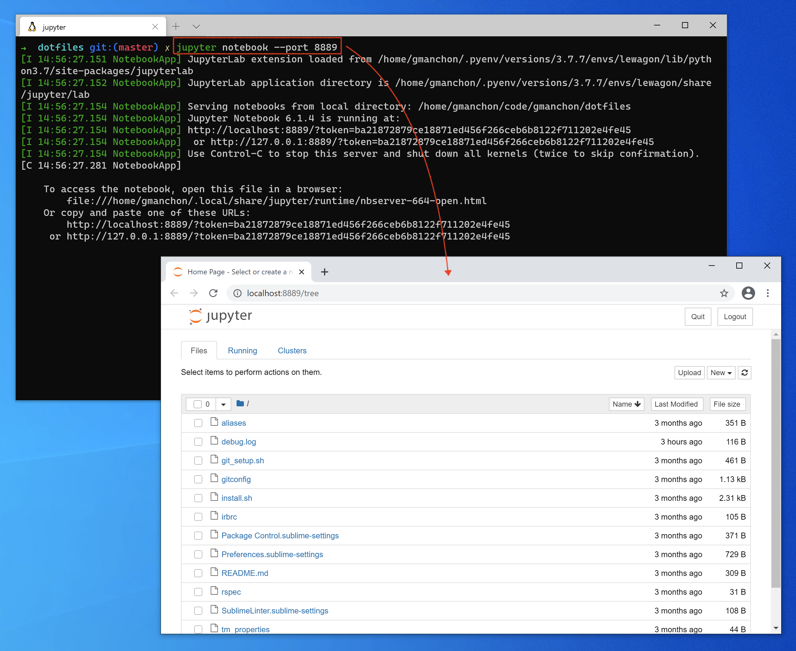

# Instrucciones para la configuración

Aquí abajo encontrarás las instrucciones para configurar tu computadora para [el curso de Data Science de Le Wagon](https://www.lewagon.com/data-science-course/full-time)

Por favor **léelas cuidadosamente y ejecuta todos los comandos en el siguiente orden**. Si tienes algún problema, no dudes en pedirle ayuda a una profesor :raising_hand:

¡Comencemos! :rocket:


## Cuenta GitHub

¿Ya tienes una cuenta GitHub? Si no es el caso, [ábrela ya](https://github.com/join).

:point_right: **[Sube una foto](https://github.com/settings/profile)** y escribe tu nombre correctamente en tu cuenta GitHub. Esto es importante porque nosotros usaremos un tablero de comando interno con tu avatar. Por favor hazlo **ahora** antes de dar un paso más en esta guía.


:point_right: **[Habilita la Autenticación de Dos Factores (2FA)](https://docs.github.com/en/authentication/securing-your-account-with-two-factor-authentication-2fa/configuring-two-factor-authentication#configuring-two-factor-authentication-using-text-messages)**. GitHub te enviará mensajes de texto con un código cuando intentes iniciar sesión. Esto es importante para la seguridad y también pronto será necesario para contribuir código en GitHub.


## La versión de Windows

Antes de comenzar, necesitamos verificar que la versión de Windows instalada en tu computadora sea compatible con estas instrucciones de configuración.

### Windows 10 o Windows 11

> :warning: **Nota sobre Windows 10 y seguridad**
>
> La configuración del bootcamp de Le Wagon funciona en Windows 10. Dicho esto, recomendamos encarecidamente actualizar a Windows 11. Desde el 14 de octubre de 2025 Microsoft finalizó el soporte para Windows 10, lo que significa que ya no recibirá actualizaciones de seguridad y podría poner tu equipo en riesgo. Para más detalles, consulta la [guía de Microsoft](https://support.microsoft.com/en-us/windows/windows-10-support-has-ended-on-october-14-2025-2ca8b313-1946-43d3-b55c-2b95b107f281). Si tu equipo no puede ejecutar Windows 11, considera cambiar a Ubuntu.

Para poder configurar tu computadora, necesitas tener **Windows 10 o Windows 11** instalado.

Para chequear la versión de tu Windows:
- Presiona `Windows` + `R`
- Escribe  `winver`
- Presiona `Enter`

:heavy_check_mark: Si las primeras palabras de esta ventana son **Windows 11**, entonces todo está bien y puedes continuar trabajando en la configuración :+1:

:heavy_check_mark: Si las primeras palabras de esta ventana son **Windows 10**, verifica el **número de la versión**:

- :heavy_check_mark: Si dice al menos `2004`, entonces todo está bien :+1:

- :x: Si es inferior a `2004`, debes actualizar tu versión.

- <details>
  <summary>Cómo instalar las últimas actualizaciones?</summary>

  Abre Windows Update:
  - Presiona `Windows` + `R`
  - Escribe `ms-settings:windowsupdate`
  - Presiona `Enter`
  - Haz clic en `Check updates`

  :heavy_check_mark: Si tienes una marca verde y el siguiente mensaje "You're up to date", entonces todo está bien :+1:

  :warning: Si obtienes una exclamación roja y el siguiente mensaje "Update available", por favor instala las actualizaciones y repite el proceso hasta que diga que todo está actualizado :loop:

  :x: Si obtienes un mensaje de error diciendo que Windows no puede aplicar las actualizaciones, por favor **contacta a un profesor**.

  <details>
    <summary>Activa Windows Update Service para resolver las Actualizaciones</summary>

    Algunos antivirus y programas deshabilitan las actualizaciones que necesitamos y luego se muestra un error. ¡Solucionemos esto!
    - Presiona `Windows` + `R`
    - Escribe `services.msc`
    - Presiona `Enter`
    - Haz doble clic en `Windows Update Service`
    - Coloca su `Startup` en `Automatic`
    - Haz clic en `Start`
    - Haz clic en `Ok`
    ¡Ahora intenta instalar las actualizaciones nuevamente!
  </details>

  Verifica el número de la versión:

  - Presiona `Windows` + `R`
  - Escribe  `winver`
  - Presiona `Enter`

  :heavy_check_mark: Si dice al menos `2004`, entonces todo está bien :+1:

  :x: Si es inferior a `2004`, por favor **contacta a un profesor**.

  </details>


## Virtualización

Tenemos que asegurarnos de que las opciones de Virtualización estén habilitadas en el BIOS de tu computadora.

Normalmente ya es el caso en muchas computadoras. Verifiquemos:
- Presiona `Windows` + `R`
- Escribe `taskmgr`
- Presiona `Enter`
- Haz clic en la pestaña `Performance`
- Haz clic en `CPU`


:heavy_check_mark: Si ves "Virtualization: Enabled", entonces todo está bien :+1:

:x: Si falta la línea o si la virtualización está desactivada, por favor **contacta a un profesor antes de intentar activar la Virtualización por tu cuenta**

<details>
  <summary>Activa la Virtualización</summary>

  Debemos acceder al BIOS / UEFI de la computadora para activarla.
  - Presiona `Windows + R`
  - Escribe `shutdown.exe /r /o /t 1`
  - Presiona `Enter`
  - Espera a que la computadora se apague
  - Haz clic en `Troubleshoot`
  - Haz clic en `Advanced Options`
  - Haz clic en `UEFI Firmware Settings`
  - Haz clic en `Restart`

  Debes activar la opción de la virtualización para tu procesador aquí:
  - La mayoría de las veces se hace en los parámetros avanzados, los parámetros del CPU o los parámetros de Northbridge
  - El nombre de la opción puede variar de una computadora a otra:
      - Intel: `Intel VT-x`, `Intel Virtualization Technology`, `Virtualization Extensions`, `Vanderpool`...
      - AMD: `SVM Mode` o `AMD-V`
  - Guarda los cambios después de la activación y reinicia la computadora con las opciones correspondientes
</details>


## Subsistema de Windows para Linux (WSL)

WSL es el ambiente de entorno que estamos usando para usar Ubuntu. Puedes aprender más sobre WSL [aquí](https://docs.microsoft.com/en-us/windows/wsl/faq).

Instalaremos WSL 2 y Ubuntu con un comando a través de la Windows Command Prompt.

:warning: en esta instrucción, utiliza el atajo `Ctrl` + `Shift` + `Enter` para usar la **Windows Command Prompt** con privilegios de administrador en lugar de simplemente hacer clic en `Ok` o presionar `Enter`.

- Presiona `Windows` + `R`
- Escribe `cmd`
- Presiona **`Ctrl` + `Shift` + `Enter`**

:warning: tal vez tengas que aceptar la confirmación UAC sobre el cambio en los privilegios.

Un ventana de terminal aparecerá:
- Copia el siguiente comando (`Ctrl` + `C`)
- Pégalo en la ventana de la terminal (`Ctrl` + `V` o haciendo clic derecho en la ventana)
- Ejecútalo presionado `Enter`

```powershell
wsl --install
```

:heavy_check_mark: Si el comando se ejecutó sin ningún error, por favor reinicia tu computadora y continúa con las siguientes instrucciones aquí abajo :+1:

:x: Si obtienes un mensaje de error (o si ves algún texto en rojo en la ventana), por favor **contacta a un profesor**

<details>
<summary>Solución de problemas para Windows 10 (solo si es necesario, consulta con un profesor)</summary>

#### Para Windows 10 < 2004: instala primero WSL 1

:warning: en esta instrucción, utiliza el atajo `Ctrl` + `Shift` + `Enter` para usar **Windows PowerShell** con privilegios de administrador en lugar de hacer clic en `Ok` o presionar `Enter`.

- Presiona `Windows` + `R`
- Escribe `powershell`
- Presiona **`Ctrl` + `Shift` + `Enter`**

:warning: tal vez tengas que aceptar la confirmación UAC sobre el cambio en los privilegios.

Un ventana de terminal azul aparecerá:
- Copia los siguiente comandos uno por uno (`Ctrl` + `C`)
- Pégalos en la ventana de Powershell (`Ctrl` + `V` o haciendo clic derecho en la ventana)
- Ejecútalos presionado `Enter`

```powershell
Enable-WindowsOptionalFeature -Online -FeatureName Microsoft-Windows-Subsystem-Linux
```

```powershell
dism.exe /online /enable-feature /featurename:Microsoft-Windows-Subsystem-Linux /all /norestart
```

```powershell
dism.exe /online /enable-feature /featurename:VirtualMachinePlatform /all /norestart
```

:heavy_check_mark: Si los tres comandos se ejecutaron sin ningún error, por favor reinicia tu computadora y continúa con las instrucciones de aquí abajo :+1:

:x: Si obtienes un mensaje de error (o si ves algún texto en rojo en la ventada), por favor **contacta a un profesor**

#### Para Windows 10 con WSL 1: Actualización a WSL 2

Si tienes Windows 10, actualizaremos WSL a la versión 2.

Cuando se reinicie tu computadora, descarga el instalador de WSL2.

- Ve a la [página de descarga](https://aka.ms/wsl2kernel)
- Descarga "el paquete de actualización de WSL2 Linux kernel"
- Abre el archivo que acabas de descargar
- Haz clic en `Next`
- Haz clic en `Finish`


:heavy_check_mark: Si no obtuviste ningún mensaje de error, entonces puedes continuar :+1:

:x: Si obtienes el siguiente error "This update only applies to machines with the Windows Subsystem for Linux", **haz clic derecho** en el programa y selecciona `uninstall`; esta vez deberías poder instalarlo sin problemas.

#### Para Windows 10 con WSL 1: Coloca WSL 2 como el Subsistema Windows por defecto para Linux

Si tienes Windows 10, pondremos la versión predeterminada de WSL en 2.

Ahora coloca WSL 2 como la versión predeterminada. Esto lo podemos hacer porque ya está instalado:
- Presiona `Windows` + `R`
- Escribe  `cmd`
- Presiona `Enter`

Escribe lo siguiente en la ventana que aparecerá:

```bash
wsl --set-default-version 2
```

:heavy_check_mark: Si ves este mensaje "The operation completed successfully", puedes cerrar esta terminal y continuar con las siguientes instrucciones aquí abajo :+1:

:x: Si el mensaje que obtienes es sobre virtualización, por favor **contacta a un profesor**

<details>
  <summary>Habilita de la feature de la Virtual Machine Platform en Windows</summary>

  Sigue los pasos [siguientes](https://www.configserverfirewall.com/windows-10/please-enable-the-virtual-machine-platform-windows-feature-and-ensure-virtualization-is-enabled-in-the-bios/#:~:text=To%20enable%20WSL%202,%20Open,Windows%20feature%20on%20or%20off.&text=Ensure%20that%20the%20Virtual%20Machine,Windows%20will%20enable%20WSL%202) hasta que hayas habilitado <strong>la Virtual Machine Platform</strong> y <strong>el Subsistema de Windows para Linux</strong>
</details>

<details>
  <summary>Habilita la feature de Windows Hyper-V</summary>

  Sigue los pasos [siguientes](https://winaero.com/enable-use-hyper-v-windows-10/) hasta que hayas habilitado el grupo <strong>Hyper-V</strong>

  :information_source: Si tienes Windows 10 **Home edition**, la feature Hyper-V no está disponible para su sistema operativo. No es un bloqueo y puedes continuar con las siguientes instrucciones aquí abajo :ok_hand:
</details>

</details>


## Ubuntu

### Instalación

Después de reiniciar tu computadora, deberías ver una ventana de terminal diciendo WSL está retomando el proceso de instalación de Ubuntu. Cuando termine, iniciará Ubuntu.

<details>
<summary>Solución de problemas para Windows 10 (solo si es necesario, consulta con un profesor)</summary>

Si la instalación de Ubuntu no se reanudó, primero intenta nuevamente: abre Powershell o el Símbolo del sistema y ejecuta `wsl --install` otra vez.
</details>

Si tienes Windows 10, instala la terminal de Windows por medio de la Microsoft Store:

- Haz clic en `Start`
- Escribe `Microsoft Store`
- Haz clic en `Microsoft Store` en la lista
- Busca `Ubuntu` en la barra de búsqueda
- **Selecciona la versión sin nombre, simplemente "Ubuntu"**
- Haz clic en `Get`

:warning: ¡NO instales **Ubuntu 18.04 LTS** ni **Ubuntu 20.04**!

<details>
  <summary>Desinstala las versiones incorrectas de Ubuntu</summary>

  Para desinstalar las versiones incorrectas de Ubuntu, solo tienes que ir a la Lista de Programas Instalados de Windows 10:
  - Presiona `Windows` + `R`
  - Escribe `ms-settings:appsfeatures`
  - Preiona `Enter`

  Busca el programa que desees desinstalar y haz clic en el botón de desinstalación.
</details>

Cuando termine la instalación, el botón `Get` se transformará en un botón `Open`: Haz clic en él.

</details>

### Primer uso

La primera vez que lo abras, te pedirán que:
- Escojas un **username** de:
    - una palabra
    - minúscula
    - sin caracteres especiales
    - por ejemplo: `lewagon` o tu `firstname`, es decir, tu primer nombre
- Escoge un **password**
- Confírmalo

:warning: Cuando escribas tu contraseña no verás nada en la pantalla. **Esto es normal**. Es una herramienta de seguridad para ocultar tanto el contenido de tu contraseña como su longitud. Simplemente escribe tu contraseña y presiona `Enter` al terminar.

### Chequea la versión WSL de Ubuntu

- Presiona `Windows` + `R`
- Escribe  `cmd`
- Presiona `Enter`

Escribe el siguiente comando:

```bash
wsl -l -v
```

:heavy_check_mark: Si la versión de WSL de Ubuntu es 2, entonces todo está bien y puedes continuar :+1:

:x: Si la versión de WSL de Ubuntu es 1, tendremos que pasarla a la versión 2.

<details>
  <summary>Conversión de WSL de Ubuntu V1 a V2</summary>

  Escribe esto en la ventana de Entrada de Comandos:

  ```bash
  wsl --set-version Ubuntu 2
  ```

  :heavy_check_mark: Deberías obtener el siguiente mensaje en algunos segundos: `The conversion is complete`. Esto significa que la conversión ha sido completada.

  :x: Si no funciona, tendremos que asegurarnos de que los archivos de Ubuntu no estén comprimidos.

<details>
  <summary>Chequea si los archivos no están comprimidos</summary>

  - Presiona `Windows` + `R`
  - Escribe  `%localappdata%\Packages`
  - Presiona `Enter`
  - Abre la carpeta `CanonicalGroupLimited.UbuntuonWindows...`
  - Haz clic derecho en la carpeta `LocalState`
  - Haz clic en `Properties`
  - Haz clic en `Advanced`
  - Asegúrate de que la opción `Compress content` **no** esté seleccionada. Luego haz clic en `Ok`.

  Aplícale cambios a esta carpeta solamente y trata de convertir la versión de WSL de Ubuntu nuevamente.

  :x: Si la conversión aún no funciona, por favor **contacta a un profesor**.
</details>

Ya puedes cerrar la ventana de la terminal.

</details>

### Comprueba tu nombre de usuario

Escribe esto en la terminal de Ubuntu:

```bash
whoami
```

Debería devolver el nombre de usuario que elegiste anteriormente.

:x: Si dice `root`, **contacta a un profesor** antes de continuar.


## Visual Studio Code

### Instalación

Instala el editor de texto [Visual Studio Code](https://code.visualstudio.com).

- Ve a [la página de descarga de Visual Studio Code](https://code.visualstudio.com/download).
- Haz clic en el botón "Windows"
- Abre el archivo que acabas de descargar.
- Instálalo con pocas opciones:


Abre VS Code cuando termine la instalación.

### Conexión de VS Code con Ubuntu

Instala la extensión de VS Code llamada [Remote - WSL](https://marketplace.visualstudio.com/items?itemName=ms-vscode-remote.remote-wsl) para hacer que VS Code interactúe adecuadamente con Ubuntu.

Abre tu **terminal Ubuntu**.

Copia y pega los siguientes comandos en la terminal:

```bash
code --install-extension ms-vscode-remote.remote-wsl
```

Luego abre VS Code desde la terminal:

```bash
code .
```

:heavy_check_mark: Si ves `WSL: Ubuntu` en la esquina inferior izquierda de la ventana de VS Code, entonces todo está bien y puedes continuar :+1:


:x: Si no es el caso, por favor **pídele ayuda a un profesor**.


## Terminal de Windows

### Instalación

:information_source: Las instrucciones que verás a continuación dependen de la versión de Windows que tengas.

Si estás utilizando Windows 11, la terminal de Windows ya está instalada y puedes ir a la siguiente sección :point_down:

Si tienes Windows 10, instala la terminal de Windows. Verás que es una terminal moderna.

<details>
<summary>**Windows 10**: Instalar Windows Terminal</summary>

- Haz clic en `Start`
- Escribe `Microsoft Store`
- Haz clic en `Microsoft Store` en la lista
- Busca `Windows Terminal` en la barra de búsqueda
- **Selecciona Windows Terminal"**
- Haz clic en `Install`

:warning: ¡NO instales **Windows Terminal Preview**, solo instala **Windows Terminal**!

<details>
  <summary>Desinstala la versión incorrecta de la terminal de Windows</summary>

  Para desinstalar la versión incorrecta la terminal de Windows, solamente tienes que ir a la lista de programas instalados de Windows 10:

  - Presiona `Windows` + `R`
  - EScribe  `ms-settings:appsfeatures`
  - Presiona `Enter`

  Busca el programa que quieres desinstalar y haz clic en el botón de desinstalación.
</details>

Cuando termine la instalación, el botón `Install` se transformará en un botón `Launch`: haz clic en él.

</details>

### Ubuntu como terminal predeterminada

Hagamos que Ubuntu sea la terminal predeterminada de tu aplicación Windows terminal.

Presiona `Ctrl` + `,`

Debería abrir los parámetros de la terminal:


- Cambia el perfil predeterminado a "Ubuntu"
- Haz clic en "Save"
- Haz clic en "Open JSON file"

Verás la parte a cambiar en un círculo rojo:


Primero pídele a Ubuntu que inicie directamente dentro de tu Ubuntu Home Directory en vez de hacerlo desde Windows:
- Localiza el `"name": "Ubuntu",`
- Agrega la siguiente línea debajo de eso:

```bash
"commandline": "wsl.exe ~",
```

:warning: ¡Que no se te olvide la coma al final de la línea!

Luego deshabilita el warning para copiar y pegar comandos entre Windows y Ubuntu:
- Localiza la línea `"defaultProfile": "{2c4de342-...}"`
- Agrega la siguiente línea debajo de eso:

```bash
"warning.multiLinePaste": false,
```

:warning: ¡No olvides la coma al final de la línea!

Puedes guardar estos cambios presionando `Ctrl` + `S`

:heavy_check_mark: Tu **Windows Terminal** ya está configurada :+1:

Esta terminal tiene pestañas: puedes escoger abrir una terminal en una nueva pestaña haciendo clic en el **+** al lado de la pestaña actual.
**De ahora en adelante, cada vez que hablemos de la terminal o la consola, nos referiremos a esta.** NUNCA más uses otra.


## Extensiones de VS Code

### Instalación

Instala algunas extensiones útiles para VS Code.

```bash
code --install-extension ms-vscode.sublime-keybindings
code --install-extension emmanuelbeziat.vscode-great-icons
code --install-extension MS-vsliveshare.vsliveshare
code --install-extension ms-python.python
code --install-extension KevinRose.vsc-python-indent
code --install-extension ms-python.vscode-pylance
code --install-extension ms-toolsai.jupyter
code --install-extension alexcvzz.vscode-sqlite
```

Aquí está la lista de las extensiones que estás instalando:
- [Sublime Text Keymap and Settings Importer](https://marketplace.visualstudio.com/items?itemName=ms-vscode.sublime-keybindings)
- [VSCode Great Icons](https://marketplace.visualstudio.com/items?itemName=emmanuelbeziat.vscode-great-icons)
- [Live Share](https://marketplace.visualstudio.com/items?itemName=MS-vsliveshare.vsliveshare)
- [Python](https://marketplace.visualstudio.com/items?itemName=ms-python.python)
- [Python Indent](https://marketplace.visualstudio.com/items?itemName=KevinRose.vsc-python-indent)
- [Pylance](https://marketplace.visualstudio.com/items?itemName=ms-python.vscode-pylance)
- [Jupyter](https://marketplace.visualstudio.com/items?itemName=ms-toolsai.jupyter)
- [SQLite](https://marketplace.visualstudio.com/items?itemName=alexcvzz.vscode-sqlite)


### Funciones de IA en VS Code

VS Code incluye muchas y potentes **funciones de IA**, que son una gran herramienta una vez que ya sabes programar.

Dicho esto, depender de la IA demasiado pronto puede ocultar conceptos importantes y dificultar la comprensión de la depuración. Una vez que estés cómodo con los fundamentos, sabrás cuándo y cómo usar la IA de forma eficaz —sin dejar que haga el trabajo por ti.

Para el inicio del bootcamp, desactivaremos estas funciones. Llegado el momento apropiado en el curso, las volveremos a habilitar para que puedas utilizarlas bien.

En **VS Code**:

1. Abramos la "Paleta de comandos" de VS Code: escribe `Ctrl-Shift-P` (Windows / Linux) o `Cmd-Shift-P` (macOS).
1. Se abrirá la Paleta de comandos: una pequeña caja de texto en la parte superior de la pantalla. Empieza a escribir `aifeatures` hasta que veas "Chat: Learn How to Hide AI features". Haz clic en ella.
  
1. Esto abrirá la configuración y te mostrará la opción "Disable and hide built-in AI features ...". Marca la casilla delante de esa opción.
  

Más adelante, si quieres **volver a habilitar** las funciones de IA, puedes seguir las mismas instrucciones para desmarcar la casilla.


## Herramientas de línea de comando

### Comprueba la configuración regional (locale)

La "locale" es un mecanismo que permite adaptar los programas a su idioma y país.

Comprobemos que la configuración regional por defecto es el inglés:

```bash
locale
```

Si la salida no contiene `LANG=en_US.UTF-8`, ejecute el siguiente comando en un Ubuntu terminal para instalar la locale inglesa:

```bash
sudo locale-gen en_US.UTF-8
```

Si después, recibes una advertencia (`bash: warning: setlocale: LC_ALL: cannot change locale (en_US.utf-8)`) en tu terminal, por favor haz lo siguiente:

<details>
  <summary>Generar la configuración regional<>/summary>

Por favor, ejecuta estas líneas en tu terminal.

```bash
sudo update-locale LANG=en_US.UTF8
sudo apt-get update
sudo apt-get install language-pack-en language-pack-en-base manpages
```
</details>

### Zsh & Git

En lugar de usar el `bash` [shell](https://en.wikipedia.org/wiki/Shell_(computing)) predeterminado, usaremos `zsh`.

También utilizaremos [`git`](https://git-scm.com/), un programa de línea de comando para control de versiones.

Vamos a instalarlos, junto con otros programas útiles:
- Abre una **terminal de Ubuntu**
- Copia y pega los siguientes comandos:

```bash
sudo apt update
```

```bash
sudo apt install -y curl git imagemagick jq unzip vim zsh
```

Estos comandos te pedirán tu contraseña: escríbela.

:warning: Cuando escribas tu contraseña no verás nada en la pantalla. **Esto es normal**. Es una herramienta de seguridad para ocultar tanto el contenido de tu contraseña como su longitud. Simplemente escribe tu contraseña y presiona `Enter` al terminar.

### Instalación de la CLI de GitHub

Instalemos la [CLI oficial de GitHub](https://cli.github.com) (Interfaz de Línea de Comando). Es un programa que se usa para interactuar con tu cuenta GitHub por medio de la línea de comando.

En tu terminal, copia y pega los siguientes comandos y escribe tu contraseña si te la piden:

```bash
sudo apt remove -y gitsome # gh command can conflict with gitsome if already installed
curl -fsSL https://cli.github.com/packages/githubcli-archive-keyring.gpg | sudo dd of=/usr/share/keyrings/githubcli-archive-keyring.gpg
echo "deb [arch=$(dpkg --print-architecture) signed-by=/usr/share/keyrings/githubcli-archive-keyring.gpg] https://cli.github.com/packages stable main" | sudo tee /etc/apt/sources.list.d/github-cli.list > /dev/null
sudo apt update
sudo apt install -y gh
```

Ejecuta el comando que te mostramos a continuación para verificar que `gh` se haya instalado correctamente en tu máquina:

```bash
gh --version
```

:heavy_check_mark: Si ves esta versión `gh version X.Y.Z (YYYY-MM-DD)`, puedes continuar trabajando :+1:

:x: Si no es el caso, por favor **contacta a un profesor**


## Oh-my-zsh

Instalemos el plugin `zsh` [Oh My Zsh](https://ohmyz.sh/).

Ejecuta este comando en la terminal:

```bash
sh -c "$(curl -fsSL https://raw.github.com/ohmyzsh/ohmyzsh/master/tools/install.sh)"
```

Si te preguntan "Do you want to change your default shell to zsh?", presiona `Y`

Cuando termines, tu terminal debería lucir así:


:heavy_check_mark: Si es el caso, puedes continuar :+1:

:x: Si no, por favor **pídele ayuda a un profesor**.


## Linking your default browser to Ubuntu

Para asegurarnos de que puedas interactuar desde la terminal de Ubuntu con el navegador que tienes instalado en Windows, debemos definirlo como tu navegador predeterminado aquí.

Ejecuta el siguiente comando y sigue las instrucciones. La herramienta te pedirá que elijas uno de los navegadores disponibles en tu sistema. Solo necesitas escribir el **número** que aparece delante del navegador.

```bash
bash -c "$(curl -s https://raw.githubusercontent.com/julesvanrie/wslsetbrowser/refs/heads/main/wslsetbrowser.sh)"
```

Reinicia tu terminal:

```bash
exec zsh
```

Luego asegúrate de que el siguiente comando devuelva "Browser defined 👌":

```bash
[ -z "$BROWSER" ] && echo "ERROR: please define a BROWSER environment variable ⚠️" || echo "Browser defined 👌"
```

Si no es así, puedes seguir [estas instrucciones](https://github.com/lewagon/setup/blob/master/_partials/es/windows_browser.md) para configurar tu navegador predeterminado manualmente.

No dudes en **pedirle ayuda a tu profesor**.


## direnv

[direnv](https://direnv.net/) es una extensión del shell. Facilita trabajar con variables de entorno por proyecto, lo cual será útil para customizar el comportamiento de tu código.


``` bash
sudo apt-get update; sudo apt-get install direnv
echo 'eval "$(direnv hook zsh)"' >> ~/.zshrc
```


## GitHub CLI

CLI es una abreviación de [Command-line Interface](https://en.wikipedia.org/wiki/Command-line_interface) que significa interfaz de línea de comando.

En esta sección usaremos [GitHub CLI](https://cli.github.com/) para interactuar directamente con GitHub desde la terminal.

Usaremos la GitHub CLI (`gh`) para conectarnos a GitHub utilizando *SSH*, un protocolo para iniciar la sesión utilizando claves SSH en lugar de la famosa pareja nombre de usuario y contraseña.

Ya debería haberse instalado en tu computadora con los comandos que ejecutaste anteriormente.

Lo primero que hay que hacer para **iniciar sesión** es copiar y pegar el comando siguiente en tu terminal:

:warning: **NO edites el `email`** — Aunque `user:email` parezca un marcador de posición para tu dirección de correo real, no lo es — no lo reemplaces.

```bash
gh auth login -s 'user:email' -w --git-protocol ssh
```

`gh` le hará algunas preguntas:

- `Generate a new SSH key to add to your GitHub account?` Presiona `Enter` para pedirle a gh que genere las claves SSH por ti.

  Si ya tienes claves SSH, verás en su lugar `Upload your SSH public key to your GitHub account?`Con las flechas, selecciona la ruta de tu archivo de clave pública y pulsa `Intro`.

- `Enter a passphrase for your new SSH key (Optional)`:
  - **PARA LA MAYORÍA DE LOS ESTUDIANTES:** Simplemente presiona `Enter` para omitir. No necesitas una contraseña para el bootcamp y te la pediría cada vez que uses la clave. Sin embargo, hay un riesgo de que si alguien roba tu computadora, pueda subir código a GitHub.
  - **SI LA SEGURIDAD ES MUY IMPORTANTE PARA TI:** Escribe una contraseña de tu elección y presiona `Enter`. Es _muy_ importante que si introduces una contraseña, la anotes en algún lugar inmediatamente y no la pierdas ni la olvides. Tendrás que introducirla con frecuencia.

- `Title for your SSH key`. Puede dejarlo en la propuesta "GitHub CLI", presiona `Enter`.

Obtendrás el siguiente resultado:

```bash
! First copy your one-time code: 0EF9-D015
- Press Enter to open github.com in your browser...
```

Selecciona y copia el código (`0EF9-D015` en el ejemplo) y luego presiona `Enter`.

Tu navegador se abrirá y te pedirá que autorices GitHub CLI para usar tu cuenta GitHub. Acepta y espera un poco.

Regresa a la terminal, presiona `Enter` nuevamente y listo. Eso es todo.

Para verificar que están conectado correctamente, escribe lo siguiente:

```bash
gh auth status
```

:heavy_check_mark: Si obtienes este mensaje: `Logged in to github.com as <YOUR USERNAME> `, significa que todo está bien :+1:

:x: De lo contrario, **contacta a un profesor**.


## Dotfiles

Los hackers aman mejorar sus shells y sus herramientas. Comenzaremos con una configuración por defecto genial proporcionada por [Le Wagon](http://github.com/lewagon/dotfiles) y almacenada en GitHub.

### Verifica tu configuración de GitHub CLI

Primero, hagamos una verificación rápida. Abre tu terminal y ejecuta el comando siguiente:

```bash
export GITHUB_USERNAME=`gh api user | jq -r '.login'`
echo $GITHUB_USERNAME
```

Deberías ver tu usuario GitHub. Si no es así, **no hagas más nada** y pide ayuda.
Parece que hay un problema con el paso anterior (`gh auth`).


### Fork y/o clone los archivos de configuración

Hay tres opciones, escoge **una**:


<details>
    <summary>
        <strong>No he hecho el bootcamp de Web Development o Data Science & AI de Le Wagon</strong>
    </summary>

 Tu configuración es personal, así que necesitas tu propio repositorio para almacenarla. Primero tienes que hacer el fork del repositorio en tu cuenta GitHub.

Hacer un fork significa que crearás un nuevo repositorio en tu cuenta GitHub idéntico al original. Tendrás un nuevo repositorio en tu cuenta GitHub, `your_github_username/dotfiles`. El fork es necesario porque cada uno de ustedes necesitará poner información específica (e.g. tu nombre) en esos archivos.

Ejecutemos este comando para hacer un **fork** del repositorio `lewagon/dotfiles` y clonarlo:


```bash
mkdir -p ~/code/$GITHUB_USERNAME && cd $_
gh repo fork lewagon/dotfiles --clone
```

</details>


<details>
    <summary>
        <strong>Ya hice el bootcamp de Web Development o Data Science & AI de Le Wagon <em>pero tengo una nueva laptop</em></strong>
    </summary>

Esto significa que ya has hecho el fork del repositorio GitHub lewagon/dotfiles pero tal vez la configuración para el nuevo bootcamp de Data Science & AI no estaba lista en ese momento.Actualicémoslo. **Pide a un TA que te acompañe en los siguientes pasos.**

Es hora de clonarlo el repositorio en tu laptop:

```bash
mkdir -p ~/code/$GITHUB_USERNAME && cd $_
gh repo clone lewagon/dotfiles
```


Abre tu terminal y ve a tu proyecto `dotfiles`:

```bash
cd ~/code/$GITHUB_USERNAME$/dotfiles
```

Es hora de fusionar los cambios de lewagon/dotfiles en los tuyos:

1. Commit la versión actual de tus dotfiles:
   ```bash
   git add .
   git status # Check what will be committed
   git commit -m "Version prior to new setup"
   ```

1. Trae los cambios del repositorio upstream: `git merge upstream/master`

1. Verifica que no estés en estado MERGING. Si lo estás, resuelve los conflictos.

1. Haz un `git diff HEAD~1 HEAD` para revisar qué cambió.

1. Si todo parece estar en orden, continúa.

<details>
  <summary>¿Demasiados conflictos?
  </summary>

  Vamos a tomar la versión actual de `lewagon/dotfiles`.

  Primero aborta la merge: `git merge --abort`.

  Ejecuta `code .`

  En VS Code, abre el archivo zshrc. Reemplaza su contenido con la [versión más reciente](https://raw.githubusercontent.com/lewagon/dotfiles/master/zshrc). Luego guárdalo en el disco.

  Aún en VS Code, abre el archivo `zprofile`. Reemplaza su contenido con la [versión más reciente](https://raw.githubusercontent.com/lewagon/dotfiles/master/zprofile). Luego guárdalo en el disco.

  Regresa a la terminal y ejecuta un `git diff` y verifica que esto no haya eliminado ninguna configuración personal que quisieras conservar.

</details>

Es hora de guardar tus cambios y subirlos.

```bash
git add .
git commit -m "Update for Data Science bootcamp"
git push origin master
```

</details>


<details>
    <summary>
        <strong>Ya hice el bootcamp de Web Development o Data Science & AI de Le Wagon </em>en la misma laptop</em></strong>
    </summary>

Esto significa que ya has hecho el fork del repositorio GitHub lewagon/dotfiles pero tal vez la configuración para el nuevo bootcamp de Data Science & AI no estaba lista en ese momento. Actualicémoslo. **Pide a un TA que te acompañe en los siguientes pasos.**


Abre tu terminal y ve a tu proyecto `dotfiles`:

```bash
cd ~/code/$GITHUB_USERNAME$/dotfiles
```

Es hora de fusionar los cambios de lewagon/dotfiles en los tuyos:

1. Commit la versión actual de tus dotfiles:
   ```bash
   git add .
   git status # Check what will be committed
   git commit -m "Version prior to new setup"
   ```

1. Trae los cambios del repositorio upstream: `git merge upstream/master`

1. Verifica que no estés en estado MERGING. Si lo estás, resuelve los conflictos.

1. Haz un `git diff HEAD~1 HEAD` para revisar qué cambió.

1. Si todo parece estar en orden, continúa.

<details>
  <summary>¿Demasiados conflictos?
  </summary>

  Vamos a tomar la versión actual de `lewagon/dotfiles`.

  Primero aborta la merge: `git merge --abort`.

  Ejecuta `code .`

  En VS Code, abre el archivo zshrc. Reemplaza su contenido con la [versión más reciente](https://raw.githubusercontent.com/lewagon/dotfiles/master/zshrc). Luego guárdalo en el disco.

  Aún en VS Code, abre el archivo `zprofile`. Reemplaza su contenido con la [versión más reciente](https://raw.githubusercontent.com/lewagon/dotfiles/master/zprofile). Luego guárdalo en el disco.

  Regresa a la terminal y ejecuta un `git diff` y verifica que esto no haya eliminado ninguna configuración personal que quisieras conservar.

</details>

Es hora de guardar tus cambios y subirlos.

```bash
git add .
git commit -m "Update for Data Science bootcamp"
git push origin master
```

</details>


### Ejecuta el instalador de dotfiles

Ejecuta el instalador de `dotfiles`.

```bash
cd ~/code/$GITHUB_USERNAME/dotfiles && zsh install.sh
```

Verifica los emails registrados en tu cuenta GitHub. Deberás seleccionar uno de ellos en el próximo paso:

```bash
gh api user/emails | jq -r '.[].email'
```

Ejecuta el instalador de git:

```bash
cd ~/code/$GITHUB_USERNAME/dotfiles && zsh git_setup.sh
```

:point_up: Esto te **guiará** con tu nombre (`FirstName LastName`) y con tu email.
:warning: Cuidado, **debes** poner uno de los emails de la lista de arriba que te suministra el comando `gh api ...` usado anteriormente. Si haces eso, Kitt no podrá hacerle seguimiento a tu progreso. Cualquier correo que elijas se mostrará **públicamente** en internet. 💡 Selecciona la dirección `@users.noreply.github.com` si no quieres que tu correo electrónico aparezca en los repositorios públicos a los que puedas contribuir.

Ahora **cierra** todas las ventanas de tu terminal que tengas abiertas por favor.


## Desahilitación de la solicitud de SSH passphrase

No vas a querer que te pidan tu passphrase cada vez que te comuniques con un repositorio remoto. Por eso debes agregarle plugin `ssh-agent` a `oh my zsh`:

Primero abre el archivo `.zshrc`:

```bash
code ~/.zshrc
```

Luego:
- Identifica la línea que comienza por `plugins=`
- Agrega `ssh-agent` al final de la lista de plugins

La lista debería verse de la siguiente manera:

```bash
plugins=(gitfast last-working-dir common-aliases zsh-syntax-highlighting history-substring-search pyenv ssh-agent)
```

:heavy_check_mark: Guarda el archivo `.zshrc` con `Ctrl` + `S` y cierra tu editor de texto.


## Instalando Python (con [`pyenv`](https://github.com/pyenv/pyenv))

### Desinstalar `conda`

Como estamos utilizando `pyenv` para instalar y gestionar la versión de Python, necesitamos desinstalar [`conda`](https://docs.conda.io/projects/conda/en/latest/), otro gestor de paquetes que podrías tener en tu computadora si previamente instalaste [Anaconda](https://www.anaconda.com/). De esta forma, evitaremos problemas con Python más adelante.

Chequea si tienes `conda` instalado en tu computadora:

```bash
conda list
```

Si aparece `zsh: command not found: conda`, puedes **saltear** la desinstalación de `conda` e ir directo a la sección de **Instalar pre-requisitos**.


<details>
    <summary markdown='span'>Instrucciones de desinstalación <code>conda</code></summary>

- Instala el paquete Anaconda-Clean desde tu terminal y comienza la limpieza
```bash
conda install anaconda-clean
anaconda-clean --yes
```
- Remueve todos los directorios de Anaconda
```bash
rm -rf ~/anaconda2
rm -rf ~/anaconda3
rm -rf ~/.anaconda_backup

```
- Elimina el directorio Anaconda de tu `.bash_profile`
    - Abre el archivo con `code ~/.bash_profile`
    - Si el archivo abre, busca la línea que coincida con el siguiente patrón `export PATH="/path/to/anaconda3/bin:$PATH"` y eliminala

- Reinicia la terminal con `exec zsh`
- Remueve la inicializaciópn de Anaconda de tu `.zshrc`:
    - Abre el archivo con `code ~/.zshrc` 
    - Remueve las líneas de código desde `>>> conda initialize >>>` hasta `<<< conda initialize <<<`
</details>


### Instala `pyenv`

Ubuntu viene con una versión vieja de Python que no queremos usar. Tal vez ya hayas instalado Anaconda u otro programa para utilizar Python y paquetes de Ciencia de Datos. Si es así, no pasa nada ya que haremos una configuración profesional de Python que te permitirá cambiar de versión cuando quieras al escribir `python` en la terminal.

Primero instala `pyenv` con el siguiente comando en la Terminal:

```bash
git clone https://github.com/pyenv/pyenv.git ~/.pyenv
exec zsh
```

Instala algunas [dependencias](https://github.com/pyenv/pyenv/wiki/common-build-problems#prerequisites) necesarias para crear Python desde `pyenv`:

```bash
sudo apt-get update; sudo apt-get install make build-essential libssl-dev zlib1g-dev \
libbz2-dev libreadline-dev sqlite3 libsqlite3-dev wget curl llvm \
libncursesw5-dev xz-utils tk-dev libxml2-dev libxmlsec1-dev libffi-dev liblzma-dev \
python3-dev
```

### Instala Python

Instala la [última versión estable de Python](https://www.python.org/doc/versions/) que sea aceptada en el currículum de Le Wagon:

```bash
pyenv install 3.12.9
```

Este comando puede tomar un tiempo en ejecutarse. Esto es completamente normal. ¡No dudes en ayudar a los estudiantes que estén sentados cerca de ti!

OK. Cuando este comando termine de ejecutarse, le diremos al sistema que use esta versión de Python **por defecto**. Esto se hace con:

```bash
pyenv global 3.12.9
exec zsh
```

Para verificar que esto haya funcionado, ejecuta `python --version`. Si ves `3.12.9`, ¡todo está bien! Si no, pídele ayuda a un TA para resolver el problema por medio de `versiones de pyenv` y `type -a python` (`python` debería estar usando la versión `.pyenv/shims` de primero).


## Entorno Virtual de Python

Antes de instalar paquetes de Python, aislaremos la configuración del Bootcamp en un entorno virtual **dedicado**. Usaremos un plugin `pyenv` llamado [`pyenv-virtualenv`](https://github.com/pyenv/pyenv-virtualenv).

### Instala un virtualenv

Primero instala este plugin:

```bash
git clone https://github.com/pyenv/pyenv-virtualenv.git $(pyenv root)/plugins/pyenv-virtualenv
exec zsh
```

Crea el entorno virtual que usaremos durante todo el bootcamp:

```bash
pyenv virtualenv 3.12.9 lewagon
```

Define el entorno virtual con lo siguiente:

```bash
pyenv global lewagon
```

¡Genial! Ahora cada vez que queramos instalar un paquete Python, lo haremos en ese entorno.


### Paquetes de Python

Ahora que tenemos el ambiente virtual de `lewagon` adecuado, es hora de instalarle algunos paquetes.

Primero, actualiza `pip`, la herramienta para instalar Paquetes Python desde [pypi.org](https://pypi.org). Ejecuta lo siguiente en la última terminal donde esté activado el virtualenv de `lewagon`:

```bash
pip install --upgrade pip
```

Ahora instala algunos paquetes para las primeras semanas del programa:


``` bash
pip install -r https://raw.githubusercontent.com/lewagon/data-setup/master/specs/releases/linux.txt
```


## Mejora Jupyter Notebook

Mejora la visualización del [elemento `details` para revelación de información](https://developer.mozilla.org/en-US/docs/Web/HTML/Element/details) en tus notebooks.

Ejecuta las siguientes líneas para crear una hoja de estilos `custom.css` en tu directorio de configuración de Jupyter:

```bash
LOCATION=$(jupyter --config-dir)/custom
SOURCE=https://raw.githubusercontent.com/lewagon/data-setup/refs/heads/master/specs/jupyter/custom.css
mkdir -p $LOCATION
curl $SOURCE > $LOCATION/custom.css
```


### Configuración de Jupyter Notebook para abrirlo en tu navegador

Primero, vamos a configurar tu navegador predeterminado nuevamente. Ya hicimos esto antes, pero cuando instalamos los dotfiles se eliminó la configuración. No hay problema, ejecuta este comando para volver a configurarlo:

```bash
grep -E "export (GH_)*BROWSER" ~/.zshrc.backup >> ~/.zshrc
```

Luego, reinicia tu terminal con:

```bash
exec zsh
```

Genera el archivo de configuración para **Jupyter Notebook**...

``` bash
jupyter notebook --generate-config
```

⚠️ Por favor copia la ruta que arrojó el comando anterior.

Ahora edita el archivo de configuración de Jupyter generado:

``` bash
sed -i.backup 's/# c.ServerApp.use_redirect_file = True/c.ServerApp.use_redirect_file = False/' ~/.jupyter/jupyter_notebook_config.py
```

Intenta usar Jupyter:

``` bash
jupyter notebook
```

Este comando debió haber abierto una página Jupyter en tu navegador:



Si no es el caso, por favor llama a un TA.

Para cerrar el servidor jupyter en la terminal, presiona `CTRL` + `C`, enter y. Luego presiona Enter.


## Chequeo de la configuración de Python

### Chequeo de Python y packages

Reinicia tu terminal:

```bash
cd ~/code && exec zsh
```

Verifica tu versión de Python con los siguientes comandos:
```bash
zsh -c "$(curl -fsSL https://raw.githubusercontent.com/lewagon/data-setup/master/checks/python_checker.sh)" 3.12.9
```

Ejecuta el comando siguiente para verificar que hayas instalado los paquetes requeridos correctamente:
```bash
zsh -c "$(curl -fsSL https://raw.githubusercontent.com/lewagon/data-setup/master/checks/pip_check.sh)"
```

Ahora ejecuta el siguiente comando para verificar que puedas cargar estos paquetes:
```bash
python -c "$(curl -fsSL https://raw.githubusercontent.com/lewagon/data-setup/master/checks/pip_check.py)"
```

### Chequeo de Jupyter

Ahora verifica que puedas iniciar un servidor de notebook en tu máquina:

```bash
jupyter notebook
```

Tu navegador web debería abrir en una ventana `jupyter`:


Haz clic en `New` y, en el menú desplegable, selecciona Python 3 (ipykernel):


Debería abrirse una pestaña en un nuevo notebook:


Asegúrate de que estés usando la versión correcta de python en el notebook. Abre una celda y ejecuta lo siguiente:
``` python
import sys; sys.version
```

Debería mostrar `3.12.9` seguido de algunos detalles adicionales. Si no es así, consulta con un TA.

Puedes cerrar tu navegador web y luego cerrar el servidor jupyter con `CTRL` + `C`.

¡Listo! Ya tienes un virtual env de python completo con todos los paquetes tercerizados que necesitarás en el bootcamp.


## DBeaver

DDescarga e instala [DBeaver](https://dbeaver.io/), una herramienta poderosa, gratuita y de código abierto para conectar con cualquier base de datos, explorar su esquema e incluso **hacer consultas SQL**.


## Parámetros de Windows

### Intercambio de archivos entre Windows y Ubuntu

Necesitamos una manera fácil de transferir archivos de Windows a Ubuntu y viceversa.

Para ello, vamos a crear atajos a directorios Ubuntu en el **Explorador de Archivos** de Windows:
- Abre el Explorador de Archivos de Windows (o usa el atajo `WIN` + `E`)
- En la Barra de Direcciones, coloca `\\wsl$\` (o `\\wsl$\Ubuntu` si eso no funciona)
- Ahora tienes acceso al sistema de archivos de Ubuntu
- Navega por el sistema de archivos de Ubuntu para encontrar los directorios que te interesen
- Arrastra las carpetas que te interesen a la Barra de Direcciones para crear atajos


### Abre el Explorador de Archivos de Windows desde la terminal de Ubuntu

Otra opción para mover archivos es abrir el **Explorador de Archivos** de Windows desde la terminal de Ubuntu:
- Abre una terminal de Ubuntu
- Ve al directorio que quieres explorar
- Ejecuta el comando `explorer.exe .` (Otra alternativa es usar `wslview .`)
- Si obtienes un mensaje de input output error, ejecuta `wsl --shutdown` en una PowerShell de Windows y abre la terminal de Ubuntu nuevamente


### Uso del Sistema de Archivos de Ubuntu

Es posible que quieras averiguar la localización exacta de un directorio en Windows en el sistema de archivos de Ubuntu o viceversa.

Para convertir una ruta Windows a una Ubuntu y viceversa:
- Abre una terminal de Ubuntu
- Usa el comando `wslpath "C:\Program Files"` para traducir la ruta Windows a una Ubuntu
- Usa el comando `wslpath -w "/home"` para traducir una ruta Ubuntu a una Windows
- El comando `wslpath -w $(pwd)` devuelve la ruta Windows del directorio Ubuntu actual


### Anclaje de aplicaciones a tu barra de tareas

Usarás frecuentemente casi todas las aplicaciones que has instalado hoy. ¡Anclémoslas a tu barra de tareas para que estén a solo un clic de ti!

Para ello, abre la aplicación. Haz clic derecho en el ícono de la barra de tareas para hacer que aparezca el menú contextual (también llamado emergente) y selecciona "Pin to taskbar".


Ancla lo siguiente:
- Tu terminal
- Tu explorador de archivos
- VS Code
- Tu navegador de Internet
- Slack


## Visual C++ Redistributable

Algunos paquetes Python requieren de un compilador para funcionar correctamente, así que vamos a instalar uno:

[For x64 systems](https://aka.ms/vs/16/release/vc_redist.x64.exe)


## Docker 🐋

Docker es una plataforma abierta para desarrollo, entrega y operación de aplicaciones.

_Si ya tienes Docker instalado en tu máquina, por favor actualízalo con la versión más reciente_

### Instalación de Docker

Ve a [Install Docker Desktop on Windows](https://docs.docker.com/docker-for-windows/wsl/).

Descarga e instala el Docker Desktop.

Si tienes un procesador Intel o AMD, elige la primera opción que termina con "x86_64".

<details>
  <summary markdown='span'>¿No estás seguro de qué procesador tienes?</summary>

  Lo más probable es que necesites la versión `x86_64`, es decir, si tienes un procesador Intel o AMD.

  Si no sabes qué procesador tiene tu máquina, ejecuta `arch` en tu terminal de Ubuntu. Verifica su salida:
  - `x86_64`: elige la primera opción "x86_64"
  - `aarch64`: elige la segunda opción "Arm"

</details>


Cuando termines, inicia Docker.

Deberías poder usarlo en una terminal Ubuntu:

```bash
docker run hello-world
```

Debería aparecer el siguiente mensaje:


<details>
  <summary markdown='span'>Permission denied? (WSL / Ubuntu)</summary>

Ejecute los siguientes comandos uno por uno:

```bash
sudo groupadd docker
sudo usermod -aG docker $USER
newgrp docker
```

Intente `docker info` nuevamente.

¿Ve este error?

```
WARNING: Error loading config file: /home/user/.docker/config.json - stat /home/user/.docker/config.json: permission denied`?
```

Ejecute el siguiente comando:

```bash
sudo rm -rf ~/.docker/
```

Intente `docker info` nuevamente.

</details>


## Kata (Extra)

Si has terminado la configuración, te pedimos que preguntes si alguien necesita ayuda con la suya (macOS, Linux o Windows). Las primeras clases son a las 2pm. Hablaremos de la configuración que acabas de hacer y de Kitt.

Si no tienes mucha experiencia con `git` y GitHub, por favor [ve nuevamente el video de este workshop](https://www.youtube.com/watch?v=Z9fIBT2NBGY) (puedes verlo a `1.25` de velocidad).

Si aún te queda tiempo, puedes esperar trabajar en este [Kata de Tic-Tac-Toe](https://www.codewars.com/kata/5b817c2a0ce070ace8002be0/python) mientras esperas la primera clase.


