# Anaconda

Anaconda is the world's most popular data science platform.

Go to [anaconda's website](https://www.anaconda.com/distribution/) and click on "Windows" then "Download" under Python 3.7 version.


A little popup will appear at the bottom of the page, click on "Run".

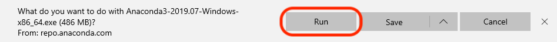

A new window will appear, it is the Anaconda3 installer. Click on "Next".

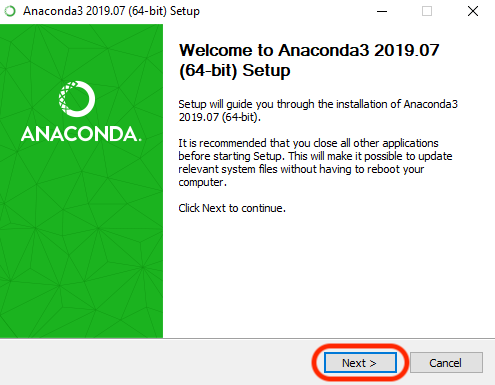

Accept the License Agreement by clicking on "I Agree".

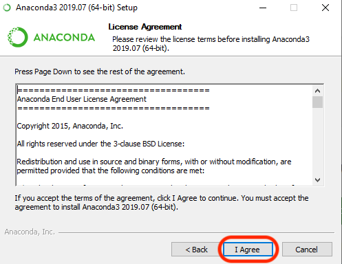

Click on "Next".  

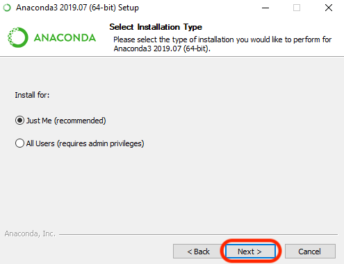

Leave the default installation location, click on "Next".

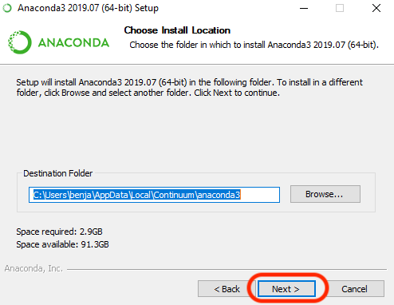

Check "Add Anaconda to my PATH environment variable" and click on "Install"  

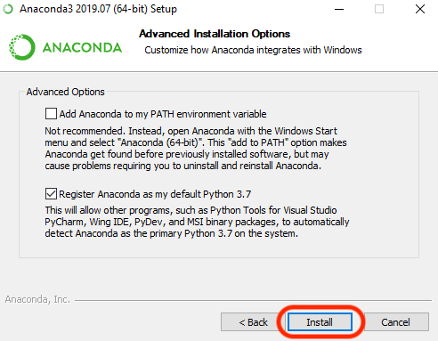

When it says "Completed", click on "Next".  

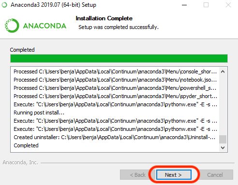

Click on "Next".  

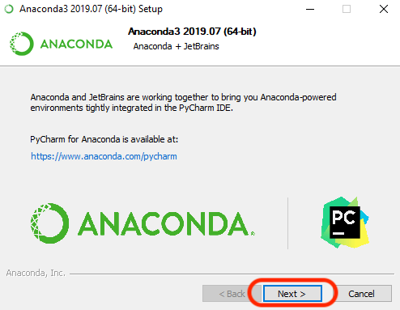

Finally, uncheck the two options and click on "Finish".

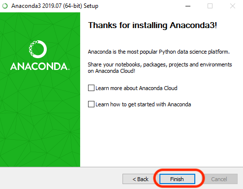

Anaconda3 is now installed!


# Sublime Text 3 - Your text editor

A text editor is one of the most important tools of a developer.

Go to [Sublime's website](https://www.sublimetext.com/) and click on "Download for Windows"  

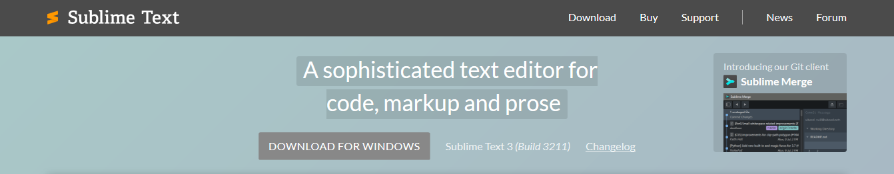

A little popup will appear at the bottom of the page, click on "Run".  

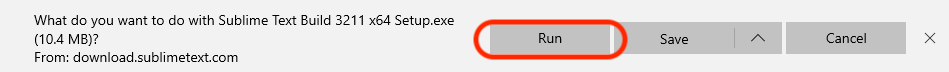

A new window will appear, it is the Sublime Text 3 installer. Click on "Next".  

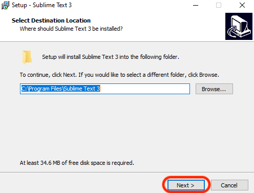

Click on "Next".  

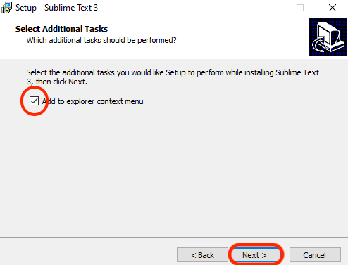

Click on "Install".  

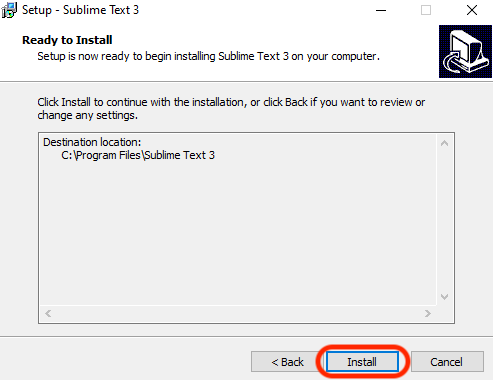

Click on "Finish".  

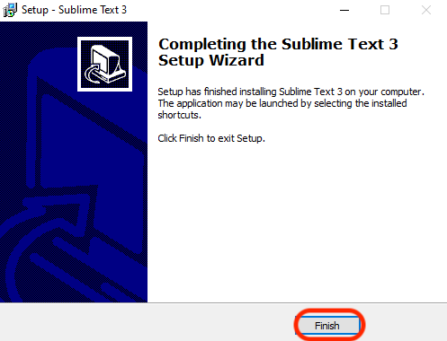


# Git Bash

Git bash will allow you to run some linux command on Windows.  
Go to [Git-SCM](https://git-scm.com/download/wim) and click on "Windows".  

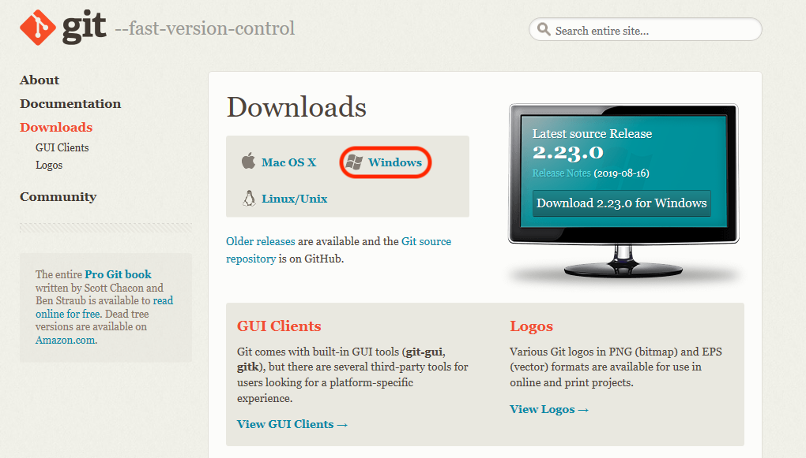

Click on "Next".  

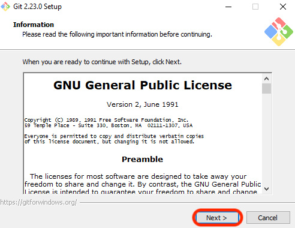

Leave the default installation folder and click on "Next".  

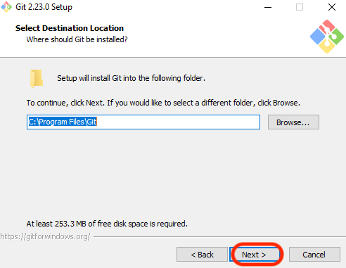

Leave the default components qnd click on "Next".  

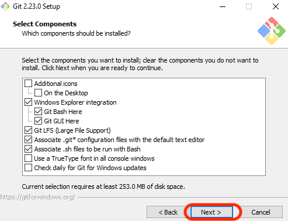

Leave the default name "Git" and click on "Next".  

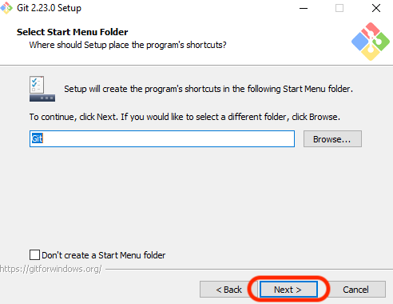

In the dropdown, choose your new favorite text editor "Use Sublime Text as Git's default editor" and click on "Next".  

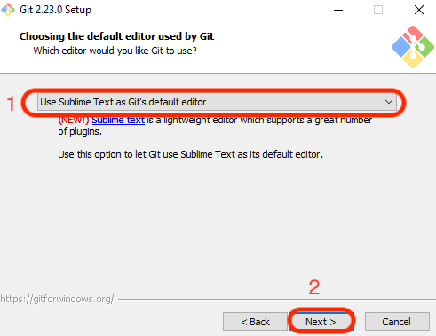

Click on "Next".  

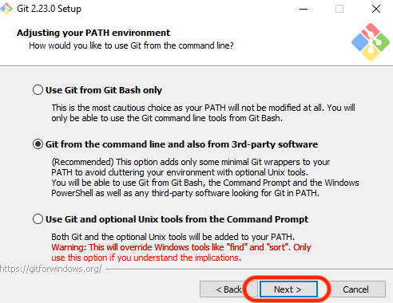

Once again, click on "Next".

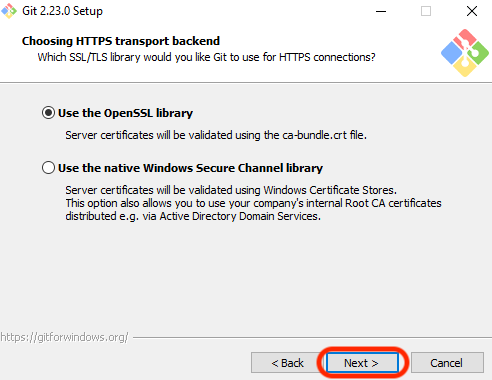

Guess what? Click on "Next" :)  

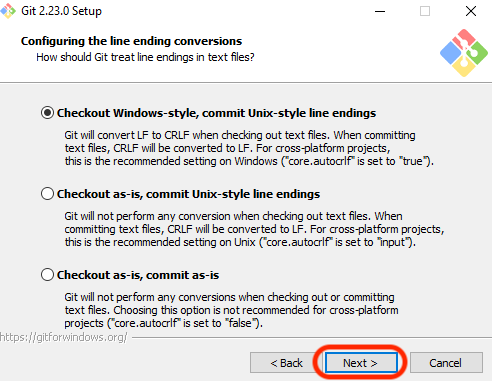

"Nexttttt!".  

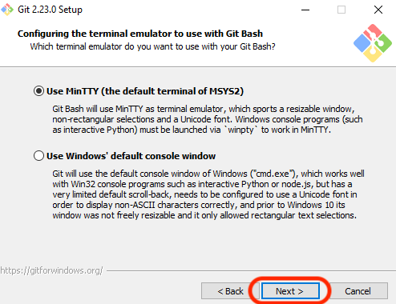

"Again!".  

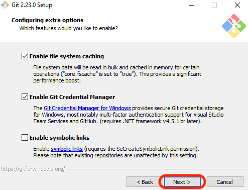

And again! Just kidding, click on "Install".  

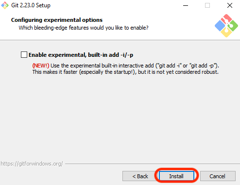

Lastly, check "Launch Git Bash", uncheck "View Releave Notes" and click on "Finish".  

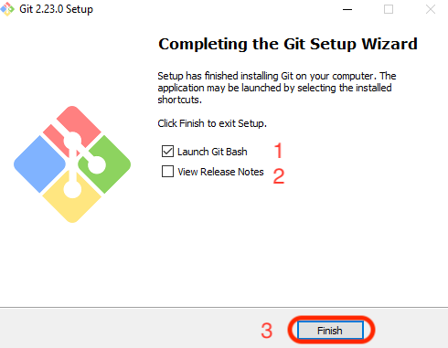

The Git Bash terminal should open.  

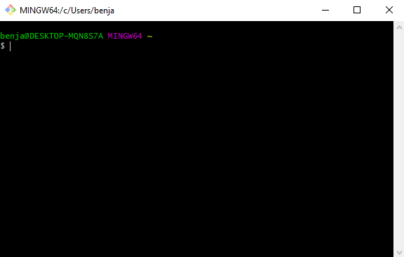

Please run the following command:  

```bash
conda init bash
``` 

Then run this one:  

```bash
conda activate base
```

Let's install two tools will need to tests our Python code ;)  

```bash
conda install pytest
conda install pylint
``` 

If you have an error, please ask a TA.  

To make sure Python is properly installed, please run the following command:  

```bash
python -i
``` 

You should get an answer like 
```bash
Python 3.7.3 (default...
```  
  
To exit please run  
```bash
exit()
``` 


# Make

Make is a build automation tool that build executable.  
Go to this [url](https://sourceforge.net/projects/ezwinports/files)  
Locate "make-4.2.1-without-guile-w32-bin.zip"  

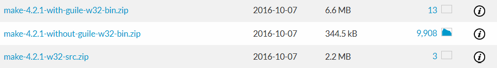  

Click on it. Your download should start shortly. A popup will appear at the bottom. Click on "Save".  

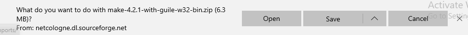  

When the download is done you will be prompted with another popup, click on "Open folder".  

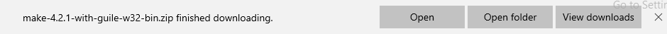  

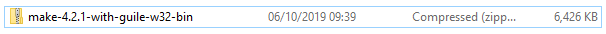  
Right click on it and chose "Extract All".  

Click on "Extract".  

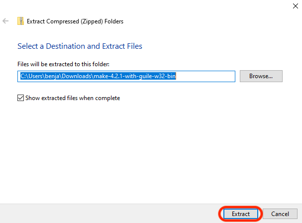  

A new explorer window should open showing you the extracted folders.  

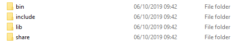  

Select all the folders and right click and choose "Copy".  

Press the windows key + R at the same time to open the "Run" tool. Type the command  
```bash
explorer.exe "C:\Program Files\Git\mingw64"
```

Click on "OK".  

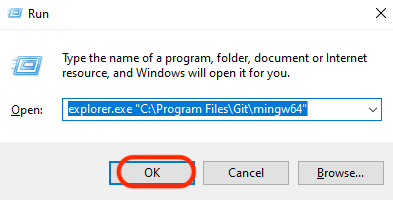  

A new windows should open with folders already in it. Right click and chose "Paste". It will paste the folders you've extracted before into this folder. If it ask you for admin rights, press "Continue". Your folder should now look like this:  

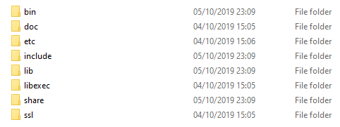  

To make sure "Make" is properly installed, please Click on "Start" in the bottom left corner.  

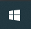  

Search for "Git Bash" and click on the icon of it.  

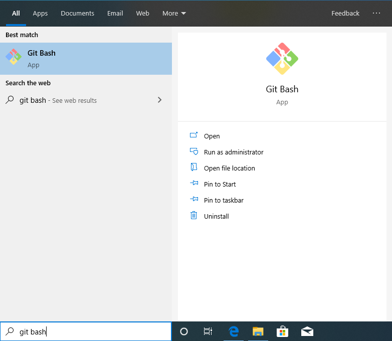  

In the terminal please type the command:  

```bash
make -v
```

You should get and answer like this:  

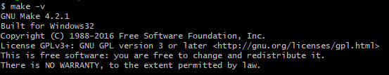  

If you don't, please ask a TA.  


# Github account

Have you signed up to Github? If not [do it right away](https://github.com/join).  

:point_right: **[Upload a picture](https://github.com/settings/profile)** and put your name correctly on your Github account. This is important as we'll use an internal dashboard with your avatars. please do it **now**.  

# Github

We need to generate SSH keys which are going to be used by Github
to authenticate you. Think of it as a way to log in, but different from the
well known username/password couple. If you already generated keys
that you already use with other services, you can skip this step.

Open a Git Bash terminal and type this, replacing the email with **yours** (the
same one you used to create your GitHub account). It will prompt
for information. Just press enter until it asks for a **passphrase**.

```bash
mkdir -p ~/.ssh && ssh-keygen -t ed25519 -o -a 100 -f ~/.ssh/id_ed25519 -C "TYPE_YOUR_EMAIL@HERE.com"
```

**NB:** when asked for a passphrase, put something you want (and that you'll remember),
it's a password to protect your private key stored on your hard drive. You'll type,
nothing will show up on the screen, **that's normal**. Just type the passphrase,
and when you're done, press `Enter`.

Then you need to give your **public** key to GitHub. Run:

```bash
cat ~/.ssh/id_ed25519.pub
```

It will prompt on the screen the content of the `id_ed25519.pub` file. Copy that text,
then go to [github.com/settings/ssh](https://github.com/settings/ssh). Click on
**Add SSH key**, fill in the Title with your computer name, and paste the **Key**.
Finish by clicking on the **Add key** green button.

To check that this step is completed, in the terminal run this. You will be
prompted a warning, type `yes` then `Enter`.

```bash
ssh -T git@github.com
```

If you see something like this, you're done!

```bash
# Hi --------! You've successfully authenticated, but GitHub does not provide shell access
```

If it does not work, try running this before trying again the `ssh -T` command:

```bash
ssh-add ~/.ssh/id_ed25519
```

Don't be in a rush, take time to [read this article](http://sebastien.saunier.me/blog/2015/05/10/github-public-key-authentication.html) to get a better
understanding of what those keys are used for.


