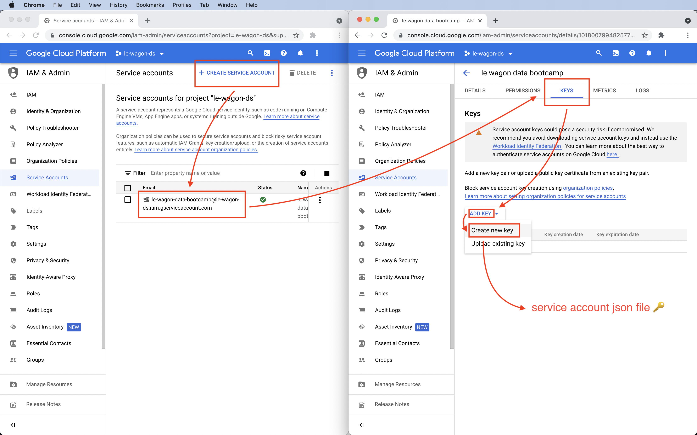
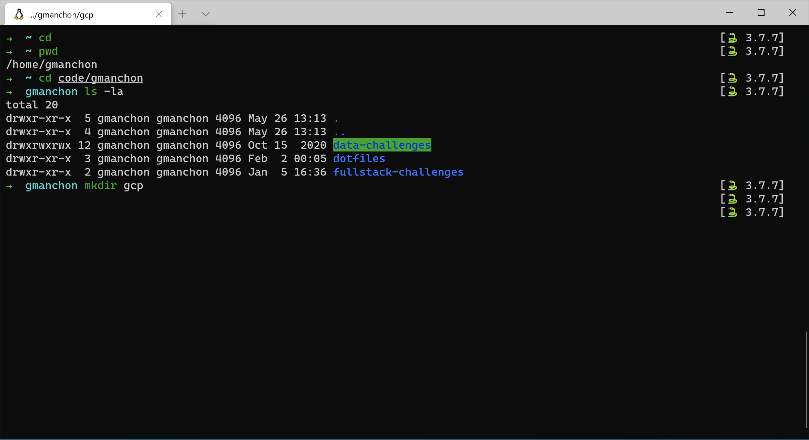
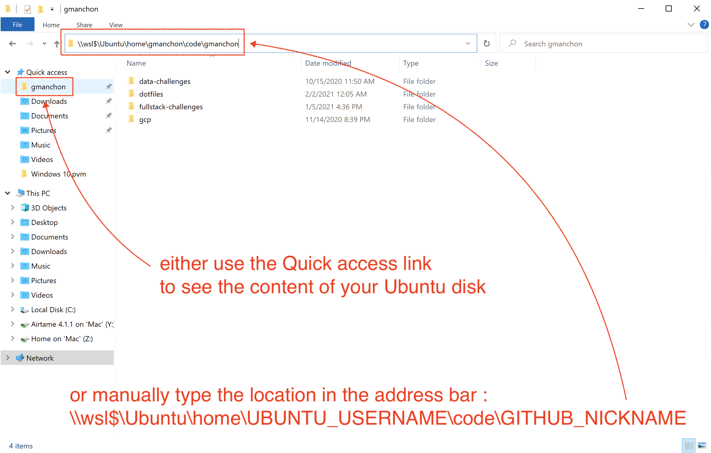
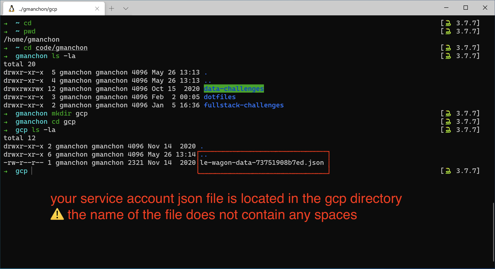

# Setup instructions

You will find below the instructions to set up you computer for [Le Wagon Data Science course](https://www.lewagon.com/data-science-course/full-time)

Please **read them carefully and execute all commands in the following order**. If you get stuck, don't hesitate to ask a teacher for help :raising_hand:

Let's start :rocket:


## Zoom

To be able to interact when we are not in the same physical room, we will be using [Zoom](https://zoom.us/), a video conferencing tool.

:warning: If you already have Zoom installed, please make sure that the version is at least **5.6**.

Go to [zoom.us/download](https://zoom.us/download).

Under **Zoom Client** click the **Download** button.

Open the file you have just downloaded to install the app.

Open the Zoom app.

If you already have a Zoom account, sign in using your credentials.

If not, click on the **Sign Up Free** link:


You will be redirected to Zoom's website to complete a form.

When it's done, go back to the Zoom app and sign in using your credentials.

You should then see a screen like this:


You can now close the Zoom app.


## GitHub account

Have you signed up to GitHub? If not, [do it right away](https://github.com/join).

:point_right: **[Upload a picture](https://github.com/settings/profile)** and put your name correctly on your GitHub account. This is important as we'll use an internal dashboard with your avatar. Please do this **now**, before you continue with this guide.


## Windows version

Before we start, we need to check that the version of Windows installed on your computer is compatible with this setup instructions.

### Windows 10 or Windows 11

To be able to set up your computer, you need to have **Windows 10 or Windows 11** installed.

To check your Windows version:
- Press `Windows` + `R`
- Type  `winver`
- Press `Enter`

:heavy_check_mark: If the first words of this window are **Windows 10 or Windows 11** you're good to go :+1:

:x: If not, you cannot proceed with this setup. You have to upgrade to Windows 10 first :point_down:

<details>
  <summary>Upgrade to Windows 10</summary>

  - Download Windows 10 from [Microsoft](https://www.microsoft.com/software-download/windows10ISO)
  - Install it. It should take roughly an hour, but this depends on your computer.
  - When the installation is over, execute the commands above :point_up: to check that you now have **Windows 10**.
</details>

:information_source: [Windows 11 upgrade is rolling out now](https://www.microsoft.com/en-us/windows/get-windows-11), which means it may or may not be available for your computer just yet.

:warning: **If you have Windows 10 installed, you don't need to upgrade to Windows 11 to proceed with this setup**.

### Latest updates

Once you're sure that you're using Windows 10 or 11, you need to install all the latest updates.

Open Windows Update:
- Press `Windows` + `R`
- Type  `ms-settings:windowsupdate`
- Press `Enter`
- Click on `Check updates`

:heavy_check_mark: If you see a green check mark and the message "You're up to date", you're good to go :+1:

:warning: If you have a red exclamation mark and the message "Update available", please install them and repeat the process until it says that you are up to date :loop:

:x: If you have an error message about Windows not being able to apply updates, please **contact a teacher**.

<details>
  <summary>Activate Windows Update Service to fix Updates</summary>

  Some antiviruses and pieces of software deactivate the Update service we need, resulting in the error you see. Let's fix that!
  - Press `Windows` + `R`
  - Type  `services.msc`
  - Press `Enter`
  - Double Click `Windows Update Service`
  - Set its `Startup` to `Automatic`
  - Click on `Start`
  - Click on `Ok`
  Then let's try updates again!
</details>

### Minimum version

Some of the tools we need to install have been release with the `1903` version **or above** of Windows 10 so we need to make sure you have at least this one.

- Press `Windows` + `R`
- Type  `winver`
- Press `Enter`

Check the **Version number**:

:heavy_check_mark: If it says at least `1903`, you are good to go :+1:

:x: If it is below `1903`, please **contact a teacher**.


## Virtualization

We need to ensure that the Virtualization options are enabled in the BIOS of your computer.

For many computers, this is already the case. Let's check:
- Press `Windows` + `R`
- Type  `taskmgr`
- Press `Enter`
- Click on the `Performance` tab
- Click on `CPU`


:heavy_check_mark: If you see "Virtualization: Enabled", you're good to go :+1:

:x: If the line is missing or if the virtualization is disabled, please **contact a teacher before trying to activate the Virtualization**

<details>
  <summary>Activate Virtualization</summary>

  We need to access the BIOS / UEFI of the computer to activate it.
  - Press `Windows + R`
  - Type  `shutdown.exe /r /o /t 1`
  - Press `Enter`
  - Wait for the computer to shutdown
  - Click on `Troubleshoot`
  - Click on `Advanced Options`
  - Click on `UEFI Firmware Settings`
  - Click on `Restart`

  You need to activate the virtualization option for your processor here:
  - Most of the time, in the advanced settings, the CPU settings, or the Northbridge settings
  - The option can be called differently according to your computer:
      - Intel: `Intel VT-x`, `Intel Virtualization Technology`, `Virtualization Extensions`, `Vanderpool`...
      - AMD: `SVM Mode` or `AMD-V`
  - Save the changes after activation and reboot the computer through the appropriate option
</details>


## Windows Subsystem for Linux (WSL)

WSL is the development environment we are using to run Ubuntu. You can learn more about WSL [here](https://docs.microsoft.com/en-us/windows/wsl/faq).

:information_source: The following instructions depend on your version of Windows. Please execute only the instructions corresponding to your version :point_down:

### Windows 11

If you are running Windows 11, we will install WSL 2 and Ubuntu in one command through the Windows Terminal.

:warning: In the following instruction, please be aware of the `Ctrl` + `Shift` + `Enter` key stroke to execute **Windows Terminal** with administrator privileges instead of just clicking on `Ok`or pressing `Enter`.

- Press `Windows` + `R`
- Type  `wt`
- Press **`Ctrl` + `Shift` + `Enter`**

:warning: You may have to accept the UAC confirmation about the privilege elevation.

A blue terminal window will appear:
- Copy the following command (`Ctrl` + `C`)
- Paste it into the terminal window (`Ctrl` + `V` or by right-clicking in the window)
- Run it by pressing `Enter`

```powershell
wsl --install
```

:heavy_check_mark: If the command ran without any error, please restart your computer and continue below :+1:

:x: If you encounter an error message (or if you see some text in red in the window), please **contact a teacher**

### Windows 10

#### Install WSL 1

If you are running Windows 10, we will first install WSL 1 through the PowerShell Terminal.

:warning: In the following instruction, please be aware of the `Ctrl` + `Shift` + `Enter` key stroke to execute **Windows PowerShell** with administrator privileges instead of just clicking on `Ok`or pressing `Enter`.

- Press `Windows` + `R`
- Type  `powershell`
- Press **`Ctrl` + `Shift` + `Enter`**

:warning: You may have to accept the UAC confirmation about the privilege elevation.

A blue terminal window will appear:
- Copy the following commands one by one (`Ctrl` + `C`)
- Paste them into the PowerShell window (`Ctrl` + `V` or by right-clicking in the window)
- Run them by pressing `Enter`

```powershell
Enable-WindowsOptionalFeature -Online -FeatureName Microsoft-Windows-Subsystem-Linux
```

```powershell
dism.exe /online /enable-feature /featurename:Microsoft-Windows-Subsystem-Linux /all /norestart
```

```powershell
dism.exe /online /enable-feature /featurename:VirtualMachinePlatform /all /norestart
```

:heavy_check_mark: If all three commands ran without any error, please restart your computer and continue below :+1:

:x: If you encounter an error message (or if you see some text in red in the window), please **contact a teacher**

#### Upgrade to WSL 2

If you are running Windows 10, we will then upgrade WSL to version 2.

Once your computer has restarted, we need to download the WSL2 installer.

- Go to the [download page](https://aka.ms/wsl2kernel)
- Download "WSL2 Linux kernel update package"
- Open the file you've just downloaded
- Click `Next`
- Click `Finish`


:heavy_check_mark: If didn't encounter any error message, you're good to go :+1:

:x: If you encounter the error "This update only applies to machines with the Windows Subsystem for Linux", **right click** on the program and select `uninstall`; you shall be able to install it normally this time.

#### Make WSL 2 the default Windows Subsystem for Linux

If you are running Windows 10, we will set WSL default version to 2.

Now that WSL 2 is installed, let's make it the default version:
- Press `Windows` + `R`
- Type  `cmd`
- Press `Enter`

In the window which appears, type:

```bash
wsl --set-default-version 2
```

:heavy_check_mark: If you see "The operation completed successfully", you can close this terminal and continue to follow the instructions below :+1:

:x: If the message you get is about Virtualization, please **contact a teacher**

<details>
  <summary>Enable Virtual Machine Platform Windows feature</summary>

  Follow the steps described [here](https://www.configserverfirewall.com/windows-10/please-enable-the-virtual-machine-platform-windows-feature-and-ensure-virtualization-is-enabled-in-the-bios/#:~:text=To%20enable%20WSL%202,%20Open,Windows%20feature%20on%20or%20off.&text=Ensure%20that%20the%20Virtual%20Machine,Windows%20will%20enable%20WSL%202) until you enable <strong>Virtual Machine Platform</strong> and <strong>Windows Subsystem for Linux</strong>
</details>

<details>
  <summary>Enable Hyper-V Windows feature</summary>

  Follow the steps described [here](https://winaero.com/enable-use-hyper-v-windows-10/) until you enable the group <strong>Hyper-V</strong>

  :information_source: If you are running Windows 10 **Home edition**, Hyper-V feature is not available for your operating system. It's non-blocking and you can still continue to follow the instructions below :ok_hand:
</details>


## Ubuntu

### Installation

:information_source: The following instructions depend on your version of Windows. Please execute only the instructions corresponding to your version :point_down:

#### Windows 11

If you are running Windows 11, after restarting you computer, you should see a terminal window saying WSL is resuming the Ubuntu installation process. When it's done, Ubuntu will be launched.

#### Windows 10

If you are running Windows 10, let's install Ubuntu throught the Microsoft Store:

- Click on `Start`
- Type  `Microsoft Store`
- Click on `Microsoft Store` in the list
- Search for `Ubuntu` in the search bar
- **Select version without any number, just plain "Ubuntu"**
- Click on `Install`

:warning: Don't install **Ubuntu 18.04 LTS** nor **Ubuntu 20.04**!

<details>
  <summary>Uninstall wrong versions of Ubuntu</summary>

  To uninstall a wrong version of Ubuntu, you just have to go to the Installed Program List of Windows 10:
  - Press `Windows` + `R`
  - Type  `ms-settings:appsfeatures`
  - Press `Enter`

  Find the software to uninstall and click on the uninstall button.
</details>

Once the installation is finished, the `Install` button becomes a `Launch` button: click on it.

### First launch

At first launch, you will be asked some information:
- Choose a **username**:
    - one word
    - lowercase
    - no special characters
    - for example: `lewagon` or your `firstname`
- Choose a **password**
- Confirm your password

:warning: When you type your password, nothing will show up on the screen, **that's normal**. This is a security feature to mask not only your password as a whole but also its length. Just type your password and when you're done, press `Enter`.

You can close the Ubuntu window now that it is installed on your computer.

### Check the WSL version of Ubuntu

- Press `Windows` + `R`
- Type  `cmd`
- Press `Enter`

Type the following command:

```bash
wsl -l -v
```

:heavy_check_mark: If the version of Ubuntu WSL is 2, you are good to go :+1:

:x: If the version of Ubuntu WSL is 1, we will need to convert it to version 2.

<details>
  <summary>Convert Ubuntu WSL V1 to V2</summary>

  In the Command Prompt window, type:

  ```bash
  wsl --set-version Ubuntu 2
  ```

  :heavy_check_mark: After a few seconds, you should get the following message: `The conversion is complete`.

  :x: If it does not work, we need to be sure that Ubuntu files are not compressed.
</details>

<details>
  <summary>Check for Uncompressed Files</summary>

  - Press `Windows` + `R`
  - Type  `%localappdata%\Packages`
  - Press `Enter`
  - Open the folder named `CanonicalGroupLimited.UbuntuonWindows...`
  - Right Click on the `LocalState` folder
  - Click on `Properties`
  - Click on `Advanced`
  - Make sure that the option `Compress content` is **not** ticked, then click on `Ok`.

  Apply changes to this folder only and try to convert the Ubuntu WSL version again.

  :x: If the conversion still does not work, please **contact a teacher**.
</details>

You can now close this terminal window.


## Chrome - your browser

Install the Google Chrome browser if you haven't got it already and set it as a __default browser__.

Follow the steps for your system from this link :point_right: [Install Google Chrome](https://support.google.com/chrome/answer/95346?co=GENIE.Platform%3DDesktop&hl=en-GB)

__Why Chrome?__

We recommend to use it as your default browser as it's most compatible with testing or running your code, as well as working with Google Cloud Platform. Another alternative is Firefox, however we don't recommend using other tools like Opera, Internet Explorer or Safari.


## Visual Studio Code

### Installation

Let's install [Visual Studio Code](https://code.visualstudio.com) text editor.

- Go to [Visual Studio Code download page](https://code.visualstudio.com/download).
- Click on "Windows" button
- Open the file you have just downloaded.
- Install it with few options:


When the installation is finished, launch VS Code.

### Connecting VS Code to Ubuntu

To make VS Code interact properly with Ubuntu, let's install the [Remote - WSL](https://marketplace.visualstudio.com/items?itemName=ms-vscode-remote.remote-wsl) VS Code extension.

Open your **Ubuntu terminal**.

Copy-paste the following commands in the terminal:

```bash
code --install-extension ms-vscode-remote.remote-wsl
```

Then open VS Code from your terminal:

```bash
code .
```

:heavy_check_mark: If you see `WSL: Ubuntu` in a green box in the bottom left corner of the VS Code window, you're good to go :+1:


:x: Otherwise, please **contact a teacher**


## Windows Terminal

### Installation

:information_source: The following instructions depend on your version of Windows.

If you are running Windows 11, the Windows Terminal is already installed and you can proceed to the next section :point_down:

If you are running Windows 10, let's install Windows Terminal, a real modern terminal:

- Click on `Start`
- Type  `Microsoft Store`
- Click on `Microsoft Store` in the list
- Search for `Windows Terminal` in the search bar
- **Select Windows Terminal"**
- Click on `Install`

:warning: DO NOT install **Windows Terminal Preview**, just **Windows Terminal**!

<details>
  <summary>Uninstall wrong version of Windows Terminal</summary>

  To uninstall a wrong version of Windows Terminal, you just have to go to the Installed Program List of Windows 10:

  - Press `Windows` + `R`
  - Type  `ms-settings:appsfeatures`
  - Press `Enter`

  Find the software to uninstall and click on the uninstall button.
</details>

Once the installation is finished, the `Install` button becomes a `Launch` button: click on it.

### Ubuntu as the default terminal

Let's make Ubuntu the default terminal of your Windows Terminal application.

Press `Ctrl` + `,`

It should open the terminal settings:


- Change the default profile to "Ubuntu"
- Click on "Save"
- Click on "Open JSON file"

You may see an orange circle rather than a penguin as the logo for Ubuntu.

We have circle in red the part you will change:


First, let's ask Ubuntu to start directly inside your Ubuntu Home Directory instead of the Windows one:
- Locate the entry with both `"name": "Ubuntu",` and `"hidden": false,`
- Add the following line after it:

```bash
"commandline": "wsl.exe ~",
```

:warning: Do not forget the comma at the end of the line!

Then, let's disable warning for copy-pasting commands between Windows and Ubuntu:
- Locate the line `"defaultProfile": "{2c4de342-...}"`
- Add the following line after it:

```bash
"multiLinePasteWarning": false,
```

:warning: Do not forget the comma at the end of the line!

You can save these changes by pressing `Ctrl` + `S`

:heavy_check_mark: Your **Windows Terminal** is now setup :+1:

This terminal has tabs: you can choose to open a new terminal tab by clicking on the **+** next to the current one.

**From now on, every time we will refer to the terminal or the console it will be this one.** DO NOT use any other terminal anymore.


## VS Code Extensions

### Installation

Let's install some useful extensions to VS Code.

```bash
code --install-extension ms-vscode.sublime-keybindings
code --install-extension emmanuelbeziat.vscode-great-icons
code --install-extension MS-vsliveshare.vsliveshare
code --install-extension ms-python.python
code --install-extension KevinRose.vsc-python-indent
code --install-extension ms-python.vscode-pylance
code --install-extension ms-toolsai.jupyter
```

Here is a list of the extensions you are installing:
- [Sublime Text Keymap and Settings Importer](https://marketplace.visualstudio.com/items?itemName=ms-vscode.sublime-keybindings)
- [VSCode Great Icons](https://marketplace.visualstudio.com/items?itemName=emmanuelbeziat.vscode-great-icons)
- [Live Share](https://marketplace.visualstudio.com/items?itemName=MS-vsliveshare.vsliveshare)
- [Python](https://marketplace.visualstudio.com/items?itemName=ms-python.python)
- [Python Indent](https://marketplace.visualstudio.com/items?itemName=KevinRose.vsc-python-indent)
- [Pylance](https://marketplace.visualstudio.com/items?itemName=ms-python.vscode-pylance)
- [Jupyter](https://marketplace.visualstudio.com/items?itemName=ms-toolsai.jupyter)


### Live Share configuration

[Visual Studio Live Share](https://visualstudio.microsoft.com/services/live-share/) is a VS Code extension which allows you to share the code in your text editor for debugging and pair-programming: let's set it up!

Launch VS Code from your terminal by typing `code` and pressing `Enter`.

Click on the little arrow at the bottom of the left bar :point_down:


- Click on the "Share" button, then on "GitHub (Sign in using GitHub account)".
- A popup appears asking you to sign in with GitHub: click on "Allow".
- You are redirected to a GitHub page in you browser asking you to authorize Visual Studio Code: click on "Continue" then "Authorize github".
- VS Code may display additional pop-ups: close them by clicking "OK".

That's it, you're good to go!


## Command line tools

### Zsh & Git

Instead of using the default `bash` [shell](https://en.wikipedia.org/wiki/Shell_(computing)), we will use `zsh`.

We will also use [`git`](https://git-scm.com/), a command line software used for version control.

Let's install them, along with other useful tools:
- Open an **Ubuntu terminal**
- Copy and paste the following commands:

```bash
sudo apt update
```

```bash
sudo apt install -y curl git imagemagick jq unzip vim zsh tree
```

These commands will ask for your password: type it in.

:warning: When you type your password, nothing will show up on the screen, **that's normal**. This is a security feature to mask not only your password as a whole but also its length. Just type in your password and when you're done, press `Enter`.

### GitHub CLI installation

Let's now install [GitHub official CLI](https://cli.github.com) (Command Line Interface). It's a software used to interact with your GitHub account via the command line.

In your terminal, copy-paste the following commands and type in your password if asked:

```bash
sudo apt remove -y gitsome # gh command can conflict with gitsome if already installed
curl -fsSL https://cli.github.com/packages/githubcli-archive-keyring.gpg | sudo dd of=/usr/share/keyrings/githubcli-archive-keyring.gpg
```

```bash
echo "deb [arch=$(dpkg --print-architecture) signed-by=/usr/share/keyrings/githubcli-archive-keyring.gpg] https://cli.github.com/packages stable main" | sudo tee /etc/apt/sources.list.d/github-cli.list > /dev/null
```

```bash
sudo apt update
```

```bash
sudo apt install -y gh
```

To check that `gh` has been successfully installed on your machine, you can run:

```bash
gh --version
```

:heavy_check_mark: If you see `gh version X.Y.Z (YYYY-MM-DD)`, you're good to go :+1:

:x: Otherwise, please **contact a teacher**


## Oh-my-zsh

Let's install the `zsh` plugin [Oh My Zsh](https://ohmyz.sh/).

In a terminal execute the following command:

```bash
sh -c "$(curl -fsSL https://raw.github.com/ohmyzsh/ohmyzsh/master/tools/install.sh)"
```

If asked "Do you want to change your default shell to zsh?", press `Y`

At the end your terminal should look like this:


:heavy_check_mark: If it does, you can continue :+1:

:x: Otherwise, please **ask for a teacher**


## Linking your default browser to Ubuntu

To be sure that you can interact with your browser installed on Windows from your Ubuntu terminal, we need to set it as your default browser there.

:warning: You need to execute at least one of the following commands below:

<details>
  <summary>Google Chrome as your default browser</summary>

  Run the command:

  ```bash
    ls /mnt/c/Program\ Files\ \(x86\)/Google/Chrome/Application/chrome.exe
  ```

  If you get an error like `ls: cannot access...` Run the following command:

  ```bash
    echo "export BROWSER='\"/mnt/c/Program Files/Google/Chrome/Application/chrome.exe\"'" >> ~/.zshrc
  ```

  Else run:

  ```bash
    echo "export BROWSER='\"/mnt/c/Program Files (x86)/Google/Chrome/Application/chrome.exe\"'" >> ~/.zshrc
  ```
</details>

<details>
  <summary>Mozilla Firefox as your default browser</summary>

  Run the command:

  ```bash
    ls /mnt/c/Program\ Files\ \(x86\)/Mozilla\ Firefox/firefox.exe
  ```

  If you get an error like `ls: cannot access...` Run the following command:

  ```bash
    echo "export BROWSER='\"/mnt/c/Program Files/Mozilla Firefox/firefox.exe\"'" >> ~/.zshrc
  ```

  Else run:

  ```bash
    echo "export BROWSER='\"/mnt/c/Program Files (x86)/Mozilla Firefox/firefox.exe\"'" >> ~/.zshrc
  ```
</details>

<details>
  <summary>Microsoft Edge as your default browser</summary>

  Run the command:

  ```bash
  echo "export BROWSER='\"/mnt/c/Program Files (x86)/Microsoft/Edge/Application/msedge.exe\"'" >> ~/.zshrc
  ```
</details>

Restart your terminal.

Then please make sure that the following command returns "Browser defined 👌":

```bash
[ -z "$BROWSER" ] && echo "ERROR: please define a BROWSER environment variable ⚠️" || echo "Browser defined 👌"
```

If it does not,

:heavy_check_mark: If you got this message, you can continue :+1:

:x: If not, choose a browser in the list above and execute the corresponding command. Then don't forget to reset your terminal:

```bash
exec zsh
```

Do not hesitate to **contact a teacher**.


## direnv

[direnv](https://direnv.net/) is a shell extension. It makes it easy to deal with per project environment variables. This will be useful in order to customize the behavior of your code.

``` bash
sudo apt-get update; sudo apt-get install direnv
echo 'eval "$(direnv hook zsh)"' >> ~/.zshrc
```


## GitHub CLI

CLI is the acronym of [Command-line Interface](https://en.wikipedia.org/wiki/Command-line_interface).

In this section, we will use [GitHub CLI](https://cli.github.com/) to interact with GitHub directly from the terminal.

It should already be installed on your computer from the previous commands.

First in order to **login**, copy-paste the following command in your terminal:

:warning: **DO NOT edit the `email`**

```bash
gh auth login -s 'user:email' -w
```

gh will ask you few questions:

`What is your preferred protocol for Git operations?` With the arrows, choose `SSH` and press `Enter`. SSH is a protocol to log in using SSH keys instead of the well known username/password pair.

`Generate a new SSH key to add to your GitHub account?` Press `Enter` to ask gh to generate the SSH keys for you.

If you already have SSH keys, you will see instead `Upload your SSH public key to your GitHub account?` With the arrows, select your public key file path and press `Enter`.

`Enter a passphrase for your new SSH key (Optional)`. Type something you want and that you'll remember. It's a password to protect your private key stored on your hard drive. Then press `Enter`.

:warning: When you type your passphrase, nothing will show up on the screen, **that's normal**. This is a security feature to mask not only your passphrase as a whole but also its length. Just type your passphrase and when you're done, press `Enter`.

You will then get the following output:

```bash
! First copy your one-time code: 0EF9-D015
- Press Enter to open github.com in your browser...
```

Select and copy the code (`0EF9-D015` in the example), then press `Enter`.

Your browser will open and ask you to authorize GitHub CLI to use your GitHub account. Accept and wait a bit.

Come back to the terminal, press `Enter` again, and that's it.

To check that you are properly connected, type:

```bash
gh auth status
```

:heavy_check_mark: If you get `Logged in to github.com as <YOUR USERNAME> `, then all good :+1:

:x: If not, **contact a teacher**.


## Google Cloud CLI

Install the `gcloud` CLI to communicate with [Google Cloud Platform](https://cloud.google.com/) through your terminal:
```bash
echo "deb [signed-by=/usr/share/keyrings/cloud.google.gpg] https://packages.cloud.google.com/apt cloud-sdk main" | sudo tee -a /etc/apt/sources.list.d/google-cloud-sdk.list
sudo apt-get install apt-transport-https ca-certificates gnupg
curl https://packages.cloud.google.com/apt/doc/apt-key.gpg | sudo apt-key --keyring /usr/share/keyrings/cloud.google.gpg add -
sudo apt-get update && sudo apt-get install google-cloud-sdk
sudo apt-get install google-cloud-sdk-app-engine-python
```
👉 [Install documentation](https://cloud.google.com/sdk/docs/install#deb)


## Dotfiles

There are three options, choose **one**:

<details>
    <summary>
        <strong>I already attended Web Development (FullStack) bootcamp at Le Wagon <em>on the same laptop</em></strong>
    </summary>

This means that you already forked the GitHub repo `lewagon/dotfiles`, but at that time the configuration was maybe not ready for the new Data Science bootcamp.

Open your terminal and go to your `dotfiles` project:

```bash
cd ~/code/<YOUR_GITHUB_NICKNAME>/dotfiles
code . # Open it in VS Code
```

In VS Code, open the `zshrc` file. Replace its content with the [newest version](https://raw.githubusercontent.com/lewagon/dotfiles/master/zshrc) of that file that we provide. Save to disk.

Back to the terminal, run a `git diff` and ask a TA to come and check about this configuration change. You should see stuff about Python and `pyenv`.

Once this is good, commit and push your changes:

```bash
git add zshrc
git commit -m "Update zshrc for Data Science bootcamp"
git push origin master
```

</details>

OR


<details>
    <summary>
        <strong>I did not attend the Web Dev bootcamp at Le Wagon</strong>
    </summary>

Hackers love to refine and polish their shell and tools. We'll start with a great default configuration provided by [Le Wagon](http://github.com/lewagon/dotfiles), stored on GitHub. As your configuration is personal, you need your own repository storing it, so you first need to fork it to your GitHub account.

:arrow_right: [Click here to **fork**](https://github.com/lewagon/dotfiles/fork) the `lewagon/dotfiles` repository to your account (you'll need to click again on your picture to confirm _where_ you do the fork).

Forking means that it will create a new repo in your GitHub account, identical to the original one. You'll have a new repository on your GitHub account, `your_github_username/dotfiles`. We need to fork because each of you will need to put specific information (e.g. your name) in those
files.


Open your terminal and run the following command:

```bash
export GITHUB_USERNAME=`gh api user | jq -r '.login'`
echo $GITHUB_USERNAME
```

You should see your GitHub username printed. If it's not the case, **stop here** and ask for help.
There seems to be a problem with the previous step (`gh auth`).

Time to fork the repo and clone it on your laptop:

```bash
mkdir -p ~/code/$GITHUB_USERNAME && cd $_
gh repo fork lewagon/dotfiles --clone
```

Run the `dotfiles` installer.

```bash
cd ~/code/$GITHUB_USERNAME/dotfiles && zsh install.sh
```

Check the emails registered with your GitHub Account. You'll need to pick one
at the next step:

```bash
gh api user/emails | jq -r '.[].email'
```

Run the git installer:

```bash
cd ~/code/$GITHUB_USERNAME/dotfiles && zsh git_setup.sh
```

:point_up: This will **prompt** you for your name (`FirstName LastName`) and your email. Be careful
you **need** to put one of the email listed above thanks to the previous `gh api ...` command. If you
don't do that, Kitt won't be able to track your progress.

Please now **quit** all your opened terminal windows.
</details>


OR

<details>
    <summary>
        <strong>I already attended Web Development (FullStack) bootcamp at Le Wagon <em>but I have a new laptop</em></strong>
    </summary>


Open your terminal and run the following command:

```bash
export GITHUB_USERNAME=`gh api user | jq -r '.login'`
echo $GITHUB_USERNAME
```

You should see your GitHub username printed. If it's not the case, **stop here** and ask for help.
There seems to be a problem with the previous step (`gh auth`).

Time to fork the repo and clone it on your laptop:

```bash
mkdir -p ~/code/$GITHUB_USERNAME && cd $_
gh repo fork lewagon/dotfiles --clone
```

Run the `dotfiles` installer.

```bash
cd ~/code/$GITHUB_USERNAME/dotfiles && zsh install.sh
```

Check the emails registered with your GitHub Account. You'll need to pick one
at the next step:

```bash
gh api user/emails | jq -r '.[].email'
```

Run the git installer:

```bash
cd ~/code/$GITHUB_USERNAME/dotfiles && zsh git_setup.sh
```

:point_up: This will **prompt** you for your name (`FirstName LastName`) and your email. Be careful
you **need** to put one of the email listed above thanks to the previous `gh api ...` command. If you
don't do that, Kitt won't be able to track your progress.

Please now **quit** all your opened terminal windows.
</details>


## Disable SSH passphrase prompt

You don't want to be asked for your passphrase every time you communicate with a distant repository. So, you need to add the plugin `ssh-agent` to `oh my zsh`:

First, open the `.zshrc` file:

```bash
code ~/.zshrc
```

Then:
- Spot the line starting with `plugins=`
- Add `ssh-agent` at the end of the plugins list

:heavy_check_mark: Save the `.zshrc` file with `Ctrl` + `S` and close your text editor.


## Installing Python (with [`pyenv`](https://github.com/pyenv/pyenv))

Ubuntu comes with an outdated version of Python that we don't want to use. You might already have installed Anaconda or something else to tinker with Python and Data Science packages. All of this does not really matter as we are going to do a professional setup of Python where you'll be able to switch which version you want to use whenever you type `python` in the terminal.

First let's install `pyenv` with the following Terminal command:

```bash
git clone https://github.com/pyenv/pyenv.git ~/.pyenv
exec zsh
```

Let's install some [dependencies](https://github.com/pyenv/pyenv/wiki/common-build-problems#prerequisites) needed to build Python from `pyenv`:

```bash
sudo apt-get update; sudo apt-get install make build-essential libssl-dev zlib1g-dev \
libbz2-dev libreadline-dev libsqlite3-dev wget curl llvm \
libncursesw5-dev xz-utils tk-dev libxml2-dev libxmlsec1-dev libffi-dev liblzma-dev \
python3-dev
```

Let's install the [latest stable version of Python](https://www.python.org/doc/versions/) supported by Le Wagon's curriculum:

```bash
pyenv install 3.10.6
```

This command might take a while, this is perfectly normal. Don't hesitate to help other students seated next to you!

OK once this command is complete, we are going to tell the system to use this version of Python **by default**. This is done with:

```bash
pyenv global 3.10.6
exec zsh
```

To check if this worked, run `python --version`. If you see `3.10.6`, perfect! If not, ask a TA that will help you debug the problem thanks to `pyenv versions` and `type -a python` (`python` should be using the `.pyenv/shims` version first).


## Python Virtual Environment

Before we start installing relevant Python packages, we will isolate the setup for the Bootcamp into a **dedicated** virtual environment. We will use a `pyenv` plugin called [`pyenv-virtualenv`](https://github.com/pyenv/pyenv-virtualenv).

First let's install this plugin:

```bash
git clone https://github.com/pyenv/pyenv-virtualenv.git $(pyenv root)/plugins/pyenv-virtualenv
exec zsh
```

Let's create the virtual environment we are going to use during the whole bootcamp:

```bash
pyenv virtualenv 3.10.6 lewagon
```

Let's now set the virtual environment with:

```bash
pyenv global lewagon
```

Great! Anytime we'll install Python package, we'll do it in that environment.


## Python packages

Now that we have a pristine `lewagon` virtual environment, it's time to install some packages in it.

First, let's upgrade `pip`, the tool to install Python Packages from [pypi.org](https://pypi.org). In the latest terminal where the virtualenv `lewagon` is activated, run:

```bash
pip install --upgrade pip
```

Then let's install some packages for the first weeks of the program:

``` bash
pip install -r https://raw.githubusercontent.com/lewagon/data-setup/master/specs/releases/linux.txt
```


## Configuring Jupyter Notebook to open in your browser

Let's generate the configuration file for **Jupyter Notebook**...

``` bash
jupyter notebook --generate-config
```

⚠️ Please copy the path returned by the previous command.

We will now edit the generated Jupyter configuration file:

``` bash
code $HOME/.jupyter/jupyter_notebook_config.py
```

Locate the following line in the configuration file:

``` python
# c.NotebookApp.use_redirect_file = True
```

And replace it with this one **precisely** 👇 (including removing the `#` symbol)

``` python
c.NotebookApp.use_redirect_file = False
```

Let's try to run Jupyter:

``` bash
jupyter notebook
```

This command should have opened a Jupyter page in your browser:


If it is not the case, please call a TA.

To stop the Jupyter server in the terminal, press `Ctrl` + `C`, enter y, then press Enter.


## `jupyter` notebook extensions

Pimp your `jupyter` notebooks with awesome extensions:

```bash
# install nbextensions
jupyter contrib nbextension install --user
jupyter nbextension enable toc2/main
jupyter nbextension enable collapsible_headings/main
jupyter nbextension enable spellchecker/main
jupyter nbextension enable code_prettify/code_prettify
```

### Custom CSS

Improve the display of the [`details` disclosure elements](https://developer.mozilla.org/en-US/docs/Web/HTML/Element/details) in your notebooks.

Open `custom/custom.css` in the config directory:
```bash
cd $(jupyter --config-dir)
mkdir -p custom
touch custom/custom.css
code custom/custom.css
```
Edit `custom.css` with:

```css
summary {
    cursor: pointer;
    display:list-item;
}
summary::marker {
    font-size: 1em;
}
```

You can close VS Code.

### `jupyter` check up

Let's reset your terminal:

```bash
exec zsh
```

Now, check you can launch a notebook server on your machine:

```bash
jupyter notebook
```

Your web browser should open on a `jupyter` window:


Click on `New`:


A tab should open on a new notebook:


### `nbextensions` check up

Perform a sanity check for `jupyter notebooks nbextensions`. Click on `Nbextensions`:


Untick _"disable configuration for nbextensions without explicit compatibility"_ then check that _at least_ all `nbextensions` circled in red are enabled:


You can close your web browser then terminate the jupyter server with `CTRL` + `C`.


### Python setup check up

Check your Python version with the following commands:
```bash
zsh -c "$(curl -fsSL https://raw.githubusercontent.com/lewagon/data-setup/master/checks/python_checker.sh)" 3.10.6
```

Run the following command to check if you successfully installed the required packages:
```bash
zsh -c "$(curl -fsSL https://raw.githubusercontent.com/lewagon/data-setup/master/checks/pip_check.sh)"
```

Now run the following command to check if you can load these packages:
```bash
python -c "$(curl -fsSL https://raw.githubusercontent.com/lewagon/data-setup/master/checks/pip_check.py)"
```

Make sure you can run Jupyter:

```bash
jupyter notebook
```

And open a `Python 3` notebook.

Make sure that you are running the correct python version in the notebook. Open a cell and run :
``` python
import sys; sys.version
```

Here you have it! A complete python virtual env with all the third-party packages you'll need for the whole bootcamp.


## DBeaver

Download and install [DBeaver](https://dbeaver.io/), a free and open source powerful tool to connect to any database, explore the schema and even **run SQL queries**.


## Windows settings

### Exchange files between Windows and Ubuntu

We need an easy way to transfer files from Windows to Ubuntu and vice versa.

In order to do that, let's create shortcuts to Ubuntu directories in the Windows **File Explorer**:
- Open the Windows File Explorer (or use the shortcut `WIN` + `E`)
- In the Address Bar, enter `\\wsl$\` (or `\\wsl$\Ubuntu` if it does not work)
- You now have acces to the Ubuntu file system
- Dive into the Ubuntu file system in order to look for directories of interest
- Drag the desired folders into the Address Bar in order to create shortcuts


### Open the Windows File Explorer from the Ubuntu terminal

Another option to move files around is to open the Windows **File Explorer** from the Ubuntu terminal:
- Open an Ubuntu terminal
- Go to the directory you wish to explore
- Run the `explorer.exe .` command (alternatively, use `wslview .`)
- If you get an input output error message, run `wsl --shutdown` in a Windows PowerShell and reopen an Ubuntu terminal


### Find your way in the Ubuntu File System

You might want to figure out the exact location of a Windows directory in the Ubuntu file system, or the other way around.

In order to convert a Windows path to and from an Ubuntu path:
- Open an Ubuntu terminal
- Use the `wslpath "C:\Program Files"` command in order to translate a Windows path into an Ubuntu path
- Use the `wslpath -w "/home"` command in order to translate an Ubuntu path into a Windows path
- In particular, the `wslpath -w $(pwd)` command returns the Windows path of the current Ubuntu directory


### Pin apps to your taskbar

You are going to use most of the apps you've installed today really often. Let's pin them to your taskbar so that they are just one click away!

To pin an app to your taskbar, launch the app, right-click on the icon in the taskbar to bring up the context menu and choose "Pin to taskbar".


You must pin:
- Your terminal
- Your file explorer
- VS Code
- Your Internet browser
- Slack
- Zoom


## Visual C++ Redistributable

Some Python packages require a compiler to function properly. Let's install one:

[For x64 systems](https://aka.ms/vs/16/release/vc_redist.x64.exe)


[For x86 systems](https://aka.ms/vs/16/release/vc_redist.x86.exe)

If you're unsure about which system you're using please ask a teacher.


## Docker 🐋

Docker is an open platform for developing, shipping, and running applications.

_if you already have Docker installed on your machine please update with the latest version_

### Install Docker

Go to [Docker for WSL2](https://docs.docker.com/docker-for-windows/wsl/).

Download and install the Docker Desktop WSL 2 backend.

Once done, start Docker.

You should be able to run in a Ubuntu terminal:

```bash
docker run hello-world
```

The following message should print:


## Google Cloud Platform setup

[GCP](https://cloud.google.com/) is a cloud solution that you are going to use in order to deploy your Machine Learning-based products to production.

🚨 If you are a student of the **Part-Time Bootcamp**, SKIP THIS SECTION FOR NOW! **GCP** offers $300 worth of free credits for a duration of 3 months. You do not want to activate your GCP account too soon 🙅‍♂️

### Project setup

- Go to [Google Cloud](https://console.cloud.google.com/) and create an account if you do not already have one
- In the Cloud Console, on the project list, select or create a Cloud project


- Give it a name such as `Wagon Bootcamp` for example
- Notice the `ID` automatically created for the project, e.g. `wagon-bootcamp-123456`


### Account language

In order to facilitate the following of the instructions during the bootcamp, open your GCP account preferences:

https://myaccount.google.com/language

If the *preferred language* is not:
- **English**
- **United States**

Then switch the language to english:
- Click on the edit pen logo
- Select **English**
- Select **United States**
- Click on **Select**

### Billing account

You will now link your account to your credit card. This step is required or you will not be able to use the services provided by GCP. Do not worry, you will be able to consume most GCP services through free credits throughout the bootcamp.


- Click on **Billing**
- Click on **MANAGE BILLING ACCOUNTS**
- Click on **ADD BILLING ACCOUNT**
- Give a name to your billing account, e.g. `My Billing Account`
- Click on "I have read..." and agree the to the terms of service
- Click on **CONTINUE**
- Select your account type: `Individual`
- Fill your name and address

You should see that you have a free credit of "$300 credits over the next 90days".

- Click on card details
- Enter your credit card info
- Click on **START MY FREE TRIAL**

Once this is done, verify that your billing account is linked to your GCP project.

- Select your project
- Go to **Billing**
- Select **LINK A BILLING ACCOUNT**
- Select `My Billing Account`
- Click on **SET ACCOUNT**

You should now see:

```
Free trial status: $300 credit and 91 days remaining - with a full account, you'll get unlimited access to all of Google Cloud Platform.
```

<details>
  <summary>👉 If you do not own a credit card 👈</summary>


If you do not own a credit card, an alternative is to setup a **Revolut** account.
Revolut is a financial app that will allow you to create a virtual credit card linked to your mobile phone billing account.

Skip this step if you own a credit card and use your credit card for the setup.

Download the Revolut app, or go to [revolut](https://www.revolut.com/a-radically-better-account) and follow the steps to download the app (enter your mobile phone number and click on Get Started).

- Open the Revolut app
- Enter your mobile phone number
- Enter the verification code received by SMS
- The app will ask for your country, address, first and last name, date of birth, email address
- The app will also ask for a selfie and request your profession
- The app will require a photo of your identification card or passport

Once this is done, select the standard (free) plan. No need to add the card to Apple pay, or ask for a the delivery of a physical card, or add money securely.

You now have a virtual card which we will use for the GCP setup.

In the main view of the Revolut the app
- Click on Ready to use
- Click on the card
- Click on Show card details
- Note down the references of the virtual credit card and use them in order to proceed with the GCP setup

</details>

<details>
  <summary>👉 If you receive an email from Google saying "Urgent: your billing account XXXXXX-XXXXXX-XXXXXX has been suspended" 👈</summary>


This may happen especially in case you just setup a Revolut account.

- Click on PROCEED TO VERIFICATION
- You will be asked to send a picture of your credit card (only the last 4 digits, no other info)
- In case you used **Revolut**, you can send a screenshot of your virtual credit card (do not forget to remove the validity date from the screenshot)
- Explain that you are attending the Le Wagon bootcamp, do not own a credit card, and have just created a Revolut account in order to setup GCP for the bootcamp using a virtual credit card

You may receive a validation or requests for more information within 30 minutes.

Once the verification goes through, you should receive an email stating that "Your Google Cloud Platform billing account XXXXXX-XXXXXX-XXXXXX has been fully reinstated and is ready to use.".

</details>

### Enabling GCP services

- Make sure that billing is enabled for your Google Cloud project

ℹ️ You have a **$300 credit** to use for Google Cloud resources, which will be more than enough for the bootcamp.

- [Enable the AI Platform Training & Prediction and Compute Engine APIs](https://console.cloud.google.com/flows/enableapi?apiid=ml.googleapis.com,compute_component&_ga=2.269215094.662509797.1580849510-2071889129.1567861089&_gac=1.154971594.1580849512.CjwKCAiAyeTxBRBvEiwAuM8dnbZ6uMwizbZW44J2mBCX6ncEjwjwpgF8S8QsvhYAXLkJ8awDnIRTNRoCJ_0QAvD_BwE) (This step may take a few minutes)

### Configure Cloud sdk

- Authenticate the `gcloud` CLI with the google account you used for GCP

```bash
gcloud auth login --no-launch-browser
```

- Login to your Google account on the new tab opened in your web browser
- List your active account and check your email address you used for GCP is present
```bash
gcloud auth list
```
- Set your current project (replace `PROJECT_ID` with the `ID` of your project, e.g. `wagon-bootcamp-123456`)
```bash
gcloud config set project PROJECT_ID
```
- List your active account and current project and check your project is present
```bash
gcloud config list
```

### Create a service account key 🔑

Now that you have created a `GCP account` and a `project` (identified by its `PROJECT_ID`), we are going to configure the actions (API calls) that you want to allow your code to perform.

<details>
  <summary>🤔 Why do we need a service account key ?</summary>


  You have created a `GCP account` linked to your credit card. Your account will be billed according to your usage of the ressources of the **Google Cloud Platform**. The billing will occur if you consume anything once the free trial is over, or if you exceed the amount of spending allowed during the free trial.

  In your `GCP account`, you have created a single `GCP project`, identified by its `PROJECT_ID`. The `GCP projects` allow you to organize and monitor more precisely how you consume the **GCP** ressources. For the purpose of the bootcamp, we are only going to create a single project.

  Now, we need a way to tell which ressources within a `GCP project` our code will be allowed to consume. Our code consumes GCP ressources through API calls.

  Since API calls are not free, it is important to define with caution how our code will be allowed to use them. During the bootcamp this will not be an issue and we are going to allow our code to use all the API of **GCP** without any restrictions.

  In the same way that there may be several projects associated with a GCP account, a project may be composed of several services (any bundle of code, whatever its form factor, that requires the usage of GCP API calls in order to fulfill its purpose).

  GCP requires that the services of the projects using API calls are registered on the platform and their credentials configured through the access granted to a `service account`.

  For the moment we will only need to use a single service and will create the corresponding `service account`.
</details>

Since the [service account](https://cloud.google.com/iam/docs/service-accounts) is what identifies your application (and therefore your GCP billing account and ultimately your credit card), you are going to want to be cautious with the next steps.

⚠️ **Do not share you service account json file 🔑** ⚠️ Do not store it on your desktop, do not store it in your git codebase (even if your git repository is private), do not let it by the coffee machine, do not send it as a tweet.

- Go to the [service accounts page](https://console.cloud.google.com/apis/credentials/serviceaccountkey)
- Select your project in the list of recent projects if asked to
- Create a service account:
  - Click on **CREATE SERVICE ACCOUNT**:
  - Give a `Service account name` to that account
  - Click on **CREATE AND CONTINUE**
  - Click on **Select a role** and choose `Quick access/Basic` then **Owner**, which gives full access to all ressources
  - Click on **CONTINUE**
  - Click on **DONE**
- Download the service account json file 🔑:
  - Click on the newly created service account
  - Click on **KEYS**
  - Click on **ADD KEY** then **Create new key**
  - Select **JSON** and click on **CREATE**



The browser has now saved the service account json file 🔑 in your downloads directory (it is named according to your service account name, something like `le-wagon-data-123456789abc.json`)


We will now move the service account json file from your Windows disk to the Ubuntu disk. This will allow the development tools in Ubuntu to access to the ressources of your GCP account.

First, let's create a directory in which we will store the file.

👉 Open an Ubuntu terminal and run the following commands

🚨 replace `GITHUB_NICKNAME` by your **GitHub** nickname

``` bash
cd ~/code/GITHUB_NICKNAME
ls -la
```

If the command does not show the `dotfiles` directory, ask for a TA 🙏

Otherwise, you can proceed with the setup:

``` bash
mkdir gcp
```



We will now move the service account json file to the `gcp` directory we just created.

Open a Windows **File Explorer** (Win + E) and locate the `gcp` directory in the Ubuntu file system.

You can either:
- Use the **Quick access** link that we created earlier
- manually type the location of the `gcp` directory in the Ubuntu file system in the address bar:

```
\\wsl$\Ubuntu\home\UBUNTU_USERNAME\code\GITHUB_NICKNAME
```


🚨 if you opt for the second option:
- replace `UBUNTU_USERNAME` by the username that you choose during the **Ubuntu** setup
- replace `GITHUB_NICKNAME` by your **GitHub** nickname



Once you have located the `gcp` directory in the Windows **File Explorer**, move the service account json file that you downloaded inside of it.

The file should now be visible from Ubuntu file system.

👉 Open an Ubuntu terminal and verify that the service account json file has been moved

``` bash
cd gcp
ls -la
```



If you do not see the service account json file listed in the `gcp` directory, ask for a TA 🙏

We will now store the path to your service account json file in an environment variable.

🚨 in the following command, replace:
- `UBUNTU_USERNAME` by the username that you choose during the **Ubuntu** setup
- `GITHUB_NICKNAME` by your **GitHub** nickname
- `SERVICE_ACCOUNT_JSON_FILE_CONTAINING_YOUR_SECRET_KEY.json` by the name of your service account json file

``` bash
echo 'export GOOGLE_APPLICATION_CREDENTIALS=/home/UBUNTU_USERNAME/code/GITHUB_NICKNAME/gcp/SERVICE_ACCOUNT_JSON_FILE_CONTAINING_YOUR_SECRET_KEY.json' >> ~/.zshrc
```
**Note:** every time you run this command, it will add this line to your zshrc file regardless of whether you already have it. If you made a mistake and need to fix it, preferably open the file and edit the line!

You can do so by running

```bash
code ~/.zshrc
```

in the Terminal! 😄


<details>
  <summary>ℹ️ How to find the absolute path of a file?</summary>
  You can drag and drop the file in your terminal.
</details>

**Restart** your terminal and run:

``` bash
echo $GOOGLE_APPLICATION_CREDENTIALS
```

The ouptut should be the following:

```bash
/some/absolute/path/to/your/gcp/SERVICE_ACCOUNT_JSON_FILE_CONTAINING_YOUR_SECRET_KEY.json
```

Now let's verify that the path to your service account json file is correct:

``` bash
cat $(echo $GOOGLE_APPLICATION_CREDENTIALS)
```

👉 This command should display the content of your service account json file. If it does not, ask for a TA 🙏

Your code and utilities are now able to access the resources of your GCP account.

Let's proceed with the final steps of configuration...

- List the service accounts associated to your active account and current project
```bash
gcloud iam service-accounts list
```
- Retrieve the service account email address, e.g. `SERVICE_ACCOUNT_NAME@PROJECT_ID.iam.gserviceaccount.com`
- List the roles of the service account from the cli (replace PROJECT_ID and SERVICE_ACCOUNT_EMAIL)
```bash
gcloud projects get-iam-policy PROJECT_ID \
--flatten="bindings[].members" \
--format='table(bindings.role)' \
--filter="bindings.members:SERVICE_ACCOUNT_EMAIL"
```
- You should see that your service account has a role of `roles/owner`

<details>
  <summary>Troubleshooting</summary>

- `AccessDeniedException: 403 The project to be billed is associated with an absent billing account.`
  - Make sure that billing is enabled for your Google Cloud Platform project https://cloud.google.com/billing/docs/how-to/modify-project
</details>

🏁 You are done with the GCP setup!


## Kitt

:warning: If you have received an email from Le Wagon inviting you to sign up on Kitt (our learning platform), you can safely skip this step. Instead, please follow the instructions in the email you received if you haven't done so already.

If you are unsure about what to do, you can follow [this link](https://kitt.lewagon.com/). If you are already logged in, you can safely skip this section. If you are not logged in, click on `Enter Kitt as a Student`. If you manage to login, you can safely skip this step. Otherwise ask a teacher whether you should have received an email or follow the instructions below.

Register as a Wagon alumni by going to [kitt.lewagon.com/onboarding](http://kitt.lewagon.com/onboarding). Select your batch, sign in with GitHub and enter all your information.

Your teacher will then validate that you are indeed part of the batch. You can ask them to do it as soon as you completed the registration form.

Once the teacher has approved your profile, go to your email inbox. You should have 2 emails:

- One from Slack, inviting you to the Le Wagon Alumni slack community (where you'll chat with your buddies and all the previous alumni). Click on **Join** and fill the information.
- One from GitHub, inviting you to `lewagon` team. **Accept it** otherwise you won't be able to access the lecture slides.


## Slack

[Slack](https://slack.com/) is a communcation platform pretty popular in the tech industry.

### Installation

[Download the Slack app](https://slack.com/downloads/windows) and install it.

:warning: If you are already using Slack in your browser, please download and install **the desktop app** which is fully featured.


### Settings

Launch the app and sign in to `lewagon-alumni` organization.

Make sure you **upload a profile picture** :point_down:


The idea is that you'll have Slack open all day, so that you can share useful links / ask for help / decide where to go to lunch / etc.

To ensure that everything is working fine for video calls, let's test your camera and microphone:
- Open the Slack app
- In any channel message bar type `/call --test` and press `Enter`
- Click on the "Start test" green button


:heavy_check_mark: When the test is finished, you should see green "Succeed" messages at least for your microphone and camera. :+1:

:x: If not, **contact a teacher**.

You can also install Slack app on your phone and sign in `lewagon-alumni`!


## (Bonus) Kata

If you are done with your setup, please ask around if some classmates need some help with theirs (macOS, Linux, Windows). We will have our first lectures at 2pm and will talk about the Setup you just did + onboard you on Kitt.

If you don't have a lot of experience with `git` and GitHub, please [(re-)watch this workshop](https://www.youtube.com/watch?v=Z9fIBT2NBGY) (`1.25` playback speed is fine).

If you do, then you can wait for the first lecture working on this [Tic-Tac-Toe Kata](https://www.codewars.com/kata/5b817c2a0ce070ace8002be0/train/python)


