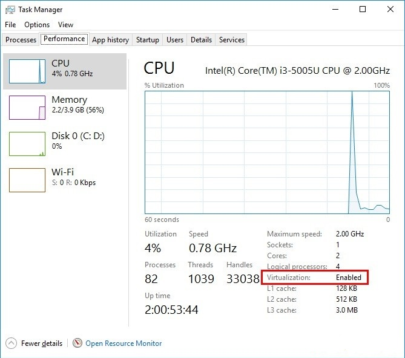
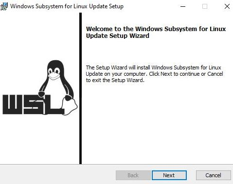
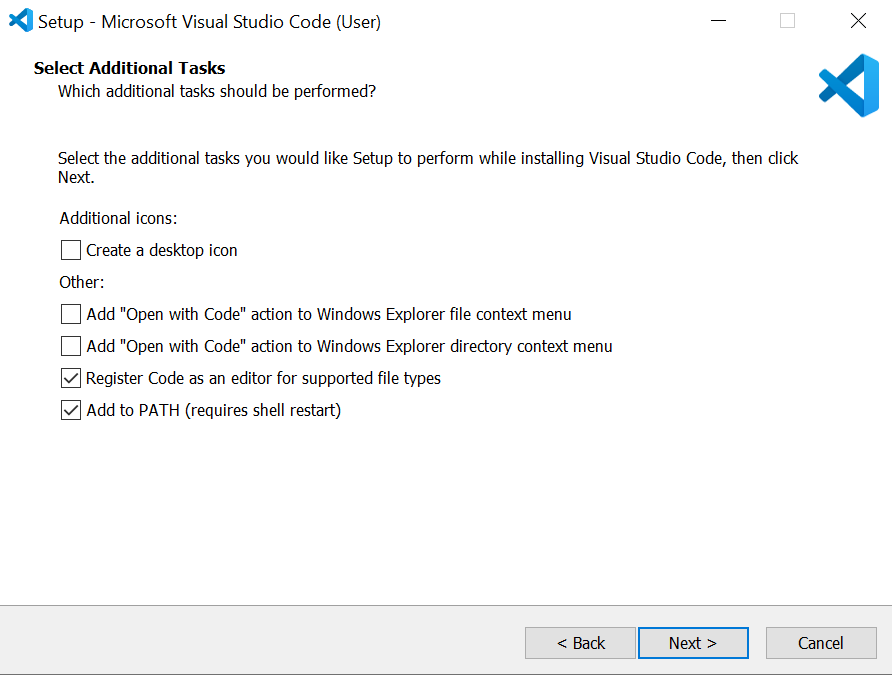
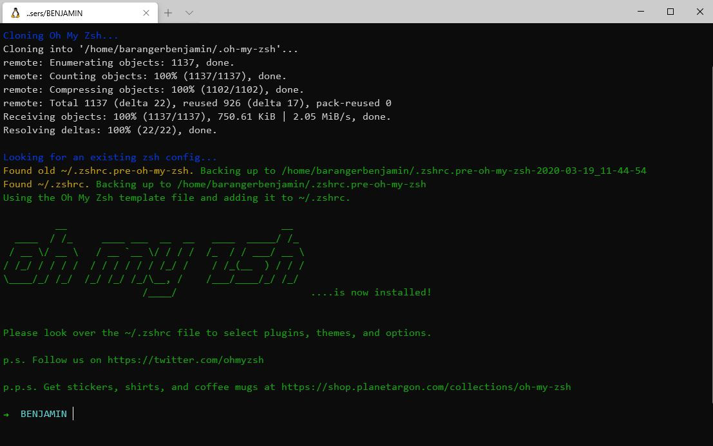
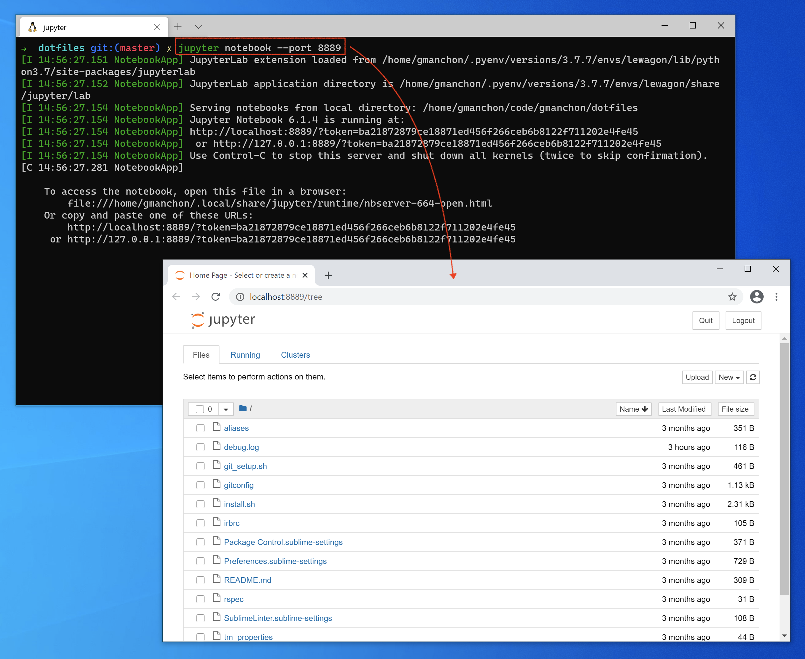
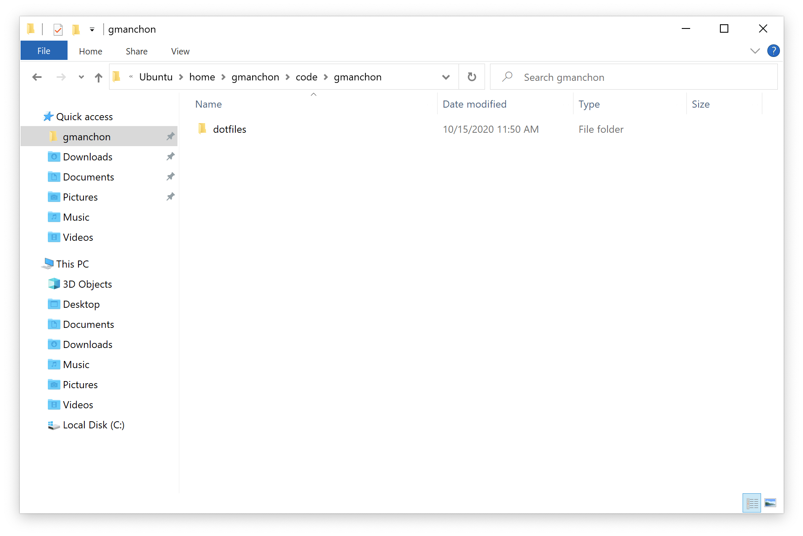
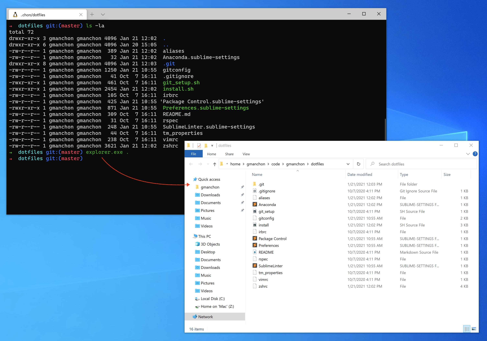
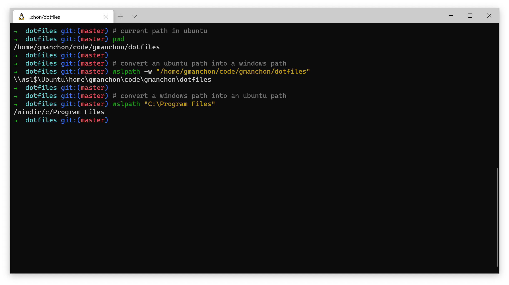

# Setup instructions

The following instructions will help you to get ready for [Le Wagon](http://www.lewagon.com) Data Science bootcamp:

- Grab a text editor
- Install a package manager
- Pimp your Terminal
- Setup git and GitHub
- Install remote tools
- Install [Python 3](https://www.python.org/) and packages to manage [Virtual Environments](https://docs.python.org/3/tutorial/venv.html)
- Install [Docker](https://docs.docker.com/get-docker/)
- Install Slack
- Onboard on **Kitt**, Le Wagon's pedagogic platform


## Prerequisites

Before we start, it is important you meet the following prerequisites to ensure the smooth running of the setup.
Take your time to read through everything and do not hesitate to ask for help if you feel stuck.

Ready? Let's go :sunglasses:


### Windows 10

For this setup, you need to be using the latest version of Windows.

This means that you need to be on **Windows 10**, with all the latest updates installed.

To check your Windows version:


- Press `Windows` + `R`
- Type  `winver`
- Press `Enter`

&nbsp;

&nbsp;&nbsp;&nbsp; :x: If it does not mention **Windows 10**, you cannot proceed with this setup — but do not panic! You can always upgrade to Windows 10!

&nbsp;&nbsp;&nbsp; :white_check_mark: If the first words of this window are **Windows 10** you're good to go! :muscle:


---

#### :wrench: Potential Fixes

<details>
  <summary>Upgrade to Windows 10</summary>

  &nbsp;
  - Download Windows 10 from [Microsoft](https://www.microsoft.com/software-download/windows10ISO)
  - Install it. It should take roughly an hour, but this is dependent on your computer
</details>

---


Once you're sure that you're using Windows 10, you will need to check that your computer has all the latest updates.


### Latest version of Windows

Open Windows Update:


- Press `Windows` + `R`
- Type  `ms-settings:windowsupdate`
- Press `Enter`
>
>
- Click on `Check updates`

&nbsp;

&nbsp;&nbsp;&nbsp; :x: If you have an error message about Windows not being able to apply updates, please **contact a teacher**.

&nbsp;&nbsp;&nbsp; :white_check_mark: If you have updates available please install them and repeat the process until it says that you are up to date :star:.


---

#### :wrench: Potential Fixes

<details>
  <summary>Activate Windows Update Service to fix Updates</summary>

  &nbsp;


  Some antiviruses and pieces of software deactivate the Update service we need, resulting in the error you see. Let's fix that!


  - Press `Windows` + `R`
  - Type  `services.msc`
  - Press `Enter`
  >
  >
  - Double Click `Windows Update Service`
  - Set its `Startup` to `Automatic`
  - Click on `Start`
  - Click on `Ok`

  Then let's try updates again!
</details>

---

### Minimum version

Some of the tools we need to install have been release with the `1903` version **or above** of Windows 10 so we need to make sure you have at least this one.


- Press `Windows` + `R`
- Type  `winver`
- Press `Enter`


Check the **Version number**:


&nbsp;&nbsp;&nbsp; :x: If it is below `1903`, just follow the [Latest version of Windows](#Latest-version-of-Windows) paragraph above to install the latest updates.

&nbsp;&nbsp;&nbsp; :white_check_mark: If it says at least `1903`, you are good to go! :sunglasses:


### Virtualization

We need to ensure that the Virtualization options are enabled in the BIOS of your computer.

For many computers, this is already the case. Let's check:


- Press `Windows` + `R`
- Type  `taskmgr`
- Press `Enter`
>
>
- Click on the `Performance` tab
- Click on `CPU`




&nbsp;

&nbsp;&nbsp;&nbsp; :x: If the line is missing or if it is disabled, please **contact a teacher before trying to activate the Virtualization**.

&nbsp;&nbsp;&nbsp; :white_check_mark: The status will be listed under the graph and will say "Virtualization: Enabled" if this tool is enabled.


---

#### :wrench: Potential Fixes

<details>
  <summary>Activate Virtualization</summary>

  &nbsp;


  We need to access the BIOS / UEFI of the computer to activate it.


  - Press `Windows + R`
  - Type  `shutdown.exe /r /o /t 1`
  - Press `Enter`
  >
  >
  - Wait for the computer to shutdown
  >
  >
  - Click on `Troubleshoot`
  - Click on `Advanced Options`
  - Click on `UEFI Firmware Settings`
  - Click on `Restart`


  You need to activate the virtualization option for your processor here:
  - Most of the time, in the advanced settings, the CPU settings, or the Northbridge settings
  - The option can be called differently according to your computer:
      - Intel: `Intel VT-x`, `Intel Virtualization Technology`, `Virtualization Extensions`, `Vanderpool`...
      - AMD: `SVM Mode` or `AMD-V`
  - Save the changes after activation and reboot the computer through the appropriate option
</details>

---


## GitHub account

Have you signed up to GitHub? If not, [do it right away](https://github.com/join).

:point_right: **[Upload a picture](https://github.com/settings/profile)** and put your name correctly on your GitHub account. This is important as we'll use an internal dashboard with your avatars. Please do this **now**, before you continue with this guide.


## Remote tools

To be able to interact when we are not in the same physical room, we will be using two tools:

### Zoom

⚠️ If you already have Zoom installed, please make sure that the version is at least **5.4**. Otherwise, you will not be able to use breakout rooms in order to work with your buddy.

Zoom is a video conferencing tool. To create an account and install the app, go to [https://zoom.us/download](https://zoom.us/download) and under **Zoom Client for Meetings** click the **Download** button. Open the file you have just downloaded. A progress bar will appear, then Zoom will start. Click on **Connection** and create an account with the **Sign Up Free** option:


Once connected, you should see:


You can close Zoom now.

### Teamviewer

For the most complicated problems, a teacher might have to take control of your computer. To be able to do this, we will need to use the Teamviewer tool. Go to the [Teamviewer download page](https://www.teamviewer.com/en/download). It should automatically detect your operating system. If it doesn't, choose your operating system from the list at the top of the page. Click on **Download Teamviewer** and open the file you just have downloaded. Leave the default settings as they are and click on **Accept**. A progress bar will appear, then Teamviewer will start when the installation is over. It should look like this:


This will only be used as last resort when debugging becomes too tricky through spoken word. Nobody will ever be able to take control of your screen without you knowing it :ok_hand:

You can close Teamviewer now.

If you are not familiar with video calls, here is a great [article](https://martinfowler.com/articles/effective-video-calls.html) full of good practices :camera: :microphone:


## Windows Subsystem for Linux
### Install WSL 1
WSL is the development environment we are using to run Ubuntu. You can learn more about WSL [here](https://docs.microsoft.com/en-us/windows/wsl/faq).

We will install WSL through the PowerShell Terminal:


:warning: In the following instruction, please be aware of the `Ctrl` + `Shift` + `Enter` key stroke to execute **Windows PowerShell** with administrator privileges instead of just clicking on `Ok`or pressing `Enter`.


- Press `Windows` + `R`
- Type  `powershell`
- Press `Ctrl` + `Shift` + `Enter`


:warning: You may have to accept the UAC confirmation about the privilege elevation.


&nbsp;
A blue terminal window will appear:


- Copy the following commands
- Paste them into the PowerShell window by right-clicking into it (`Ctrl` + `V` does not work here!)
- Run them by pressing `Enter`


&nbsp;
```powershell
Enable-WindowsOptionalFeature -Online -FeatureName Microsoft-Windows-Subsystem-Linux
```

```powershell
dism.exe /online /enable-feature /featurename:Microsoft-Windows-Subsystem-Linux /all /norestart
```

```powershell
dism.exe /online /enable-feature /featurename:VirtualMachinePlatform /all /norestart
```

&nbsp;


&nbsp;&nbsp;&nbsp; :x: If you encounter an error message (or if you see some text in red in the window), please **contact a teacher**!

&nbsp;&nbsp;&nbsp; :white_check_mark: When all three commands ran without any error, you can restart your computer.


### Upgrade to WSL 2
Once your computer has restarted, we need to download the WSL2 installer.


- Go to the [download page](https://aka.ms/wsl2kernel) and get the installer
- Click `Next`
- Click `Finish`



&nbsp;

&nbsp;&nbsp;&nbsp; :x: If you encounter the error `This update only applies to machines with the Windows Subsystem for Linux`, **right click** on the program and select `uninstall`; you shall be able to install it normally this time.

&nbsp;&nbsp;&nbsp; :white_check_mark: If everything is fine, we are ready to use WSL 2 instead of WSL 1!

### Make WSL 2 the default Windows Subsystem for Linux
Now that WSL 2 is installed, let's use it by default when we deal with WSL:


- Press `Windows` + `R`
- Type  `cmd`
- Press `Enter`


In the window which appears, type:

```bash
wsl --set-default-version 2
```

&nbsp;


&nbsp;&nbsp;&nbsp; :x: If the message you get talks about Virtualization, please **contact a teacher**

&nbsp;&nbsp;&nbsp; :white_check_mark: You can close this Command Prompt terminal; we are ready to install Ubuntu!


## Ubuntu
### Installation


- Click on `Start`
- Type  `Microsoft Store`
- Click on the Microsoft Windows Store in the list
>
>
- Search for `Ubuntu` in the search bar
- Select version without any number, just plain "Ubuntu"
>
>
- Click on `Install`


:warning: Don't install **Ubuntu 18.04 LTS** nor **Ubuntu 20.04**!

---

#### :wrench: Potential Fixes


<details>
  <summary>Uninstall wrong versions of Ubuntu</summary>

  &nbsp;


  To uninstall a wrong version of Ubuntu, you just have to go to the Installed Program List of Windows 10:


  - Press `Windows` + `R`
  - Type  `ms-settings:appsfeatures`
  - Press `Enter`


  Find the right software to uninstall and click on the uninstall button.
</details>

---


&nbsp;
Once the installation is done, the `Install` button becomes a `Launch` button:


- Click on `Launch`


At first launch, you will be asked some information:
- Choose a **username**:
    - one word
    - lowercase
    - no special characters
    - for example: `lewagon` or your `firstname`
- Choose a **password**
- Confirm your password


:warning: When typing the password, nothing will not appear on the screen — there will be no familiar typing indicator even though your keystrokes are being registered!

:warning: This is a security feature to mask not only your password as a whole but also its length!


&nbsp;


&nbsp;&nbsp;&nbsp; :white_check_mark: The installation should be complete; you can close the Ubuntu window now that it is installed on your computer.

### Check the WSL version of Ubuntu


- Press `Windows` + `R`
- Type  `cmd`
- Press `Enter`


Type the following command:

```bash
wsl -l -v
```

&nbsp;

&nbsp;&nbsp;&nbsp; :x: If the version of Ubuntu WSL is 1, we will need to convert it to version 2.

&nbsp;&nbsp;&nbsp; :white_check_mark: If the version of Ubuntu WSL is 2, you are ready to install VS Code!


---

#### :wrench: Potential Fixes


<details>
  <summary>Convert Ubuntu WSL V1 to V2</summary>


  &nbsp;


  In the Command Prompt window, type:

  ```bash
  wsl --set-version Ubuntu 2
  ```

  &nbsp;

  &nbsp;&nbsp;&nbsp; :white_check_mark: After a few seconds, you should get the following message: `The conversion is complete`.

  &nbsp;&nbsp;&nbsp; :x: If it does not work, we need to be sure that Ubuntu files are not compressed.
</details>

<details>
  <summary>Check for Uncompressed Files</summary>


  &nbsp;
  - Press `Windows` + `R`
  - Type  `%localappdata%\Packages`
  - Press `Enter`
  >
  >
  - Open the folder named `CanonicalGroupLimited.UbuntuonWindows...`
  - Right Click on the `LocalState` folder
  - Click on `Properties`
  - Click on `Advanced`
  - Make sure that the option `Compress content` is **not** ticked, then click on `Ok`.


  Apply changes to this folder only and try to convert the Ubuntu WSL version again.


  &nbsp;&nbsp;&nbsp; :x: If the conversion still does not work, please **contact a teacher**.
</details>

---


(You can now close this Command Prompt window.)


## Visual Studio Code

We use Visual Code Studio for writing code on Windows, because it integrates nicely with the Ubuntu terminal.

For this integration to work, you need to uninstall other code editor, like for example SublimeText, as their WSL integration interferes with the integration of VS Code.

### Installation
- Go to the [Visual Studio Code page](https://code.visualstudio.com/download)
- Choose the Windows version of VS Code


The tool should start to download automatically.

- Open the file you have just downloaded.
- Install it with a few options:
    - Register VS Code as an editor for supported file types
    - Let the other options as they are



### Connecting VS Code to Ubuntu

- Launch VS Code a first time, then:
    - Pin it to the taskbar; you will be using it a lot!
    - You should have a frame at the bottom-right corner of VS Code saying it detects WSL
    - Accept the installation of the WSL extension for VS Code

:warning: This extension is mandatory for you to be able to work with VS Code!

### VS Code Shortcuts

In VS Code:

- Click on `File`
- Click on `Preferences`
- Click on `Keymaps`
- Click on `Sublime Text Keymap and Settings Importer`
- Click on `Install`


### VS Code Extensions

Let's gain time now and add other extensions that will be helpful during your Bootcamp.

For each of these extensions:

- On the web page, click on `install`
- In the browser, accept to use VS Code to install the extension
- In VS Code, click on `install`

**Extensions**
- [Sublime Text Keymap](https://marketplace.visualstudio.com/items?itemName=ms-vscode.sublime-keybindings)
- [Rails Snippets](https://marketplace.visualstudio.com/items?itemName=hridoy.rails-snippets)
- [ESLint](https://marketplace.visualstudio.com/items?itemName=dbaeumer.vscode-eslint)
- [ERB Helper Tags](https://marketplace.visualstudio.com/items?itemName=rayhanw.erb-helpers)
- [ruby-rubocop](https://marketplace.visualstudio.com/items?itemName=misogi.ruby-rubocop)

### VS Code Settings
- Press `Ctrl` + `,` on your keyboard to open the settings
- In the search bar, type `emmet`
- Click on the first **`Edit in settings.json`** link

Paste the following just before the last `}`:

```bash
"emmet.triggerExpansionOnTab": true,
"emmet.includeLanguages": {
  "erb": "html"
},
```

It should look like this:


:warning: You should add a comma if there is none after the **`]`** like line 26 in the image above ☝️

:warning: Don't forget to save those changes!

### Final Check

To make sure everything works fine, close VS Code, then open your Ubuntu terminal:

- Press `Windows` + `R`
- Type  `ubuntu`
- Press `Enter`


In Ubuntu, let's try to launch VS Code:

```bash
code
```

&nbsp;

&nbsp;&nbsp;&nbsp; :x: If Visual Studio Code does not open, please **contact a teacher**

&nbsp;&nbsp;&nbsp; :white_check_mark: If Visual Studio Code opens, your code editor is ready! :muscle:


### Final Check

To make sure everything works fine, close VS Code, then open your Ubuntu terminal:

- Press `Windows` + `R`
- Type  `ubuntu`
- Press `Enter`

In Ubuntu, let's try to launch VS Code:

### VS Code Shortcuts

In VS Code:

- Click on `File`
- Click on `Preferences`
- Click on `Keymaps`
- Click on `Sublime Text Keymap and Settings Importer`
- Click on `Install`

### VS Code Extensions

Let's gain time now and add other extensions that will be helpful during your Bootcamp.

For each of these extensions:

- On the web page, click on `install`
- In the browser, accept to use VS Code to install the extension
- In VS Code, click on `install`

**Extensions**
- [Sublime Text Keymap](https://marketplace.visualstudio.com/items?itemName=ms-vscode.sublime-keybindings)
- [Rails Snippets](https://marketplace.visualstudio.com/items?itemName=hridoy.rails-snippets)
- [ESLint](https://marketplace.visualstudio.com/items?itemName=dbaeumer.vscode-eslint)
- [ERB Helper Tags](https://marketplace.visualstudio.com/items?itemName=rayhanw.erb-helpers)
- [ruby-rubocop](https://marketplace.visualstudio.com/items?itemName=misogi.ruby-rubocop)

### VS Code Settings
- Press `Ctrl` + `,` on your keyboard to open the settings
- In the search bar, type `emmet`
- Click on the first **`Edit in settings.json`** link

Paste the following just before the last `}`:

```bash
"emmet.triggerExpansionOnTab": true,
"emmet.includeLanguages": {
  "erb": "html"
},
```

It should look like this:


:warning: You should add a comma if there is none after the **`]`** like line 26 in the image above ☝️
:warning: Don't forget to save those changes!

### Final Check

To make sure everything works fine, close VS Code, then open your Ubuntu Terminal:

- Press `Windows` + `R`
- Type  `ubuntu`
- Press `Enter`

In Ubuntu, let's try to launch VS Code:

```bash
code
```

&nbsp;

&nbsp;&nbsp;&nbsp; :x: If Visual Studio Code does not open, please **contact a teacher**

&nbsp;&nbsp;&nbsp; :white_check_mark: If Visual Studio Code opens, your code editor is ready! :muscle:


## Windows Terminal

The standard Ubuntu terminal is a very crude way of using Ubuntu; let's use a real modern terminal!

### Installation

We first need to install **Windows Terminal** from the Microsoft Windows Store:


- Click on `Start`
- Type  `Microsoft Store`
- Click on the Microsoft Windows Store in the list
>
>
- Search for `Windows Terminal` in the search bar
>
>
- Click on `Install`


Once the installation is done, the `Install` button becomes a `Launch` button:


- Click on `Launch`
- Right Click on the icon in the taskbar
- Choose to pin the app to the bar


This terminal allows you to open multiple terminal sessions, including **PowerShell**, **Command Prompt** and **Ubuntu** that you installed earlier.

This terminal has tabs: you can choose to open a new terminal tab clicking on the **down arrow** / **v-shape** next to the current one.

:warning: From now on, we will only need **Ubuntu** as a terminal.

### Ubuntu as the default terminal

Let's make Ubuntu the default terminal of your Windows Terminal application.


- Press `Ctrl` + `,`


It should open the settings:


We have put in red the part we will use or change.


&nbsp;


First, let us ask Ubuntu to start directly inside your Ubuntu Home Directory instead of the Windows one:


- Locate the `"name": "Ubuntu",`
- Add the following line after it:

```bash
"startingDirectory": "//wsl$/Ubuntu/home/the-username-you-chose-at-the-ubuntu-install",
```

:warning: Do not forget the comma at the end of the line!

:warning: Do not forget to replace the username by your own in the line above!


&nbsp;

Now, let us ask Windows Terminal to start directly an Ubuntu Terminal when launched:


- Locate the `"guid"` for Ubuntu
- Copy the value between `{` and `}`
- Locate the `"defaultProfile"`
- Replace the value between `{` and `}` with what you copied from above
- Add a comma after the `defaultProfile` so you can add the `"multiLinePasteWarning": false,` option as well. This will disable an annoying warning every time you want to paste multiple lines to your terminal.

You can refer to the screenshot above to get a sense of how it should look like. Don't hesitate to ask for help.


:warning: Do not forget to save those changes!

&nbsp;

&nbsp;&nbsp;&nbsp; :white_check_mark: Voilà, your **Windows Terminal** is setup! :confetti_ball:
&nbsp;&nbsp;&nbsp;&nbsp;&nbsp;&nbsp;&nbsp;&nbsp;&nbsp;&nbsp; **From now on, every time we will refer to the terminal or the console it will be this one.**


## Git

To install `git`:


- Open an Ubuntu terminal.
- Copy and paste the following lines:


```bash
sudo apt update
```
```bash
sudo apt install -y git apt-transport-https unzip gnome-terminal
````

Let's now install GitHub [official CLI](https://cli.github.com) (Command Line Interface) with the following commands:

```bash
sudo apt-key adv --keyserver hkp://keyserver.ubuntu.com:80 --recv-key C99B11DEB97541F0
sudo apt-add-repository https://cli.github.com/packages
sudo apt update
sudo apt install -y gh
```

To check that `gh` has been successfully installed on your machine, you can run:

```bash
gh --version
```

If you don't get a prompt saying `gh version X.Y.Z (YYYY-MM-DD)` with at least version 1.4, please refer to [the documentation](https://github.com/cli/cli/blob/trunk/docs/install_linux.md#official-sources) where they list some troubleshooting information. In doubt, ask a TA.


## Oh-my-zsh - Fancy your Terminal

We will use the shell named `zsh` instead of `bash`, the default one.

```bash
# it will ask for your session password
sudo apt install -y zsh curl vim imagemagick jq
```
```bash
sh -c "$(curl -fsSL https://raw.githubusercontent.com/robbyrussell/oh-my-zsh/master/tools/install.sh)"
```

At then end, your terminal should look like this:




&nbsp;

&nbsp;&nbsp;&nbsp; :x: If it does not, please **contact a teacher**.

&nbsp;&nbsp;&nbsp; :white_check_mark: If everything is correct, let's configure GitHub!

---

#### :wrench: Potential Fixes

<details>
  <summary>Error: "chsh command unsuccessful. Change your default shell manually."</summary>

  &nbsp;


  You probably typed the wrong password when asked.
  Starting the script again will not work as it will try to create a configuration folder that now already exists!

  We need to remove it first:

  ```bash
  rm -rf ~/.oh-my-zsh
  ```


  Then let's try again!
</details>

---


## GitHub

### Already configured?

Then try this command:

```bash
ssh -T git@github.com
```

If it returns the following:

```bash
# Hi <your_github_nickname>! You've successfully authenticated, but GitHub does not provide shell access
```

It means `git` is **already** configured on your laptop, you can skip the section below!

### Configuring your first SSH key

We need to generate SSH keys which are going to be used by GitHub and Heroku
to authenticate you. Think of it as a way to log in, but different from the
well known username/password couple. If you already generated keys
that you already use with other services, you can skip this step.

Open a terminal and type this, replacing the email with **yours** (the
same one you used to create your GitHub account). It will prompt
for information. Just press enter until it asks for a **passphrase**.

```bash
mkdir -p ~/.ssh && ssh-keygen -t ed25519 -o -a 100 -f ~/.ssh/id_ed25519 -C "TYPE_YOUR_EMAIL@HERE.com"
```

**NB:** when asked for a passphrase, put something you want (and that you'll remember),
it's a password to protect your private key stored on your hard drive. You'll type,
nothing will show up on the screen, **that's normal**. Just type the passphrase,
and when you're done, press `Enter`.

Then you need to give your **public** key to GitHub. Run:

```bash
cat ~/.ssh/id_ed25519.pub
```

It will prompt on the screen the content of the `id_ed25519.pub` file. Copy that text,
then go to [github.com/settings/ssh](https://github.com/settings/ssh). Click on
**Add SSH key**, fill in the Title with your computer name, and paste the **Key**.
Finish by clicking on the **Add key** green button.

To check that this step is completed, in the terminal run this. You will be
prompted a warning, type `yes` then `Enter`.

```bash
ssh -T git@github.com
```

If you see something like this, you're done!

```bash
# Hi <your_github_nickname>! You've successfully authenticated, but GitHub does not provide shell access
```

Don't be in a rush, take time to [read this article](http://sebastien.saunier.me/blog/2015/05/10/github-public-key-authentication.html) to get a better
understanding of what those keys are used for.


## Linking your default browser to Ubuntu
To be sure that you can interact with your browser installed on Windows from your new Ubuntu terminal, we need to set it as your default browser there.

⚠️ You need to execute at least one of the following commands below:


<details>
  <summary>Google Chrome as your default browser</summary>

  &nbsp;


  Run the command:

  ```bash
    ls /mnt/c/Program\ Files\ \(x86\)/Google/Chrome/Application/chrome.exe
  ```

  If you get an error like `ls: cannot access...` Run the following command:

  ```bash
    echo "export BROWSER='\"/mnt/c/Program Files/Google/Chrome/Application/chrome.exe\"'" >> ~/.zshrc
  ```

  Else run:

  ```bash
    echo "export BROWSER='\"/mnt/c/Program Files (x86)/Google/Chrome/Application/chrome.exe\"'" >> ~/.zshrc
  ```

</details>


<details>
  <summary>Mozilla Firefox as your default browser</summary>

  &nbsp;


  Run the command:

  ```bash
    ls /mnt/c/Program\ Files\ \(x86\)/Mozilla\ Firefox/firefox.exe
  ```

  If you get an error like `ls: cannot access...` Run the following command:

  ```bash
    echo "export BROWSER='\"/mnt/c/Program Files/Mozilla Firefox/firefox.exe\"'" >> ~/.zshrc
  ```

  Else run:

  ```bash
    echo "export BROWSER='\"/mnt/c/Program Files (x86)/Mozilla Firefox/firefox.exe\"'" >> ~/.zshrc
  ```
</details>

<details>
  <summary>Microsoft Edge as your default browser</summary>

  &nbsp;


  Run the command:


  ```bash
  echo "export BROWSER='\"/mnt/c/Program Files (x86)/Microsoft/Edge/Application/msedge.exe\"'" >> ~/.zshrc
  ```
</details>


👉 Restart your terminal

Then please make sure that the following command returns "Browser defined 👌":

```bash
[ -z "$BROWSER" ] && echo "ERROR: please define a BROWSER environment variable ⚠️" || echo "Browser defined 👌"
```

If it does not, choose a browser in the list above and execute the corresponding command.


## GitHub CLI

CLI is the acronym of [Command-line Interface](https://en.wikipedia.org/wiki/Command-line_interface).

In this section, we will install [GitHub CLI](https://cli.github.com/) to perform useful actions with GitHub data directly from the Terminal.

It should already be installed on your laptop from the previous commands. First you need to **login**:

```bash
gh auth login -s 'user:email' -w
```

You will get the following output:

```bash
- Logging into github.com

! First copy your one-time code: 0EF9-D015
- Press Enter to open github.com in your browser...
```

Select and copy the code (`0EF9-D015` in the example), then type `Enter`. Your browser will open and ask you to authorize GitHub CLI to use your GitHub account. Accept and wait a bit. Come back to the terminal, type `Enter` again, and that should be it :tada:

To check that you are properly connected, type:

```bash
gh auth status
```

If you get `Logged in to github.com as <YOUR USERNAME> `, then all good. If not, **ask a teacher**.

Then run the following configuration line:

```bash
gh config set git_protocol ssh
```

Finally, create a [gist](https://docs.github.com/en/free-pro-team@latest/github/writing-on-github/editing-and-sharing-content-with-gists) to make sure `gh` is working:

```bash
echo "Hello [Le Wagon](https://www.lewagon.com) :wave:" | gh gist create -d "Starting my coding journey..." -f "SETUP_DAY.md" -p -w
```

This line should open your browser on the newly created gist page. See, we've just created a [**Markdown**](https://guides.github.com/features/mastering-markdown/) file!


## Dotfiles

There are three options, choose _one_:

### 1. I already attended Web Development (FullStack) bootcamp at Le Wagon _on the same laptop_

This means that you already forked the GitHub repo `lewagon/dotfiles`, but at that time the configuration was maybe not ready for the new Data Science bootcamp.

Open your terminal and go to your `dotfiles` project:

```bash
cd ~/code/<YOUR_GITHUB_NICKNAME>/dotfiles
vsc # Open it in VScode
```

In VScode, open the `zshrc` file. Replace its content with the [newest version](https://raw.githubusercontent.com/lewagon/dotfiles/master/zshrc) of that file that we provide. Save to disk.

Back to the terminal, run a `git diff` and ask a TA to come and check about this configuration change. You should see stuff about Python and `pyenv`.

Once this is good, commit and push your changes:

```bash
git add zshrc
git commit -m "Update zshrc for Data Science bootcamp"
git push origin master
```

### 2. I did not attend the Web Dev bootcamp at Le Wagon

Hackers love to refine and polish their shell and tools. We'll start with a great default configuration provided by [Le Wagon](http://github.com/lewagon/dotfiles), stored on GitHub. As your configuration is personal, you need your own repository storing it, so you first need to fork it to your GitHub account.

:arrow_right: [Click here to **fork**](https://github.com/lewagon/dotfiles/fork) the `lewagon/dotfiles` repository to your account (you'll need to click again on your picture to confirm _where_ you do the fork).

Forking means that it will create a new repo in your GitHub account, identical to the original one. You'll have a new repository on your GitHub account, `your_github_username/dotfiles`. We need to fork because each of you will need to put specific information (e.g. your name) in those
files.

Now this is done, go on with the following instructions under in the `3. ` section right below. :warning: DO NOT SKIP IT!

### 3. I already attended Web Development (FullStack) bootcamp at Le Wagon _but I have a new laptop_

Open your terminal and run the following command:

```bash
export GITHUB_USERNAME=`gh api user | jq -r '.login'`
echo $GITHUB_USERNAME
```

You should see your GitHub username printed. If it's not the case, **stop here** and ask for help.
There seems to be a problem with the previous step (`gh auth`).

Time to fork the repo and clone it on your laptop:

```bash
mkdir -p ~/code/$GITHUB_USERNAME && cd $_
gh repo fork lewagon/dotfiles --clone
```

Run the `dotfiles` installer.

```bash
cd ~/code/$GITHUB_USERNAME/dotfiles && zsh install.sh
```

Check the emails registered with your GitHub Account. You'll need to pick one
at the next step:

```bash
gh api user/emails | jq -r '.[].email'
```

Run the git installer:

```bash
cd ~/code/$GITHUB_USERNAME/dotfiles && zsh git_setup.sh
```

:point_up: This will **prompt** you for your name (`FirstName LastName`) and your email. Be careful
you **need** to put one of the email listed above thanks to the previous `gh api ...` command. If you
don't do that, Kitt won't be able to track your progress.

Please now **quit** all your opened terminal windows.


&nbsp;


Let us open the `~/.zshrc` profile file in Visual Studio Code and change slightly its content:

```bash
code ~/.zshrc
```

- Locate the line `# Actually load Oh-My-Zsh`
- **Above it** write the following line:

```bash
ZSH_DISABLE_COMPFIX=true
```

&nbsp;


You don't want to be asked for your passphrase every time you communicate with a distant repository. So you need to add the plugin `ssh-agent` to `oh my zsh`:


- Spot the line starting with `plugins=`
- Add `ssh-agent` to the plugins list.

The list should look like:

```
plugins=(gitfast last-working-dir common-aliases sublime zsh-syntax-highlighting history-substring-search pyenv ssh-agent)
```

&nbsp;


&nbsp;&nbsp;&nbsp; :white_check_mark: Save the `.zshrc` file with `Ctrl` + `S` and close Visual Studio Code.


## Installing Python (with [`pyenv`](https://github.com/pyenv/pyenv))

Ubuntu comes with an outdated version of Python that we don't want to use. You might already have installed Anaconda or something else to tinker with Python and Data Science packages. All of this does not really matter as we are going to do a professional setup of Python where you'll be able to switch which version you want to use whenever you type `python` in the terminal.

First let's install `pyenv` with the following Terminal command:

```bash
git clone https://github.com/pyenv/pyenv.git ~/.pyenv
```

Then quit **all your opened terminal windows** (Cmd + Q) and restart one. Ignore the `pyenv: no such command 'virtualenv-init' for now`.

Let's install some [dependencies](https://github.com/pyenv/pyenv/wiki/common-build-problems#prerequisites) needed to build Python from `pyenv`:

```bash
sudo apt install -y make build-essential libssl-dev zlib1g-dev libbz2-dev \
  libreadline-dev libsqlite3-dev llvm libncurses5-dev libncursesw5-dev \
  xz-utils tk-dev libffi-dev liblzma-dev python-openssl
```

Let's install the [latest stable version of Python](https://www.python.org/doc/versions/) supported by Le Wagon's curriculum:

```bash
pyenv install 3.8.6
```

This command might take a while, this is perfectly normal. Don't hesitate to help other students seated next to you!

OK once this command is complete, we are going to tell the system to use this version of Python **by default**. This is done with:

```bash
pyenv global 3.8.6
```

Once again, quit **all your opened terminal windows** (Cmd + Q) and restart one.

To check if this worked, run `python --version`. If you see `3.8.6`, perfect! If not, ask a TA that will help you debug the problem thanks to `pyenv versions` and `type -a python` (`python` should be using the `.pyenv/shims` version first).


## Python Virtual Environment

Before we start installing relevant Python packages, we will isolate the setup for the Bootcamp into a **dedicated** virtual environment. We will use a `pyenv` plugin called [`pyenv-virtualenv`](https://github.com/pyenv/pyenv-virtualenv).

First let's install this plugin:

```bash
git clone https://github.com/pyenv/pyenv-virtualenv.git $(pyenv root)/plugins/pyenv-virtualenv
```

Once again, quit **all your opened terminal windows** (Cmd + Q) and restart one.

Let's create the virtual environment we are going to use during the whole bootcamp:

```bash
pyenv virtualenv 3.8.6 lewagon
```

Let's now set the virtual environment with:

```bash
pyenv global lewagon
```

Great! Anytime we'll install Python package, we'll do it in that environment.


## Python packages

Now that we have a pristine `lewagon` virtual environment, it's time to install some packages in it.

First, let's upgrade `pip`, the tool to install Python Packages from [pypi.org](https://pypi.org). In the latest Ubuntu terminal where the virtualenv `lewagon` is activated, run:

```bash
pip install --upgrade pip
```

Then let's install some packages for the first weeks of the program:

```bash
pip install pytest pylint ipdb pyyaml nbresult autopep8 flake8 lxml
```

Let's install packages useful for API & Scraping:

```bash
pip install requests bs4
```

Finally, more Data Science packages:

```bash
pip install jupyterlab pandas matplotlib seaborn plotly scikit-learn tensorflow
```

### Packages check up

TODO: check pip freeze with a routine

That's it for today. During the bootcamp, we'll install more packages but we'll talk about that later.


## Configuring Jupyter Notebook to open in your browser

Let's generate the configuration file for **Jupyter Notebook**...

``` bash
jupyter notebook --generate-config
```

⚠️ Please copy the path returned by the previous command.

We will now edit the generated Jupyter configuration file:

``` bash
code $HOME/.jupyter/jupyter_notebook_config.py
```

Locate the following line in the configuration file:

``` python
# c.NotebookApp.use_redirect_file = True
```

And replace it with this one:

``` python
c.NotebookApp.use_redirect_file = False
```

Let's try to run Jupyter:

``` bash
jupyter notebook
```

This command should have opened a Jupyter page in your browser:



If it is not the case, please call a TA.

To stop the Jupyter server in the terminal, press Ctrl + C, enter y, then press Enter.


## `jupyter` notebook extensions

Pimp your `jupyter` notebooks with awesome extensions:

```bash
# install nbextensions
pip install jupyter_contrib_nbextensions
pip install jupyter_nbextensions_configurator
jupyter contrib nbextension install --user
jupyter nbextension enable toc2/main
jupyter nbextension enable collapsible_headings/main
jupyter nbextension enable spellchecker/main
jupyter nbextension enable code_prettify/
jupyter nbextension enable autopep8
jupyter nbextension enable varInspector/main
```

### `jupyter` check up

Check you can launch a notebook server on your machine:
```bash
jupyter notebook
```
Your web browser should open on a `jupyter` window:


Click on `New`:


A tab should open on a new notebook:


### `nbextensions` check up

Perform a sanity check for `jupyter notebooks nbextensions`. Click on `Nbextensions`:


Check that the `nbextensions` are enabled:


You can close your web browser then terminate the jupyter server with `CTRL` + `C`.


## Ubuntu File System

### Exchange files between Windows and Ubuntu

We need an easy way to transfer files from Windows to Ubuntu and vice versa.

In order to do that, we will create shortcuts to Ubuntu directories in the Windows **File Explorer**.



Here are the steps:

- Open an Ubuntu terminal
- Open the Windows File Explorer (or use the shortcut Win + E)
- In the Address Bar, enter `\\wsl$\` (or `\\wsl$\Ubuntu` if it does not work)
- You now have acces to the Ubuntu file system
- Dive into the Ubuntu file system in order to look for directories of interest
- Drag the desired folders into the Address Bar in order to create shortcuts


### Open the Windows File Explorer from the Ubuntu terminal

Another option to move files around is to open the Windows **File Explorer** from the Ubuntu terminal.

In order to do that:

- Open an Ubuntu terminal
- Go to the directory you wish to explore
- Run the `explorer.exe .` command (alternatively, use `wslview .`)
- If you get an input output error message, run `wsl --shutdown` in a Windows PowerShell and reopen an Ubuntu terminal



### Find your way in the Ubuntu File System

You might want to figure out the exact location of a Windows directory in the Ubuntu file system, or the other way around.

In order to convert a Windows path to and from an Ubuntu path:

- Open an Ubuntu terminal
- Use the `wslpath "C:\Program Files"` command in order to translate a Windows path into an Ubuntu path
- Use the `wslpath -w "/home"` command in order to translate an Ubuntu path into a Windows path
- In particular, the `wslpath -w $(pwd)` command returns the Windows path of the current Ubuntu directory




## Visual C++ Redistributable

Some Python packages require a compiler to function properly. Let's install one:

[For x64 systems](https://aka.ms/vs/16/release/vc_redist.x64.exe)


[For x86 systems](https://aka.ms/vs/16/release/vc_redist.x86.exe)

If you're unsure about which system you're using please ask a teacher.


## Docker 🐋

Docker is an open platform for developing, shipping, and running applications.

_if you already have Docker installed on your machine please update with the latest version_

### Install Docker

Go to [Docker install documentation](https://docs.docker.com/engine/install/ubuntu/#install-using-the-repository).

Then follow the tutorial instructions to install Docker **using the repository**. There are 2 steps:

- SET UP THE REPOSITORY
- INSTALL DOCKER ENGINE

Once done, you should be able to run:

```bash
sudo service docker start
```

```bash
sudo docker run hello-world
```

The following message should print:


```bash
sudo service docker stop
```


## Ubuntu inotify

Ubuntu is always tracking changes in your folders and to do this it uses inotify.
By default the Ubuntu limit is set to 8192 files monitored.

As programming involves a lot of files, we need to raise this limit.
In your terminal run:

```bash
echo fs.inotify.max_user_watches=524288 | sudo tee -a /etc/sysctl.conf && sudo sysctl -p
```


## Extra

### Install video codec H264

On our pedagogical platform (Kitt, you'll soon discover it!), we have some videos. By default Firefox on Linux cannot play them as they use an unsupported codec (H264). To get those videos working for you, you need to run this:

```bash
sudo apt install libavcodec-extra -y
```

### Install useful terminal tools

`tree` is a nice tool to visualize a directory tree inside the terminal:

`ncdu` is a text-based interface disk utility.

`htop` is an interactive process viewer.

`tig` is a text-mode interface for `git`.

```bash
sudo apt install tree ncdu htop tig
```


## Alumni
:warning: If you have received an email from Le Wagon inviting you to sign up on Kitt (our learning platform), you can safely skip this step. Instead, please follow the instructions in the email you received if you haven't done so already.
If you are unsure about what to do, you can follow [this link](https://kitt.lewagon.com/). If you are already logged in, you can safely skip this section. If you are not logged in, click on `Enter Kitt as a Student`. If you manage to login, you can safely skip this step. Otherwise ask a teacher whether you should have received an email or follow the instructions below.

Register as a Wagon alumni by going to [kitt.lewagon.com/onboarding](http://kitt.lewagon.com/onboarding). Select your batch, sign in with GitHub and enter all your information.

Your teacher will then validate that you are indeed part of the batch. You can ask him to do it as soon as you completed the registration form.

Once the teacher has approved your profile, go to your email inbox. You should have 2 emails:

- One from Slack, inviting you to the Le Wagon Alumni slack community (where you'll chat with your buddies and all the previous alumni). Click on **Join** and fill the information.
- One from GitHub, inviting you to `lewagon` team. **Accept it** otherwise you won't be able to access the lecture slides.


# Slack

Download and install the Slack app from [slack.com](https://slack.com/downloads/windows), and install it.

Launch the app and sign in to `lewagon-alumni` organization.

Make sure you upload a picture there.

You can also sign in to Slack on your iPhone or Android device!

The idea is that you'll have Slack open all day, so that you can share useful links / ask for help / decide where to go to lunch / etc.

Enjoy your ride with Le Wagon :)


## (Bonus) Kata

If you are done with your setup, please ask around if some classmates need some help with theirs (macOS, Linux, Windows). We will have our first lectures at 2pm and will talk about the Setup you just did + onboard you on Kitt.

If you don't have a lot of experience with `git` and GitHub, please [(re-)watch this workshop](https://www.youtube.com/watch?v=Z9fIBT2NBGY) (`1.25` playback speed is fine).

If you do, then you can wait for the first lecture working on this [Tic-Tac-Toe Kata](https://www.codewars.com/kata/5b817c2a0ce070ace8002be0/train/python)


