# Setup instructions

The following instructions will help you to get ready for [Le Wagon](http://www.lewagon.com) Data Bootcamp:

- Install remote tools
- Install and setup the terminal
- Install a text editor
- Install and setup `git` and GitHub
- Install [Python 3](https://www.python.org/) and packages to manage [Virtual Environments](https://docs.python.org/3/tutorial/venv.html)
- Install [Docker](https://docs.docker.com/get-docker/)
- Install Slack
- Onboard on **Kitt**, Le Wagon's pedagogic platform


## Remote tools

To be able to interact when you are not on site, we will be using two tools.

### Zoom

Zoom is a video conferencing tool, go to [Zoom page](https://zoom.us/download) and under **Zoom Client for Meetings** hit the **Download** button. Open the file you have just downloaded. A progress bar will appear, then Zoom will start. Click on **Connexion** and create an account with the **Sign Up Free** option:


Once connected, you should see:


You can close Zoom now :wink:

### Teamviewer

For the most complicated problems, a teacher might have to take control of your computer. To be able to do this, we will need to use the Teamviewer tool. Go to the [Teamviewer download page](https://www.teamviewer.com/en/download). It should automatically detect your operating system. if it doesn't, choose your operating system from the list at the top of the page. Click on **Download Teamviewer**. Open the file you just have downloaded. Leave the default settings and click on **Accept**. A progress bar will appear, then Teamviewer will start when the installation is over. It should look like this:


This will only be used as last resort when debugging becomes too tricky orally. Nobody will ever be able to take control of your screen without you knowing it :ok_hand:

You can close Teamviewer now :wink:

If you are not familiar with video calls, here is a great [article](https://martinfowler.com/articles/effective-video-calls.html) article full of good practices :camera: :microphone:


## Sublime Text 3 - Your text editor

A text editor is one of the most important tools of a developer.

Go to [Sublime's website](https://www.sublimetext.com/) and click on "Download for Windows"


A little popup will appear at the bottom of the page, click on "Run".


A new window will appear, it is the Sublime Text 3 installer. Click on "Next".


Click on "Next".


Click on "Install".


Click on "Finish".


## Github account

Have you signed up to Github? If not [do it right away](https://github.com/join).

:point_right: **[Upload a picture](https://github.com/settings/profile)** and put your name correctly on your Github account. This is important as we'll use an internal dashboard with your avatars. please do it **now**.


## Git Bash

Git bash will allow you to run some linux command on Windows.
Go to [Git-SCM](https://git-scm.com/download/wim) and click on "Windows".


Click on "Next".


Leave the default installation folder and click on "Next".


Leave the default components qnd click on "Next".


Leave the default name "Git" and click on "Next".


In the dropdown, choose your new favorite text editor "Use Sublime Text as Git's default editor" and click on "Next".


Click on "Next".


Once again, click on "Next".


Guess what? Click on "Next" :)


"Nexttttt!".


Again!


And again! Just kidding, click on "Install".


Lastly, check "Launch Git Bash", uncheck "View Releave Notes" and click on "Finish".


The Git Bash terminal should open.


## Github

We need to generate SSH keys which are going to be used by Github
to authenticate you. Think of it as a way to log in, but different from the
well known username/password couple. If you already generated keys
that you already use with other services, you can skip this step.

Open Git Bash  and copy-paste the lines below, replacing the email with **yours** (the same one you used to create your GitHub account).

```bash
mkdir -p $HOME/.ssh
ssh-keygen -t ed25519 -o -a 100 -C "TYPE_YOUR_EMAIL@HERE.com"
```

It will prompt for information. Just press enter (to tell it to use the default values) until it asks for a **passphrase**.

**NB:** when asked for a passphrase, put something you want (and that you'll remember),
it's a password to protect your private key stored on your hard drive. You'll type,
nothing will show up on the screen, **that's normal**. Type the passphrase,
and when you're done, press `Enter`.

Then you need to give your **public** key to GitHub. Run:

```bash
cat ~/.ssh/id_ed25519.pub
```

It will prompt on the screen the content of the `id_ed25519.pub` file. Copy that text (`Ctrl` + `Shift` + `C`),
then go to [github.com/settings/ssh](https://github.com/settings/ssh). Click on
**Add SSH key**, fill in the Title with your computer name, and paste the **Key**.
Finish by clicking on the **Add key** green button.

To check that this step is completed, in the Git Bash terminal run this. You will be
prompted a warning, type `yes` then `Enter`.

```bash
ssh -T git@github.com
```

If you see something like this, you're done!

```bash
# Hi --------! You've successfully authenticated, but GitHub does not provide shell access
```

We need to set your `git` identity. In bash, type the following (**Don't blindly copy/paste it!**)

```bash
git config --global user.email "YOUR_GITHUB_EMAIL@HERE.COM"
git config --global user.name "YOUR NAME"
```


## Install Python

Download [Python 3.7.7 Installer](https://www.python.org/ftp/python/3.7.7/python-3.7.7-amd64.exe) and execute it.

:warning: Do not forget to tick the "Add Python to PATH" option.

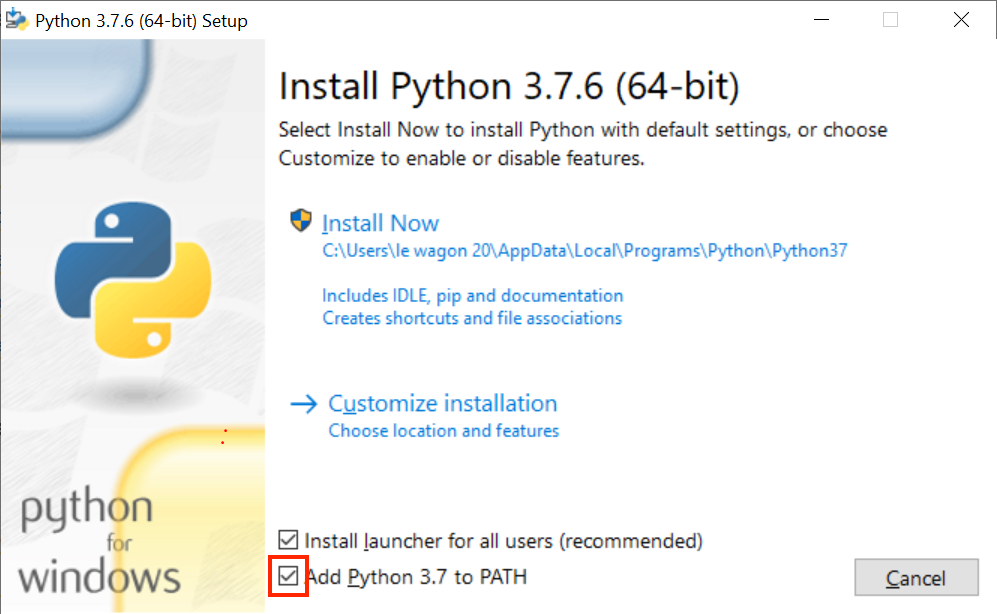

Launch Git Bash. Type the following command:

```bash
python --version
```

You should see 3.7.7! You can also check that it's coming from `AppData/Local/Programs` with:

```bash
type -a python
```

---

:thinking: Why aren't we using the latest `3.8+` Python version? Good question! For now, Python 3.8 is [not supported by Jupyter](https://github.com/jupyterlab/jupyterlab/issues/6487) which is a key tool in Data Science. Let's be patient and be thankful of the open-source community work!

---


## Virtual Environment

Now we will install the `virtualenv` package:

```bash
pip install virtualenv
```

Let's create a new virtual environment for the whole bootcamp:

```bash
mkdir -p ~/.venvs && cd ~/.venvs
python -m venv lewagon
```

Awesome! The virtual environment has been created.

### Git Bash configuration

Launch a Git Bash window and type the following commands:

```bash
curl -Ls https://raw.githubusercontent.com/lewagon/data-setup/master/.bash_profile > ~/.bash_profile
mkdir -p ~/.config/git
curl -Ls https://raw.githubusercontent.com/lewagon/data-setup/master/git-prompt.sh > ~/.config/git/git-prompt.sh
```

Restart Git Bash. You should have the `lewagon` virtual environment activated (as shown on the left of your prompt)


## Python packages

Now that we have a pristine `lewagon` virtual environment, it's time to install some packages in it.

First, let's upgrade `pip`, the tool to install Python Packages from [pypi.org](https://pypi.org). In the latest Powershell window where the virtualenv `lewagon` is activated, run:

```bash
pip install --upgrade pip
```

Then let's install some packages for the first weeks of the program:

```bash
pip install pytest pylint ipdb
```

Let's install packages useful for API & Scraping:

```bash
pip install requests bs4
```

Finally, more Data Science packages:

```bash
pip install jupyterlab pandas matplotlib seaborn plotly scikit-learn
```

That's it for today. During the bootcamp, we'll install more packages but we'll talk about that later.

If you want to check which packages (and which version of that package) you have installed


# Sublime Text 3 - Package

Let's go back to Sublime Text and install some packages that will help us to create better code.

Press the windows key + R at the same time to open the "Run" tool. Type the command:

```bash
%USERPROFILE%\AppData\Roaming\Sublime Text 3\Packages\User
```

Click on "OK"

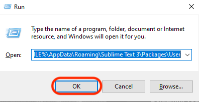

A new Explorer window should open, it should be empty. Right click and chose "Git Bash here".

A new Git Bash terminal will open. Please copy the following command:

```bash
curl -Ls https://raw.githubusercontent.com/lewagon/dotfiles/master/Preferences.sublime-settings > Preferences.sublime-settings
```

### Package install

Launch `Sublime Text 3`.

Install package controll via the Command Palette (`Ctrl` + `Shift` + `P`) and type `Install Package Control`. Type `Enter` and wait a few seconds. You should get an alert telling you package control has been successfully installed.

Now we can install the package `MagicPython`.<br>
You can install a package via the Command Palette (`Ctrl` + `Shift` + `P`) then type `Install package`,<br>
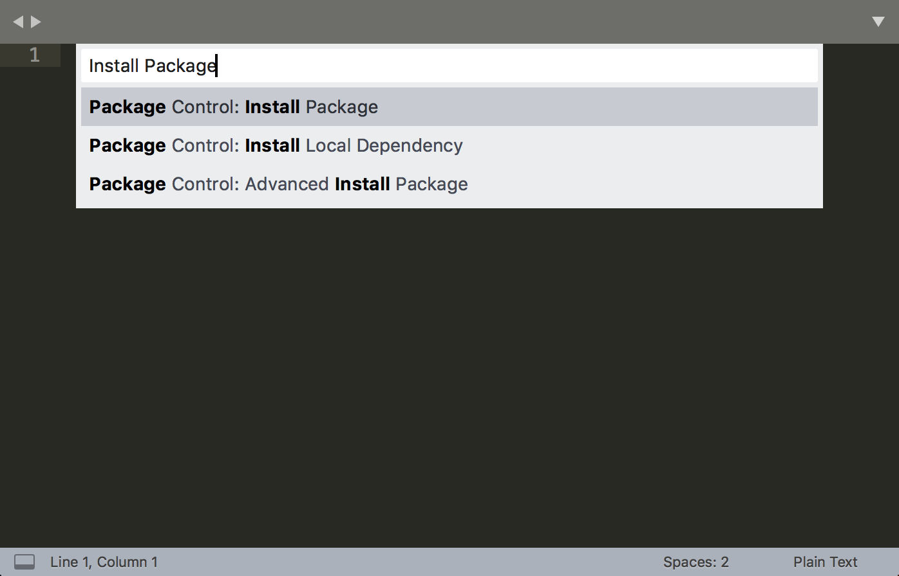

Then type the name of the package you want to install and press `Enter`.
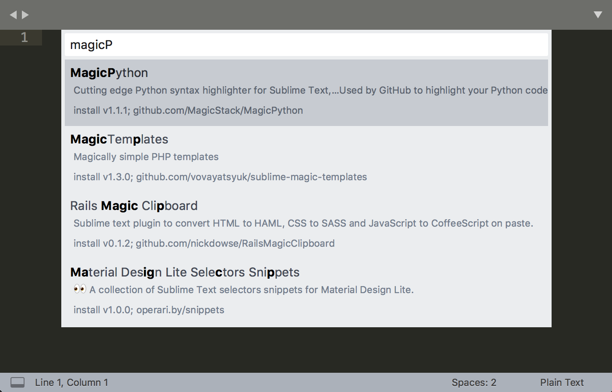


# Make

Make is a build automation tool that build executable.
Go to this [url](https://sourceforge.net/projects/ezwinports/files)
Locate "make-X.X.X-without-guile-w32-bin.zip" where X.X.X is a version (e.g 4.3.1)


Click on it. Your download should start shortly. A popup will appear at the bottom. Click on "Save".


When the download is done you will be prompted with another popup, click on "Open folder".


Right click on it and chose "Extract All".

Click on "Extract".


A new explorer window should open showing you the extracted folders.


Select all the folders and right click and choose "Copy".

Press the windows key + R at the same time to open the "Run" tool. Type the command
```bash
explorer.exe "C:\Program Files\Git\mingw64"
```

Click on "OK".


A new windows should open with folders already in it. Right click and chose "Paste". It will paste the folders you've extracted before into this folder. If it ask you for admin rights, press "Continue". Your folder should now look like this:


Restart a new Git Bash window and type the command:

```bash
make -v
```

You should get and answer like this:


If you don't, please ask a TA.


## Install useful extra tools

### Handle

Handle is an interactive process viewer for your terminal.

- Go to https://docs.microsoft.com/en-us/sysinternals/downloads/handle then click on `Download Handle`
- Open the archive _Handle.zip_
- Copy the _handle.exe_ file to _C:\WINDOWS\System32_
- Restart Git Bash then run:
```bash
handle -accepteula
```
And this one:
```bash
handle -p explorer.exe
```

You should get a long list of logs starting with:

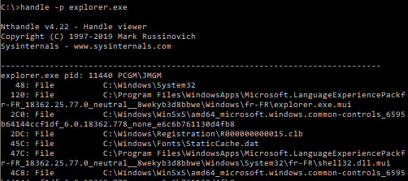

### Windows Directory Statistics

WinDirStat is a disk usage statistics viewer application.

- Go to https://windirstat.net/download.html then in the **List of official dowload mirrors**, click on **SourceForge**
- Save the executable file on your disk

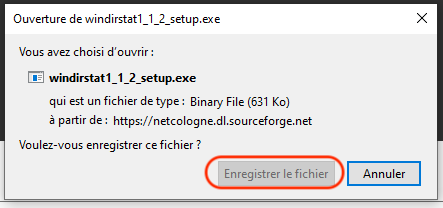

- Double-click on the file to install WinDirStat

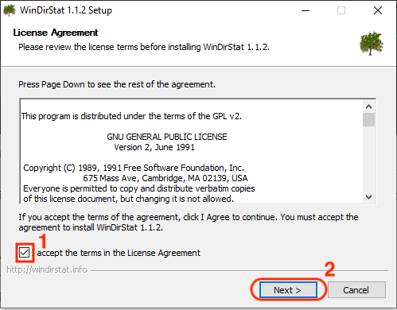

- **Accept** the terms of the licence then click **Next**

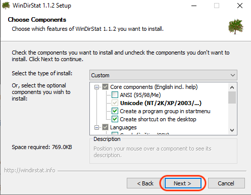

- Leave the default Components options then click **Next**

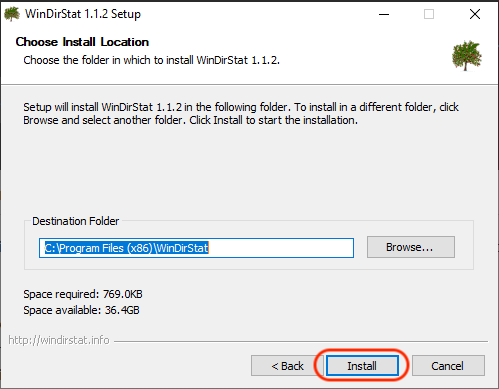

- Choose the destination folder then click **Install**

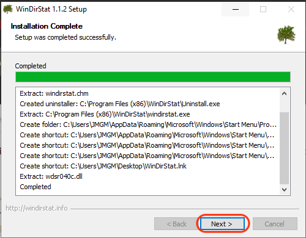

- When the installation has ended, click **Next** one last time!

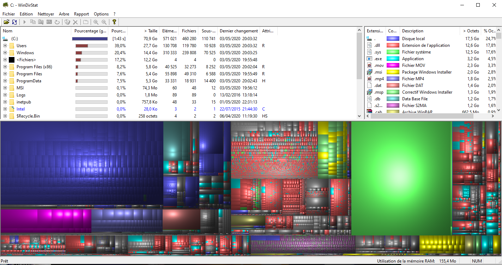

- You can perform a disk analysis on `C:/` to try WinDirStat, after a minute you should get this kind of result


## Docker 🐋

Docker is an open platform for developing, shipping, and running applications.

_if you already have Docker installed on your machine please update with the latest version_

### Install Docker

Go to [Docker](https://docs.docker.com/get-docker/) website and choose your operating system:


Then follow the setup instructions, you are going to install a desktop application.

Once done and launched, check Docker is up and running:

```bash
docker info
```

You should get:


## Alumni

Register as a Wagon alumni by going to [kitt.lewagon.com/onboarding](http://kitt.lewagon.com/onboarding). Select your batch, sign in with GitHub and enter all your information.

Your teacher will then validate that you are indeed part of the batch. You can ask him to do it as soon as you completed the registration form.

Once the teacher has approved your profile, go to your email inbox. You should have 2 emails:

- One from Slack, inviting you to the Le Wagon Alumni slack community (where you'll chat with your buddies and all the previous alumni). Click on **Join** and fill the information.
- One from GitHub, inviting you to `lewagon` team. **Accept it** otherwise you won't be able to access the lecture slides.


# Slack

Download and install the Slack app from [slack.com](https://slack.com/downloads/windows), and install it.

Launch the app and sign in to `lewagon-alumni` organization.

Make sure you upload a picture there.

You can also sign in to Slack on your iPhone or Android device!

The idea is that you'll have Slack open all day, so that you can share useful links / ask for help / decide where to go to lunch / etc.

Enjoy your ride with Le Wagon :)


## (Bonus) Kata

If you are done with your setup, please ask around if some classmates need some help with theirs (macOS, Linux, Windows). We will have our first lectures at 2pm and will talk about the Setup you just did + onboard you on Kitt.

If you don't have a lot of experience with `git` and GitHub, please [(re-)watch this workshop](https://www.youtube.com/watch?v=Z9fIBT2NBGY) (`1.25` playback speed is fine).

If you do, then you can wait for the first lecture working on this [Tic-Tac-Toe Kata](https://www.codewars.com/kata/5b817c2a0ce070ace8002be0/train/python)


