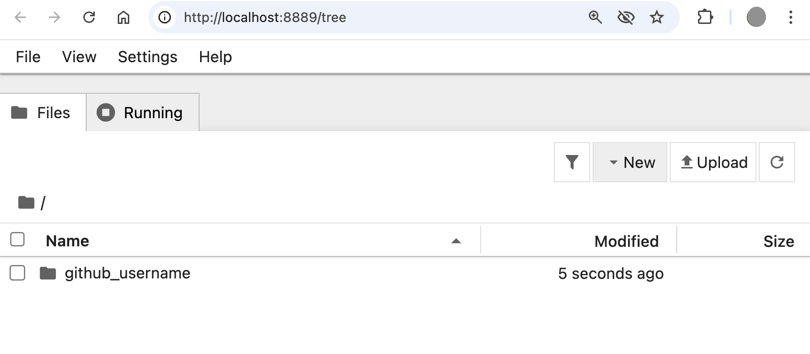

# Instrucciones para la configuración

Aquí abajo encontrarás las instrucciones para configurar tu computadora para [el curso de Data Science de Le Wagon](https://www.lewagon.com/data-science-course/full-time)

Por favor **léelas cuidadosamente y ejecuta todos los comandos en el siguiente orden**. Si tienes algún problema, no dudes en pedirle ayuda a una profesor :raising_hand:

¡Comencemos! :rocket:


## Zoom

Para poder interactuar cuando no estemos en el mismo lugar físico, usaremos [Zoom](https://zoom.us/), una herramienta de videoconferencia.

:warning: Si ya tienes Zoom instalado, por favor asegúrate de que por lo menos tienes versión **5.6**.

Ve a [zoom.us/download](https://zoom.us/download).

Haz clic en el botón **Download** debajo de **Zoom Client**.

Abre el archivo que acabas de descargar para instalar la aplicación.

Abre la aplicación Zoom.

Si ya tienes una cuenta Zoom, inicia sesión con tus credenciales.

Si no, haz clic en el enlace **Sign Up Free**, que significa registrarse gratuitamente:


Te redireccionarán a la página de Zoom para que completes un formulario.

Cuando termines, regresa a la aplicación Zoom e inicia sesión usando tus credenciales.

Deberías ver una pantalla como la siguiente:


Ya puedes cerrar la aplicación Zoom.


## Cuenta GitHub

쯏a tienes una cuenta GitHub? Si no es el caso, [ábrela ya](https://github.com/join).

:point_right: **[Sube una foto](https://github.com/settings/profile)** y escribe tu nombre correctamente en tu cuenta GitHub. Esto es importante porque nosotros usaremos un tablero de comando interno con tu avatar. Por favor hazlo **ahora** antes de dar un paso más en esta guía.


:point_right: **[Habilita la Autenticación de Dos Factores (2FA)](https://docs.github.com/en/authentication/securing-your-account-with-two-factor-authentication-2fa/configuring-two-factor-authentication#configuring-two-factor-authentication-using-text-messages)**. GitHub te enviará mensajes de texto con un código cuando intentes iniciar sesión. Esto es importante para la seguridad y también pronto será necesario para contribuir código en GitHub.


## Chips Apple Silicon

Si compraste tu computadora después de finales del 2020, es probable que tenga un nuevo chip Apple Silicon en lugar de un procesador Intel: descubrámoslo.

Abre una nueva ventana de la tarminal desde Aplicaciones > Utilidades o búscala con [Spotlight](https://support.apple.com/es-es/HT204014):


Copia y pega el siguiente comando en la terminal y presiona `Enter` para ejecutarlo.

``` bash
/bin/bash -c "$(curl -fsSL https://raw.githubusercontent.com/lewagon/setup/master/utils/macos_list_processor_type.sh)"
```

☝️ El resultado del comando debería indicar si tu computadora usa un chip Apple Silicon.

Si tu computadora usa **Apple Silicon**, expande el siguiente párrafo y ejecútalo. En caso contrario, ignóralo.

<details>
  <summary>👉&nbsp;&nbsp;Setup para Apple Silicon 👈</summary>

Quieres asegurarte que no estás usando Rosetta, que es una forma de usar tu Terminal como si tuvieras una computadora con Intel.

Abre la app Finder (o búscala con [Spotlight](https://support.apple.com/es-es/HT204014)).

Ve a Aplicaciones > Utilidades.

Ubica la app Terminal (selecciónala).

Presiona `Cmd` + `I` en la app Terminal, luego verifica que la caja "Abrir usando Rosetta" esté **desmarcada**.
</details>

🚨 Ten esto en mente. Deberás recordarlo más adelante en este setup si tu computadora usa un chip Apple Silicon o Intel.


## Cómo cerrar aplicaciones en una Mac correctamente

Hacer clic en círculo rojo en la esquina superior izquierda de la ventana de la aplicación en Mac **no la termina el proceso**, solo cierra una ventana activa. Hay dos alternativas para cerrar la aplicación _realmente_. Puedes presionar `Cmd + Q` cuando la misma está activa. La otra opción es ir a `APP_NAME` -> `Quit` en la barra del menú.


Durante esta configuración, se te pedirá **cerrar y abrir nuevamente** aplicaciones varias veces. Por favor asegúrate de hacerlo correctamente :pray:

## Herramientas de la Línea de Comando

Abre una nueva terminal, copia y pega el comando siguiente y presiona `Enter`:

```bash
xcode-select --install
```

Si obtienes el mensaje que te mostramos a continuación, puedes ignorar este paso e ir al siguiente.

```bash
# command line tools are already installed, use "Software Update" to install updates
```

Este mensaje significa que las herramientas de la línea de comando ya están instaladas y te pide que uses "Software Update" para instalar las actualizaciones. Si no recibes este mensaje, se abrirá una ventana preguntándote si quieres instalar algún programa: haz clic en "Install" y espera.


:heavy_check_mark: Si ves el mensaje "The software was installed", lo que significa que el programa se ha instalado, entonces todo está bien :+1:

:x: Si falla el comando `xcode-select --install` , intenta nuevamente: algunas veces los servidores de Apple se sobrecargan.

:x: Si ves el mensaje "Xcode is not currently available from the Software Update server", debes actualizar el catálogo de actualización de programas:

```bash
sudo softwareupdate --clear-catalog
```

Cuando termines eso, puedes intentar hacer la instalación nuevamente.


## Homebrew
### 1. Instálalo:
Si usas Mac tienes que instalar [Homebrew](http://brew.sh/) el cual es un sistema de gestión de paquetes.
Será necesario cuando tengamos que instalar algún programa.
Para instalarlo, abre tu Terminal y ejecuta lo siguiente:

```bash
/bin/bash -c "$(curl -fsSL https://raw.githubusercontent.com/Homebrew/install/HEAD/install.sh)"
```

Te pedirá tu confirmación (presiona `Enter`) y tu **contraseña de usuario macOS** (la que usas para [iniciar sesión](https://support.apple.com/en-gb/HT202860) cuando reinicias tu Macbook).
:warning: Cuando escribas tu contraseña en la Terminal, **no** la verás (sólo verás algo como `*****`). ¡Esto es **normal**! Simplemente escribe tu contraseña y confirma presionando `Enter`.

<details>
  <summary>🛠 Si aparece un <code>Error: Not a valid ref: refs/remotes/origin/master</code> </summary>


El error completo es el siguiente:

``` bash
Error: Not a valid ref: refs/remotes/origin/master :
fatal: ambiguous argument 'refs/remotes/origin/master': unknown revision or path not in the working tree.
```

Ejecuta los siguientes comandos para resolverlo:

``` bash
rm -fr $(brew --repo homebrew/core)  # because you can't `brew untap homebrew/core`
brew tap homebrew/core
```

</details>

Si ya tienes Homebrew, el sistema te lo dirá. No hay problema, así que puedes continuar.

### 2. Asegúrate de tener la versión más reciente:

```bash
brew update
```

<details>
  <summary>🛠 Si aparece un error <code>/usr/local must be writable</code> </summary>

Simplemente ejecuta lo siguiente:

``` bash
sudo chown -R $USER:admin /usr/local
brew update
```

</details>

### 3. Luego instala algunos programas útiles:

Ejecuta lo siguiente en la terminal (puedes copiar / pegar todas las líneas juntas una sola vez).

```bash
brew upgrade git         || brew install git
brew upgrade gh          || brew install gh
brew upgrade wget        || brew install wget
brew upgrade imagemagick || brew install imagemagick
brew upgrade jq          || brew install jq
brew upgrade openssl     || brew install openssl
brew upgrade tree        || brew install tree
brew upgrade ncdu        || brew install ncdu
brew upgrade xz          || brew install xz
brew upgrade readline    || brew install readline
```


## Chrome - tu navegador

Instala el navegador Google Chrome si no lo tienes todavía y configúralo como tu __navegador predeterminado__.

Sigue los pasos en el siguiente enlace :point_right: [Instalación de Google Chrome](https://support.google.com/chrome/answer/95346?co=GENIE.Platform%3DDesktop&hl=en-GB)

__쯇or qué Chrome?__

Lo recomendamos como navegador predeterminado porque es el más compatible con los tests y la ejecución de código. Además trabaja con Google Cloud Platform. Otra opción es Firefox. No recomendamos usar otros navegadores como Opera, Internet Explorer o Safari.


## Visual Studio Code

### Instalación

Instala el editor de texto [Visual Studio Code](https://code.visualstudio.com).

Copia (presionando `Cmd` + `C`) el comando de aquí abajo y luego pégalo en tu terminal (con `Cmd` + `V`):

```bash
brew install --cask visual-studio-code
```

Luego abre VS Code ejecutando el siguiente comando en tu terminal:

```bash
code
```

:heavy_check_mark: Si se acaba de abrir una ventana de VS Code, todo está bien y puedes continuar :+1:

:x: De lo contrario, por favor **contacta a un profesor**.


## Extensiones de VS Code

### Instalación

Instala algunas extensiones útiles para VS Code.

```bash
code --install-extension ms-vscode.sublime-keybindings
code --install-extension emmanuelbeziat.vscode-great-icons
code --install-extension MS-vsliveshare.vsliveshare
code --install-extension ms-python.python
code --install-extension KevinRose.vsc-python-indent
code --install-extension ms-python.vscode-pylance
code --install-extension ms-toolsai.jupyter
```

Aquí está la lista de las extensiones que estás instalando:
- [Sublime Text Keymap and Settings Importer](https://marketplace.visualstudio.com/items?itemName=ms-vscode.sublime-keybindings)
- [VSCode Great Icons](https://marketplace.visualstudio.com/items?itemName=emmanuelbeziat.vscode-great-icons)
- [Live Share](https://marketplace.visualstudio.com/items?itemName=MS-vsliveshare.vsliveshare)
- [Python](https://marketplace.visualstudio.com/items?itemName=ms-python.python)
- [Python Indent](https://marketplace.visualstudio.com/items?itemName=KevinRose.vsc-python-indent)
- [Pylance](https://marketplace.visualstudio.com/items?itemName=ms-python.vscode-pylance)
- [Jupyter](https://marketplace.visualstudio.com/items?itemName=ms-toolsai.jupyter)


### Configuración de Live Share

[Visual Studio Live Share](https://visualstudio.microsoft.com/services/live-share/) es una extensión de VS Code que te permite compartir el código en tu editor de texto para debugging y pair-programming: ¡Instalémoslo!

Abre VS Code desde tu terminal escribiendo `code` y presionando `Enter`.

Haz clic en la pequeña flecha de la parte inferior de la barra de la izquierda:


- Haz clic en el botón "Share". Luego en "GitHub (Inicia sesión usando tu cuenta GitHub)".
- Va a aparecer una ventana emergente pidiéndote que inicies sesión con GitHub: Haz clic en "Allow".
- Te redireccionarán a una página GitHub en tu navegador pidiéndote que autorices Visual Studio Code: Haz clic en "Continue" y luego en "Authorize github".
- Es posible que VS Code muestre más ventanas emergentess: Ciérralas haciendo clic en "OK".

Eso es todo. ¡Ya puedes continuar!


## Oh-my-zsh

Instalemos el plugin `zsh` [Oh My Zsh](https://ohmyz.sh/).

Ejecuta este comando en la terminal:

```bash
sh -c "$(curl -fsSL https://raw.github.com/ohmyzsh/ohmyzsh/master/tools/install.sh)"
```

Si te preguntan "Do you want to change your default shell to zsh?", presiona `Y`

Cuando termines, tu terminal debería lucir así:


:heavy_check_mark: Si es el caso, puedes continuar :+1:

:x: Si no, por favor **pídele ayuda a un profesor**.


## direnv

[direnv](https://direnv.net/) es una extensión del shell. Facilita trabajar con variables de entorno por proyecto, lo cual será útil para customizar el comportamiento de tu código.

``` bash
brew install direnv
echo 'eval "$(direnv hook zsh)"' >> ~/.zshrc
```


## GitHub CLI

CLI es una abreviación de [Command-line Interface](https://en.wikipedia.org/wiki/Command-line_interface) que significa interfaz de línea de comando.

En esta sección usaremos [GitHub CLI](https://cli.github.com/) para interactuar directamente con GitHub desde la terminal.

Ya debería haberse instalado en tu computadora con los comandos que ejecutaste anteriormente.

Lo primero que hay que hacer para **iniciar sesión** es copiar y pegar el comando siguiente en tu terminal:

:warning: **NO edites el `email`**

```bash
gh auth login -s 'user:email' -w
```

gh le hará algunas preguntas:

`What is your preferred protocol for Git operations?` Con las flechas, elige `SSH` y presiona `Enter`. SSH es un protocolo para iniciar la sesión utilizando claves SSH en lugar de la famosa pareja nombre de usuario y contraseña.

`Generate a new SSH key to add to your GitHub account?` Presiona `Enter` para pedirle a gh que genere las claves SSH por ti.

Si ya tienes claves SSH, verás en su lugar `Upload your SSH public key to your GitHub account?`Con las flechas, selecciona la ruta de tu archivo de clave pública y pulsa `Intro`.

`Enter a passphrase for your new SSH key (Optional)`. Pon algo que quieras y que recuerdes. Es una contraseña para proteger tu private key que está almacenada en tu disco duro. Luego presiona `Enter`.

`Title for your SSH key`. Puede dejarlo en la propuesta "GitHub CLI", presiona `Enter`.

Obtendrás el siguiente resultado:

```bash
! First copy your one-time code: 0EF9-D015
- Press Enter to open github.com in your browser...
```

Selecciona y copia el código (`0EF9-D015` en el ejemplo) y luego presiona `Enter`.

Tu navegador se abrirá y te pedirá que autorices GitHub CLI para usar tu cuenta GitHub. Acepta y espera un poco.

Regresa a la terminal, presiona `Enter` nuevamente y listo. Eso es todo.

Para verificar que están conectado correctamente, escribe lo siguiente:

```bash
gh auth status
```

:heavy_check_mark: Si obtienes este mensaje: `Logged in to github.com as <YOUR USERNAME> `, significa que todo está bien :+1:

:x: De lo contrario, **contacta a un profesor**.


## Dotfiles

Hay tres opciones, escoge **una**:

<details>
    <summary>
        <strong>Ya hice el bootcamp de Web Development (FullStack) de Le Wagon <em>en la misma laptop</em></strong>
    </summary>

Esto significa que ya has hecho el fork del repositorio GitHub `lewagon/dotfiles` pero tal vez la configuración para el nuevo bootcamp de Data Science no estaba lista en ese momento.

Abre tu terminal y ve a tu proyecto `dotfiles`:

```bash
cd ~/code/<YOUR_GITHUB_NICKNAME>/dotfiles
code . # Open it in VS Code
```

En VS Codeabre  el archivo `zshrc`. Reemplaza su contenido con la [versión más reciente](https://raw.githubusercontent.com/lewagon/dotfiles/master/zshrc) de ese archivo que te suministramos. Luego guárdalo en el disco.

Regresa a la terminal y ejecuta un `git diff` y pídele a un TA que venga y verifique este cambio de configuración. Debería ver cosas de Python y `pyenv`.

Cuando el TA termine de hacer la verificación, haz un commit y haz el push de tus cambios:

```bash
git add zshrc
git commit -m "Update zshrc for Data Science bootcamp"
git push origin master
```

</details>

O


<details>
    <summary>
        <strong>No he hecho el bootcamp de Web Development (FullStack) de Le Wagon</strong>
    </summary>

Los hackers aman mejorar sus shells y sus herramientas. Comenzaremos con una configuración por defecto genial proporcionada por [Le Wagon](http://github.com/lewagon/dotfiles) y almacenada en GitHub. Tu configuración es personal, así que necesitas tu propio repositorio para almacenarla. Primero tienes que hacer el fork del repositorio en tu cuenta GitHub.

:arrow_right: [Haz clic aquí para hacer el **fork**](https://github.com/lewagon/dotfiles/fork) del repositorio `lewagon/dotfiles` a tu cuenta (deberás hacer clic nuevamente en tu foto para confirmar _dónde_ harás el fork).

Hacer un fork significa que crearás un nuevo repositorio en tu cuenta GitHub idéntico al original. Tendrás un nuevo repositorio en tu cuenta GitHub, `your_github_username/dotfiles`. El fork es necesario porque cada uno de ustedes necesitará poner información específica (e.g. tu nombre) en esos archivos.


Abre tu terminal y ejecuta el comando siguiente:

```bash
export GITHUB_USERNAME=`gh api user | jq -r '.login'`
echo $GITHUB_USERNAME
```

Deberías ver tu usuario GitHub. Si no es así, **no hagas más nada** y pide ayuda.
Parece que hay un problema con el paso anterior (`gh auth`).

Es hora de hacer el fork del repositorio y clonarlo en tu laptop:

```bash
mkdir -p ~/code/$GITHUB_USERNAME && cd $_
gh repo fork lewagon/dotfiles --clone
```

Ejecuta el instalador de `dotfiles`.

```bash
cd ~/code/$GITHUB_USERNAME/dotfiles && zsh install.sh
```

Verifica los emails registrados en tu cuenta GitHub. Deberás seleccionar uno de ellos en el próximo paso:

```bash
gh api user/emails | jq -r '.[].email'
```

Ejecuta el instalador de git:

```bash
cd ~/code/$GITHUB_USERNAME/dotfiles && zsh git_setup.sh
```

:point_up: Esto te **guiará** con tu nombre (`FirstName LastName`) y con tu email.
:warning: Cuidado, **debes** poner uno de los emails de la lista de arriba que te suministra el comando `gh api ...` usado anteriormente. Si haces eso, Kitt no podrá hacerle seguimiento a tu progreso. Cualquier correo que elijas se mostrará **públicamente** en internet. 💡 Selecciona la dirección `@users.noreply.github.com` si no quieres que tu correo electrónico aparezca en los repositorios públicos a los que puedas contribuir.

Ahora **cierra** todas las ventanas de tu terminal que tengas abiertas por favor.
</details>


OR

<details>
    <summary>
        <strong>IYa hice el bootcamp de Web Development (FullStack) de Le Wagon <em>pero tengo una nueva laptop</em></strong>
    </summary>


Abre tu terminal y ejecuta el comando siguiente:

```bash
export GITHUB_USERNAME=`gh api user | jq -r '.login'`
echo $GITHUB_USERNAME
```

Deberías ver tu usuario GitHub. Si no es así, **no hagas más nada** y pide ayuda.
Parece que hay un problema con el paso anterior (`gh auth`).

Es hora de hacer el fork del repositorio y clonarlo en tu laptop:

```bash
mkdir -p ~/code/$GITHUB_USERNAME && cd $_
gh repo fork lewagon/dotfiles --clone
```

Ejecuta el instalador de `dotfiles`.

```bash
cd ~/code/$GITHUB_USERNAME/dotfiles && zsh install.sh
```

Verifica los emails registrados en tu cuenta GitHub. Deberás seleccionar uno de ellos en el próximo paso:

```bash
gh api user/emails | jq -r '.[].email'
```

Ejecuta el instalador de git:

```bash
cd ~/code/$GITHUB_USERNAME/dotfiles && zsh git_setup.sh
```

:point_up: Esto te **guiará** con tu nombre (`FirstName LastName`) y con tu email.
:warning: Cuidado, **debes** poner uno de los emails de la lista de arriba que te suministra el comando `gh api ...` usado anteriormente. Si haces eso, Kitt no podrá hacerle seguimiento a tu progreso. Cualquier correo que elijas se mostrará **públicamente** en internet. 💡 Selecciona la dirección `@users.noreply.github.com` si no quieres que tu correo electrónico aparezca en los repositorios públicos a los que puedas contribuir.

Ahora **cierra** todas las ventanas de tu terminal que tengas abiertas por favor.
</details>


## Instalando Python (con [`pyenv`](https://github.com/pyenv/pyenv))

### Desinstalar `conda`

Como estamos utilizando `pyenv` para instalar y gestionar la versión de Python, necesitamos desinstalar [`conda`](https://docs.conda.io/projects/conda/en/latest/), otro gestor de paquetes que podrías tener en tu computadora si previamente instalaste [Anaconda](https://www.anaconda.com/). De esta forma, evitaremos problemas con Python más adelante.

Chequea si tienes `conda` instalado en tu computadora:

```bash
conda list
```
Si aparece `zsh: command not found: conda`, puedes **saltear** la desinstalación de `conda` e ir directo a la sección de **Instalar pre-requisitos**.

<details>
    <summary markdown='span'>Instrucciones de desinstalación <code>conda</code></summary>

- Instala el paquete Anaconda-Clean desde tu terminal y comienza la limpieza
```bash
conda install anaconda-clean
anaconda-clean --yes
```
- Remueve todos los directorios de Anaconda
```bash
rm -rf ~/anaconda2
rm -rf ~/anaconda3
rm -rf ~/.anaconda_backup
rm -rf ~/opt
```
- Elimina el directorio Anaconda de tu `.bash_profile`
    - Abre el archivo con `code ~/.bash_profile`
    - Si el archivo abre, busca la línea que coincida con el siguiente patrón `export PATH="/path/to/anaconda3/bin:$PATH"` y eliminala
    - Guarda el archivo con `CMD` + `s`
- Reinicia la terminal con `exec zsh`
- Remueve la inicializaciópn de Anaconda de tu `.zshrc`:
    - Abre el archivo con `code ~/.zshrc` 
    - Remueve las líneas de código desde `>>> conda initialize >>>` hasta `<<< conda initialize <<<`
</details>


### Instalar pre-requisitos

Antes de instalar Python, por favor verifica la versión de tu extensión `xz` con:

```bash
brew info xz
```

Debe ser superior a `5.2.0`. **Si no es el caso**, debes ejecutar lo siguiente:

```bash
sudo rm -rf /usr/local/opt/xz
brew upgrade
brew install xz
```

Luego ejecuta:

```bash
brew install readline
```

### Instala `pyenv`

macOS viene con una versión vieja de Python que no queremos usar. Tal vez ya hayas instalado Anaconda u otro programa para utilizar Python y paquetes de Ciencia de Datos. Si es así, no pasa nada ya que haremos una configuración profesional de Python que te permitirá cambiar de versión cuando quieras al escribir `python` en la terminal.

Primero instala `pyenv` con el siguiente comando en la Terminal:

```bash
brew install pyenv
exec zsh
```

### Instala Python

Si tu computadora tiene un procesador **Apple Silicon** (M1, M2, entre otros), expande el párrafo de abajo y sigue las indicaciones. En caso contrario, ignóralo.

<details>
  <summary>👉&nbsp;&nbsp;Setup para Apple Silicon 👈</summary>

Necesitamos agregar las siguientes variables de entorno para instalar python:

``` bash
export LDFLAGS="-L/opt/homebrew/lib"; export CPPFLAGS="-I/opt/homebrew/include"
```
</details>


Instala la [última versión estable de Python](https://www.python.org/doc/versions/) aceptada en el currículum de Le Wagon:

```bash
pyenv install 3.10.6
```

Este comando puede tomar un tiempo en ejecutarse. Esto es completamente normal. ¡No dudes en ayudar a los estudiantes que estén sentados cerca de ti!

<details>
  <summary>🛠 Resolución de problemas</summary>

Si aparece un error durante la instalación de Python con `pyenv` y relacionada con `zlib`:

```txt
zipimport.ZipImportError: can't decompress data; zlib not available
```

Instala `zlib` con lo siguiente:

```bash
brew install zlib
export LDFLAGS="-L/usr/local/opt/zlib/lib"
export CPPFLAGS="-I/usr/local/opt/zlib/include"
```

Luego trata de instalar Python nuevamente:

```bash
pyenv install 3.10.6
```

Es posible que aparezca otro error relacionado con `bzip2`. Esto lo puedes ignorar y continuar al paso siguiente.

</details>
<br>

OK. Cuando este comando termine de ejecutarse, le diremos al sistema que use esta versión de Python **por defecto**. Esto se hace con:

```bash
pyenv global 3.10.6
exec zsh
```

Para verificar si esto ha funcionado, ejecuta `python --version`. Si ves `3.10.6`, ¡todo está bien! Si no, pídele ayuda a un TA para resolver el problema por medio `pyenv versions` y `type -a python` (`python` debería estar usando la versión `.pyenv/shims` de primero).


## Entorno Virtual de Python

Antes de instalar paquetes de Python, aislaremos la configuración del Bootcamp en un entorno virtual **dedicado**. Usaremos un plugin `pyenv` llamado [`pyenv-virtualenv`](https://github.com/pyenv/pyenv-virtualenv).

Primero instala este plugin:

```bash
git clone https://github.com/pyenv/pyenv-virtualenv.git $(pyenv root)/plugins/pyenv-virtualenv
exec zsh
```

Crea el entorno virtual que usaremos durante todo el bootcamp:

```bash
pyenv virtualenv 3.10.6 lewagon
```

Define el entorno virtual con lo siguiente:

```bash
pyenv global lewagon
```

¡Genial! Ahora cada vez que queramos instalar un paquete Python, lo haremos en ese entorno.


## Paquetes de Python

Ahora que tenemos el ambiente virtual de `lewagon` adecuado, es hora de instalarle algunos paquetes.

Primero, actualiza `pip`, la herramienta para instalar Paquetes Python desde [pypi.org](https://pypi.org). Ejecuta lo siguiente en la última terminal donde esté activado el virtualenv de `lewagon`:

```bash
pip install --upgrade pip
```

Ahora instala algunos paquetes para las primeras semanas del programa:

Si tu computadora usa **Apple Silicon**, expande el párrafo de abajo y léelo. Si no es el caso, ignóralo.

<details>
  <summary>👉&nbsp;&nbsp;Configuración para Apple Silicon 👈</summary>

``` bash
pip install -r https://raw.githubusercontent.com/lewagon/data-setup/master/specs/releases/apple_silicon.txt
```
</details>

Si tu computadora usa **Apple Intel**, expande el párrafo de abajo y léelo. Si no es el caso, ignóralo.

<details>
  <summary>👉&nbsp;&nbsp;Configuración para Apple Intel 👈</summary>

``` bash
pip install -r https://raw.githubusercontent.com/lewagon/data-setup/master/specs/releases/apple_intel.txt
```
</details>


## Extensiones de `jupyter` notebook

Mejora tu `jupyter` notebooks con extensiones increíbles:

```bash
# install nbextensions
jupyter contrib nbextension install --user
jupyter nbextension enable toc2/main
jupyter nbextension enable collapsible_headings/main
jupyter nbextension enable spellchecker/main
jupyter nbextension enable code_prettify/code_prettify
```

### CSS personalizado

Mejora la visualización del [elemento `details` para revelación de información](https://developer.mozilla.org/en-US/docs/Web/HTML/Element/details) en tus notebooks.

Abre `custom/custom.css` en el directorio config:
```bash
cd $(jupyter --config-dir)
mkdir -p custom
touch custom/custom.css
code custom/custom.css
```
Edita `custom.css` con la siguiente información:

```css
summary {
    cursor: pointer;
    display:list-item;
}
summary::marker {
    font-size: 1em;
}
```

Puedes cerrar VS Code.

### Chequeo de `jupyter`

Reinicia tu terminal:

```bash
exec zsh
```

Ahora verifica que puedas iniciar un servidor de notebook en tu máquina:

```bash
jupyter notebook
```

Tu navegador web debería abrir en una ventana `jupyter`:



Haz clic en `New`:


Debería abrirse una pestaña en un nuevo notebook:


### Chequeo de `nbextensions`

Haz una revisión de las `jupyter notebooks nbextensions`. Haz clic en `Nbextensions`:


Deselecciona _"disable configuration for nbextensions without explicit compatibility"_. Esto significa deshabilitar la configuración de nbextensions sin compatibilidad explícita. Luego verifica que _al menos_ las `nbextensions` marcadas en rojo estén habilitadas:


Puedes cerrar tu navegador web y luego cerrar el servidor jupyter con `CTRL` + `C`.


### Chqueo de la configuración de Python

Verifica tu versión de Python con los siguientes comandos:
```bash
zsh -c "$(curl -fsSL https://raw.githubusercontent.com/lewagon/data-setup/master/checks/python_checker.sh)" 3.10.6
```

Ejecuta el comando siguiente para verificar que hayas instalado los paquetes requeridos correctamente:
```bash
zsh -c "$(curl -fsSL https://raw.githubusercontent.com/lewagon/data-setup/master/checks/pip_check.sh)"
```

Ahora ejecuta el siguiente comando para verificar que puedas cargar estos paquetes:
```bash
python -c "$(curl -fsSL https://raw.githubusercontent.com/lewagon/data-setup/master/checks/pip_check.py)"
```

Asegúrate de que puedas usar Jupyter:

```bash
jupyter notebook
```

Y abre un notebook `Python 3`.

Asegúrate de que estés usando la versión correcta de python en el notebook. Abre una celda y ejecuta lo siguiente:
``` python
import sys; sys.version
```

¡Listo! Ya tienes un virtual env de python completo con todos los paquetes tercerizados que necesitarás en el bootcamp.


## DBeaver

DDescarga e instala [DBeaver](https://dbeaver.io/), una herramienta poderosa, gratuita y de código abierto para conectar con cualquier base de datos, explorar su esquema e incluso **hacer consultas SQL**.


## Docker 🐋

Docker es una plataforma abierta para el desarrollo, entrega y ejecución de aplicaciones.

_Si ya tienes Docker instalado en tu máquina, por favor actualízalo con la versión más reciente_

### Instalación de Docker

Ve a la página web de [Docker](https://docs.docker.com/get-docker/) y selecciona tu sistema operativo:


Luego sigue las instrucciones de configuración. Vas a instalar una aplicación de escritorio.

Cuando termines con eso, inicia Docker y verifica que funcione correctamente:

```bash
docker info
```

Deberías obtener lo siguiente:


## CLI de `gcloud`

Antes de configurar nuestra cuenta Google Cloud Platform vamos a configurar el CLI de `gcloud` (una interfaz de línea de comando para Google Cloud Platform). Ejecuta el siguiente código y sigue las indicaciones de la terminal para actualizar tu $PATH y habilitar la finalización del comando del shell para el archivo `.zshrc`:

```bash
brew install --cask google-cloud-sdk
```

Luego podrás ejecutar lo siguiente:

```bash
$(brew --prefix)/Caskroom/google-cloud-sdk/latest/google-cloud-sdk/install.sh
```


## Kitt

:warning: Si recibiste una invitación por email de Le Wagon para crear una cuenta en Kitt (nuestra plataforma de aprendizaje), ignora este paso y sigue las instrucciones en el email si es que todavía no lo has hecho.

Si no sabes que hacer, haz clic en [este enlace](https://kitt.lewagon.com/). Si ya iniciaste sesión, puedes omitir esta sección. Si no, haz clic en `Enter Kitt as a Student`. Esto significa iniciar sesión como estudiante. Si no tienes problemas para iniciar sesión, puedes omitir este paso. De lo contrario pídele a un profesor que te confirme si debiste haber recibido o si debes seguir las instrucciones de aquí abajo.

Registrate como alumni de Le Wagon yendo a [kitt.lewagon.com/onboarding](http://kitt.lewagon.com/onboarding). Selecciona tu batch, inicia sesión con GitHub y completa toda la información que te piden.

Ahora tu profesor podrá validar que realmente eres parte del batch. Pídele que lo haga justo después de que hayas completado el formulario de registro.

Cuando el profesor haya aprobado tu perfil, ve a la bandeja de entrada de tu email. Deberías tener 2 nuevos emails:

- Uno de Slack, invitándote a la comunidad de los alumni de Le Wagon en slack (donde podrás chatear con tus compañeros y todos los demás alumni). Haz clic en **Join** y completa la información que te piden.
- Otro de GitHub, invitándote a `lewagon` team. **Acéptala**, de lo contrario no podrás acceder a las diapositivas de las clases.


## Slack

[Slack](https://slack.com/) es una plataforma de comunicación popular en la industria tech.

### Instalación

[Descarga la aplicación Slack](https://itunes.apple.com/fr/app/slack/id803453959?mt=12) e instálala.

:warning: Si ya estás usando Slack en tu navegador, por favor descarga e instala  **la aplicación de escritorio** la cual tiene todas las funciones.


### Parámetros

Abre la aplicación e inicia sesión en `lewagon-alumni`.

Asegúrate de **subir una foto para tu perfil** :point_down:


La idea es tener Slack abierto todo el día para compartir enlaces útiles / pedir ayuda / decidir dónde almorzar / etc.

Para asegurarte de que todo lo relacionado a videollamadas funcione bien, prueba tu cámara y tu micrófono:
- Abre la aplicación Slack
- Haz clic en tu foto de perfil en la esquina superior derecha
- Selecciona "Preferencias" en el menú.
- Haz clic en "Audio y vídeo" en la columna de la izquierda.
- Debajo de "Solución de problemas", haz clic en "Ejecutar una prueba de audio, vídeo y pantalla compartida". La prueba se abrirá en una nueva ventana.
- Comprueba que tus dispositivos preferidos de altavoz, micrófono y cámara aparecen en los menús desplegables y haz clic en "Iniciar prueba"
- Haz clic en el botón verde "Start test"


:heavy_check_mark: Cuando termine el test deberías ver mensajes de "Succeed" en verde por lo menos para tu micrófono y tu cámara. :+1:

:x: Si no es el caso, **contacta a un profesor**.

¡También puedes instalar la aplicación Slack en tu smartphone e iniciar sesión en `lewagon-alumni`!


## Kata (Extra)

Si has terminado la configuración, te pedimos que preguntes si alguien necesita ayuda con la suya (macOS, Linux o Windows). Las primeras clases son a las 2pm. Hablaremos de la configuración que acabas de hacer y de Kitt.

Si no tienes mucha experiencia con `git` y GitHub, por favor [ve nuevamente el video de este workshop](https://www.youtube.com/watch?v=Z9fIBT2NBGY) (puedes verlo a `1.25` de velocidad).

Si aún te queda tiempo, puedes esperar trabajar en este [Kata de Tic-Tac-Toe](https://www.codewars.com/kata/5b817c2a0ce070ace8002be0/train/python) mientras esperas la primera clase.


