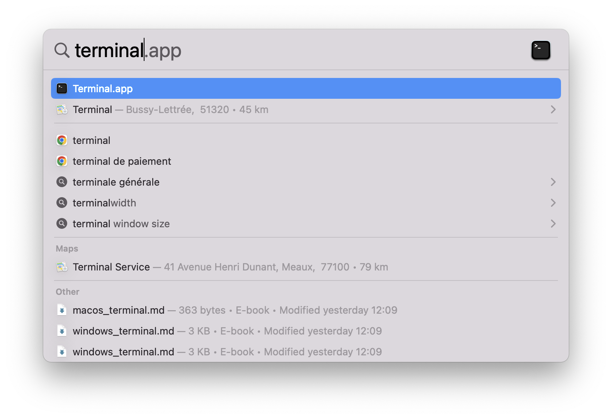

# Setup instructions

You will find below the instructions to set up you computer for [Le Wagon Data Science course](https://www.lewagon.com/data-science-course/full-time)

Please **read them carefully and execute all commands in the following order**. If you get stuck, don't hesitate to ask a teacher for help :raising_hand:

Let's start :rocket:


## GitHub account

Have you signed up to GitHub? If not, [do it right away](https://github.com/join).

:point_right: **[Upload a picture](https://github.com/settings/profile)** and put your name correctly on your GitHub account. This is important as we'll use an internal dashboard with your avatar. Please do this **now**, before you continue with this guide.


:point_right: **[Enable Two-Factor Authentication (2FA)](https://docs.github.com/en/authentication/securing-your-account-with-two-factor-authentication-2fa/configuring-two-factor-authentication#configuring-two-factor-authentication-using-text-messages)**. GitHub will send you text messages with a code when you try to log in. This is important for security and also will soon be required in order to contribute code on GitHub.


## Apple Silicon Chips

If you bought your computer after late 2020, chances are it has a new Apple silicon chip instead of an Intel processor: let's find out.

Open a new terminal window from Applications > Utilities or search for it with [Spotlight](https://support.apple.com/en-gb/HT204014):



Copy-paste the following command in the terminal and hit `Enter` to execute.

``` bash
/bin/bash -c "$(curl -fsSL https://raw.githubusercontent.com/lewagon/setup/master/utils/macos_list_processor_type.sh)"
```

☝️ The result of the command should indicate whether your computer uses Apple Silicon.

If your computer uses **Apple Silicon**, expand the paragraph below and go through it. Otherwise ignore it.

<details>
  <summary>👉&nbsp;&nbsp;Setup for Apple Silicon 👈</summary>

You want to make sure that you are **not using** Rosetta, which is a way to use your Terminal as if you had an Intel computer.

Open the Finder app (or search for it with [Spotlight](https://support.apple.com/en-gb/HT204014)).

Go to Applications > Utilities.

Locate the Terminal app (select it).

Press `Cmd` + `I` on the Terminal app, then verify that the box "Open using Rosetta" is **unchecked**.
In case you don't see this box, just continue.
</details>

🚨 Keep this in mind. You will need to remember later on in the setup whether your computer uses an Apple Silicon chip or is an Apple Intel version


## A note about quitting apps on a Mac

Clicking the little red cross in the top left corner of the application window on a Mac **does not really quit it**, it just closes an active window. To quit the application _for real_ either press `Cmd + Q` when the application is active, or navigate to `APP_NAME` -> `Quit` in the menu bar.


During this setup you will be asked to **quit and re-open** applications multiple times, please make sure you do it properly :pray:

## Command Line Tools

Open a new terminal, copy-paste the following command and hit `Enter`:

```bash
xcode-select --install
```

If you receive the following message, you can just skip this step and go to next step.

```bash
# command line tools are already installed, use "Software Update" to install updates
```

Otherwise, it will open a window asking you if you want to install some software: click on "Install" and wait.


:heavy_check_mark: If you see the message "The software was installed" then all good :+1:

:x: If the command `xcode-select --install` fails try again: sometimes the Apple servers are overloaded.

:x: If you see the message "Xcode is not currently available from the Software Update server", you need to update the software update catalog:

```bash
sudo softwareupdate --clear-catalog
```

Once this is done, you can try to install again.


## Homebrew
### 1. Install:
On Mac, you need to install [Homebrew](http://brew.sh/) which is a Package Manager.
It will be used as soon as we need to install some software.
To do so, open your Terminal and run:

```bash
/bin/bash -c "$(curl -fsSL https://raw.githubusercontent.com/Homebrew/install/HEAD/install.sh)"
```

This will ask for your confirmation (hit `Enter`) and your **macOS user account password** (the one you use to [log in](https://support.apple.com/en-gb/HT202860) when you reboot your Macbook).
:warning: When typing a password in the Terminal, you will **not** get a visual feedback (something like `*****`), this is **normal**!! Type the password and confirm by typing `Enter`.

<details>
  <summary>🛠 If you get a <code>Error: Not a valid ref: refs/remotes/origin/master</code> error</summary>


The full error would be:

``` bash
Error: Not a valid ref: refs/remotes/origin/master :
fatal: ambiguous argument 'refs/remotes/origin/master': unknown revision or path not in the working tree.
```

Run the following commands to solve it:

``` bash
rm -fr $(brew --repo homebrew/core)  # because you can't `brew untap homebrew/core`
brew tap homebrew/core
```

</details>

If you already have Homebrew, it will tell you so, that's fine, go on.

### 2. Make sure you are on the latest version:

```bash
brew update
```

<details>
  <summary>🛠 If you get a <code>/usr/local must be writable</code> error</summary>

Just run this:

``` bash
sudo chown -R $USER:admin /usr/local
brew update
```

</details>

### 3. Then install some useful software:

Proceed running the following in the terminal (you can copy / paste all the lines at once).

```bash
brew upgrade git         || brew install git
brew upgrade gh          || brew install gh
brew upgrade wget        || brew install wget
brew upgrade imagemagick || brew install imagemagick
brew upgrade jq          || brew install jq
brew upgrade openssl     || brew install openssl
brew upgrade tree        || brew install tree
brew upgrade ncdu        || brew install ncdu
brew upgrade xz          || brew install xz
brew upgrade readline    || brew install readline
```


## Visual Studio Code

### Installation

Let's install [Visual Studio Code](https://code.visualstudio.com) text editor.

Copy (`Cmd` + `C`) the command below then paste it in your terminal (`Cmd` + `V`):

```bash
brew install --cask visual-studio-code
```

Then launch VS Code by running the following command in your terminal:

```bash
code
```

:heavy_check_mark: If a VS Code window has just opened, you're good to go :+1:

:x: Otherwise, please **contact a teacher**


## VS Code Extensions

### Installation

Let's install some useful extensions to VS Code.

```bash
code --install-extension ms-vscode.sublime-keybindings
code --install-extension emmanuelbeziat.vscode-great-icons
code --install-extension MS-vsliveshare.vsliveshare
code --install-extension ms-python.python
code --install-extension KevinRose.vsc-python-indent
code --install-extension ms-python.vscode-pylance
code --install-extension ms-toolsai.jupyter
code --install-extension alexcvzz.vscode-sqlite
```

Here is a list of the extensions you are installing:
- [Sublime Text Keymap and Settings Importer](https://marketplace.visualstudio.com/items?itemName=ms-vscode.sublime-keybindings)
- [VSCode Great Icons](https://marketplace.visualstudio.com/items?itemName=emmanuelbeziat.vscode-great-icons)
- [Live Share](https://marketplace.visualstudio.com/items?itemName=MS-vsliveshare.vsliveshare)
- [Python](https://marketplace.visualstudio.com/items?itemName=ms-python.python)
- [Python Indent](https://marketplace.visualstudio.com/items?itemName=KevinRose.vsc-python-indent)
- [Pylance](https://marketplace.visualstudio.com/items?itemName=ms-python.vscode-pylance)
- [Jupyter](https://marketplace.visualstudio.com/items?itemName=ms-toolsai.jupyter)
- [SQLite](https://marketplace.visualstudio.com/items?itemName=alexcvzz.vscode-sqlite)


## Oh-my-zsh

Let's install the `zsh` plugin [Oh My Zsh](https://ohmyz.sh/).

In a terminal execute the following command:

```bash
sh -c "$(curl -fsSL https://raw.github.com/ohmyzsh/ohmyzsh/master/tools/install.sh)"
```

If asked "Do you want to change your default shell to zsh?", press `Y`

At the end your terminal should look like this:


:heavy_check_mark: If it does, you can continue :+1:

:x: Otherwise, please **ask for a teacher**


## direnv

[direnv](https://direnv.net/) is a shell extension. It makes it easy to deal with per project environment variables. This will be useful in order to customize the behavior of your code.

``` bash
brew install direnv
echo 'eval "$(direnv hook zsh)"' >> ~/.zshrc
```


## GitHub CLI

CLI is the acronym of [Command-line Interface](https://en.wikipedia.org/wiki/Command-line_interface).

In this section, we will use [GitHub CLI](https://cli.github.com/) to interact with GitHub directly from the terminal.

It should already be installed on your computer from the previous commands.

We will use the GitHub CLI (`gh`) to connect to GitHub using *SSH*, a protocol to log in using SSH keys instead of the well known username/password pair.

First in order to **login**, copy-paste the following command in your terminal:

:warning: **DO NOT edit the `email`**

```bash
gh auth login -s 'user:email' -w --git-protocol ssh
```

`gh` will ask you few questions:

- `Generate a new SSH key to add to your GitHub account?` Press `Enter` to ask gh to generate the SSH keys for you.

  If you already have SSH keys, you will see instead `Upload your SSH public key to your GitHub account?` With the arrows, select your public key file path and press `Enter`.

- `Enter a passphrase for your new SSH key (Optional)`. Type something you want and that you'll remember. It's a password to protect your private key stored on your hard drive. Then press `Enter`.

- `Title for your SSH key`. You can leave it at the proposed "GitHub CLI", press `Enter`.

You will then get the following output:

```bash
! First copy your one-time code: 0EF9-D015
- Press Enter to open github.com in your browser...
```

Select and copy the code (`0EF9-D015` in the example), then press `Enter`.

Your browser will open and ask you to authorize GitHub CLI to use your GitHub account. Accept and wait a bit.

Come back to the terminal, press `Enter` again, and that's it.

To check that you are properly connected, type:

```bash
gh auth status
```

:heavy_check_mark: If you get `Logged in to github.com as <YOUR USERNAME> `, then all good :+1:

:x: If not, **contact a teacher**.


## Dotfiles

Hackers love to refine and polish their shell and tools. We'll start with a great default configuration provided by [Le Wagon](http://github.com/lewagon/dotfiles), stored on GitHub.

### Check your GitHub CLI configuration

First, let's do a quick check. Open your terminal and run the following command:

```bash
export GITHUB_USERNAME=`gh api user | jq -r '.login'`
echo $GITHUB_USERNAME
```

You should see your GitHub username printed. If it's not the case, **stop here** and ask for help.
There seems to be a problem with the previous step (`gh auth`).

### Fork and/or clone dotfiles

There are three options, choose **one**:


<details>
    <summary>
        <strong>I did not attend the Web Dev or Data Science & AI bootcamp at Le Wagon</strong>
    </summary>

 As your configuration is personal, you need your own repository storing it, so you'll need to fork it to your GitHub account.

Forking means that it will create a new repo in your GitHub account, identical to the original one. You'll have a new repository on your GitHub account, `your_github_username/dotfiles`. We need to fork because each of you will need to put specific information (e.g. your name) in those
files.

Lets' run this command to fork the repo, and clone it on your laptop:

```bash
mkdir -p ~/code/$GITHUB_USERNAME && cd $_
gh repo fork lewagon/dotfiles --clone
```

</details>


<details>
    <summary>
        <strong>I already attended a Le Wagon coding bootcamp (Web Development or Data Science & AI) <em>but I have a new laptop</em></strong>
    </summary>

This means that you already forked the GitHub repo `lewagon/dotfiles`, but at that time the configuration was maybe not ready for the current Data Science & AI bootcamp. Let's update it. **Ask a TA to join you for the nex steps.**

First, clone your fork on this machine:

```bash
mkdir -p ~/code/$GITHUB_USERNAME && cd $_
gh repo clone $GITHUB_USERNAME/dotfiles
```


Open your terminal and go to your `dotfiles` project:

```bash
cd ~/code/$GITHUB_USERNAME/dotfiles
```

Time to merge the changes from `lewagon/dotfiles` into yours:
1. Commit your current version of your dotfiles:
   ```bash
   git add .
   git status # Check what will be committed
   git commit -m "Version prior to new setup"
   ```

1. Let's bring in the changes from upstream: `git merge upstream/master`

1. Check that you're not in `MERGING` state. If you are, resolve any conflicts.

1. Do a `git diff HEAD~1 HEAD` to check what changed.

1. If nothing seems out of the ordinary, continue

<details>
  <summary>Too many conflicts?
  </summary>

  Let's just take over the current version from `lewagon/dotfiles`.

  First abort the merge: `git merge --abort`.

  Run `code .`

  In VS Code, open the `zshrc` file. Replace its content with the [newest version](https://raw.githubusercontent.com/lewagon/dotfiles/master/zshrc). Save to disk.

  Still in VS Code, open the `zprofile` file. Replace its content with the [newest version](https://raw.githubusercontent.com/lewagon/dotfiles/master/zprofile). Save to disk.

  Back in the terminal, run a `git diff` and check if this didn't remove any personal configuration setting that you wanted to keep.

</details>

Time to commit your changes and push them.

```bash
git add .
git commit -m "Update for Data Science bootcamp"
git push origin master
```

</details>


<details>
    <summary>
        <strong>I already did the setup of a Le Wagon coding bootcamp (WebDev or Data Science & AI) <em>on the same laptop</em> before</strong>
    </summary>

This means that you already forked and cloned the GitHub repo `lewagon/dotfiles`, but at that time the configuration was maybe not ready for the current Data Science & AI bootcamp. Let's update it. **Ask a TA to join you for the nex steps.**


Open your terminal and go to your `dotfiles` project:

```bash
cd ~/code/$GITHUB_USERNAME/dotfiles
```

Time to merge the changes from `lewagon/dotfiles` into yours:
1. Commit your current version of your dotfiles:
   ```bash
   git add .
   git status # Check what will be committed
   git commit -m "Version prior to new setup"
   ```

1. Let's bring in the changes from upstream: `git merge upstream/master`

1. Check that you're not in `MERGING` state. If you are, resolve any conflicts.

1. Do a `git diff HEAD~1 HEAD` to check what changed.

1. If nothing seems out of the ordinary, continue

<details>
  <summary>Too many conflicts?
  </summary>

  Let's just take over the current version from `lewagon/dotfiles`.

  First abort the merge: `git merge --abort`.

  Run `code .`

  In VS Code, open the `zshrc` file. Replace its content with the [newest version](https://raw.githubusercontent.com/lewagon/dotfiles/master/zshrc). Save to disk.

  Still in VS Code, open the `zprofile` file. Replace its content with the [newest version](https://raw.githubusercontent.com/lewagon/dotfiles/master/zprofile). Save to disk.

  Back in the terminal, run a `git diff` and check if this didn't remove any personal configuration setting that you wanted to keep.

</details>

Time to commit your changes and push them.

```bash
git add .
git commit -m "Update for Data Science bootcamp"
git push origin master
```

</details>


### Run the dotfiles installer

It's time to run the `dotfiles` installer:

```bash
cd ~/code/$GITHUB_USERNAME/dotfiles && zsh install.sh
```

Check the emails registered with your GitHub Account. You'll need to pick one at the next step:

```bash
gh api user/emails | jq -r '.[].email'
```

Run the git installer:

```bash
cd ~/code/$GITHUB_USERNAME/dotfiles && zsh git_setup.sh
```

:point_up: This will **prompt** you for your name (`FirstName LastName`) and your email.
:warning: You **need** to put one of the emails listed above thanks to the previous `gh api ...` command. If you don't do that, Kitt won't be able to track your progress. 💡 Select the `@users.noreply.github.com` address if you don't want your email to appear in public repositories you may contribute to.

Please now **quit** all your opened terminal windows.


## Installing Python (with [`pyenv`](https://github.com/pyenv/pyenv))

### Uninstall `conda`

As we are using `pyenv` to install and manage our Python version, we need to uninstall [`conda`](https://docs.conda.io/projects/conda/en/latest/), another package manager you may have on your machine if you previously installed [Anaconda](https://www.anaconda.com/). Thus, we are preventing any possible Python version issue later.

Check if you have `conda` installed on your machine:

```bash
conda list
```
If you have `zsh: command not found: conda`, you can **skip** the uninstall of `conda` and jump to the **Install pre-requisites** section.

<details>
    <summary markdown='span'><code>conda</code> uninstall instructions</summary>

- Install the Anaconda-Clean package from your terminal and run the cleaning
```bash
conda install anaconda-clean
anaconda-clean --yes
```
- Remove every Anaconda directories
```bash
rm -rf ~/anaconda2
rm -rf ~/anaconda3
rm -rf ~/.anaconda_backup
rm -rf ~/opt
```
- Remove Anaconda path from your `.bash_profile`
    - Open the file with `code ~/.bash_profile`
    - If the file opens find the line matching the following pattern `export PATH="/path/to/anaconda3/bin:$PATH"` and delete the line
    - Save the file with `CMD` + `s`
- Restart your terminal with `exec zsh`
- Remove Anaconda initialization from your `.zshrc`:
    - Open the file with `code ~/.zshrc` 
    - Remove the code lines starting from `>>> conda initialize >>>` to `<<< conda initialize <<<`
</details>


### Install pre-requisites

Before installing Python, please check your `xz` version with:

```bash
brew info xz
```

It should be more than `5.2.0`, **if not** you should run:

```bash
sudo rm -rf /usr/local/opt/xz
brew upgrade
brew install xz
```

Then run:

```bash
brew install readline
```

### Install `pyenv`

macOS comes with an outdated version of Python that we don't want to use. You might already have installed Anaconda or something else to tinker with Python and Data Science packages. All of this does not really matter as we are going to do a professional setup of Python where you'll be able to switch which version you want to use whenever you type `python` in the terminal.

First let's install `pyenv` with the following Terminal command:

```bash
brew install pyenv
exec zsh
```

### Install Python

Let's install the [latest stable version of Python](https://www.python.org/doc/versions/) supported by Le Wagon's curriculum:

```bash
pyenv install 3.12.9
```

This command might take a while, this is perfectly normal. Don't hesitate to help other students seated next to you!

<details>
  <summary>🛠 Troubleshooting `pyenv` not found</summary>

If you encounter an error `Command 'pyenv' not found`: execute the following line:

```bash
source ~/.zprofile
```

Then try to install Python again:

```bash
pyenv install 3.12.9
```

If `pyenv` is still not found, contact a teacher.

</details>


<details>
  <summary>🛠 Troubleshooting `zlib`</summary>

If you encounter an error installing Python with `pyenv` about `zlib`:

```txt
zipimport.ZipImportError: can't decompress data; zlib not available
```

Install `zlib` with:

```bash
brew install zlib
export LDFLAGS="-L/usr/local/opt/zlib/lib"
export CPPFLAGS="-I/usr/local/opt/zlib/include"
```

Then try to install Python again:

```bash
pyenv install 3.12.9
```

It could raise another error about `bzip2`, you can ignore it and continue to the next step.

</details>
<br>

OK once this command is complete, we are going to tell the system to use this version of Python **by default**. This is done with:

```bash
pyenv global 3.12.9
exec zsh
```

To check if this worked, run `python --version`. If you see `3.12.9`, perfect! If not, ask a TA that will help you debug the problem thanks to `pyenv versions` and `type -a python` (`python` should be using the `.pyenv/shims` version first).


## Python Virtual Environment

Before we start installing relevant Python packages, we will isolate the setup for the Bootcamp into a **dedicated** virtual environment. We will use a `pyenv` plugin called [`pyenv-virtualenv`](https://github.com/pyenv/pyenv-virtualenv).

### Setup a virtualenv

First let's install this plugin:

```bash
git clone https://github.com/pyenv/pyenv-virtualenv.git $(pyenv root)/plugins/pyenv-virtualenv
exec zsh
```

Let's create the virtual environment we are going to use during the whole bootcamp:

```bash
pyenv virtualenv 3.12.9 lewagon
```

Let's now set the virtual environment with:

```bash
pyenv global lewagon
```

Great! Anytime we'll install Python package, we'll do it in that environment.


### Python packages

Now that we have a pristine `lewagon` virtual environment, it's time to install some packages in it.

First, let's upgrade `pip`, the tool to install Python Packages from [pypi.org](https://pypi.org). In the latest terminal where the virtualenv `lewagon` is activated, run:

```bash
pip install --upgrade pip
```

Then let's install some packages for the first weeks of the program:

If your computer uses **Apple Silicon**, expand the paragraph below and go through it. Otherwise ignore it.

<details>
  <summary>👉&nbsp;&nbsp;Setup for Apple Silicon 👈</summary>

``` bash
pip install -r https://raw.githubusercontent.com/lewagon/data-setup/master/specs/releases/apple_silicon.txt
```
</details>

If your computer uses **Apple Intel**, expand the paragraph below and go through it. Otherwise ignore it.

<details>
  <summary>👉&nbsp;&nbsp;Setup for Apple Intel 👈</summary>

``` bash
pip install -r https://raw.githubusercontent.com/lewagon/data-setup/master/specs/releases/apple_intel.txt
```
</details>


## Jupyter Notebook tweaking

Let's improve the display of the [`details` disclosure elements](https://developer.mozilla.org/en-US/docs/Web/HTML/Element/details) in your notebooks.

Run the following lines to create a `custom.css` stylesheet in your Jupyter config directory:

```bash
LOCATION=$(jupyter --config-dir)/custom
SOURCE=https://raw.githubusercontent.com/lewagon/data-setup/refs/heads/master/specs/jupyter/custom.css
mkdir -p $LOCATION
curl $SOURCE > $LOCATION/custom.css
```


## Python setup check

### Python and packages check

Let's reset your terminal:

```bash
cd ~/code && exec zsh
```

Check your Python version with the following commands:
```bash
zsh -c "$(curl -fsSL https://raw.githubusercontent.com/lewagon/data-setup/master/checks/python_checker.sh)" 3.12.9
```

Run the following command to check if you successfully installed the required packages:
```bash
zsh -c "$(curl -fsSL https://raw.githubusercontent.com/lewagon/data-setup/master/checks/pip_check.sh)"
```

Now run the following command to check if you can load these packages:
```bash
python -c "$(curl -fsSL https://raw.githubusercontent.com/lewagon/data-setup/master/checks/pip_check.py)"
```

### Jupyter check

Make sure you can run Jupyter:

```bash
jupyter notebook
```

Your web browser should open on a `jupyter` window:


Click on `New` and in the dropdown menu select `Python 3 (ipykernel)`:


A tab should open on a new notebook:


Make sure that you are running the correct python version in the notebook. Open a cell and run:
``` python
import sys; sys.version
```

It should output `3.12.9` followed by some more details. If not, check with a TA.

You can close your web browser then terminate the jupyter server with `CTRL` + `C`.

Here you have it! A complete python virtual env with all the third-party packages you'll need for the whole bootcamp.


## DBeaver

Download and install [DBeaver](https://dbeaver.io/), a free and open source powerful tool to connect to any database, explore the schema and even **run SQL queries**.


## Docker 🐋

Docker is an open platform for developing, shipping, and running applications.

_if you already have Docker installed on your machine please update with the latest version_

### Install Docker

Go to [Docker](https://docs.docker.com/get-docker/) website and choose your operating system:


Then follow the setup instructions, you are going to install a desktop application.

Once done and launched, check Docker is up and running:

```bash
docker info
```

You should get:


## `gcloud` CLI

Before Setting up our Google Cloud Platform account let's configure the `gcloud` CLI (A command line interface for Google Cloud Platform). Run the below and follow the terminal prompts to update your $PATH and enable shell command completion for the `.zshrc` file:

```bash
brew install --cask google-cloud-sdk
```

Then you can:

```bash
$(brew --prefix)/Caskroom/google-cloud-sdk/latest/google-cloud-sdk/install.sh
```


  ## Kitt

You should have received an email from Le Wagon inviting you to sign up on [Kitt](https://kitt.lewagon.com) (our learning platform).

Then you should receive an additional invitation from Slack, inviting you to the Le Wagon Alumni slack community (where you'll chat with your buddies and all the previous alumni). Click on **Join** and complete the information.

If you haven't, please contact your teaching team.


## Slack

[Slack](https://slack.com/) is a communication platform pretty popular in the tech industry.

### Installation

[Download the Slack app](https://itunes.apple.com/us/app/slack/id803453959?mt=12) and install it.

:warning: If you are already using Slack in your browser, please download and install **the desktop app** which is fully featured.


### Settings

Launch the app and sign in to `lewagon-alumni` organization.

Make sure you **upload a profile picture** :point_down:


The idea is that you'll have Slack open all day, so that you can share useful links / ask for help / decide where to go to lunch / etc.

To ensure that everything is working fine for video calls, let's test your camera and microphone:
- Open the Slack app
- Click your profile picture in the top right.
- Select `Preferences` from the menu.
- Click `Audio & video` in the left-side column.
- Below `Troubleshooting`, click `Run an audio, video and screensharing test`. The test will open in a new window.
- Check that your preferred speaker, microphone and camera devices appear in the drop-down menus, then click `Start test`.


:heavy_check_mark: When the test is finished, you should see green "Succeed" messages at least for your microphone and camera. :+1:

:x: If not, **contact a teacher**.

You can also install Slack app on your phone and sign in `lewagon-alumni`!


## macOS settings

### Security

It is mandatory that you protect your session behind a password. If it is not already the case, go to ` > System Settings... > Users & Groups` and change your account password. You should also go to ` > System Settings... > Lock Screen`. You should require a password `5 seconds` after screen saver begins or display is turned off.

You can also go to ` > System Settings... > Desktop & Dock` and click on the `Hot Corners...` button at the bottom left. Choose for the bottom right corner to start the screen saver. That way, when you leave your desk, you can quickly lock you screen by putting your mouse in the bottom right corner. 5 seconds after, your MacBook will be locked and will ask for a password to get back on the session.

### Keyboard

As you become a programmer, you'll understand that leaving the keyboard takes a lot of time, so you'll want to minimize using the trackpad or the mouse. Here are a few tricks on macOS to help you do that.

#### Keyboard speed

Go to ` > System Settings... > Keyboard`. Set `Key repeat rate` to the fastest position (to the right) and `Delay until repeat` to the shortest position (also to the right).

#### macOS For hackers

[Read this script](https://github.com/mathiasbynens/dotfiles/blob/master/.macos) and cherry-pick some stuff you think will suit you. For instance, you can type in the terminal this one:

```bash
# Expanding the save panel by default
defaults write NSGlobalDomain NSNavPanelExpandedStateForSaveMode -bool true
defaults write NSGlobalDomain PMPrintingExpandedStateForPrint -bool true
defaults write NSGlobalDomain PMPrintingExpandedStateForPrint2 -bool true

# Save screenshots to the Desktop (or elsewhere)
defaults write com.apple.screencapture location "${HOME}/Desktop"

# etc..
```

### Pin apps to your dock

You are going to use most of the apps you've installed today really often. Let's pin them to your dock so that they are just one click away!

To pin an app to your dock, launch the app, right-click on the icon in the taskbar to bring up the context menu and choose "Options" then "Keep in Dock".


You must pin:
- Your terminal
- Your file explorer
- VS Code
- Your Internet browser
- Slack


## (Bonus) Kata

If you are done with your setup, please ask around if some classmates need some help with theirs (macOS, Linux, Windows). We will have our first lectures at 2pm and will talk about the Setup you just did + onboard you on Kitt.

If you don't have a lot of experience with `git` and GitHub, please [(re-)watch this workshop](https://www.youtube.com/watch?v=Z9fIBT2NBGY) (`1.25` playback speed is fine).

If you do, then you can wait for the first lecture working on this [Tic-Tac-Toe Kata](https://www.codewars.com/kata/5b817c2a0ce070ace8002be0/python)


