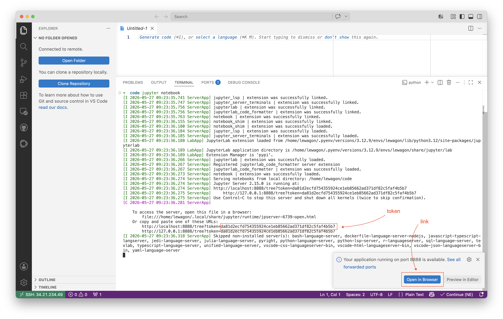
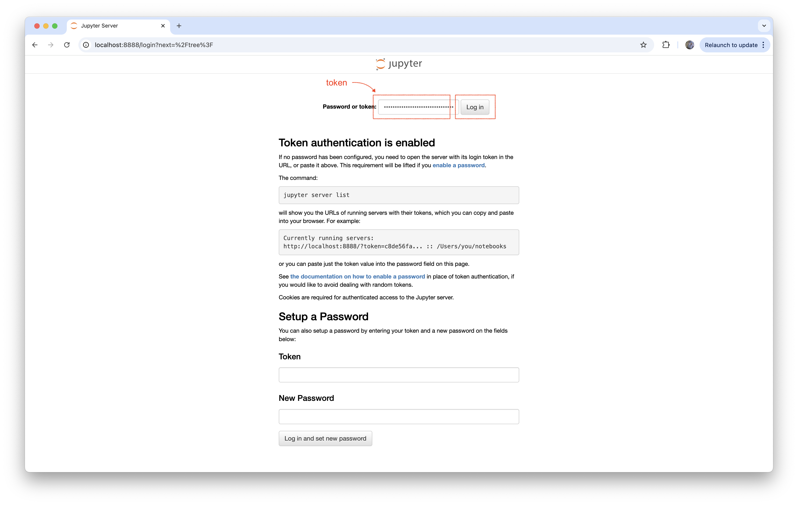
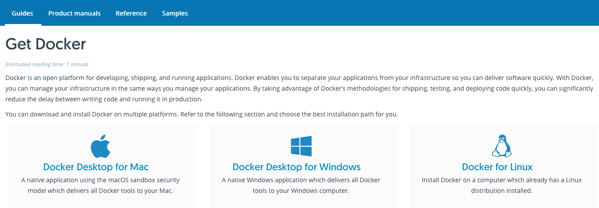
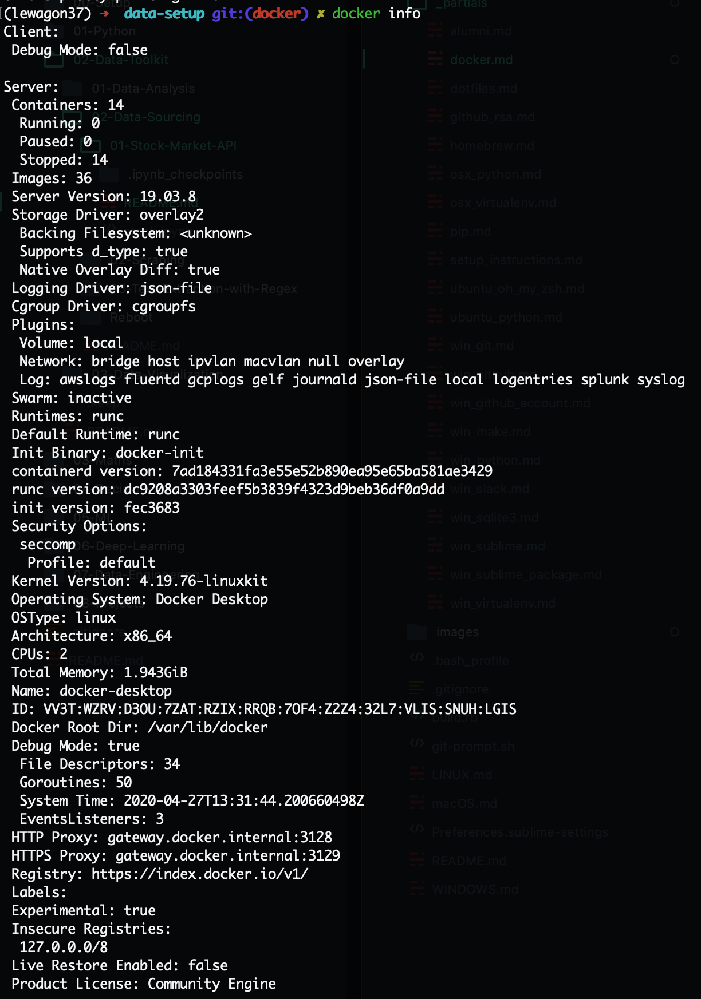
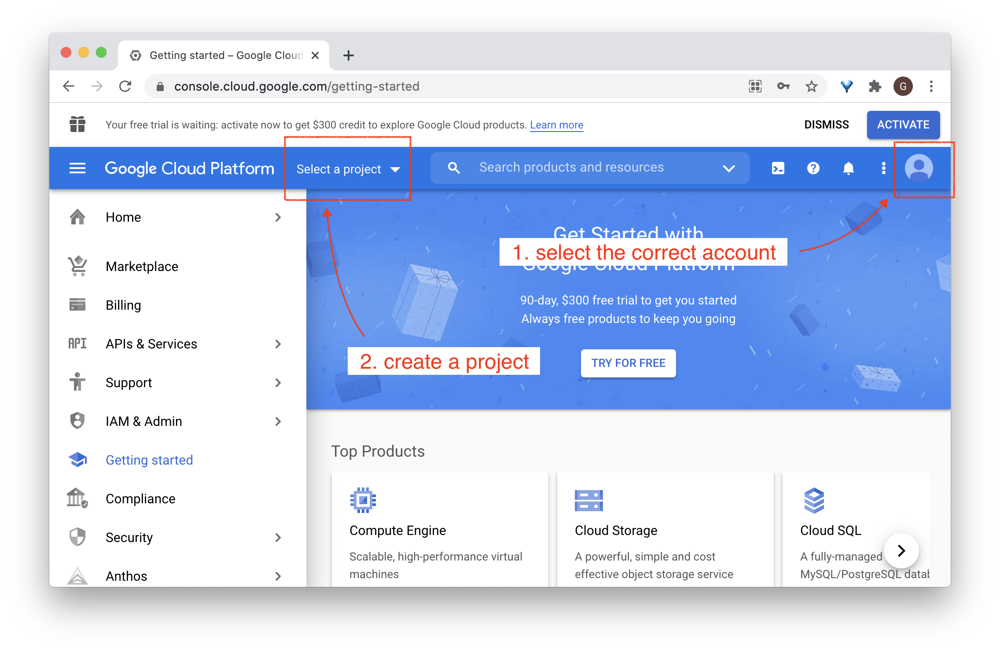
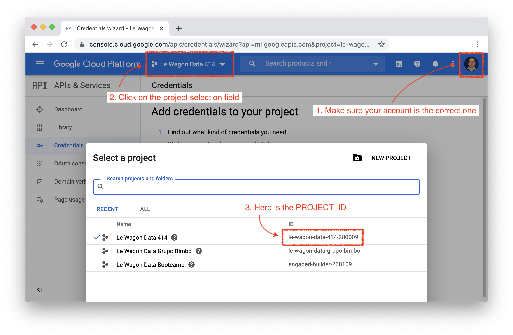
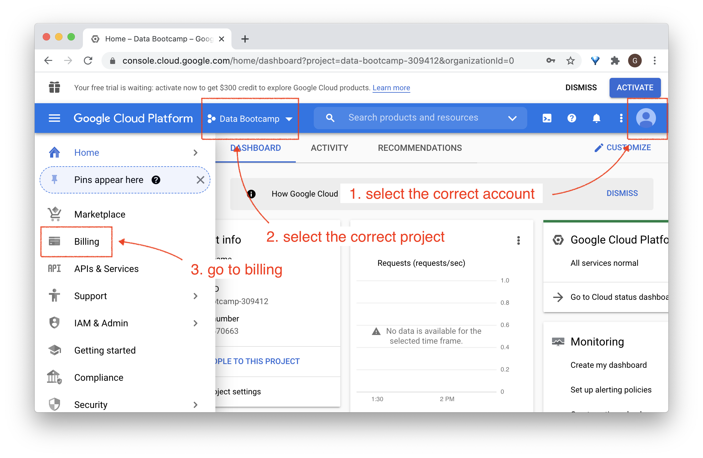

# Setup instructions

Below are the instructions for setting up your computer for the [Le Wagon Data Science & AI bootcamp](https://www.lewagon.com/data-science-course).

Please **read them carefully and execute all commands in the following order**. 

This setup is not an exercise; its sole purpose is to prepare your machine in a standardised way. Do not experiment or ask an LLM for help. If you get stuck, simply ask a teacher for help :raising_hand:

Let's start :rocket:


## GitHub account

Have you signed up to GitHub? If not, [do it right away](https://github.com/join).

:point_right: **[Upload a picture](https://github.com/settings/profile)** and put your name correctly on your GitHub account. This is important as we'll use an internal dashboard with your avatar. Please do this **now**, before you continue with this guide.


:point_right: **[Enable Two-Factor Authentication (2FA)](https://docs.github.com/en/authentication/securing-your-account-with-two-factor-authentication-2fa/configuring-two-factor-authentication#configuring-two-factor-authentication-using-text-messages)**. GitHub will send you text messages with a code when you try to log in. This is important for security and also will soon be required in order to contribute code on GitHub.


## Check your processor

As explained in our laptop requirements, this setup supports only Apple silicon and no longer supports Macs with Intel processors.

If you bought your Mac after late 2020, it most likely has an Apple silicon chip rather than an Intel processor.

If you're unsure, click the Apple icon in the top-left corner of your screen, then select *"About This Mac"*. If the *"Chip"* field starts with *"Apple"*, you're good to go. If it starts with *"Intel"*, your Mac isn't supported.


## A note about quitting apps on a Mac

Clicking the little red cross in the top left corner of the application window on a Mac **does not really quit it**, it just closes an active window. To quit the application _for real_ either press `Cmd + Q` when the application is active, or navigate to `APP_NAME` -> `Quit` in the menu bar.


During this setup you will be asked to **quit and re-open** applications multiple times, please make sure you do it properly :pray:

## Command Line Tools

Open a new terminal, copy-paste the following command and hit `Enter`:

```bash
xcode-select --install
```

If you receive the following message, you can just skip this step and go to next step.

```bash
# command line tools are already installed, use "Software Update" to install updates
```

Otherwise, it will open a window asking you if you want to install some software: click on "Install" and wait.


:heavy_check_mark: If you see the message "The software was installed" then all good :+1:

:x: If the command `xcode-select --install` fails try again: sometimes the Apple servers are overloaded.

:x: If you see the message "Xcode is not currently available from the Software Update server", you need to update the software update catalog:

```bash
sudo softwareupdate --clear-catalog
```

Once this is done, you can try to install again.


## Homebrew

[Homebrew](http://brew.sh/) is a package manager: it's a software used to install other software from the command line. Let's install it!

Open a terminal and run:

```bash
/bin/bash -c "$(curl -fsSL https://raw.githubusercontent.com/Homebrew/install/HEAD/install.sh)"
```

This will ask for your confirmation (hit `Enter`) and your **macOS user account password** (the one you use to [log in](https://support.apple.com/en-gb/HT202860) when you reboot your Macbook).

:warning: When you type your password, nothing will show up on the screen, **that's normal**. This is a security feature to mask not only your password as a whole but also its length. Just type your password and when you're done, press `Enter`.

If you already have Homebrew, it will tell you so, that's fine, go on.

Once Homebrew has finished installing, run these two commands to add it to your `PATH`:

```bash
echo 'eval "$(/opt/homebrew/bin/brew shellenv)"' >> ~/.zprofile
eval "$(/opt/homebrew/bin/brew shellenv)"
```

Make sure you're on the latest version:

```bash
brew update
```

Then install some useful software (you can copy / paste all the lines at once):

```bash
brew upgrade git         || brew install -y git
brew upgrade gh          || brew install -y gh
brew upgrade wget        || brew install -y wget
brew upgrade imagemagick || brew install -y imagemagick
brew upgrade jq          || brew install -y jq
brew upgrade openssl     || brew install -y openssl
brew upgrade tree        || brew install -y tree
brew upgrade ncdu        || brew install -y ncdu
brew upgrade xz          || brew install -y xz
brew upgrade readline    || brew install -y readline
```


## Visual Studio Code

### Installation

Let's install [Visual Studio Code](https://code.visualstudio.com) text editor.

Copy (`Cmd` + `C`) the command below then paste it in your terminal (`Cmd` + `V`):

```bash
brew install --cask visual-studio-code
```

Then launch VS Code by running the following command in your terminal:

```bash
code
```

:heavy_check_mark: If a VS Code window has just opened, you're good to go :+1:

:x: Otherwise, please **contact a teacher**


## VS Code Extensions

### Installation

Let's install some useful extensions to VS Code.

```bash
code --install-extension ms-vscode.sublime-keybindings
code --install-extension emmanuelbeziat.vscode-great-icons
code --install-extension MS-vsliveshare.vsliveshare
code --install-extension ms-python.python
code --install-extension KevinRose.vsc-python-indent
code --install-extension ms-python.vscode-pylance
code --install-extension ms-toolsai.jupyter
code --install-extension alexcvzz.vscode-sqlite
```

Here is a list of the extensions you are installing:
- [Sublime Text Keymap and Settings Importer](https://marketplace.visualstudio.com/items?itemName=ms-vscode.sublime-keybindings)
- [VSCode Great Icons](https://marketplace.visualstudio.com/items?itemName=emmanuelbeziat.vscode-great-icons)
- [Live Share](https://marketplace.visualstudio.com/items?itemName=MS-vsliveshare.vsliveshare)
- [Python](https://marketplace.visualstudio.com/items?itemName=ms-python.python)
- [Python Indent](https://marketplace.visualstudio.com/items?itemName=KevinRose.vsc-python-indent)
- [Pylance](https://marketplace.visualstudio.com/items?itemName=ms-python.vscode-pylance)
- [Jupyter](https://marketplace.visualstudio.com/items?itemName=ms-toolsai.jupyter)
- [SQLite](https://marketplace.visualstudio.com/items?itemName=alexcvzz.vscode-sqlite)


### VS Code AI Features

VS Code includes many powerful **AI features**, which are a great tool once you already know how to code.

That said, relying on AI too early can hide important concepts and make debugging harder to understand. Once you’re comfortable with the fundamentals, you’ll know when and how to use AI effectively — without letting it do the thinking for you.

For the start of the bootcamp, we’ll disable these features. At the right point in the course, we’ll reenable them so you can put them to good use.

In **VS Code**:

1. Let's open the VS Code "Command **P**alette": type `Ctrl-Shift-P` (Windows / Linux) or `Cmd-Shift-P` (macOS).
1. This will open the Command Palette: a small text box at the top of your screen. Start typing `aifeatures` until you see "Chat: Learn How to Hide AI features". Click on it.
   
1. This will open the settings, and will show you the option "Disable and hide built-in AI features ...". Tick the checkbox in front of that option.
   

Later, if you want **to reenable** the AI features, you can follow the same instructions to untick the checkbox.


## Oh-my-zsh

Let's install the `zsh` plugin [Oh My Zsh](https://ohmyz.sh/).

In a terminal execute the following command:

```bash
sh -c "$(curl -fsSL https://raw.github.com/ohmyzsh/ohmyzsh/master/tools/install.sh)"
```

If asked "Do you want to change your default shell to zsh?", press `Y`

At the end your terminal should look like this:


:heavy_check_mark: If it does, you can continue :+1:

:x: Otherwise, please **ask for a teacher**


## direnv

[direnv](https://direnv.net/) is a shell extension. It makes it easy to deal with per project environment variables. This will be useful in order to customize the behavior of your code.


``` bash
brew install direnv
echo 'eval "$(direnv hook zsh)"' >> ~/.zshrc
```


## GitHub CLI

CLI is the acronym of [Command-line Interface](https://en.wikipedia.org/wiki/Command-line_interface).

In this section, we will use [GitHub CLI](https://cli.github.com/) to interact with GitHub directly from the terminal.

It should already be installed on your computer from the previous commands.

We will use the GitHub CLI (`gh`) to connect to GitHub using *SSH*, a protocol to log in using SSH keys instead of the well known username/password pair.

First in order to **login**, copy-paste the following command in your terminal:

:warning: **DO NOT edit the `email`** — Even though `user:email` looks like a placeholder for your actual email address, it isn't — do not replace it.

```bash
gh auth login -s 'user:email' -w --git-protocol ssh
```

`gh` will ask you few questions:

- `Generate a new SSH key to add to your GitHub account?` Press `Enter` to ask gh to generate the SSH keys for you.

  If you already have SSH keys, you will see instead `Upload your SSH public key to your GitHub account?` With the arrows, select your public key file path and press `Enter`.

- `Enter a passphrase for your new SSH key (Optional)`:
  - **FOR MOST PEOPLE:** Just press `Enter` to skip. You don't need a passphrase for the bootcamp and it would prompt you every time you use the key. There is a risk, however, that if someone steals your laptop, they could then push to GitHub.
  - **IF SECURITY IS REALLY IMPORTANT TO YOU:** Enter a passphrase of your choice and press `Enter`. It's _really_ important that if you enter a passphrase, you write it down somewhere immediately and do not lose/forget it. You will need to enter this frequently.

- `Title for your SSH key`. You can leave it at the proposed "GitHub CLI", press `Enter`.

You will then get the following output:

```bash
! First copy your one-time code: 0EF9-D015
- Press Enter to open github.com in your browser...
```

Select and copy the code (`0EF9-D015` in the example), then press `Enter`.

Your browser will open and ask you to authorize GitHub CLI to use your GitHub account. Accept and wait a bit.

Come back to the terminal, press `Enter` again, and that's it.

To check that you are properly connected, type:

```bash
gh auth status
```

:heavy_check_mark: If you get `Logged in to github.com as <YOUR USERNAME> `, then all good :+1:

:x: If not, **contact a teacher**.


## Dotfiles

Let's enhance the experience of your machine by installing Le Wagon's pre-configured [dotfiles 🔗](https://github.com/lewagon/dotfiles). These are configuration files for your terminal, zsh, git, and VS Code.

### Forking the dotfiles

To customise this configuration for yourself, you'll need to **fork** the repository to your own Github account.

**Forking** creates a copy of the repository under your account (`your_github_username/dotfiles`), which you can then modify with your personal information, such as your name.

<details>
<summary>❗ <strong>If</strong> you already did another Le Wagon bootcamp  (<strong>Web Development, AI Software Development, Data Analytics, Data Science & AI</strong>, open this first ❗
</summary>

You may have an older version of the Le Wagon dotfiles. They could be incompatible with the current setup.


**Open a ticket** with a TA and do one of the following:
- Compare your existing dotfiles with the current Le Wagon [dotfiles 🔗](https://github.com/lewagon/dotfiles), particularly the `.zshrc`, `.zprofile`, and `settings.json` - if there is no meaningful difference other than your name and email setting, continue with the setup.
- If you are OK with losing your existing dotfiles (recommended):
    - Delete your existing dotfiles repository on GitHub and continue with the setup.
    - Delete the local repository: `rm -rf ~/code/<your_github_username>/dotifles`.
- If you do not want to lose your existing dotfiles, we recommend working with branches:
    - On your **laptop**, or wherever you have a **local** copy of **your existing version of dotfiles**
    - Create a branch of your existing dotfiles setup (`git checkout -b old-setup`), and push to GitHub - `git push origin old-setup`,
    - Go back to `master`: `git checkout master`.
    - On local `master`, `git pull upstream master`, resolve any conflicts, `git commit -m "merged"`, and `git push origin master`. It is important that you accept incoming changes to the `.zshrc`, `.zprofile`, and `settings.json` files.
    - Continue with the setup.

</details>

<br>

Run the following command:

```bash
export GITHUB_USERNAME=`gh api user | jq -r '.login'`
echo $GITHUB_USERNAME
```

✔️ You should see your Github username printed.

❌ If not, stop here and ask for help. There may be a problem with the previous step (`gh auth`).

Time to fork the repo and clone it on your computer:

```bash
mkdir -p ~/code/$GITHUB_USERNAME && cd $_
gh repo fork lewagon/dotfiles --clone
```

### Installing the dotfiles

Run the `dotfiles` installer with:

```bash
cd ~/code/$GITHUB_USERNAME/dotfiles && zsh install.sh
```

Check the emails registered with your GitHub Account. You'll need to pick one in the next step:

```bash
gh api user/emails | jq -r '.[].email'
```

Run the git installer:

```bash
cd ~/code/$GITHUB_USERNAME/dotfiles && zsh git_setup.sh
```

:point_up: This will **prompt** you for your name (`FirstName LastName`) and your email.

:warning: You **need** to put one of the emails listed above from the previous `gh api ...` command. If you don't do that, Kitt will not be able to track your progress.

💡 Select the `...@users.noreply.github.com` address if you don't want your email to appear in public repositories you may contribute to.


## Install Python and dependencies

Your operating system - macOS, or Ubuntu (native, or inside WSL) - come with a "system Python". That's a Python version your system depends on. We don't mess around with that one. We're going to do a professional setup of Python where you don't mess up your "system Python" and wher you'll be able to switch which version you want to use for each project you work on.

To manage different Python versions and virtual environments (you'll discover what that means during the setup lecture), we will use the state-of-the-art [`uv` created by Astral](https://docs.astral.sh/uv/).


### Install `uv`

First, we'll install `uv`:

```bash
curl -LsSf https://astral.sh/uv/install.sh | sh
```


### Create a virtual environment

Next, we'll create a virtual environment (an isolated environment with Python and the dependencies for the bootcamp):

```bash
uv venv ~/.lewagon/venvs/lewagon --python 3.12.9
```

Now that we created this new virtual environment, let's restart our shell to pick it up (this works thanks to the `lewagon/dotfiles` we installed before):

```bash
exec zsh
```

Let's check that everything went right. Run this:

```bash
which python3
```

It should return this:


``` bash
/Users/your-username/.lewagon/venvs/lewagon/bin/python3
```


If it doesn't, check with a TA! Do not continue with the next step before you solved this!


### Install dependencies

Python is great for data, because the communitiy has developed an enormous amount of packages we can re-use.

Let's install the most common ones:


``` bash
uv pip install -r https://raw.githubusercontent.com/lewagon/data-setup/master/specs/releases/apple_silicon.txt
```


## Jupyter Notebook tweaking

Let's improve the display of the [`details` disclosure elements](https://developer.mozilla.org/en-US/docs/Web/HTML/Element/details) in your notebooks.

Run the following lines to create a `custom.css` stylesheet in your Jupyter config directory:

```bash
LOCATION=$(jupyter --config-dir)/custom
SOURCE=https://raw.githubusercontent.com/lewagon/data-setup/refs/heads/master/specs/jupyter/custom.css
mkdir -p $LOCATION
curl $SOURCE > $LOCATION/custom.css
```


## Python setup check

Let's run some checks. If any of the following steps fail, ask a TA for help.

Let's reset your terminal:

```bash
cd ~/code && exec zsh
```

Make sure you can run Jupyter:

```bash
jupyter notebook
```

Your web browser should open on a `jupyter` window.

<details>

  <summary>Note if you're running the setup on a virtual machine</summary>

  VSCode detects that a jupyter notebook started in your virtual machine and creates a port forward in order to allow you to open the application in your browser.

  Hit Open in Browser or go to http://localhost:8888/ (the url to use is available in the terminal).

  

  On the first run, jupyter will ask for the token displayed in the terminal of your virtual machine in order to allow you to connect to the application from your local machine.

  Fill the token and hit Log in.

  

  You are now interacting from your local machine with the jupyter application running in your virtual machine.
</details>


Click on `New` and in the dropdown menu select `Python 3 (ipykernel)`:


A tab should open on a new notebook:


Make sure that you are running the correct python version in the notebook. Open a cell and run:

``` python
import sys; sys.version
```

It should output `3.12.9` followed by some more details. If not, check with a TA.

In another cell, run:

```python
import pandas as pd
pd.__version___
```

This might take a few minutes to run. It should output a version number, `2.2.3`.  If not, check with a TA.

You can close your web browser then terminate the jupyter server with `CTRL` + `C`.

Here you have it! A complete python virtual env with all the third-party packages you'll need for the whole bootcamp.


## Docker 🐋

Docker is an open platform for developing, shipping, and running applications.

_if you already have Docker installed on your machine please update with the latest version_

### Install Docker

Go to [Docker](https://docs.docker.com/get-docker/) website and choose your operating system:



Then follow the setup instructions, you are going to install a desktop application.

Once done and launched, check Docker is up and running:

```bash
docker info
```

You should get:




## Google Cloud Platform setup

[Google Cloud](https://cloud.google.com/) is a cloud solution that you are going to use in order to deploy your Machine Learning-based products to production.

🚨 If you are a student of the **Part-Time Bootcamp or the Flex bootcamp**, SKIP THIS SECTION FOR NOW! **Google Cloud** offers $300 worth of free credits for a duration of 3 months. You do not want to activate your Google Cloud account too soon 🙅‍♂️

### Project setup

- Go to [Google Cloud](https://console.cloud.google.com/) and create an account if you do not already have one
- In the Cloud Console, on the project list, select or create a Cloud project

⚠️ **Important:** When creating a new project, you will see an **Organization** field. Leave this set to **"No organization"**. Do not select or create an organization. Choosing an organization applies restrictions that can prevent you from using Google Cloud services during the bootcamp.



- Give it a name such as `Wagon Bootcamp` for example
- Notice the `ID` automatically created for the project, e.g. `wagon-bootcamp-123456`



ℹ️ Note the **Project ID** (e.g. `wagon-bootcamp-123456`) this is **not** the same as the project name you chose (e.g. `Wagon Bootcamp`). You will need the ID later when running terminal commands, but don't worry, you can always find it in Google Cloud.

### Account language

In order to facilitate the following of the instructions during the bootcamp, open your Google Cloud account preferences:

[https://myaccount.google.com/language](https://myaccount.google.com/language)

If the *preferred language* is not:

- **English**
- **United States**

Then switch the language to english:

- Click on the edit pen logo
- Select **English**
- Select **United States**
- Click on **Select**

### Billing account

You will now link your account to your credit card. This step is required or you will not be able to use the services provided by Google Cloud. Do not worry, you will be able to consume most Google Cloud services through free credits throughout the bootcamp.

⚠️ In some cases, Google may charge your card (around €10) to verify that it is valid. This will unfortunately not be refunded once you are approved, but will be added as credit in Google Cloud that you can use once your free credits have been used or expired.



- Click on **Billing**
- Click on **MANAGE BILLING ACCOUNTS**
- Click on **ADD BILLING ACCOUNT**
- Give a name to your billing account, e.g. `My Billing Account`
- Click on "I have read..." and agree the to the terms of service
- Click on **CONTINUE**
- Select your account type: `Individual`
- Fill your name and address

You should see that you have a free credit of "$300 credits over the next 90days".

- Click on card details
- Enter your credit card info
- Click on **START MY FREE TRIAL**

Once this is done, verify that your billing account is linked to your Google Cloud project.

- Select your project
- Go to **Billing**
- Select **LINK A BILLING ACCOUNT**
- Select `My Billing Account`
- Click on **SET ACCOUNT**

You should now see:

```bash
Free trial status: $300 credit and 91 days remaining - with a full account, you'll get unlimited access to all of Google Cloud Platform.
```

<details>
  <summary>👉 If you do not own a credit card 👈</summary>

If you do not own a credit card, an alternative is to setup a **Revolut** account.
Revolut is a financial app that will allow you to create a virtual credit card linked to your mobile phone billing account.

Skip this step if you own a credit card and use your credit card for the setup.

Download the Revolut app, or go to [revolut](https://www.revolut.com/a-radically-better-account) and follow the steps to download the app (enter your mobile phone number and click on Get Started).

- Open the Revolut app
- Enter your mobile phone number
- Enter the verification code received by SMS
- The app will ask for your country, address, first and last name, date of birth, email address
- The app will also ask for a selfie and request your profession
- The app will require a photo of your identification card or passport

Once this is done, select the standard (free) plan. No need to add the card to Apple pay, or ask for a the delivery of a physical card, or add money securely.

You now have a virtual card which we will use for the Google Cloud setup.

In the main view of the Revolut app

- Click on Ready to use
- Click on the card
- Click on Show card details
- Note down the references of the virtual credit card and use them in order to proceed with the Google Cloud setup

</details>

<details>
  <summary>👉 If you receive an email from Google saying "Urgent: your billing account XXXXXX-XXXXXX-XXXXXX has been suspended" 👈</summary>

This may happen especially in case you just setup a Revolut account.

- Click on PROCEED TO VERIFICATION
- You will be asked to send a picture of your credit card (only the last 4 digits, no other info)
- In case you used **Revolut**, you can send a screenshot of your virtual credit card (do not forget to remove the validity date from the screenshot)
- Explain that you are attending the Le Wagon bootcamp, do not own a credit card, and have just created a Revolut account in order to setup Google Cloud for the bootcamp using a virtual credit card

You may receive a validation or requests for more information within 30 minutes.

Once the verification goes through, you should receive an email stating that "Your Google Cloud Platform billing account XXXXXX-XXXXXX-XXXXXX has been fully reinstated and is ready to use.".

</details>

### Enabling Google Cloud services

- Make sure that billing is enabled for your Google Cloud project

ℹ️ You have a **$300 credit** to use for Google Cloud resources, which will be more than enough for the bootcamp.

- [Enable the BigQuery and Compute Engine APIs](https://console.cloud.google.com/flows/enableapi?apiid=bigquery,compute) (This step may take a few minutes)

That's it for the browser setup! Terminal setup comes later in this guide.


## Google Cloud CLI

### Install `gcloud`

Before Setting up our Google Cloud Platform account let's configure the `gcloud` CLI (A command line interface for Google Cloud Platform). Run the below and follow the terminal prompts to update your $PATH and enable shell command completion for the `.zshrc` file:

```bash
brew install --cask google-cloud-sdk
```

Then you can:

```bash
$(brew --prefix)/share/google-cloud-sdk/install.sh
```

<details>
  <summary>Getting a <code>no such file or directory</code> error?
  </summary>

  Try this:

```bash
$(brew --prefix)/Caskroom/google-cloud-sdk/latest/google-cloud-sdk/install.sh
```

If that doesn't work, contact a TA.

</details>


### Configure the Google Cloud CLI

- Authenticate the `gcloud` CLI with the google account you used for GCP

  
  ```bash
  gcloud auth login
  ```
  

- Login to your Google account on the new tab opened in your web browser

- List your active account and check your email address you used for GCP is present

  ```bash
  gcloud auth list
  ```

- Set your current project (replace `PROJECT_ID` with the `ID` of your project, e.g. `wagon-bootcamp-123456`)

  ```bash
  gcloud config set project PROJECT_ID
  ```

- List your active account and current project and check your project is present

  ```bash
  gcloud config list
  ```

- Now let's set up Application Default Credentials so your Python code can access GCP:

  ```bash
  gcloud auth application-default login
  ```

  This will open a browser window. Log in with the same Google account you used to create your GCP project. Your credentials will be saved automatically.

- Let's verify your Application Default Credentials are working:

  ```bash
  gcloud auth application-default print-access-token
  ```

  You should see a long token string. If you see an error, run `gcloud auth application-default login` again.

  <details>
    <summary>Troubleshooting</summary>

  - `AccessDeniedException: 403 The project to be billed is associated with an absent billing account.`
    - Make sure that billing is enabled for your Google Cloud Platform project [https://cloud.google.com/billing/docs/how-to/modify-project](https://cloud.google.com/billing/docs/how-to/modify-project)
  </details>

🏁 You are done with the GCP setup!


  ## Kitt

You should have received an email from Le Wagon inviting you to sign up on [Kitt](https://kitt.lewagon.com) (our learning platform).

Then you should receive an additional invitation from Slack, inviting you to the Le Wagon Alumni slack community (where you'll chat with your buddies and all the previous alumni). Click on **Join** and complete the information.

If you haven't, please contact your teaching team.


## Slack

[Slack](https://slack.com/) is a communication platform pretty popular in the tech industry.

### Installation

[Download the Slack app](https://itunes.apple.com/us/app/slack/id803453959?mt=12) and install it.

:warning: If you are already using Slack in your browser, please download and install **the desktop app** which is fully featured.


### Settings

Launch the app and sign in to `lewagon-alumni` organization.

Make sure you **upload a profile picture** :point_down:


The idea is that you'll have Slack open all day, so that you can share useful links / ask for help / decide where to go to lunch / etc.

To ensure that everything is working fine for video calls, let's test your camera and microphone:
- Open the Slack app
- Click your profile picture in the top right.
- Select `Preferences` from the menu.
- Click `Audio & video` in the left-side column.
- Below `Troubleshooting`, click `Run an audio, video and screensharing test`. The test will open in a new window.
- Check that your preferred speaker, microphone and camera devices appear in the drop-down menus, then click `Start test`.


:heavy_check_mark: When the test is finished, you should see green "Succeed" messages at least for your microphone and camera. :+1:

:x: If not, **contact a teacher**.

You can also install Slack app on your phone and sign in `lewagon-alumni`!


## macOS settings

### Security

It is mandatory that you protect your session behind a password. If it is not already the case, go to ` > System Settings... > Users & Groups` and change your account password. You should also go to ` > System Settings... > Lock Screen`. You should require a password `5 seconds` after screen saver begins or display is turned off.

You can also go to ` > System Settings... > Desktop & Dock` and click on the `Hot Corners...` button at the bottom left. Choose for the bottom right corner to start the screen saver. That way, when you leave your desk, you can quickly lock you screen by putting your mouse in the bottom right corner. 5 seconds after, your MacBook will be locked and will ask for a password to get back on the session.

### Keyboard

As you become a programmer, you'll understand that leaving the keyboard takes a lot of time, so you'll want to minimize using the trackpad or the mouse. Here are a few tricks on macOS to help you do that.

#### Keyboard speed

Go to ` > System Settings... > Keyboard`. Set `Key repeat rate` to the fastest position (to the right) and `Delay until repeat` to the shortest position (also to the right).

#### macOS For hackers

[Read this script](https://github.com/mathiasbynens/dotfiles/blob/master/.macos) and cherry-pick some stuff you think will suit you. For instance, you can type in the terminal this one:

```bash
# Expanding the save panel by default
defaults write NSGlobalDomain NSNavPanelExpandedStateForSaveMode -bool true
defaults write NSGlobalDomain PMPrintingExpandedStateForPrint -bool true
defaults write NSGlobalDomain PMPrintingExpandedStateForPrint2 -bool true

# Save screenshots to the Desktop (or elsewhere)
defaults write com.apple.screencapture location "${HOME}/Desktop"

# etc..
```

### Pin apps to your dock

You are going to use most of the apps you've installed today really often. Let's pin them to your dock so that they are just one click away!

To pin an app to your dock, launch the app, right-click on the icon in the taskbar to bring up the context menu and choose "Options" then "Keep in Dock".


You must pin:
- Your terminal
- Your file explorer
- VS Code
- Your Internet browser
- Slack


## (Bonus) Kata

If you are done with your setup, please ask around if some classmates need some help with theirs (macOS, Linux, Windows). We will have our first lectures at 2pm and will talk about the Setup you just did + onboard you on Kitt.

If you don't have a lot of experience with `git` and GitHub, please [(re-)watch this workshop](https://www.youtube.com/watch?v=Z9fIBT2NBGY) (`1.25` playback speed is fine).

If you do, then you can wait for the first lecture working on this [Tic-Tac-Toe Kata](https://www.codewars.com/kata/5b817c2a0ce070ace8002be0/python)


