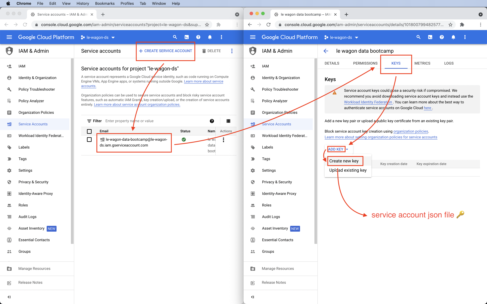

## CLI de `gcloud`

Antes de configurar nuestra cuenta Google Cloud Platform vamos a configurar el CLI de `gcloud` (una interfaz de línea de comando para Google Cloud Platform). Ejecuta el siguiente código y sigue las indicaciones de la terminal para actualizar tu $PATH y habilitar la finalización del comando del shell para el archivo `.zshrc`:

```bash
brew install --cask google-cloud-sdk
```

Luego podrás ejecutar lo siguiente:

```bash
$(brew --prefix)/share/google-cloud-sdk/install.sh
```

<details>
  <summary>¿Recibes un error <code>no such file or directory</code>?</summary>

  Prueba esto:

```bash
$(brew --prefix)/Caskroom/google-cloud-sdk/latest/google-cloud-sdk/install.sh
```

Si eso no funciona, contacta a un TA.

</details>


## Configuración de Google Cloud Platform

[GCP](https://cloud.google.com/) es una solución en la nube que usarás para colocar tus productos basados en Machine Learning en producción.

### Preparación del Proyecto

> 🚨 **Omita esta parte si está trabajando en un proyecto que alguien creó para usted**

- Ve a [Google Cloud](https://console.cloud.google.com/) y crea una cuenta si aún no tienes una
- En la consola de Cloud, en la lista de proyectos, selecciona o crea un proyecto Cloud


- Asígnale un nombre como `Wagon Bootcamp` por ejemplo
- ❗ Comprueba que el campo _Location_ esté establecido en _No organization_ ❗
- Verás que se creará un `ID` automáticamente para el proyecto e. g. `wagon-bootcamp-123456`


### Idioma de la cuenta

Abre las preferencias en tu cuenta GCP para facilitar el seguimiento de las instrucciones durante el bootcamp:

https://myaccount.google.com/language

Si el *idioma de preferencia* no es:
- **English**
- **United States**

Cámbialo a inglés:
- Haz clic en el logo edición (es una lapicera)
- Selecciona **English**
- Selecciona **United States**
- Haz clic en **Select**

### Cuenta de facturación

> 🚨 **Omita esta parte si está trabajando en un proyecto que alguien creó para usted**

Ahora conecta tu cuenta con tu tarjeta de crédito. Este paso es obligatorio para poder usar los servicios que suministra GCP. No te preocupes, podrás utilizar la mayoría de los servicios de GCP por medio de créditos gratuitos durante el bootcamp.


- Haz clic en **Billing**
- Haz clic en **MANAGE BILLING ACCOUNTS**
- Haz clic en **ADD BILLING ACCOUNT**
- Asígnale un nombre a tu cuenta de facturación, e. g. `My Billing Account`
- Haz clic en "I have read..." y acepta los términos de uso
- Haz clic en **CONTINUE**
- Selecciona tu tipo de cuenta: `Individual`
- Agrega tu nombre y dirección

Verás que tienes créditos gratuitos con un valor de "$300 a utilizar en los próximos 90 días".

- Haz clic en los detalles de la tarjeta
- Agrega la información de tu tarjeta de crédito
- Haz clic en **START MY FREE TRIAL**. Esto significa comenzar mi período de prueba.

Cuando termines, verifica que la cuenta de facturación esté conectada con tu proyecto GCP.

- Selecciona tu proyecto
- Ve a **Billing**
- Selecciona **LINK A BILLING ACCOUNT**
- Selecciona `My Billing Account`
- Haz clic en **SET ACCOUNT**

Ahora deberías ver lo siguiente:

```
Free trial status: $300 credit and 91 days remaining - with a full account, you'll get unlimited access to all of Google Cloud Platform.
```

Esto significa Estado de período de prueba: crédito de $300 y 91 días para usarlo - con la full account, tendrás acceso ilimitado a todo lo que ofrece Google Cloud Platform.

<details>
  <summary>👉 Si no tienes una tarjeta de crédito 👈</summary>


Si no tienes una tarjeta de crédito, puedes abrir una cuenta en **Revolut**.
Revolut es una aplicación que funciona como un banco y que te permitirá crear una tarjeta de crédito virtual conectada a la dirección de facturación de tu smartphone.

Ignora este paso si ya tienes una tarjeta de crédito. Simplemente úsala para hacer la configuración.

Descarga la app Revolut o ve a [revolut](https://www.revolut.com/a-radically-better-account) y sigue los pasos para descargar la app (introduce tu número de teléfono móvil y haz clic en Get Started).

- Abre la app Revolut
- Agrega tu número de teléfono móvil
- Agrega el código de verificación que recibiste por SMS
- La app te preguntará por tu país, dirección, primer y segundo nombre, fecha de nacimiento y el email
- La app también te pedirá tu profesión y una selfie
- La app te pedirá una foto de tu documento nacional de identidad o pasaporte

Cuando termines, selecciona el plan estándar (gratuito). No tienes que agregar la tarjeta a Apple pay, pedir que te envíen una tarjeta a tu domicilio ni tampoco agregar dinero a la cuenta.

Ahora tienes una tarjeta virtual que podrás usar para hacer la configuración de GCP.

En la vista principal de la app Revolut
- Haz clic en Ready to use
- Haz clic en the card
- Haz clic en Show card details
- Toma nota de la información de la tarjeta de crédito virtual y úsala para completar la configuración de GCP

</details>

<details>
  <summary>👉 Si recibes un email de Google diciendo "Urgent: your billing account XXXXXX-XXXXXX-XXXXXX has been suspended" 👈</summary>


Esto puede pasar justo después de haber creado la cuenta en Revolut.

- Haz clic en PROCEED TO VERIFICATION
- Te pedirán que envíes una foto de tu tarjeta de crédito (solo los últimos 4 dígitos, nada más)
- Si ya has usado **Revolut**, puedes enviar una captura de pantalla de tu tarjeta de crédito virtual (no olvides quitar la fecha de vencimiento de la captura)
- Explica que estás haciendo el bootcamp de Le Wagon, que no tienes una tarjeta de crédito y que acabas de crear una cuenta en Revolut para poder configurar GCP para el bootcamp con una tarjeta de crédito virtual

Es posible que te validen la cuenta pero también es posible que te pidan más información en los próximos 30 minutos.

Cuando la cuenta sea validada recibirás un email diciendo lo siguiente: "Your Google Cloud Platform billing account XXXXXX-XXXXXX-XXXXXX has been fully reinstated and is ready to use.". Esto significa que tu cuenta Google Cloud Platform ha sido restablecida

</details>

### Habilitación de servicios de GCP

> 🚨 **Omita esta parte si está trabajando en un proyecto que alguien creó para usted**

- Asegúrate de que la facturación está habilitada para tu proyecto Google Cloud

ℹ️ Tienes un **crédito de $300** para usar con recursos de Google Cloud. Esto será más que suficiente para el bootcamp.

- [Habilita las APIs BigQuery y Compute Engine](https://console.cloud.google.com/flows/enableapi?apiid=bigquery,compute) (Esto puede tomar varios minutos)

### Configuración de Cloud sdk

- Autentica el CLI de `gcloud` con la cuenta que usaste para GCP
```bash
gcloud auth login
```
- Inicia sesión en tu cuenta Google en la nueva pestaña que se abrió en tu navegador
- Lista la cuenta que tienes activa y verifica que el email que usaste para GCP está ahí
```bash
gcloud auth list
```
- Define tu proyecto actual (reemplaza `PROJECT_ID` con el `ID` de tu proyecto e.g. `wagon-bootcamp-123456`)
```bash
gcloud config set project PROJECT_ID
```
- Lista la cuenta que tienes activa y tu proyecto actual y verifica que tu proyecto está ahí
```bash
gcloud config list
```

### Crea una llave 🔑 de cuenta de servicio

Como ya creaste una cuenta `GCP account` y un `project` (identificado por su `PROJECT_ID`), vamos a configurar las acciones (llamadas API calls) que quieres que tu código ejecute.

<details>
  <summary>🤔 ¿Por qué necesitamos una clave de cuenta de servicio?</summary>


  Creaste una `cuenta GCP` conectada a una tarjeta de crédito. Te facturarán de acuerdo al uso que les des a los recursos de **Google Cloud Platform**. El cargo se hará si utilizas algo después de que el período de prueba gratuito se haya terminado o si te excedes del límite de consumo que te permite dicho período.

  En tu `cuenta GCP` has creado un solo `proyecto GCP` identificado por su `PROJECT_ID`. Los `proyectos GCP` te permiten organizar y monitorear la manera en que consumes los recursos **GCP** de forma más precisa. En este bootcamp solo crearemos un solo proyecto.

  Ahora necesitamos una manera de saber qué recursos nuestro código podrá consumir dentro de un `GCP project`. Nuestro código consume recursos GCP por medio de llamadas API.

  Ya que las llamadas API no son gratuitas, es importante definir cuidadosamente cómo nuestro código las utilizará. Sin embargo, durante el bootcamp no habrá restricciones. Le permitiremos a nuestro código que utilice todas las API **GCP** sin restricciones.

  Así como pueden haber varios proyectos asociados a una cuenta GCP, un proyecto puede estar compuesto de muchos servicios (cualquier paquete de código, sin importar su formato, que necesite utilizar llamadas a la API de GCP para cumplir con su propósito).

  GCP exige que los servicios de los proyectos que usen llamadas API se registren en la plataforma y que se configuren sus credenciales por medio del acceso concedido a una `service account`.

  Por ahora solo tendremos que usar un solo servicio y crearemos la `service account` correspondiente.
</details>

Ya que la [service account](https://cloud.google.com/iam/docs/service-accounts) es lo que identifica tu aplicación (y por ende tu cuenta de facturación GCP y, en última instancia, tu tarjeta de crédito), lo mejor es ser cuidadoso en los próximos pasos.

⚠️ **No compartas la 🔑 del archivo json de tu cuenta de servicio** ⚠️ No la guardes en tu escritorio ni en tu código base de git (incluso si tu repositorio git es privado). Que no se te olvide en un lugar como la máquina de café y, por supuesto, no la envíes en un tweet.

- Ve a la [página de las cuentas de servicio](https://console.cloud.google.com/apis/credentials/serviceaccountkey)
- Selecciona tu proyecto en la lista de proyectos recientes si te piden que
- Crees una cuenta de servicio:
  - Haz clic en **CREATE SERVICE ACCOUNT** que significa crear une cuenta de servicio:
  - Define un `Service account name` para esa cuenta. Esto significa Nombre de cuenta de servicio
  - Haz clic en **CREATE AND CONTINUE** que significa crear y continuar
  - Haz clic en **Select a role** que significa selecciona un rol. Escoge `Quick access/Basic` luego **Owner**. Esto  otorga acceso total a todos los recursos
  - Haz clic en **CONTINUE**
  - Haz clic en **DONE**
- Descarga la 🔑 del archivo json de la cuenta de servicio:
  - Haz clic en la cuenta de servicio recién creada
  - Haz clic en **KEYS**
  - Haz clic en **ADD KEY** y luego en **Create new key**
  - Selecciona **JSON** y haz clic en **CREATE**



El navegador acaba de guardar la 🔑 del archivo json de la cuenta de servicio en tu carpeta de descargas (el nombre se le asigna según el nombre de la cuenta de servicio. Es algo como `le-wagon-data-123456789abc.json`)


- Guarda el archivo json de la cuenta de servicio en un lugar que recuerdes. Por ejemplo:

``` bash
/Users/MACOS_USERNAME/code/GITHUB_NICKNAME/gcp/SERVICE_ACCOUNT_JSON_FILE_CONTAINING_YOUR_SECRET_KEY.json
```

- Guarda la **ruta absoluta** al archivo `JSON` como una variable de entorno:

``` bash
echo 'export GOOGLE_APPLICATION_CREDENTIALS=/path/to/the/SERVICE_ACCOUNT_JSON_FILE_CONTAINING_YOUR_SECRET_KEY.json' >> ~/.zshrc
```
**Nota:** cada vez que ejecutes este comando, agregará esta línea a tu archivo zshrc sin importar si la línea ya existe en el archivo. Si cometiste un error y necesitas arreglarlo, es preferible que abras el archivo y edites la línea!

Puedes hacerlo ejecutando

```bash
code ~/.zshrc
```

en la Terminal! 😄


<details>
  <summary>ℹ️ ¿Cómo encontrar la ruta absoluta de un archivo?</summary>
  Puedes arrastrar el archivo a tu terminal.
</details>

**Reinicia** tu terminal y ejecuta lo siguiente:

``` bash
echo $GOOGLE_APPLICATION_CREDENTIALS
```

Deberías obtener la siguiente información:

```bash
/some/absolute/path/to/your/gcp/SERVICE_ACCOUNT_JSON_FILE_CONTAINING_YOUR_SECRET_KEY.json
```

Ahora verifica si la ruta al archivo json de tu cuenta de servicio es el correcto:

``` bash
cat $(echo $GOOGLE_APPLICATION_CREDENTIALS)
```

👉 Este comando debería mostrar el contenido del archivo json de tu cuenta de servicio. Si no es el caso, pídele ayuda a un TA 🙏

Tu código y utilidades ahora pueden acceder a los recursos de tu cuenta GCP.

Continuemos con los últimos pasos de la configuración...

- Lista las cuentas de servicio asociadas a tu cuenta activa y a tu proyecto actual
```bash
gcloud iam service-accounts list
```
- Recupera el email de la cuenta de servicio e. g. `SERVICE_ACCOUNT_NAME@PROJECT_ID.iam.gserviceaccount.com`
- Lista los roles de la cuenta de servicio desde la cli (reemplaza el PROJECT_ID y el SERVICE_ACCOUNT_EMAIL)
```bash
gcloud projects get-iam-policy PROJECT_ID \
--flatten="bindings[].members" \
--format='table(bindings.role)' \
--filter="bindings.members:SERVICE_ACCOUNT_EMAIL"
```
- Ahora deberías ver que tu cuenta de servicio tiene el rol de `roles/owner`

<details>
  <summary>Resolución de problemas</summary>

- `AccessDeniedException: 403 The project to be billed is associated with an absent billing account.`. Esto significa que el proyecto a facturar está asociado a una cuenta de facturación que no está habilitada
  - Asegúrate de habilitar la facturación para tu proyecto https://cloud.google.com/billing/docs/how-to/modify-project
</details>

🏁 Listo. ¡Has terminado la configuración de GCP!


